# kops 설치

>  **kops**(Kubernetes Operation)이란 쿠버네티스 생성 및 관리를 쉽게 하도록 도와주는 오픈소스 툴로서, 프로덕션 레벨의 쿠버네티스 클러스터를 간단한 CLI 명령을 통해 생성, 관리, 업그레이드, 삭제할 수 있도록 지원


### 1. 가상머신

- AWS Instance를 새로만든다.

  - 만들때 Region은 `us-east-1` 선택

  - Step 1: Choose an Amazon Machine Image -- 프리티어 지원가능한 `Ubuntu 18.04`를 선택한다.
  - Step 2: Choose an Instance Type -- `t2.micro`를 선택후 생성


### 2. kops 설치

- 생성된 Instance에 PublicIP로 접근합니다. 저는 Bitvise SSH Client를 사용하겠습니다.
  - Username : ubuntu
  - Port : 22
  - Public Key : Instance를 생성할때 만들었던 key를 사용

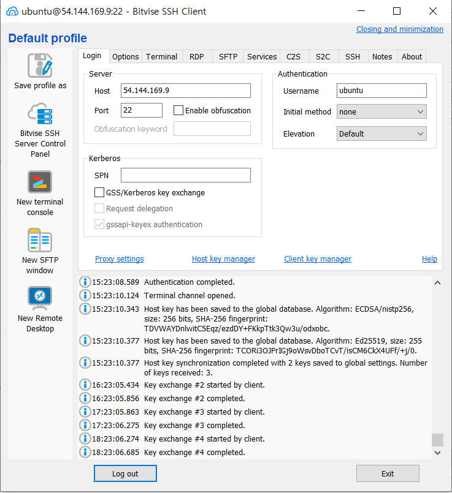


- 터미널 안에서 kops 설치

```cmd
$ wget -O kops https://github.com/kubernetes/kops/releases/download/$(curl -s https://api.github.com/repos/kubernetes/kops/releases/latest | grep tag_name | cut -d '"' -f  4)/kops-linux-amd64
```

```cmd
$ chmod +x ./kops
$ sudo mv ./kops /usr/local/bin/kops
```


- kubectl 설치

```cmd
$ wget -O kubectl https://storage.googleapis.com/kubernetes-release/release/$(curl -s https://storage.googleapis.com/kubernetes- release/release/stable.txt)/bin/linux/amd64/kubectl
```

```cmd
$ chmod +x ./kubectl
$ sudo mv ./kubectl /usr/local/bin/kubectl
```


### 3. IAM - GROUP, USER 생성

**1) IAM에서 Groups를 선택하여 새로 생성**

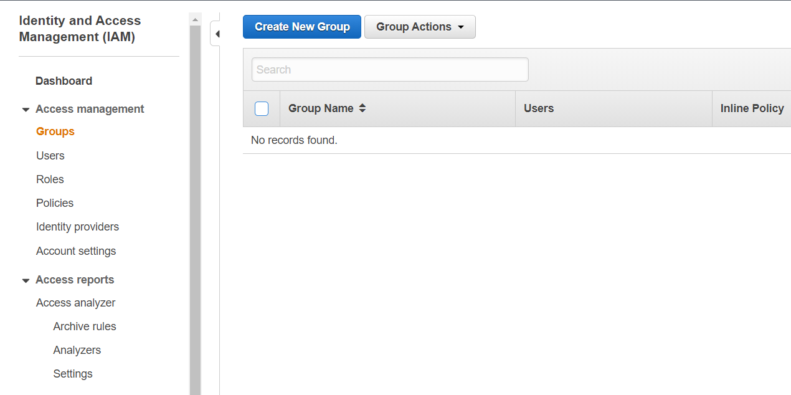


**2) Group Name을 지정하고 Step 2로 이동후 밑의 5개의 정책을 추가합니다.**

- AmazonEC2FullAccess 

- AmazonRoute53FullAccess 
- AmazonS3FullAccess 
- IAMFullAccess 
- AmazonVPCFullAccess

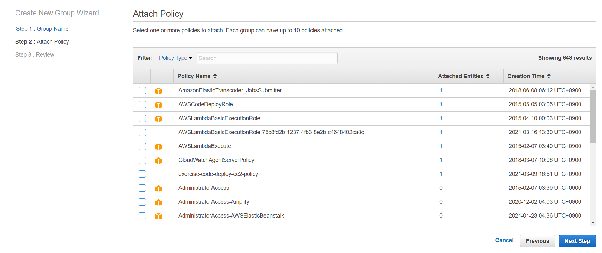

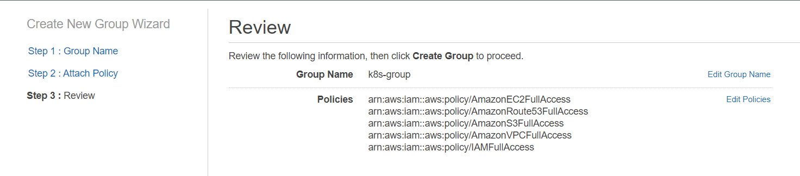


**3) User생성**

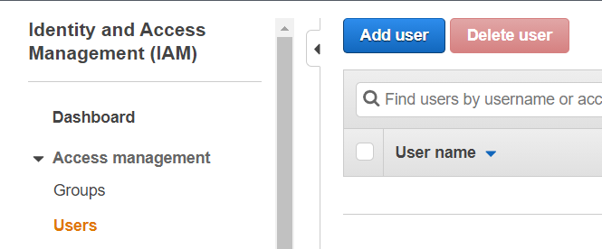


- User name 지정 후 `Console password`는 `Custom password`로 개인 비밀번호를 설정하고 `Require password reset`은 선택사항입니다.

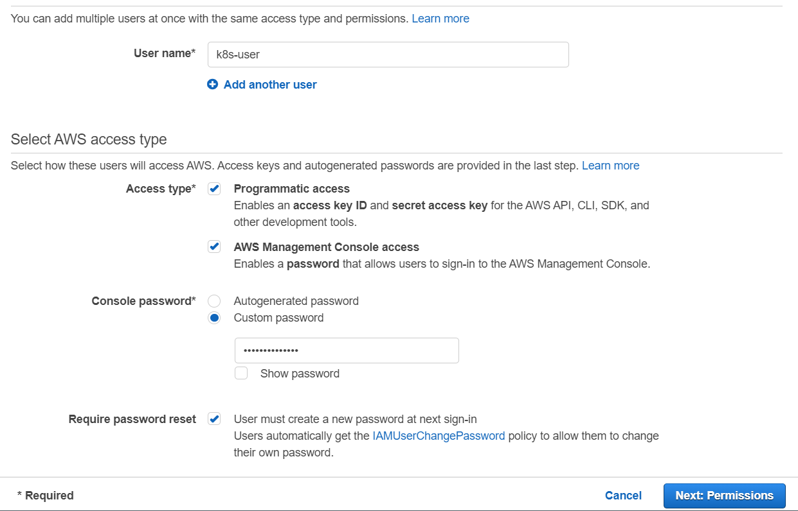


**4) Group 선택**

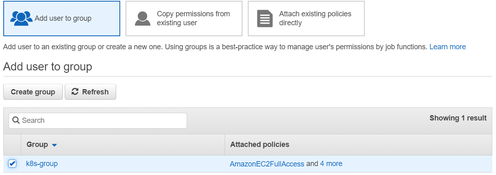


### 4. AWS CLI 설치후 설정

```CMD
$ sudo apt update
$ sudo apt install -y python3-pip
$ sudo apt install awscli
```


- `ACCESS KEY`와 `SECRET ACCESS KEY`는 User를 생성할때 만들어진것을 사용합니다.

``` cmd
$ aws configure
AWS Access Key ID [None]: <Your access key id>
AWS Secret Access Key [None]: <Your secret access key>
Default region name [None]: us-east-1
Default output format [None]:
```


### 5. S3 버킷 생성 및 환경 변수 설정

```cmd
$ aws s3api create-bucket --bucket <bucket name> --region us-east-1
```

```cmd
$ aws s3api put-bucket-versioning \
--bucket <bucket name> \
--versioning-configuration Status=Enabled
```


- 변수를 설정함으로써 값을 쉽게 사용하기 위하여 사용합니다.

```cmd
$ export AWS_ACCESS_KEY_ID=<aws configure get aws_access_key_id>
$ export AWS_SECRET_ACCESS_KEY=<aws configure get aws_secret_access_key>
$ export NAME=<cluster name>  ex) jonecluster.k8s.local
$ export KOPS_STATE_STORE=s3://<bucket name>
```


### 6. SSH Key Pair 생성

```cmd
$ ssh-keygen –t rsa
```

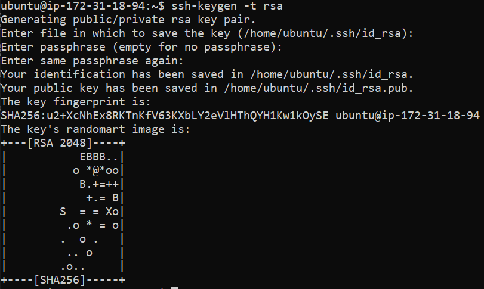


### 7. 사용 가능한 AZ 확인후 클러스터 생성을 위한 AZ지정

- region에서 가능한 AZ를 확인합니다. 예를들어 `us-east-1a`, `us-east-1b`가 있습니다.

```cmd
$ aws ec2 describe-availability-zones --region us-east-1
```


- `${NAME}`은 위에서 설정했던 변수입니다.

```cmd
$ kops create cluster --zones us-east-1a ${NAME}
$ kops edit cluster ${NAME}
$ kops get ig --name ${NAME}
```


### 8. 마스터 노드 확인, 노드 수를 조절

- `master`와 `nodes`를 편집하여 `nodes`의 생성수를 `3`으로 교체를 하고 machine이 `t3.medium`으로 되어있다면 `t2.micro`로 바꾸셔도 상관없습니다. 저희는 최대한 요금이 발생하지 않게 하기위해 `t2.micro`를 쓰겠습니다.

```cmd
$ kops edit ig master-us-east-1a --name ${NAME}
$ kops edit ig nodes-us-east-1a --name ${NAME}
```


### 9. 클러스터 생성

```cmd
$ kops update cluster ${NAME} --yes
```


### 10. 도메인 등록

```cmd
$ kops export kubecfg <cluster name> --admin
```


만약 도메인 등록을 하지 않았을때의 오류 발생

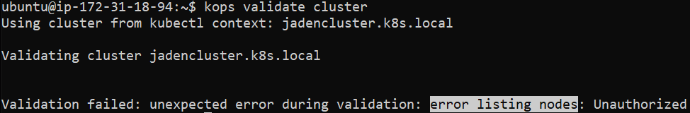


### 11. 클러스터 테스트

```cmd
$ kops validate cluster 			# 클러스터 상태 확인
$ kubectl get nodes --show-labels   # 노드 목록 가져오기
$ kubectl -n kube-system get po 	# kube-system 네임스페이스 안의 Pod 목록
```

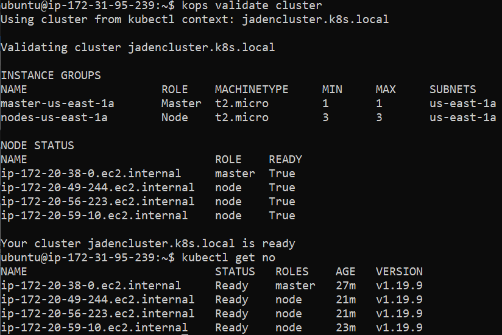


Instance에 만들어진 `master` 1개와 `node` 3개를 확인합니다. 그리고 `master`의 PublicIP를 확인하여 `kops`를 설치했던 ubuntu 터미널에서 `master`에 접속하는 방법입니다.

```cmd
# ssh <master-publicIP>
```

Instance Terminal에서 접속하는 이유는 `master`와 `node`가 만들어질때 적용된 Key값이 저희가 가지고있지않은 것이기 때문입니다.


### 클러스터 삭제

```cmd
$ kops delete cluster --name ${NAME} --yes
```


# TEST

`master`로 접속하여 해도되고 kops를 설치한 Terminal에서 작업해도 상관없습니다. kops를 설치한 Terminal에서 작업을 하여도 `master`로 자동 연결이 되기 때문입니다.


### 1. Deployment 생성

```cmd
$ mkdir yaml
$ cd yaml/
$ vi deployment.yaml
```


- `yaml`파일 생성

```yaml
apiVersion: apps/v1
kind: Deployment
metadata:
  name: my-user-deployment
spec:
  replicas: 1
  selector:
    matchLabels:
      app: my-user-app
  template:
    metadata:
      labels:
        app: my-user-app
    spec:
      containers:
      - name: my-user-ms
        image: edowon0623/my-user-service
        ports:
        - containerPort: 8080
```

```cmd
$ kubectl apply -f deployment.yaml
```


- 확인하여 어느 `node`에 설치 되어있는지 확인합니다.

```cmd
$ kubectl get po -o wide
```


### 2. Service 생성

master Terminal에서 `exit`하여 다시 ubuntu Terminal로 돌아옵니다.

그다음 service.ymal을 생성하겠습니다.

```cmd
$ mkdir yaml
$ cd yaml/
$ vi service.yaml
```


- `yaml`파일 생성

```yaml
apiVersion: apps/v1
kind: Service
metadata:
  name: my-user-service
spec:
  selector:
    app: my-user-app
  ports:
    - port: 8080
      targetPort: 8080
  type: NodePort
```

```cmd
$ kubectl apply -f service.yaml
```


- `$ kubelet get svc`을 하여 PORT가 `8080`과 몇번이 연결이 되어있는지 확인을 한다.

```cmd
NAME              TYPE        CLUSTER-IP       EXTERNAL-IP   PORT(S)          AGE
my-user-service   NodePort    100.65.244.240   <none>        8080:30453/TCP   5s
```


- `30453`번을 `master Instance`의 Security Group에서 Inbound rules를 편집합니다.

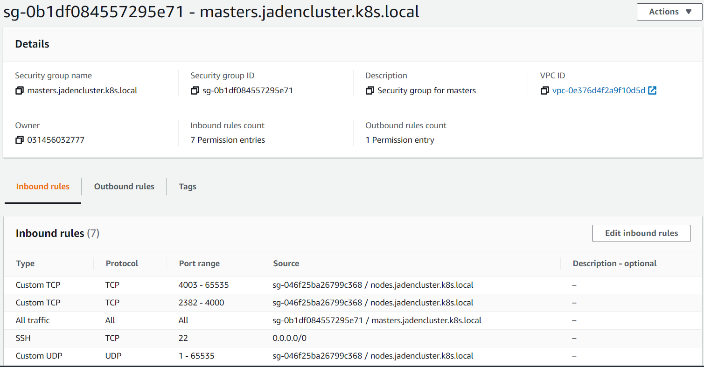


- `30453` 추가

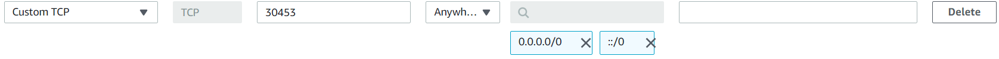


- Postman이나 웹 브라우저에서 `http://<Master-PublicIP>:<PORT>/users`을 test 해보자
  - 웹 브라우저에서 할 경우 json뷰어가 설정되어 있지 않다면 일렬로 보입니다

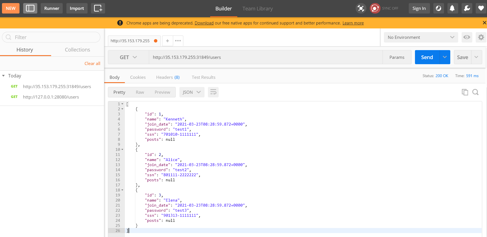