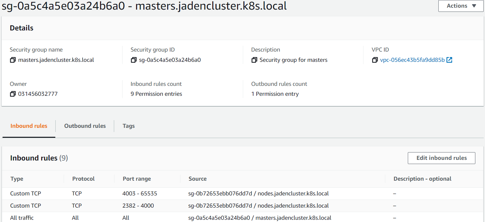
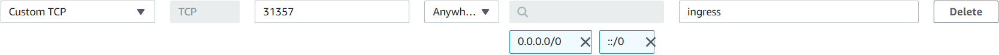

# Ingress 란?

인그레스(ingress)는 클러스터 외부에서 내부로 접근하는 요청들을 어떻게 처리할지 정의해둔 규칙들의 모음입니다. 외부에서 접근가능한 URL을 사용할 수 있게 하고, 트래픽 로드밸런싱도 해주고, SSL 인증서 처리도 해주고, 도메인 기반으로 가상 호스팅을 제공하기도 합니다. 인그레스 자체는 이런 규칙들을 정의해둔 자원이고 이런 규칙들을 실제로 동작하게 해주는게 인그레스 컨트롤러(ingress controller)입니다. 

클라우드 서비스를 사용하게 되면 별다른 설정없이 각 클라우드 서비스에서 자사의 로드밸런서 서비스들과 연동해서 인그레스를 사용할 수 있게 해줍니다. 클라우드 서비스를 사용하지 않고 직접 쿠버네티스 클러스터를 구축해서 사용하는 경우라면 인그레스 컨트롤러를 직접 인그레스와 연동해 주어야 합니다. 이때 가장 많이 사용되는건 쿠버네티스에서 제공하는 [ingress-nginx](https://github.com/kubernetes/ingress-nginx) 입니다. 

nginx 인그레스 컨트롤러는 인그레스에 설정된 내용을 nginx 환경설정으로 변경해서 nginx에 적용합니다. 이외에도 다양한 인그레스 컨트롤러가 있습니다.

​																																										출처: [아리수](https://arisu1000.tistory.com/27840)


# Ingress 적용

> 이 작업은 `10_AWS_Kubernetes_kops`를 작업한 후에 할 수 있습니다.

kops를 설치한 Terminal을 먼저 열겠습니다.

**`ingress-controller`하고 `ingress-nginx`를 설치하도록 하겠습니다.**

```cmd
$ kubectl apply -f https://raw.githubusercontent.com/kubernetes/ingress-nginx/nginx-0.27.1/deploy/static/provider/baremetal/service-nodeport.yaml
```


**`Ingress.yaml`파일을 생합니다.**

- `$ vi ingress.yaml`

```yaml
apiVersion: networking.k8s.io/v1
kind: Ingress
metadata:
  name: nginx-ingress-sample
  annotations:
    kubernetes.io/ingress.class: nginx
    nginx.ingress.kubernetes.io/rewrite-target: /
spec:
  rules:
  - http:
      paths:
      - path: /
        pathType: Prefix
        backend:
          service:
            name: my-user-service
            port: 
              number: 8080
```

```cmd
$ kubectl apply -f ingress.yaml
```


- ADDRESS가 할당 되었는지 확인하고 연결이 되어있는지 확인합니다.

```cmd
$ kubectl get ingress
NAME                   CLASS    HOSTS   ADDRESS   PORTS   AGE
nginx-ingress-sample   <none>   *                 80      88s
```

```cmd
$ kubectl get svc --namespace ingress-nginx
NAME            TYPE       CLUSTER-IP      EXTERNAL-IP   PORT(S)                      AGE
ingress-nginx   NodePort   100.68.146.98   <none>        80:31357/TCP,443:31611/TCP   28m
```


- Security Groups 의  `master`에서 **Edit inbound rules**를 클릭합니다.




- **Add Ruls**를 클릭 후 ingress에 연결된 PORT 번호를 입력하고 Anywhere을 선택후 완료합니다.



### Test

`curl`명령어로 접속시 정상적으로 Json data가 나오는지 확인을 합니다.

```cmd
$ curl http://<Master-PublicIP>:31357/users-ms/users
```