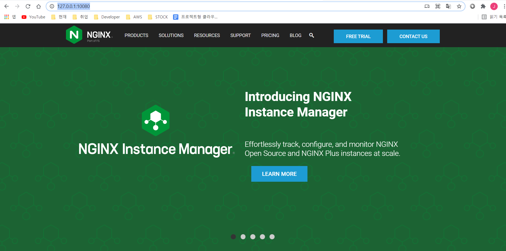

# Playbook

- 사용자가 원하는 내용을 미리 작성해 놓은 파일
  - ex) 다수의 서버에 반복 작업을 처리하는 경우

- 멱등성
  - 같은 설정을 여러번 적용하더라도 결과가 달라지지 않는 성질

```cmd
$ echo -e "[mygroup]\n 172.20.10.11" >> /etc/ansible/hosts
```

위의 코드를 여러번 실행하면 `[mygroup]\n 172.20.10.11`가 여러개 생기는 문제가 있습니다.


`$ vi first-playbook.yaml`

```yaml
---
- name: Ansible_vim_test
  hosts: localhost
  tasks:
    - name: Add ansible hosts
      blockinfile:
        path: /etc/ansible/hosts
        block: |
          [mygroup]
          172.20.10.11
```

```cmd
$ ansible-playbook first-playbook.yaml
```


`$ vi second-playbook.yaml`

```yaml
---
- name: Install nginx on CentOS
  hosts: centos
  remote_user: root
  tasks:
    - name: Install epel-release
      yum: name=epel-release state=latest
    - name: Install nginx web server
      yum: name=nginx state=present
    - name: Start nginx web server
      service: name=nginx state=started
```

```cmd
$ ansible-playbook second-playbook.yaml -k
SSH password: vagrant
```


우리의 default nginx화면을 nginx 메인 페이지를로 바꾸도록 하겠습니다.

```cmd
$ curl -o index.html https://www.nginx.com/
```


`vi second-playbook.yaml`에서 밑의 코드를  `Start nginx web server`전에 추가합니다.

```yaml
    - name: Upalod default index.html for web server
      copy: src=./index.html dest=/usr/share/nginx/html/
    - name: Start nginx web server
      service: name=nginx state=started
```


`http://127.0.0.1:10080/` 접속

- Port : `10080`는 Vagrantfile에서 `80`을 `forwarded_port` 한 번호를 입력하시면 됩니다.




## Playbook을 이용한 환경설정

`Vagrantfile`에서 `server`부분 수정

- `Ansible_env_ready.yml`, `Ansible_ssh_conf_4_CentOS.yml`파일을 적용하는 코드

```yaml
config.vm.define:"ansible-server" do |cfg|
    cfg.vm.box = "centos/7"
    cfg.vm.provider:virtualbox do |vb|
        vb.name="Ansible-Server"
        vb.customize ["modifyvm", :id, "--cpus", 2]
        vb.customize ["modifyvm", :id, "--memory", 2048]
    end
    cfg.vm.host_name="ansible-server"
    cfg.vm.synced_folder ".", "/vagrant", disabled: true
    cfg.vm.network "public_network", ip: "172.20.10.10"
    cfg.vm.network "forwarded_port", guest: 22, host: 19210, auto_correct: false, id: "ssh"
    cfg.vm.network "forwarded_port", guest: 8080, host: 58080
    # cfg.vm.network "forwarded_port", guest: 9000, host: 59000
    cfg.vm.provision "shell", path: "bootstrap.sh"  
    cfg.vm.provision "file", source: "Ansible_env_ready.yml", destination: "Ansible_env_ready.yml"
    cfg.vm.provision "shell", inline: "ansible-playbook Ansible_env_ready.yml"
    cfg.vm.provision "file", source: "Ansible_ssh_conf_4_CentOS.yml", destination: "Ansible_ssh_conf_4_CentOS.yml"
    cfg.vm.provision "shell", inline: "ansible-playbook Ansible_ssh_conf_4_CentOS.yml"
  end
```


`bootstrap.sh` 수정

```sh
#! /user/bin/env bash

yum install -y epel-release
yum install -y ansible 

mkdir -p /home/vagrant/.vim/autoload /home/vagrant/.vim/bundle
touch /home/vagrant/.vimrc
touch /home/vagrant/.bashrc
```


`Ansible_env_ready.yaml` 파일을 Vagrantfile 있는 장소에 만들겠습니다.

```yaml
---
- name: Setup for the Ansible's Environment
  hosts: localhost
  gather_facts: no

  tasks:
  	- name: Change "/etc/hosts"
      blockinfile: |
        dest=/etc/hosts
        content="
          172.20.10.10 ansible-server
          172.20.10.11 ansible-node-1
          172.20.10.12 ansible-node-2
          172.20.10.13 ansible-node-3
          "

    - name: Change "/etc/ansible/hosts"
      blockinfile: |
        dest=/etc/ansible/hosts
        content="
          [centos]
          ansible-node-1
          ansible-node-2

          [ubuntu]
          ansible-node-3
          "

    - name: Install sshpass for Authentication
      yum:
        name: sshpass
        state: present
        
    - name: Install vim-enhanced
      yum:
        name: vim-enhanced
        state: present
    
    - name: Install git
      yum:
        name: git
        state: present
    
    - name: Install pathogen.vim
      shell: "curl -fLo /home/vagrant/.vim/autoload/pathogen.vim https://tpo.pe/pathogen.vim"
    
    - name: Git clone vim-ansible-yaml
      git:
        repo: 'https://github.com/chase/vim-ansible-yaml.git'
        dest: /home/vagrant/.vim/bundle/vim-ansible-yaml
    
    - name: Configure vimrc
      lineinfile:
        dest: /home/vagrant/.vimrc
        line: "{{ item }}"
      with_items:
        - "set number"
        - "execute pathogen#infect()"
        - "syntax on"
      
    - name: Configure Bashrc
      lineinfile: 
        dest: /home/vagrant/.bashrc
        line: "{{ item }}"
      with_items:
        - "alias vi='vim'"
        - "alias ans='ansible'"
        - "alias anp='ansible-playbook'"
```


`$ vi Ansible_ssh_conf_4_CentOS.yml`파일도 Vagrantfile 있는 장소에 만들겠습니다.

```yaml
---
- name: Ansible set ssh configuation for CentOS
  hosts: localhost
  gather_facts: no

  tasks:
    - name: PasswordAuthentication change from no to yes
      replace:
        dest=/etc/ssh/sshd_config
        regexp='PasswordAuthentication no'
        replace='PasswordAuthentication yes'
        backup=yes

    - name: SSHD restart to apply "PasswordAuthentication"
      service:
        name: sshd
        state: restarted
```


##### 적용

```cmd
$ vagrant halt
$ vagrant destroy ansible-server
$ vagrant up ansible-server
```

```cmd
$ ssh-keygen
$ ssh-copy-id root@ansible-node-1
$ ssh-copy-id root@ansible-node-2
$ ssh-copy-id root@ansible-node-3
$ ssh-copy-id vagrant@ansible-node-1
$ ssh-copy-id vagrant@ansible-node-2
$ ssh-copy-id vagrant@ansible-node-3
```


##### 확인

```cmd
$ cat /etc/hosts
$ tail -10 /etc/ansible/hosts
```

```cmd
$ ansible centos -m ping -k
ansible-node-2 | SUCCESS => {
    "ansible_facts": {
        "discovered_interpreter_python": "/usr/bin/python"
    },
    "changed": false,
    "ping": "pong"
}
ansible-node-1 | SUCCESS => {
    "ansible_facts": {
        "discovered_interpreter_python": "/usr/bin/python"
    },
    "changed": false,
    "ping": "pong"
}
```


### Nginx, Timezone Playbook

CentOS와 Ubuntu의 Nginx 설치를 Playbook으로 사용

 `$ vi install_nginx.yml`

```yaml
---
- name: install nginx on CentOS
  hosts: centos
  gather_facts: no
  become: yes

  tasks:
    - name: install epel-release
      yum: name=epel-release state=latest
    - name: install nginx web server
      yum: name=nginx state=present
    - name: upload default index.html for web server
      get_url: url=https://www.nginx.com dest=/usr/share/nginx/html/
    - name: start nginx web server
      service: name=nginx state=started

- name: install nginx on Ubuntu
  hosts: ubuntu
  gather_facts: no
  become: yes

  tasks:
    - name: install nginx web server
      apt: pkg=nginx state=present update_cache=yes
    - name: upload default index.html for web server
      get_url: url=http://www.apache.com dest=/usr/share/nginx/html/ validate_certs=no
    - name: start nginx web server
      service: name=nginx state=started
```

```cmd
$ ansible-playbook install_nginx_yml -k
```


`$ vi timezone.yml`

```yaml
  1 ---
  2 - name: setup timezone
  3   hosts: centos:ubuntu
  4   gather_facts: no
  5   become: yes
  6
  7   tasks:
  8     - name: set timezone to Asia/Seoul
  9       timezone: name=Asia/Seoul
 10
 11 - name: setup timezone for localhost
 12   hosts: localhost
 13   gather_facts: no
 14   become: yes
 15
 16   tasks:
 17     - name: set timezone to Asia/Seoul
 18       timezone: name=Asia/Seoul
```


#### 삭제

`$ vi nginx_remove.yml`

```yaml
  1 ---
  2 - name: Remove nginx on CentOS
  3   hosts: centos
  4   gather_facts: no
  5   become: yes
  6
  7   tasks:
  8     - name: remove epel-release
  9       yum: name=epel-release state=absent
 10     - name: remove nginx web server
 11       yum: name=nginx state=absent
 12
 13 - name: Remove nginx on Ubuntu
 14   hosts: ubuntu
 15   gather_facts: no
 16   become: yes
 17
 18   tasks:
 19     - name: remove nginx web server
 20       apt: name=nginx state=absent
 21     - name: remove useless packages from the cache
 22       apt: autoclean=yes
 23     - name: remove dependencies that are no longer required
 24       apt:
 25         autoremove: yes
```