# AWS-Ansible 

### Security Group 생성

- `development`를 name으로 설정하고 비어있는 값으로 생성을 합니다.

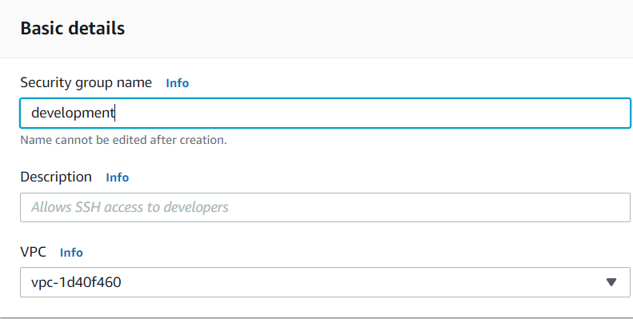


- 생성하고 나서 `Edit`를 클릭하여 아무곳에다가 `My IP`를 클릭하여 자신의 IP를 확인하고 복사
  - 메모장에다가 저장 해 놓겠습니다.

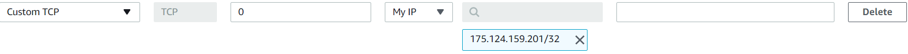


### Instance 생성

- Step이 보이지 않는 부분은 그냥 default값으로 넘어가겠습니다.
- key는 기존 보유하고 계시는걸 사용하거나 새로 만들어 주세요.

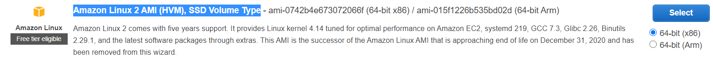


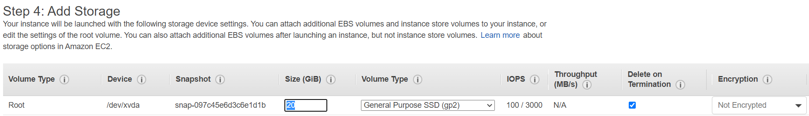


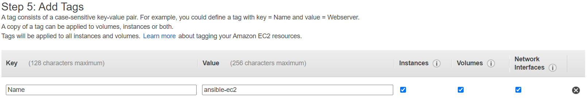


### IAM 생성

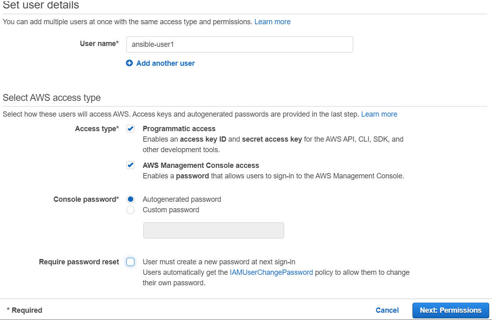


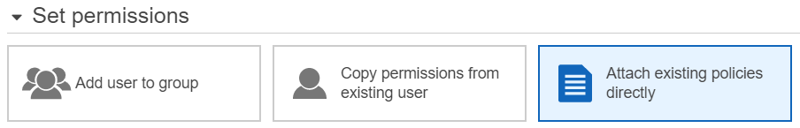

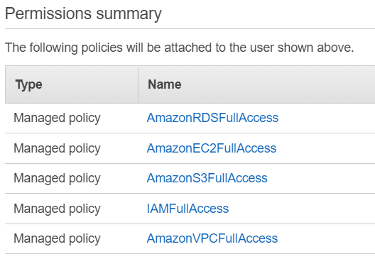


### AMI 생성

- Instance 에 `git`과`ansible`을 설치

```cmd
$ sudo yum install -y git
$ sudo amazon-linux-extras install ansible2
```


- Instance를 `Stop`후에 `Create image`를 클릭하여 AMI를 생성합니다.

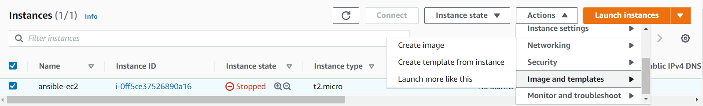


- AMI에서 `private`을 `public`으로 변경

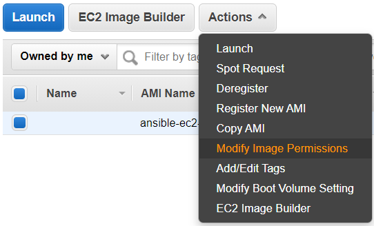


## Ansible-server

- ansible vagrant에서 code를 하나 `clone` 해 오겠습니다.

```cmd
$ git clone https://github.com/joneconsulting/ansible_cloud.git
$ cd ansible_cloud/
$ git checkout master
$ cd amazon-ansible-playbook/
```


- 설치

```cmd
$ sudo yum install python-pip
$ sudo pip install boto boto3
$ sudo pip install awscli
```


- IAM생성하여 만들어진 Key를 입력

```cmd
$aws configure
Key ID : [YOUR_KEY_ID]
Access Key : [YOUR_ACCESS_KEY]
region name : us-east-1
output format :
```


- 변수 설정

```cmd
$ export AWS_ACCESS_KEY_ID=[YOUR_KEY_ID]
$ export AWS_SECRET_ACCESS_KEY=[YOUR_ACCESS_KEY]
```


- 확인

```cmd
$ env | grep "AWS_"
$ aws s3 ls
```


- AMI에서 생성했던 image를 클릭후 owner를 확인

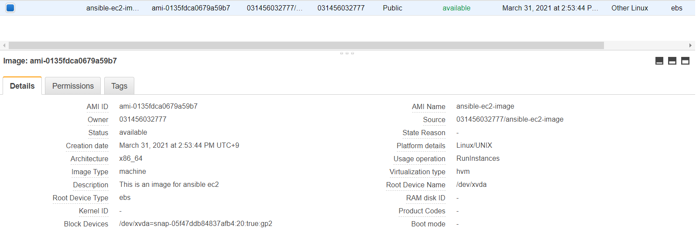


```cmd
$ aws ec2 describe-images --owners [owner]
```


- 로컬에서 key를 들어가 코드를 복사하여 밑의 파일에 붙여넣기

```cmd
$ mv your-iam-key.pem [your-key-name].pem
$ vi [your-key-name].pem
```


- `$ vi development.yml`에 접속하여 `ami_image`, `key_name`, `my_ip`를 자기 정보에 맞게 입력

```yaml
  1 ---
  2 - hosts: localhost
  3   connection: local
  4   gather_facts: no
  5   roles:
  6     - role: security_group
  7     - role: ec2
  8   vars:
  9     ami_image: #이미지명[IAM_ID]
 10     key_name: # key_name
 11     my_ip: # 액세스하는 PC의 IP
 12     group_name: "development"
 13     instance_type: "t2.micro"
 14     device_name: "/dev/xvda"
 15     device_type: "gp2"
 16     volume_size: 20 # EBS 디스트크기（GB）
```


- `$ vi roles/security_group/tasks/main.yml`에 들어가서 `region`을 자신의 region에 맞게 수정

```yaml
  1 ---
  2 - name: Security Group 작성
  3   ec2_group:
  4     name: "{{ group_name }}"
  5     description: "{{ group_name }} server security group"
  6     region: us-east-1
  7     rules:
  8       - proto: tcp
  9         from_port: 22
 10         to_port: 22
 11         cidr_ip: "{{ my_ip }}"
 12     rules_egress:
 13       - proto: all
 14         from_port: 0
 15         to_port: 65535
 16         cidr_ip: 0.0.0.0/0
```


- Inbound rules 변경

`$ ansible-playbook -i hosts/development/ec2.py development.yml --private-key=exercise-key.pem/`

```cmd
PLAY [localhost] ***********************************************************************************

TASK [security_group : Security Group] *************************************************************
[WARNING]: Group description does not match existing group. Descriptions cannot be changed without
deleting and re-creating the security group. Try using state=absent to delete, then rerunning this
task.
changed: [localhost]

TASK [ec2 : EC2 인스턴스 작성] ***************************************************************************
fatal: [localhost]: FAILED! => {"changed": false, "msg": "The following group names are not valid: development"}

PLAY RECAP *****************************************************************************************
localhost                  : ok=1    changed=1    unreachable=0    failed=1    skipped=0    rescued=0    ignored=0
```

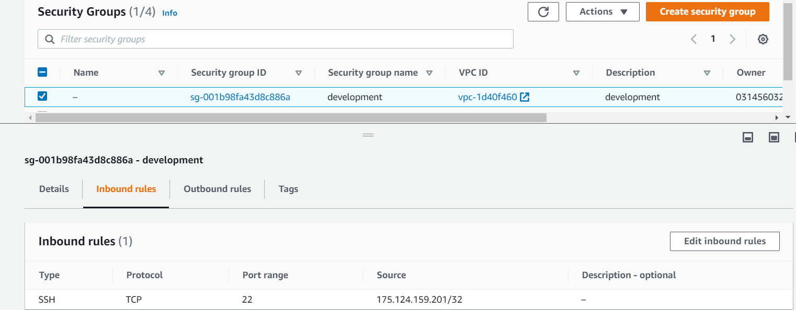


- `$ vi ./roles/ec2/tasks/main.yml`에서 `region`을 알맞게 수정

```yaml
  2 - name: EC2 인스턴스 작성
  3   ec2:
  4     image: "{{ ami_image }}"
  5     instance_type: "{{ instance_type }}"
  6     region: us-east-1
  7     key_name: "{{ key_name }}"
  8     group: "{{ group_name }}"
  9     instance_tags:
 10       Name: "{{ group_name }}"
 11     wait: yes
 12     wait_timeout: 300
 13     volumes:
 14       - device_name: "{{ device_name }}"
 15         device_type: "{{ device_type }}"
 16         volume_size: "{{ volume_size }}"
 17         delete_on_termination: yes
 18   register: ec2
```


- Instance 생성
  - **밑의 명령어를 실행하면 Instance가 계속 생성이 되기때문에 Auto Scaling을 사용할때 용이합니다.**

`$ ansible-playbook -i hosts/development/ec2.py development.yml --private-key=exercise-key.pem/`

```cmd
PLAY [localhost] ***********************************************************************************

TASK [security_group : Security Group] *************************************************************
[WARNING]: Group description does not match existing group. Descriptions cannot be changed without
deleting and re-creating the security group. Try using state=absent to delete, then rerunning this
task.
ok: [localhost]

TASK [ec2 : EC2 인스턴스 작성] ***************************************************************************
changed: [localhost]

PLAY RECAP *****************************************************************************************
localhost                  : ok=2    changed=1    unreachable=0    failed=0    skipped=0    rescued=0    ignored=0
```

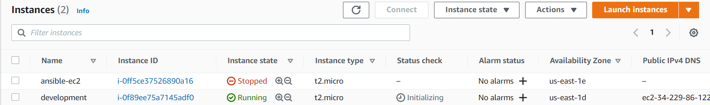


- Instance 접속

```cmd
$ chmod 600 [KEY-NAME].pem
$ ssh -i [KEY-NAME.pem ec2-user@[Public-IP]
```


## Ansible Test

위의 명령어를 통하여 Instance를 3개 생성하여 Ansible Test를 진행 해 보겠습니다.

우선 저는 처음 만들어진 Instance를 Server로 지정하고 나머지를 node로 지정하겠습니다.

- 연결이 잘 되어있는지 확인

```cmd
**Server**
$ ping [Private_IP-Node-1]
$ ping [Private_IP-Node-2]
```


만약 핑이 오류가 난다면 Security Group에서 development Inbound rules를 `Edit`하고 `development`를 선택하여 생성하고 다시 `ping`을 해보겠습니다.

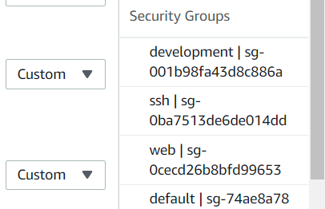

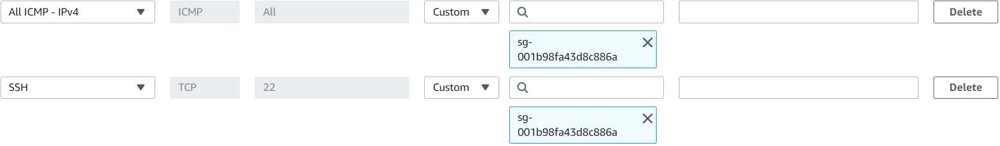


`ssh-key`값을 받고 Node에 `ssh-copy-id`를 하면 `Permission denied`를 받기때문에 같은 Public Key로 하기위해 아래와 같은 작업을 하겠습니다.

```cmd
**Server**
$ ssh-keygen
```


- Server에서 `keygen`을 하고 밑의 코드를 통해 값을 불러와 복사를 합니다.

```cmd
$ cat ./.ssh/id_rsa.pub
```


- Node에서 밑의 코드로 들어가 기존의 값을 지우고 Server에서 복사했던 key값을 붙여넣기합니다.

```cmd
$ vi ./.ssh/authorized_keys
```


##### Test

```cmd
**Server**
$ ssh-copy-id [Private-Node01-IP]
$ ssh-copy-id [Private-Node02-IP]
```


- `hosts`에 들어가서 밑의 코드를 맨 밑에 입력합니다.

```cmd
$ sudo vi /etc/ansible/hosts
[ec2]
[Private-Node01-IP]
[Private-Node02-IP]

[node1]
[Private-Node01-IP]

[node2]
[Private-Node02-IP]
```


- Node test

```cmd
$ ansible ec2 -m shell -a "uptime"
$ ansible ec2 -m ping					# ping test
```

```cmd
$ ansible node1 -m shell -a "free -h"	# 메모리 출력
$ ansible node2 -m shell -a "df -h"		# 10% 이상의 디렉토리를 출력
```

