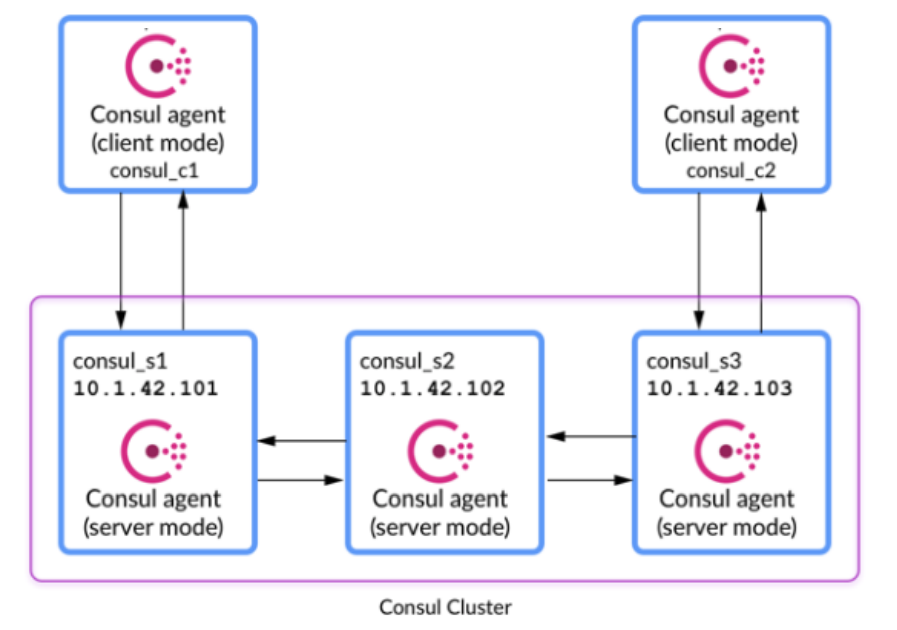

# Consul 이란

### HashiCrop Consul

**"Service Mesh Made Easy"** 

Service Mesh를 쉽게 해주는 툴이며 Service Mesh Architecture, 즉 클라우드 환경에서 MicroService Architecture 에서 서비스간 통신을 위한 메커니즘 구현을 쉽게 해준다는 이야기입니다. 동적이고 분산된 인프라에서 애플리케이션을 연결하고 구성하기 위해 설계된 고가용성과 분산 환경을 지원하는 솔루션이며, 주요 기능으로 모든 인프라에서 서비스를 발견(Discovery) 하고 구성하는 것입니다.


### 기능

- Distributed Architecture
- Service Discovery
  - 서비스를 말그대로 찾는 기능이다.
  - http, dns를 이용하여 실제 분산되어진 인프라 환경에서 원하는 서비스에 특정 콜을 날릴수 있도록 위치를(ip) 찾아준다.
  - 물론 ip뿐만아니라 특정 서비스의 메타정보, 태깅정보등도 가지고있을 수 있다.
- Health Checking
  - 서비스의 상태 확인
- Key/Value Store
- Secure Communication

Service Mesh


### 구성

- Consul Server
- Consul Agent




# Consul 설치

- [Consul 설치](https://www.consul.io/downloads.html)

다운로드 받은 폴더를 원하는 위치에 이동 후 `consul.d` 폴더를 새로 만들고 커맨더 창을 열겠습니다. `consul.d`는 consul을 실행하는데 필요한 파일들을 모아 놓고 필요한 마이크로서비스로 등록한 데이터들을 이곳에 저장하는 용도입니다. 


```cmd
> pip install python-consul
```


#### 기동

```cmd
$ consul agent -dev -ui -datacenter zone1 -node host1
```


### dig(domain information groper)

dig는 네트워크 관리 도구 중 하나로 DNS(Domain Nmae System)를 질의할 수 있는 도구입니다. nslookup 도구를 사용하여 DNS 를 질의할 수 있지만, 보다 더 편한 인터페이스와 사용법을 제공합니다. 이와 더불어 IDN(Internationalized Domain Name) 쿼리를 지원합니다.


#### 설치

- https://www.isc.org/download/

STATUS -- Current-Stable 버전을 다운 받겠습니다.


저희는 간단히 사용할 것이기 때문에 다운받은 그 위치에 환경설정하지않고 바로 사용하겠습니다.

```cmd
> dig www.naver.com
```


# Consul 실행

#### Consul Web-UI

- https://localhost:8500/


#### Consul Nodes

```cmd
> consul members
```


### Service Discovery

- microservice

**`order.py`**

```python
from flask import Flask
import requests
import os

app = Flask(__name__)

@app.route('/')
def get_order():
    # url=os.environ.get('INV_SVC_URL')
    service_address = '127.0.0.1'
    service_port = 15001

    url = "http://{}:{}".format(service_address, service_port)

    response = requests.get(url)
    ver = "1.0"
    payload='{"Service" : "Order", "Version" : ' + ver + '}\n'
    payload = payload + response.content.decode('utf-8')
    return payload

if __name__ == '__main__':
    app.run(debug=True, host='0.0.0.0', port=15000)
```


**`invoice.py`**

```python
from flask import Flask
import requests
import os

app = Flask(__name__)

@app.route('/')
def get_invoice():
    # url=os.environ.get('TAX_SVC_URL')
    service_address = '127.0.0.1'
    service_port = 15002

    url = "http://{}:{}".format(service_address, service_port)

    response = requests.get(url)
    ver = "1.0"
    payload = '{"Service" : "Invoice", "Version" : ' + ver + '}\n'
    payload = payload + response.content.decode('utf-8')

    return payload

if __name__ == '__main__':
    app.run(debug=True, host='0.0.0.0', port=15001)
```


**`tax.py`**

```python
from flask import Flask
import requests
import os

app = Flask(__name__)

@app.route('/')
def get_tax():
    ver = "1.0"
    payload = '{"Service" : "Tax", "Version" : ' + ver + '}\n'

    return payload

if __name__ == '__main__':
    app.run(debug=True, host='0.0.0.0', port=15002)
```


##### Test

```cmd
> python order.py
> python invoice.py
> python tax.py
```

```cmd
> curl http://127.0.0.1:15000
{"Service" : "Order", "Version" : 1.0}
{"Service" : "Invoice", "Version" : 1.0}
{"Service" : "Tax", "Version" : 1.0}

> curl http://127.0.0.1:15001
{"Service" : "Invoice", "Version" : 1.0}
{"Service" : "Tax", "Version" : 1.0}

> curl http://127.0.0.1:15002
{"Service" : "Tax", "Version" : 1.0}
```


### 서비스 등록json

**`./consul.d/order.json`**

```json
{
    "service": {
        "name" : "order",
        "tags" : ["order"],
        "port" : 15000
    }
}
```


**`./consul.d/invoice.json`**

```json
{
    "service": {
        "name" : "invoice",
        "tags" : ["invoice"],
        "port" : 15001
    }
}
```


**`./consul.d/tax.json`**

```json
{
    "service": {
        "name" : "tax",
        "tags" : ["tax"],
        "port" : 15002
    }
}
```


##### Test

서버 기동중인것을 중지했다가 `-config-dir ./consul.d/`를 추가하여 다시 기동 하겠습니다.

```cmd
> consul agent -dev -ui -datacenter zone1 -node host1 -config-dir ./consul.d/
```

[consul 웹](http://localhost:8500/)에서 Services를 클릭하여 `order`, `invoice`, `tax`가 잘 들어가 있는지 확인


dig를 설치했던 경로파일 커맨드를 열고 dig로 정보를 열어 보겠습니다.

```cmd
> dig @127.0.0.1 -p 8600 order.service.consul SRV
```


### Code

지금까진 `ip`와 `port`를 직접적으로 연결을 하였지만 `set`설정으로 연결을 해 보겠습니다. 이러한 작업으로 인해 장점은 `ip`나 `port`가 바뀌더라도 코드를 바꿀필요 없이 명령어만 바꾸면 되는 장점이 있습니다.

**`order.py`**

```python
from flask import Flask
import requests
import os

app = Flask(__name__)

@app.route('/')
def get_order():
    url=os.environ.get('INV_SVC_URL')

    response = requests.get(url)
    ver = "1.0"
    payload='{"Service" : "Order", "Version" : ' + ver + '}\n'
    payload = payload + response.content.decode('utf-8')
    return payload

if __name__ == '__main__':
    app.run(debug=True, host='0.0.0.0', port=15000)
```


**`invoice.py`**

```python
from flask import Flask
import requests
import os

app = Flask(__name__)

@app.route('/')
def get_order():
    url=os.environ.get('TAX_SVC_URL')

    response = requests.get(url)
    ver = "1.0"
    payload='{"Service" : "Invoice", "Version" : ' + ver + '}\n'
    payload = payload + response.content.decode('utf-8')
    return payload

if __name__ == '__main__':
    app.run(debug=True, host='0.0.0.0', port=15001)
```


`tax.py`는 기존 코드와 같습니다.


##### Test

```cmd
> set INV_SVC_URL=http://127.0.0.1:15001
> python order.py
```

```cmd
> set TAX_SVC_URL=http://127.0.0.1:15002
> python invoice.py
```

```cmd
> python tax.py
```


```cmd
> curl http://127.0.0.1:15000
{"Service" : "Order", "Version" : 1.0}
{"Service" : "Invoice", "Version" : 1.0}
{"Service" : "Tax", "Version" : 1.0}

> curl http://127.0.0.1:15001
{"Service" : "Invoice", "Version" : 1.0}
{"Service" : "Tax", "Version" : 1.0}

> curl http://127.0.0.1:15002
{"Service" : "Tax", "Version" : 1.0}
```
