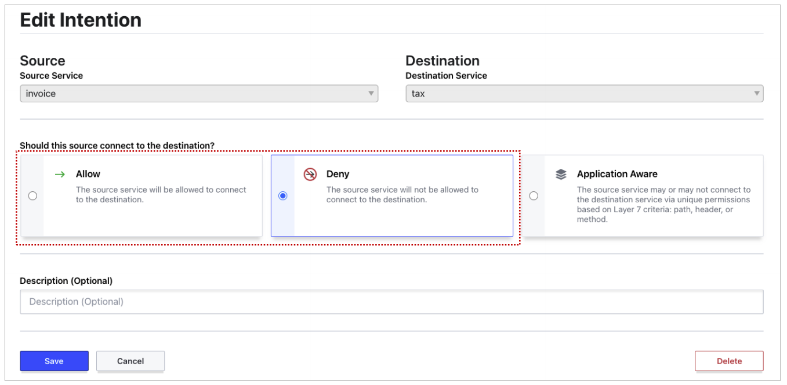
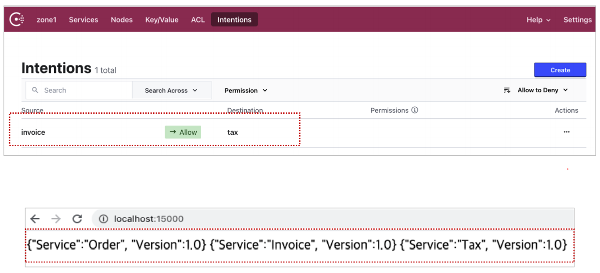

# Proxy

보안을 강화하기 위해 외부 서비스에서 접속을 할때 실제 `port`는 `15000`이지만 가상의 `port`를 생성하여 `16001`으로 연결하도록 만들 수 있다.  그리고 보안 뿐만아니라 proxy를 통해 naver에 접근을 하였지만 youtube가 열리도록 하는 것도 가능하다. 그 예로 도박사이트에 접속을 했을 때 도박사이트가 뜨지않고 ""접속할 수 없는 사이트!"가 뜨도록 하는 웹이 열리도록 할 수도 있다.

실제 연결되는 포트는 `15001` `15002`이지만 가상포트로 `16001`, `16002`로 넣겠습니다.

```cmd
> set INV_SVC_URL=http://127.0.0.1:16001
> python order.py
```

```cmd
> set TAX_SVC_URL=http://127.0.0.1:16002
> python invoice.py
```

```cmd
> python tax.py
```


**`order.py`**

```python
from flask import Flask
import requests
import os

app = Flask(__name__)

@app.route('/')
def get_order():
    url=os.environ.get('INV_SVC_URL')

    response = requests.get(url)
    ver = "1.0"
    payload='{"Service" : "Order", "Version" : ' + ver + '}\n'
    payload = payload + response.content.decode('utf-8')
    return payload

if __name__ == '__main__':
    app.run(debug=True, host='0.0.0.0', port=15000)
```


**`invoice.py`**

```python
from flask import Flask
import requests
import os

app = Flask(__name__)

@app.route('/')
def get_order():
    url=os.environ.get('TAX_SVC_URL')

    response = requests.get(url)
    ver = "1.0"
    payload='{"Service" : "Invoice", "Version" : ' + ver + '}\n'
    payload = payload + response.content.decode('utf-8')
    return payload

if __name__ == '__main__':
    app.run(debug=True, host='0.0.0.0', port=15001)
```


**`tax.py`**

```python
from flask import Flask
import requests
import os

app = Flask(__name__)

@app.route('/')
def get_tax():
    ver = "1.0"
    payload = '{"Service" : "Tax", "Version" : ' + ver + '}\n'

    return payload

if __name__ == '__main__':
    app.run(debug=True, host='0.0.0.0', port=15002)
```


**`order.json`**

```json
{
    "service": {
        "name" : "order",
        "tags" : ["order"],
        "port" : 15000,
        "connect" : {
            "sidecar_service" : {
                "proxy" : {
                    "upstreams" : [
                    	{
                        	"destination_name" : "invoice",
                        	"local_bind_port" : 16001
                    	}
                	]
                }
            }
        }
    }
}
```


**`inovice.json`**

```json
{
    "service": {
        "name" : "invoice",
        "tags" : ["invoice"],
        "port" : 15001,
        "connect" : {
            "sidecar_service" : {
                "proxy" : {
                    "upstreams" : [
                    	{
                        	"destination_name" : "tax",
                        	"local_bind_port" : 16002
                    	}
                	]
                }
            }
        }
    }
}
```


**`tax.json`**

```json
{
    "service": {
        "name" : "tax",
        "tags" : ["tax"],
        "port" : 15002,
        "connect" : {
            "sidecar_service" : {}
        }
    }
}
```


Consul 서버 재기동 후 다음 명령어 처리

```cmd
> consul agent -dev -ui -datacenter zone1 -node host1 -config-dir ./consul.d/
```

```CMD
> consul connect proxy -sidecar-for order
> consul connect proxy -sidecar-for invoice
> consul connect proxy -sidecar-for tax
```


마이크로서비스 재실행 후 `16001`, `16002` port로 정상 접근이 되는지 확인

```cmd
> python tax.py
> TAX_SVC_URL=http://127.0.0.1:16002 python invoice.py
> INV_SVC_URL=http://127.0.0.1:16001 python order.py
```

```cmd
> curl http://127.0.0.1:15000
{"Service" : "Order", "Version" : 1.0}
{"Service" : "Invoice", "Version" : 1.0}
{"Service" : "Tax", "Version" : 1.0}

> curl http://127.0.0.1:16001
{"Service" : "Invoice", "Version" : 1.0}
{"Service" : "Tax", "Version" : 1.0}

> curl http://127.0.0.1:16002
{"Service" : "Tax", "Version" : 1.0}
```


#### Intention을 통해 Allow or Deny Traffic 설정

`order`에서 `invoice`로 접근 확인

```cmd
> consul intention check order invoice
Allowed
```


`order`부분이 오타가나도 모든 경우에 접속을 할 수있기때문에 허락이 떨어집니다.

```cmd
> consul intention check orderaaaaa invoice
Allowed
```


`invoice`에서 `tax`로 접근을 deny 해보겠습니다.

```cmd
> consul intention create -deny invoice tax
Created: invoice => tax (deny)
```


서비스 실행 → Error

```cmd
> curl http://localhost:15001
```


Consul web에서도 Intentions 메뉴에서 생성, 수정, 삭제를 할 수 있습니다.



