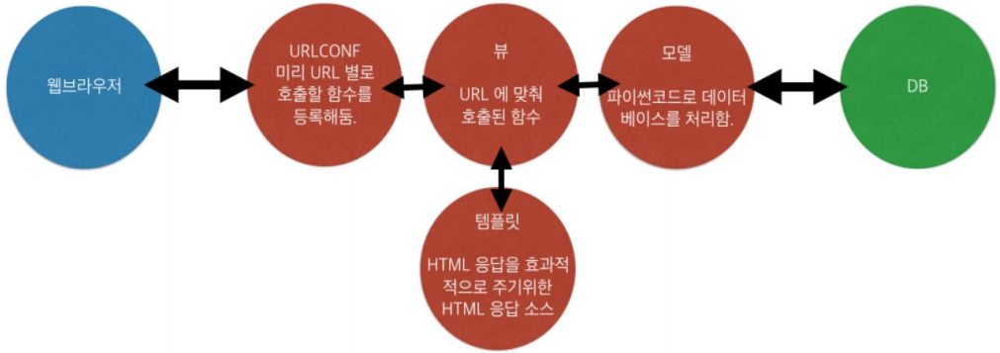
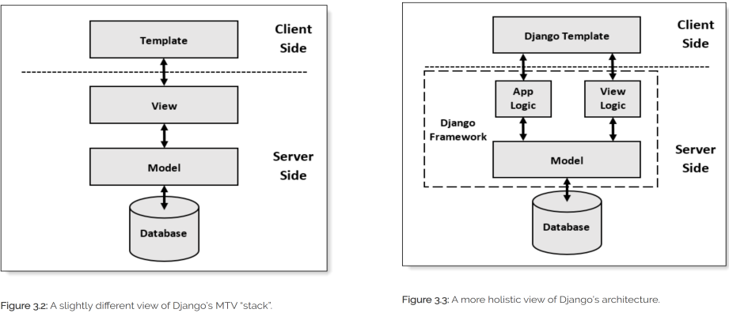

# Django 설치

- `pip install django` 
- `python --version`
- `pip --version`

**주의) 맥/리눅스에서는 python 명령으로 파이썬2가 실행될 수 있습니다. **

**그럴 때에는 python3 명령을 입력해 보세요. 환경변수 PATH에 대한 명확한 이해가 필요합니다. **

# Django 기본 구조

# MTV 개발 방식

> MTV(Model Template View) 패턴 

1) Model : 테이블을 정의한다. 

2) Template : 사용자가 보게 될 화면의 모습을 정의한다. 

3) View : 애플리케이션의 제어 흐름 및 처리 로직을 정의한다. 

- 모델은 `model.py`파일에, 템플릿은 templates 디렉토리 하위의 `*.html` 파일에, 뷰는 `views.py` 파일에 작성하도록 처음부터 뼈대를 만들어 줍니다.

- 모델,템플릿,뷰 모듈 각각에 독립성을 유지할 수 있고, 소프트웨어 개발의 중요한 원칙이 느슨한 결합(Loose Coupling) 설계의 원칙에도 부합된다. 

- Django에서 프로젝트를 생성하기 위해 `startproject` 및 `startapp` 명령을 실행하면 자동으로 프로젝트 뼈대(skeleton)에 해당하는 디렉토리와 파일들을 만들어 줍니다.

  

##  MVC 패턴

> MVC(Model View Controller) 패턴
>
> Spring MVC 프레임워크

1) Model : 테이블을 정의한다. 

2) View : 사용자가 보게 될 화면의 모습을 정의한다. 

3) Controller : 애플리케이션의 제어 흐름 및 처리 로직을 정의한다.

> Django’s Structure ( https://djangobook.com/mdj2-django-structure/ )

# Server-Side Rendering

> JSP, Thymeleaf, PHP

- server에서 html을 작성해 클라이언트로 내려주는 방식
 - Synchronous(동기)방식으로 통신 
   - request를 보내고 response가 올때까지 클라이언트는 WAITING하는 방식
 - 단점: 부분요청을 보내도 전체데이터를 클라이언트로 전송이 되어 속도가 느리다.

# Client-Side Rendering

> Ajax(Asynchronous Javascript and XML)

- server에서는 data(xml,json,csv)를 내려주면, 클라이언트에서 html을 작성하는 방식
 - Asynchronous(비동기)방식으로 통신
   - request를 보내고 response를 waiting하지 않고, 다른 일을 하는 방식
   - javascript의 XmlHttpRequest가 비동기 방식으로 통신을 해주는 역할

# ORM

> ORM(Object Relational Mapping)

- 객체를 RDB의 Table로 매핑
  - 테이블을 클래스로 매핑하여 CRUD 기능을 클래스 객체에 대해 수행 -> DB반영
- Mapping Rule
  - Model Class < - > Table
  - Object < - > Row(Record), 행
  - Variable < - > Column, 열

# 코딩 순서

1. 프로젝트생성
   - 프로젝트 및 앱 개발에 필요한 디렉토리와 파일 생성
2. 모델 생성
   - 테이블 관련 내용 개발 (model.py, admin.py)
3. URL conf 생성
   - URL 및 뷰 매핑 관계를 정의 (url.py)
4. View 생성
   - 애플리케이션 로직 개발 (views.py)
5. Template 생성
   - 화면 UI개발 (templates/ 디렉토리 하위의 *.html파일)