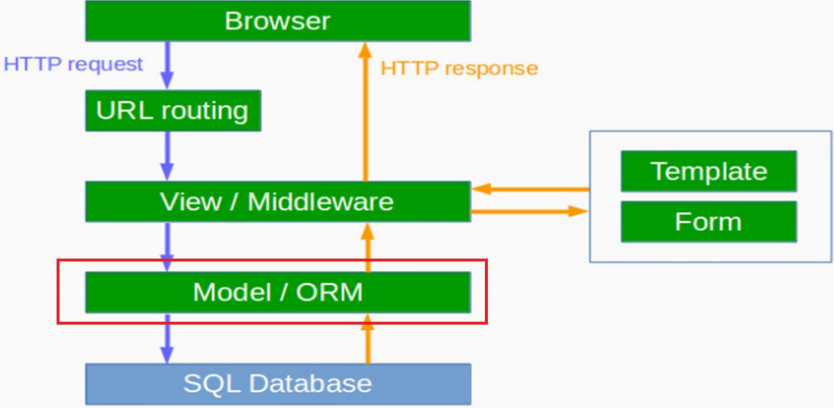

# Architecture :  ORM과 Queryset 





# ORM 이란?

- 객체와 관계형 데이터베이스의 데이터를 자동으로 Mapping(연결)해주는 것을 말한다.
  - 객체 지향 프로그래밍은 클래스를 사용하고, 관계형 데이터베이스는 테이블을 사용한다.
  - 객체 모델과 관계형 모델 간에 불일치가 존재한다.
  - ORM을 통해 객체 간의 관계를 바탕으로 SQL을 자동으로 생성하여 불일치를 해결한다.


### 장점

- 객체 지향적인 코드로 인해 더 직관적이고 비즈니스 로직에 더 집중할 수 있게 도와준다.
  - 선언문, 할당, 종료 같은 부수적인 코드가 없거나 급격히 줄어든다.
  - 각종 객체에 대한 코드를 별도로 작성하기 때문에 코드의 가독성을 올려준다.
  - SQL의 절차적이고 순차적인 접근이 아닌 객체 지향적인 접근으로 인해 생산성이 증가한다.
- 재사용 및 유지보수의 편리성이 증가한다.
  - ORM은 독립적으로 작성되어있고, 해당 객체들을 재활용 할 수 있다.
  - 때문에 모델에서 가공된 데이터를 컨트롤러에 의해 뷰와 합쳐지는 형태로 디자인 패턴을 견고하게 다지는데 유리하다.
  - 매핑정보가 명확하여, ERD를 보는 것에 대한 의존도를 낮출 수 있다.
- DBMS에 대한 종속성이 줄어든다.
  - 대부분 ORM 솔루션은 DB에 종속적이지 않다.
  - 종속적이지 않다는것은 구현 방법 뿐만아니라 많은 솔루션에서 자료형 타입까지 유효하다.
  - 프로그래머는 Object에 집중함으로 극단적으로 DBMS를 교체하는 거대한 작업에도 비교적 적은 리스크와 시간이 소요된다.
  - 또한 자바에서 가공할경우 equals, hashCode의 오버라이드 같은 자바의 기능을 이용할 수 있고, 간결하고 빠른 가공이 가능하다.


### 단점

- 완벽한 ORM 으로만 서비스를 구현하기가 어렵다.
  - 사용하기는 편하지만 설계는 매우 신중하게 해야한다.
  - 프로젝트의 복잡성이 커질경우 난이도 또한 올라갈 수 있다.
  - 잘못 구현된 경우에 속도 저하 및 심각할 경우 일관성이 무너지는 문제점이 생길 수 있다.
  - 일부 자주 사용되는 대형 쿼리는 속도를 위해 SP를 쓰는등 별도의 튜닝이 필요한 경우가 있다.
  - DBMS의 고유 기능을 이용하기 어렵다. (하지만 이건 단점으로만 볼 수 없다 : 특정 DBMS의 고유기능을 이용하면 이식성이 저하된다.)
- 프로시저가 많은 시스템에선 ORM의 객체 지향적인 장점을 활용하기 어렵다.
  - 이미 프로시저가 많은 시스템에선 다시 객체로 바꿔야하며, 그 과정에서 생산성 저하나 리스크가 많이 발생할 수 있다.


# QuerySet이란?

- 쿼리셋(QuerySet)은 DB로부터 데이터를 읽고, 필터링을 하거나, 정렬을 할 수 있습니다
- 쿼리셋을 사용하기 위해 먼저 python shell을 실행
  - 인터렉티브 콘솔(Interactive Console) 실행
    - `terminal>  python manage.py shell`


# 모든 객체 조회하기

```
In [1]: Post.objects.all()
Traceback (most recent call last):
	File "<console>", line 1, in <module>
NameError: name 'Post' is not defined
```

```python
In [1]: from blog.models import Post
```

```python
In [2]: Post.objects.all()
Out[2]: <QerySet [<Post: my post title>, <Post: another post title>]>
```


# 객체 생성하기

- 객체를 저장하기 위해 `create()`함수를 사용합니다.
- 작성자(author)로서 User(사용자) 모델의 인스턴스를 가져와 젂달 해줘야 합니다.

```python
In [1]: from djnago.contrib.auth.models import User

In [2]: User.objects.all()
Out[2]: <QuerySet [<User: admin>]>

In [3]: me = User.objects.get(username='<user-name>')
Out[3]: <User: <user-name>>

In [4]: Post.objects.create(author=me, title='Sample title', text='Test')
```


# 필터링 하기

-  특정 사용자가 작성한 글을 찾고자 할 때 

```python
In [1]: Post.objects.filter(author=me)
```


-  글의 제목(title)에 'title' 이라는 글자가 들어간 글을 찾고자 할 때

```python
In [1]: Post.objects.filter(title__contains='title')
```


- 게시일(published_date)로 과거에 작성한 글을 필터링하여 목록을 가져올 때

``` python
In [1]: from django.utils import timezone

In [2]: Post.objects.filter(published_date__lte=timezone.now())
```


- 게시(publish)하려는 Post의 인스턴스를 가져온다.

```python
In [1]: post = Post.objects.get(title="Sample title")
```


- 가져온 Post 인스턴스를 publish() 메서드를 이용하여 게시한다.

``` python
In [1]: post.publish()
```


# 정렬 하기

- 작성일(created_date) 기준으로 오름차순으로 정렬하기

``` python
In [1]: Post.objects.order_by('created_date')
```


- 작성일(created_date) 기준으로 내림차순으로 정렬하기 : – 을 붙이면 내림차순 정렬

```python
Post.objects.order_by('-created_date')
```


- 쿼리셋들을 함께 연결(chaining) 하기

```python
Post.objects.filter(published_date__lte=timezone.now()).order_by('published_date')
```

