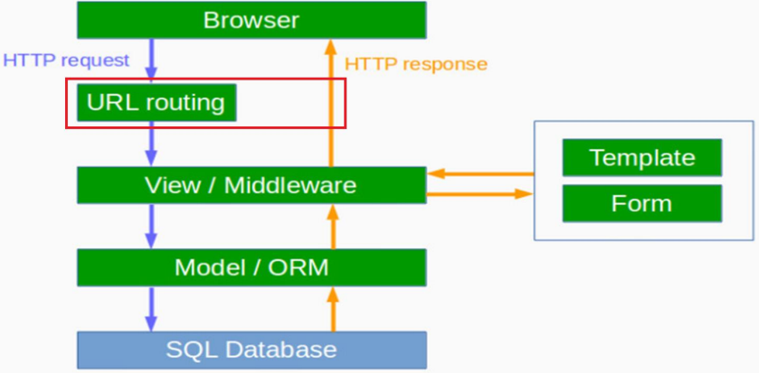

# Django의 Architecture : URL Routing




# Django URLConf (configuration)란?

- 프로젝트/settings.py 에 최상위 URLConf 모듈을 지정 
  - URLConf는 장고에서 URL과 일치하는 view를 찾기 위한 패턴들의 집합이다.
  - 특정 URL과 View 매핑 List 
  - Django 서버로 Http 요청이 들어올 때마다, URLConf 매핑 List를 처음부터 끝까지 순차적으로 찾으며 검색합니다.


# Django URLConf (configuration) 설정하기

- blog/urls.py를 작성하여 blog와 관련된 url들을 따로 정의함

```python
# mydjango/urls.py
from django.contrib import admin
from django.urls import path, include

urlpatterns = [
 path('admin/', admin.site.urls),
 path('', include('blog.urls')),
]
```

``` python
# blog/urls.py
from django.urls import path
from . import views

urlpatterns = [
path('', views.post_list, name='post_list'),
]
```


- 'http://127.0.0.1:8000/' 요청이 오면 views.post_list를 보여준다.

