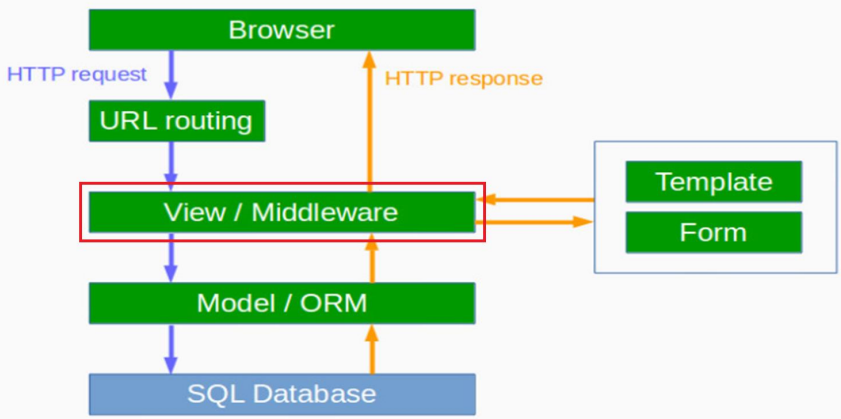

# Django의 Architecture : View




# View의 역할

- View는 애플리케이션의 "로직"을 포함하며 모델에서 필요한 정보를 받아 와서 템플릿에 전달하는 역할을 한다.

- View는 Model과 Template을 연결하는 역할을 한다.

- URLConf에 매핑된 Callable Object 첫번째 인자로 HttpRequest 인스턴스를 받습니다. 반드시 HttpResponse 인스턴스를 리턴 해야 합니다. [참고 사이트](https://docs.djangoproject.com/en/1.11/ref/request-response/)


# View

- `post_list`라는 함수(def)를 만들어 요청을 받아서 직접 문자열로 HTML형식 응답하기
  - 함수(Function-based view)방식과 클래스(Class-based view)도 사용한다. 

```python
# blog/view.py
from django.http import HttpResponse

# 첫번째 방법
def post_list(request):
    name = 'Django'
    return HttpResponse(f'''<h2>Hell o {name}</h2><p>HTTP METHOD : \			                         {request.method}</p>''')

# 두번째 방법
def post_list(request):
    name = 'Django'
	response = HttpResponse(content_type='text/html')
    response.write(f'<h2>Hello {name}!!</h2>')
    response.write(f'<p>HTTP Method : {request.method}</p>')
    response.write(f'<p>HTTP Request : {request}</p>')
    response.write(f'<p>HTTP ContentTpye : {request.content_type}</p>')
    
    return response

```


- `view.py`에서 작성한 코드를 `blog/urls.py`에서 요청하기

```python
# blog/urls.py
from . import views

urlpatterns = [
    path('', views.post_list, name='post_list')
]
```


- 메인 폴더의 `urls.py`에서 `blog/urls.py`로 연결해주는 코드를 입력해줍니다.

```python
# mydjango_prj/urls.py
from django.urls import path, include

urlpatterns = {
    path('admin/', admin.site.urls),
    path('', include('blog.urls')),
}
```

