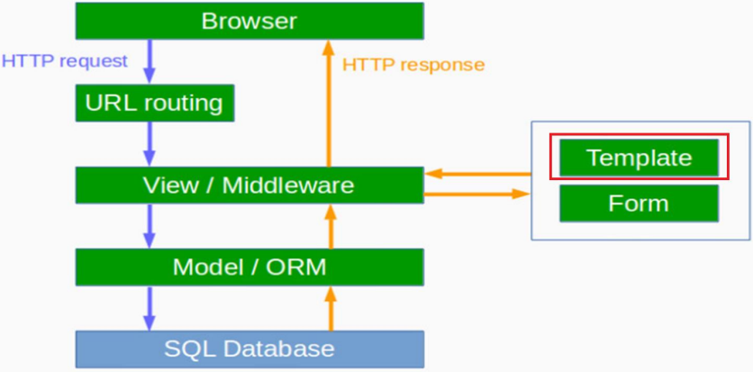

# Django의 Architecture : Template




# Template의 역할

- Template은 정보를 일정한 형태로 표시하기 위해 재사용 가능한 파일
- Django의 template 양식은 HTML을 사용합니다
- 템플릿은 blog/templates/blog 디렉토리를 만들어 저장합니다

```html
<!-- blog/templates/blog/post_list.html -->

<html>
	<head>
		<title>Django blog</title>
	</head>
	<body>
		<p>Hi there!</p>
 		<p>It works!</p>
	</body>
</html>
```


- html을 작성후에는 `view.py`의 `post_list`함수를 render로 바꿔준다.

```python
# blog/view.py
from django.shortcuts import render

def post_list(request):
	return render(request,'blog/post_list.html')
```


# 템플릿에서 동적 데이터 처리

- 게시일(published_date) 기준으로 과거에 작성한 글을 필터링하여 정렬하여 글 목록 가져오기

```python
# blog/view.py
from django.shortcuts import render
from django.utils import timezone
from .models import Post

def post_list(request):
	posts = Post.objects.filter(published_date__lte=timezone.now()).\
	order_by('published_date')
	
    return render(request, 'blog/post_list.html', {'posts': posts})

```


- Template에서는 view에서 저장한 posts 변수를 받아와서 HTML에 출력한다.
  - 변수의 값을 출력하려면 중괄호를 사용
  -  와  사이에서 목록의 모든 객체를 반복하여 출력

```html
<body>
    <h1>Hello Django</h1>
    <p>{{requset.method}}</p>

    }
        {{post}}
    
</body>
```


- ''|' linebreaksbr 같이 파이프 문자(|)를 사용하여, 블로그 글 텍스트에서 행이 바뀌면 문단으로 변환하여 출력할 수 있습니다.

```html
}
	<div>
    	<p>Published : {{post.published_date}}</p>
        <h2><a href="">{{post.title}}</a></h2>
        <p>{{post.text|linebreaksbr}}</p>
    </div>

```


# Template Engine 문법

-  1개 쓰이기도 하며, 2개 이상이 조합되기도 함
- 빌트읶 Tag가 지원되며, 장고앱 별로 커스텀 Tag 추가 가능

1. `block tag`

   - 자식 템플릿이 오버라이딩 할 block 영역을 정의

   - 자식 템플릿은 부모가 정의한 block에 한해서 재 정의만 가능. 그 외는 모두 무시됩니다.

   - ```html
     
     	block 내에 내용을 쓰실 수 있습니다.
     
     ```

     

2. `Comment Tag`

   - 템플릿 주석

   - ```html
     
     	이 부분은 렌더링 되지 않습니다.
     
     ```

     

3. ` csrf_token tag`

   - Cross Site Request Forgeries를 막기 위해 CSRF Middleware가 제공

   - ```html
     <form method="POST" action="">
     	
     	<input type="text" name="author" />
     	<textarea name="message"></textarea>
     	<input type="submit" />
     </form>
     ```

     

4. ` extends tag`

   - 자식 템플릿에서 부모 템플릿 상속을 명시

   - extends tag는 항상 템플릿의 처음에 위치해야 합니다.

   - 상속받은 자식 템플릿은 부모 템플릿에서 정의한 block맊 재정의할 수 있습니다.

   - ```html
     
     ```

     

5. `for tag`

   - 지정 객체를 순회하며 파이썬의 for문과 동일

   - ```html
     
     	<li>{{ athlete.name }}</li>
     
     ```

     

6. `for ... empty tag`

   - for tag 내에서 지정 object를 찾을 수 없거나, 비었을 때 empty block이 수행

   - ```html
     
     	<li>{{ athlete.name }}</li>
     
     	<li>Sorry, no athletes in this list.</li>
     
     ```

     

7. `if tag`

   - 파이썬의 if문과 동일

   - ```html
     
     	Number of athletes: {{ athlete_list|length }}
     
     	Athletes should be out of the locker room soon!
     
     	No athletes.
     
     ```

     

8. `url tag`

   - • URL Reverse를 수행한 URL문자열을 출력

   - ```html
     
     
     
     ```


# Django : Template에 css 적용 

### 1. CSS 파일 작성

- static 디렉토리 안에 css 디렉토리를 만들고 blog.css라는 파일을 작성.

```css
/*-- blog/static/css/blog.css */
h1 a {
	color: #FCA205;
	font-family: 'Lobster';
}
body { padding-left: 15px;}
```

```css
/*-- blog/templates/blog/post_list.html */

<html>
	<head>
		<title> Django`s blog </title>
		<link rel="stylesheet" href="">
</head>
```


### 2. 부트스트랩(Bootstrap) 적용하기

- Bootstrap을 설치하려면.html파일 내 에 아래의 링크를 넣어야 합니다.

```html

<html>
	<head>
		<title>Django's blog</title>
		<link rel="stylesheet" href="https://maxcdn.bootstrapcdn.com/bootstrap/
         3.3.2/css/bootstrap.min.css">
		<link rel="stylesheet" href="https://maxcdn.bootstrapcdn.com/bootstrap/
         3.3.2/css/bootstrap-theme.min.css">
		<link rel="stylesheet" href="http://fonts.googleapis.com/
         css?family=Lobster&subset=latin,latin-ext" type="text/css">
		<link rel="stylesheet" href="">
	</head>
```

- 이 외에 [bootstrap](https://getbootstrap.com/docs/5.0/getting-started/introduction/) , [Templates](https://startbootstrap.com/themes) 에서 여러가지 테마를 사용할 수 있습니다.


# 템플릿 상속하기(Template Inheritance)

1. Template 상속(Inheritance)이란? 

   - Template 상속을 사용하면 동읷한 정보/레이아웃을 사용 하고자 할 때, 모든 파일마다 같은 내용을 반복해서 입력 할 필요가 없게 됩니다. 
   - 수정할 부분이 생겼을 때도, 각각 모듞 파일을 수정 할 필요 없이 한번만 수정 하면 됩니다.

2. 기본 템플릿 html 생성하기 

   - 기본 템플릿은 웹사이트 내 모듞 페이지에 확장되어 사용되는 가장 기본적인 템플릿입니다. 
   - blog/templates/blog/에 base.html 파일을 생성한다. 
   - post_list.html에 있는 모든 내용을 base.html에 아래 내용을 복사해 붙여 넣는다.

3.  기본 템플릿

   -  사이에 있는 코드를 제거하고

   -  으로 변경한다.

   - ```html
     <!-- blog/templates/blog/base.html -->
     <body>
         <div class="page-header">
             <h1><a href="/">Django Blog</a></h1>
         </div>
         <div class="content container">
             <div class="row">
                 <div class="col-md-8">
                     
                     
                 </div>
             </div>
         </div>
     </body>
     ```


4. post_list.html 수정하기

   - 와  사이에 부터  코드를 넣는다.

   - 두 템플릿을 연결하기 위해  코드를 추가한다.

   - ```html
     <!-- blog/templates/blog/post_list.html -->
     
     
     
         
             <div class="post">
                 <div class="date">
                     {{ post.published_date }}
                 </div>
                 <h1><a href="">{{ post.title }}</a></h1>
                 <p>{{ post.text|linebreaksbr }}</p>
             </div>
         
     
     ```

     