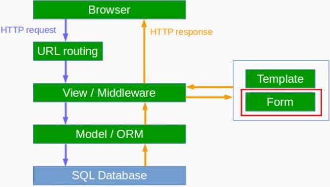

# Django의 Architecture : Form




# Form이란?

- Model클래스와 유사하게 Form클래스를 정의
- 주요 역할 : 커스텀 Form클래스를 통해
  - 입력 폼 HTML 생성 : `.as_table()`, `.as_p()`, `.as_ul()` 기본제공
  - 입력 폼 값 검증(validation) 및 값 변환


# HTTP Method에 따라 Form 처리

- GET방식으로 요청 : 입력 폼을 보여줍니다.
- POST방식으로 요청 : 데이터를 입력 받아 유효성 검증 과정을 거칩니다.
  - 검증 성공 시 : 해당 데이터를 저장하고 SUCCESS URL로 이동
  - 검증 실패 시 : 오류 메시지와 함께 입력 폼을 다시 보여줍니다.


####  1. Form 클래스 정의

```html
from django import forms

class PostForm(forms.Form):
	title = forms.CharField()
	text = forms.CharField(widget=forms.Textarea)
```


#### 2. 필드 유효성 검사 함수 추가 적용

```html
from django import forms
def min_length_3_validator(value):
	if len(value) < 3:
		raise forms.ValidationError('3글자 이상 입력해주세요.')

from django import forms
class PostForm(forms.Form):
	title = forms.CharField(validators=[min_length_3_validator])
	text = forms.CharField(widget=form.Textarea)
```


#### 3. View 함수 내에서 Form 인스턴스 생성

- GET요청을 통해 View 함수가 호출이 될 때, GET/POST 요청을 구분해서 Form 인스턴스 생성

``` html
# myapp/views.py
from .forms import PostForm
if request.method == 'POST':
	# POST 요청일 때
	form = PostForm(request.POST, request.FILES)
else:
	# GET 요청일 때
	form = PostForm()
```


####  4. POST요청에 한해 입력 값 유효성 검증

```html
# myapp/views.py
if request.method == 'POST':
	# POST읶자는 request.POST와 request.FILES를 제공받음.
	form = PostForm(request.POST, request.FILES)
	# 인자로 받은 값에 대해서, 유효성 검증 수행
	if form.is_valid(): # 검증이 성공하면, True 리턴
		# 검증에 성공한 값들을 dict타입으로 제공받아서 이 값을 DB에 저장하기
		form.cleaned_data
		post = Post(**form.cleaned_data) # DB에 저장하기
		post.save()
		return redirect('/success_url/')
	else: # 검증에 실패하면, form.errors와 form.각필드.errors 에 오류정보를 저장
		form.errors
else:
	form = PostForm()
	return render(request, 'myapp/form.html', {'form': form})
```


#### 5. 템플릿을 통해 HTML폼 생성

- 유효성 검증에서 실패했을 때 Form 읶스턴스를 통해 HTML폼 출력하고,오류 메시지도 있다면 같이 출력

```html
<table>
    <form action="" method="post">
        
        <table>{{ form.as_table }}</table>
        <input type="submit" />
    </form>
</table>
```


#  Model Form이란?

- 지정된 Model로부터 필드 정보를 인어 들여, form fields 를 세팅

``` html
class PostForm(forms.ModelForm):
	class Meta:
		model = Post
		fields = '__all__' # 전체필드지정 혹은 list로 인어올 필드명 지정
```

- 유효성 검증에 통과한 값들로, 지정 model instance로의 저장 (save)을 지원 (Create or Update)


# Django Form vs ModelForm

```html
from django import forms
from .models import Post

class PostForm(forms.Form):
	title = forms.CharField()
	text = forms.CharField(widget=forms.Textarea)

# 생성되는 Form Field는 PostForm과 거의 동일
class PostModelForm(forms.ModelForm):
	class Meta:
		model = Post
		fields = ['title', 'text']
```
