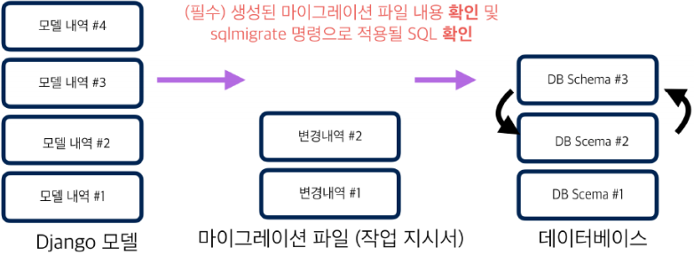

# Migrations

> django-south((https://south.readthedocs.io/en/latest/) 프로젝트가 킥스타터 펀딩 (£17,952, 507 Backers)을 통해, Django 1.7에 포함

- 모델 변경내역 히스토리 관리

- 모델의 변경내역을 Database Schema (데이터베이스 데이터 구조)로 반영시키는 효율적인 방법을 제공

  - 관련 명령

  ```
  terminal> python manage.py makemigrations <app-name> # 마이그레이션 파일 생성
  terminal> python manage.py migrate <app-name> # 마이그레이션 적용
  terminal> python manage.py showmigrations <app-name> # 마이그레이션 적용 현황
  terminal> python manage.py sqlmigrate <app-name> <migration-name> # 지정
  마이그레이션의 SQL 내역
  ```


# migration 파일 생성 및 적용

- 마이그레이션 파일 (초안) 생성하기 : `makemigration`s 명령
- 해당 마이그레이션 파일을 DB에 반영하기 : `migrate` 명령




# 필수 입력 필드를 추가

1. 기존 모델 클래스에 필수 필드를 추가하여
   - `python manage.py makemigrations blog` 수행
   - 필수 입력 필드를 추가하므로, 기존 Row들에 필드를 추가할 때, 어떤 값으로 채워 넣을 지 묻습니다.
   - 선택1) 지금 값을 입력 선택
   - 선택2) 모델 클래스를 수정하여 디폴트 값을 제공


2. 선택한 후, 원하는 이름값을 입력

3. `python manage.py migrate blog`


##### 전체 파일명을 지정하지 않더라도 유일한 1개의 파일명 판독 가능하면 일부 파일명으로도 지정 가능

```
blog/migrations/0001_initial.py
blog/migrations/0002_create_field.py
blog/migrations/0002_update_field.py

python manage.py migrate blog 000 # FAIL (다수 파일에 해당)
python manage.py migrate blog 100 # FAIL (해당되는 파일이 없음)
python manage.py migrate blog 0001 # OK
python manage.py migrate blog 0002 # FAIL (다수 파일에 해당)
python manage.py migrate blog 0002_c # OK
python manage.py migrate blog 0002_create # OK
python manage.py migrate blog 0002_update # OK
python manage.py migrate blog zero # blog앱의 모든 마이그레이션을 취소
```

