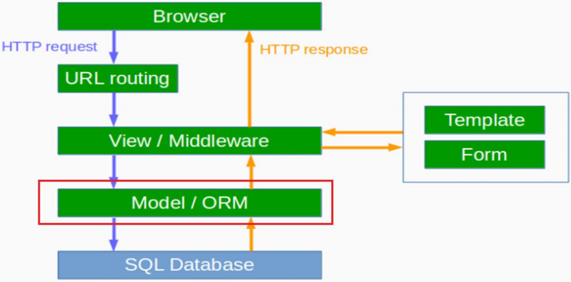

# Django의 Architecture - Model




# Django Model

- Django 내장 ORM(Object Relational Mapping) 

  - ( https://docs.djangoproject.com/en/3.0/topics/db/models/ ) 

- SQL을 직접 작성하지 않아도, Django Model을 통해 데이터베이스로의 접근 가능 (조회/추가/수정/삭제) 

- <Python 클래스>  와 <데이터베이스 테이블> 을 매핑 

  - Model : DB 테이블과 매핑 

  - Model Instance : DB 테이블의 1 Row 

  - blog앱 Post모델 : blog_post 데이터베이스 테이블과 매핑 

  - blog앱 Comment모델 : blog_comment 데이터베이스 테이블


# 첫번째 앱  'blog'앱 생성 

1. App 디렉토리 생성

   - `django> python manage.py startapp blog`

     - django/conf/app_template 구성으로 App 디렉토리가 생성되어진다.

       

2. App을 프로젝트에 등록 : 아래와 같이 <name>/settings.py을 편집하여, `INSTALLED_APPS` 항목 끝에 `blog App` 이름을 추가한다.

``` python
# <name>settings.py 파일

INSTALLED_APPS = [
    # 생략
    'blog',
]
```


# blog앱 글(Post) Model 만들기 

```python
# blog/models.py
from django.db import models
from django.utils import timezone

class Post(models.Model):
    # 작성자
	author = models.ForeignKey('auth.User', on_delete=models.CASCADE)
    # 글제목
	title = models.CharField(max_length=200)
    # 글내용
	text = models.TextField()
    # 작성일
	created_date = models.DateTimeField(default=timezone.now)
    # 게시일
	published_date = models.DateTimeField(blank=True, null=True)

	def publish(self):
		self.published_date = timezone.now()
		self.save()
	
    def __str__(self):
		return self.title
```


# DB에 테이블 만들기

1. 마이그레이션 파일(migration file) 생성

   - `django> python manage.py makemigrations blog`

     

2.  실제 데이터베이스에 Model 추가를 반영하기

   - `django> python manage.py migrate blog`


3. 관리자 페이지에서 만든 모델을 보기 위해 Post 모델을 등록

   ```python
   # blog/admin.py
   from django.contrib import admin
   from .models import Post
   
   # admin page 출력되는 내용을 customize
   class PostAdmin(admin.ModelAdmin):
       list_display = ['id', 'title', 'count_text']
       list_display_links = ['title']
   
       def count_text(self, obj):
           return f'{len(obj.text)}글자'
   
   admin.site.register(Post)
   ```

   

4.  관리자 화면에서 확인하기

   - http://localhost:8000/admin/ 으로 접속