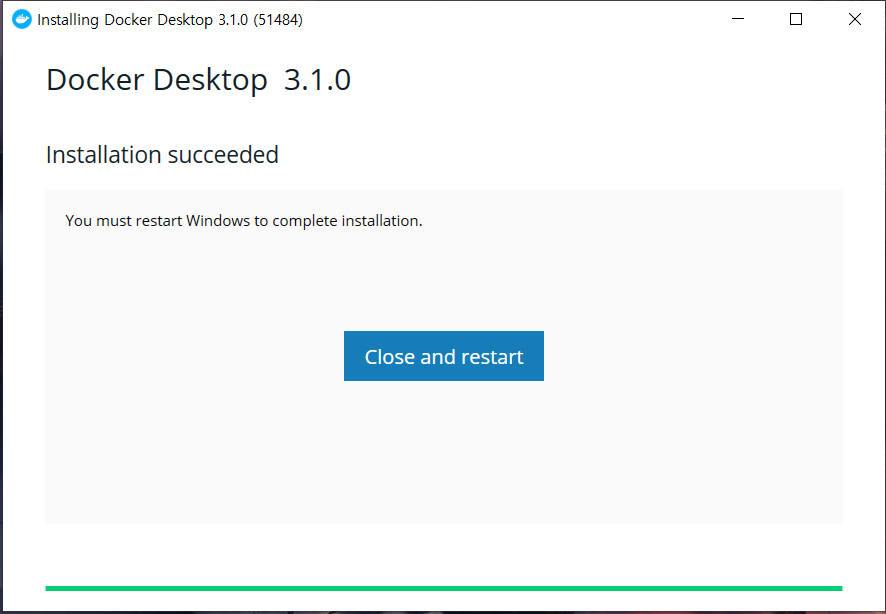
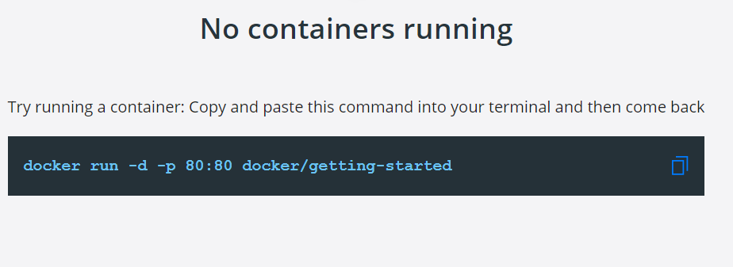

# windows환경 설치

- [Docker](https://www.docker.com/get-started) 에서 Download for Windows 클릭 후 설치 완료되면 재시작 버튼을 클릭

- 재시작 후 만약 **restart** 에러가 뜬다면 링크를 타고 들어가서 다운로드 후 다시 restart

- 만약 자신의 OS가 Windows 10 Home이라면  여기서 [설치](https://hub.docker.com/editions/community/docker-ce-desktop-windows/?tab=description )

- CMD 창에서 밑의 그림처럼 창이 뜨면 복사 후 시작한다!

