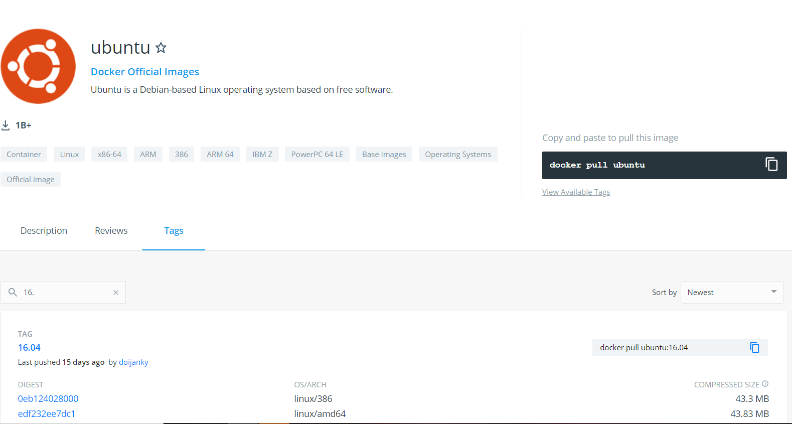

# Container 생성

1. [Docker Hub](https://hub.docker.com) 사이트 에서 원하는 image를 검색합니다. 

- 저는 Ubuntu Image를 가져오겠습니다. 밑에 Tags부분에서 원하는 버전을 찾고싶으면 검색하여 찾을 수 있습니다. 저는 16.04버전을 pull 하기위해 검색하여 나온 명령어를 복사하고 cmd에 입력하겠습니다.
  - `$ docker pull ubuntu:16.04`

2. Container 생성 후 접속

**위와 같이 Image를 가져오고 따로 Container를 생성해도 무관하지만 더 편한 방법이 있습니다.**

- `docker run -it --name [container_name] ubuntu:16.04 /bin/bash`
  - ubuntu image가 없으면 다운받으면서 container를 설정한 이름으로 생성 후 실행
  - 빠져나오고싶으면 `exit` 입력

- container 내부 `/#` 상태에서`exit` 후에 다시 접속
  1. `$ docker container ls -a`를 입력하여 container 정보를 확인
  2. 만약 접속할 container status가 `Exited` 상태라면 container를 `start`!
     - `$ docker container start [container_id, container_name]` 
  3. container에 접속
     - `$ docker exec -it [container_id, container_name] /bin/bash`
