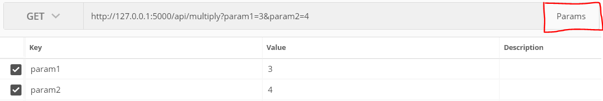

#### 설치

```cmd
> conda activate <virtual_name>
> pip install flask_restful
> pip install jsonify
```


**`rest1.py`**

```python
from flask import Flask, jsonify
import flask_restful
from flask_restful import reqparse


app = Flask(__name__)
app.config["DEBUG"] = True
api = flask_restful.Api(app)


def multipy(param1, param2):
    return param1 * param2


@app.route('/')
def index():
    return "Hello, Flask!"
```

```python
class HelloWorld(flask_restful.Resource):
    def get(self):
        parser = reqparse.RequestParser()

        # GET /api/multiply?param1=3&param2=4
        parser.add_argument('param1')
        parser.add_argument('param2')
        args = parser.parse_args()

        param1 = args['param1']
        param2 = args['param2']

        if (not param1) or (not param2):
            return {
                'state' : 0,
                'response' : None
            }
    
        param1 = int(param1)
        param2 = int(param2)

        result = multipy(param1, param2)
        return {
            'state' : 1,
            'response' : result
        }
        

api.add_resource(HelloWorld, '/api/multiply')


if __name__ == '__main__':
    app.run()
```


### Test

```cmd
> set FLASK_APP=<FILE_NAME>.py
> set FLASK_DEBUG=True
> flask run --port <PORT_NUMBER>
```

- `set FLASK_APP=<FILE_NAME>.py` -- `flask run`을 할때 파일 명이 `app.py`이 아니라면 수동 지정
- `set FLASK_DEBUG=True` -- 코드를 수정하면 서버를 껏다 킬 필요없이 자동으로 업데이트를 해줍니다.
- `--port <PORT_NUMBER>` -- port number를 임의로 지정. default number는 5000번 입니다.


**Postman**

###### GET -- `http://127.0.0.1:<PORT_NUMBER>/api/multiply`



- Params를 클릭 후 Key 값과 Value 값을 넣어서 정상적으로 출력 되는지 확인


## Testcase

**`rest1_test.py`**

```python
import unittest
import json
import rest1


class FlaskTest(unittest.TestCase):
    def setUp(self):
        rest1.app.testing = True
        self.client = rest1.app.test_client()


    # /api/multiply?param1=3&param2=4
    # -> ? 12
    def test_index(self):
        response = self.client.get('/')

        # response code: 200
        self.assertEqual(response.status_code, 200)
        # content type: text/html; charset=utf-8
        self.assertIn("text/html", response.content_type)
        self.assertEqual(response.charset, 'utf-8')

        content = response.data
        # 반환 데이터 확인
        self.assertEqual(content.decode('utf-8'), 'Hello, Flask!')


    def test_multyfly(self):
        response = self.client.get('/api/multiply?param1=3&param2=4')

        self.assertEqual(response.status_code, 200)
        self.assertIn("application/json", response.content_type)
        
        # TDD(Test Driven Development)
        json_result = json.loads(response.data)
        self.assertEqual(json_result.get('state'), 1)
        self.assertEqual(json_result.get('response'), 12)
        

if __name__ == '__main__':
    unittest.main()
```


### Test

```cmd
> python rest1_test.py
..
----------------------------------------------------------------------
Ran 2 tests in 0.015s

OK
```

