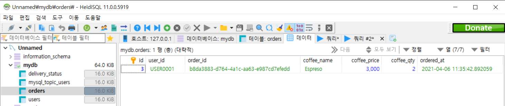

# 설계


# Flask에서 MariaDB와 Kafka를 연동-1

> MariaDB

Flask에서 MariaDB와 Kafka를 사용하여 서로 연동을 하는 작업을 하겠습니다.

이번 챕터에서는 MariaDB와 연결하여 데이터를 주고받는 코드를 짜겠습니다. 


설치

```cmd
> conda activate <virtual_name>
> pip install flask_restful
> pip install mariadb
```


- mariaDB table 생성

```mariadb
USE <database_name>;
CREATE TABLE orders(id INT AUTO_INCREMENT PRIMARY KEY,
                   user_id VARCHAR(100) NOT NULL,
                   order_id VARCHAR(100) NOT NULL,
                   coffee_name VARCHAR(50) NOT NULL,
                   coffee_price INT NOT NULL,
                   coffee_qty INT DEFAULT 1,
                   created_at VARCHAR(80)
               	   );
```


**`order_ms.py`**

```python
from flask import Flask, jsonify, request
from datetime import datetime
from flask_restful import reqparse
import flask_restful
import mariadb
import json
import uuid


app = Flask(__name__)
api = flask_restful.Api(app)

config = {
    'host': '127.0.0.1',
    'port': 3306,
    'password' : '<pwd>'
    'user': 'root',
    'database': 'mydb'
}

@app.route('/order-ms')
def index():
    return "Welcome to ORDER Microservice!"


class Order(flask_restful.Resource):
    def __init__(self):
        self.conn = mariadb.connect(**config)
        self.cursor = self.conn.cursor()
    
    def get(self, user_id):
        sql = '''SELECT user_id, order_id, coffee_name, 
        		coffee_price, coffee_qty, ordered_at
                FROM orders WHERE user_id=? order by id desc
        '''
        self.cursor.execute(sql, [user_id])
        
        result_set = self.cursor.fetchall()

        row_headers = [x[0] for x in self.cursor.description]

        json_data = []
        for result in result_set:
            json_data.append(dict(zip(row_headers, result)))

        return jsonify(json_data)
```

- SQL에 데이터 값을 넣을때

  - MariaDB = `?`

  - MySQL = `%s`


GET을 할때  Value값만 출력이 되어서 보기 편하게 Key값을 넣어주기위해 목록을 불러오는 코드를 입력

- `self.cursor.description`

```python
(
    ('user_id', 253, 100, 400, 0, 0, False, 4097), 
    ('order_id', 253, 100, 400, 0, 0, False, 4097), 
    ('coffee_name', 253, 50, 200, 0, 0, False, 4097), 
    ('coffee_price', 3, 2, 11, 0, 0, False, 36865), 
    ('coffee_qty', 3, 2, 11, 0, 0, True, 32768), 
    ('ordered_at', 253, 80, 320, 0, 0, True, 0)
)
```

위의 값에서 우리가 필요한건 'user_id'와 같이 tuple에서 맨 처음 값만 필요합니다.  그것을 구현한 코드가

`x[0] for x in self.cursor.description`  입니다. 그 값을 value값과 합치기위해 `dict`방식으로 합치는 코드를 사용하였습니다.


새로운 Table 생성

```mariadb
CREATE TABLE delivery_status (
	id INT AUTO_INCREMENT PRIMARY KEY,
	order_json TEXT,
	created_at DATETIME DEFAULT NOW()
);
```


**`order_ms.py`**

```python
def post(self, user_id):
        json_data = request.get_json()
        json_data['user_id'] = user_id
        json_data['order_id'] = str(uuid.uuid4())
        json_data['ordered_at'] = str(datetime.today())

        # DB INSERT
        sql = '''INSERT INTO orders(user_id, 
        							order_id, 
        							coffee_name, 
        							coffee_price, 
        							coffee_qty, 
        							ordered_at)
                    VALUES(?, ?, ?, ?, ?, ?)
        '''
        self.cursor.execute(sql, [user_id, 
                            json_data['order_id'],
                            json_data['coffee_name'],
                            json_data['coffee_price'],
                            json_data['coffee_qty'],
                            json_data['ordered_at']
                            ])
        self.conn.commit()

        # Kafka message send

        response = jsonify(json_data)
        response.status_code = 201

        return response
```


**`order_ms.py`**

```python
class OrderDetail(flask_restful.Resource):
    def get(self, user_id, order_id):
        return {'payload' : user_id, 'order_id' : order_id}


api.add_resource(Order, '/order-ms/<string:user_id>/orders')
api.add_resource(OrderDetail, '/order-ms/<string:user_id>/orders/<string:order_id>')


if __name__ == '__main__':
    app.run()
```


## Test

```cmd
> set FLASK_APP=<FILE_NAME>.py
> set FLASK_DEBUG=True
> flask run --port <PORT_NUMBER>
```

- `set FLASK_APP=<FILE_NAME>.py` -- `flask run`을 할때 파일 명이 `app.py`이 아니라면 수동 지정
- `set FLASK_DEBUG=True` -- 코드를 수정하면 서버를 껏다 킬 필요없이 자동으로 업데이트를 해줍니다.
- `--port <PORT_NUMBER>` -- port number를 임의로 지정. default number는 5000번 입니다.


##### **Postman**

##### GET --  `http://127.0.0.1:<PORT_NUMBER>/order-ms/USER0001/orders`

```json
[]
```


##### POST --  `http://127.0.0.1:<PORT_NUMBER>/order-ms/USER0001/orders`

- Body에서 raw 선택

```json
{
    "coffee_name" : "Espreso",
    "coffee_price" : 3000,
    "coffee_qty" : 2
}
```


##### 결과

```json
{
    "coffee_name" : "Espreso",
    "coffee_price" : 3000,
    "coffee_qty" : 2,
    "order_id" : "00000000-0000-0000-0000-000000000000",
    "ordered_at" : "202.....",
    "user_id" : "USER0001",
}
```


##### SQL orders table에 데이터가 정상적으로 들어가 있는지 확인

