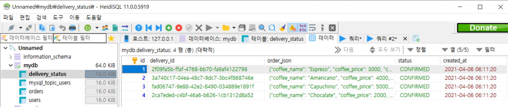

# Flask에서 MariaDB와 Kafka를 연동-2

> Kafka

이번 챕터에서는 저번 챕터에서 사용한 MariaDB를  Kafka와 연동을 해 보겠습니다.


설치

```cmd
> conda activate <virtual_name>
> pip install kafka-python
```


저번 챕터에서 작성했던 `py`파일에서 KafkaProducer를 사용한 코드를 추가

**`order_ms.py`**

```python
from kafka import KafkaProducer


class Order(flask_restful.Resource):
    def __init__(self):
			:                
        self.producer = KafkaProducer(bootstrap_servers=['localhost:9092'])
        
    def post(self, user_id):
        	:
            :
       	# producer 인스턴스의 send() 메소드로 json 데이터 전송
        self.producer.send('new_orders', value=json.dumps(json_data).encode())
        self.producer.flush()
        
        response = jsonify(json_data)
        response.status_code = 201
        
        return response
```


새로운 Table을 생성

```mariadb
CREATE TABLE delivery_status (
	id INT AUTO_INCREMENT PRIMARY KEY,
    delivery_id VARCHAR(50),
	order_json TEXT,
    status VARCHAR(50),
	created_at DATETIME DEFAULT NOW()
);
```


Kafka Consumer를 만들어 Kafka Topic에 추가한 Data를 바로 읽어들이고 DB에 Data를 추가하겠습니다.

**`kafka_consumer.py`**

```python
from kafka import KafkaConsumer
from datetime import datetime
import threading
import pymysql
import time
import json
import uuid


consumer = KafkaConsumer('new_orders', 
                        bootstrap_servers=["localhost:9092"], 
                        auto_offset_reset='earliest', 
                        enable_auto_commit=True, 
                        auto_commit_interval_ms=1000, 
                        consumer_timeout_ms=1000)

config = {
    'host': '127.0.0.1',
    'port': 3306,
    'password' : '<pwd>'
    'user': 'root',
    'database': 'mydb'
}

conn = pymysql.connect(**config)
cursor = conn.cursor()
sql = '''INSERT INTO delivery_status(delivery_id, order_json, status) 
		VALUES(%s, %s, %s)'''


def fetch_latest_orders(next_call_in):
    next_call_in += 30

    batch = consumer.poll(timeout_ms=100)
    
    if len(batch) > 0:
        for message in list(batch.values())[0]:
            value = message.value.decode()

            delivery_id = str(uuid.uuid4())
            status = 'CONFIRMED'
            
            # db insert
            cursor.execute(sql, [delivery_id, value, status])
            conn.commit()


    threading.Timer(next_call_in - time.time(), 
                    fetch_latest_orders, 
                    [next_call_in]).start()


next_call_in = time.time()
fetch_latest_orders(next_call_in)
```


## Test

##### Kafka Topic 생성 및 Consumer 실행

터미널1 -- zookeeper 실행

```cmd
> \bin\windows\zookeeper-server-start.bat .\config\zookeeper.properties
```

터미널2 -- kafka 실행

```cmd
> \bin\windows\kafka-server-start.bat .\config\server.properties
```

터미널3 -- Topic 생성 및 Consumer 실행

```cmd
> \bin\windows\kafka-topics.bat --create --topic <TOPIC_NAME> --bootstrap-server=localhost:9092
> \bin\windows\kafka-topics.bat --list --bootstrap-server=localhost:9092
> \bin\windows\kafka-console-consumer.bat --topic new_orders --bootstrap-server localhost:9092
```


##### Kafka consumer에 출력이 되는지 확인

```cmd
> .\bin\windows\kafka-console-consumer.bat --topic new_orders --bootstrap-server localhost:9092
{"coffee_name": "Espreso", "coffee_price": 3000, "coffee_qty": 2, "user_id": "USER0001", "order_id": "b8da3883-d764-4a1c-aa63-e987cd7efedd", "ordered_at": "2021-04-06 11:35:42.892059"}
```


```cmd
> python kafka_consumer.py
```




