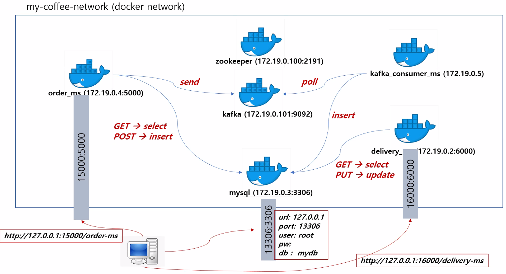
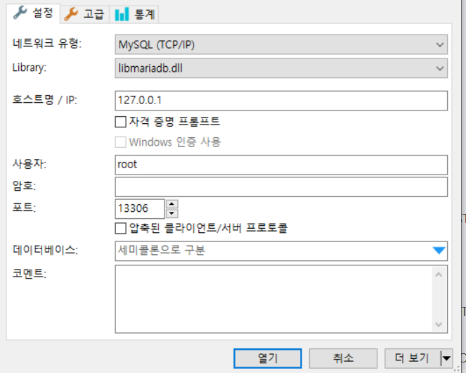

Docker network -- 가상환경

internal 과 external의 연결

local 환경에서 서버에 접속 하기위해선 `16000` `15000` `13306`번으로 사용

하지만 docker내에서는 `5000` `6000` `3306`으로 접속하기때문에 코드를 짤때 주의 하자


### 네트워크 생성

`docker network create --gateway 172.19.0.1 --subnet 172.19.0.0/24 my-coffee-network`

`docker network inspect my-coffee-network`

`"IPv4Address": "172.19.?.?"`

`order_ms.py`, `delivery_ms.py`, `kafka_consumer.py`에서 network에 맞게 새로 host번호를 변경 하겠습니다.

```python
# order_ms.py, kafka_consumer.py, delivery_ms.py
config = {
    'host': '172.19.?.?',
    'port': 3306,
    'user': 'root',
    'password' : ''
    'database': 'mydb'
}

# order_ms.py
self.producer = KafkaProducer(bootstrap_servers=['172.19.0.101:9092'])

# kafka_consumer.py
bootstrap_servers=["172.19.0.101:9092"]
```


### Docker DB 생성

`docker run -d -p 13306:3306 --network my-coffee-network -e MYSQL_ALLOW_EMPTY_PASSWORD=True --name mysql mysql:5.7`


MySQL Client에서 위와같이 접속을 하여 저번 챕터에서 만들었던 database와 table을 생성




```mariadb
CREATE DATABASE <DATABASE_NAME>
USE <DATABASE_NAME>
CREATE TABLE IF NOT EXISTS `delivery_status` (
  `id` int(11) NOT NULL AUTO_INCREMENT,
  `delivery_id` varchar(50) DEFAULT NULL,
  `order_json` text DEFAULT NULL,
  `status` varchar(50) DEFAULT NULL,
  `created_at` datetime DEFAULT current_timestamp(),
  PRIMARY KEY (`id`)
) ENGINE=InnoDB AUTO_INCREMENT=18 DEFAULT CHARSET=utf8;

CREATE TABLE IF NOT EXISTS `orders` (
  `id` int(11) NOT NULL AUTO_INCREMENT,
  `user_id` varchar(100) NOT NULL,
  `order_id` varchar(100) NOT NULL,
  `coffee_name` varchar(100) NOT NULL,
  `coffee_price` int(11) NOT NULL,
  `coffee_qty` int(11) DEFAULT 1,
  `ordered_at` varchar(50) DEFAULT NULL,
  PRIMARY KEY (`id`)
) ENGINE=InnoDB AUTO_INCREMENT=21 DEFAULT CHARSET=utf8;
```


## Dockerfile 생성

**`Dockerfile_delivery`**

```dockerfile
FROM python:3.7.9-stretch

WORKDIR /myflask

COPY delivery_ms.py /myflask/app.py

RUN pip install flask
RUN pip install flask_restful
RUN pip install pymysql


CMD [ "flask", "run", "--host", "0.0.0.0", "--port", "6000" ]
```

`> flask run --port 6000` 와 같이 서버를 실행한다면 `http://127.0.0.1:6000/`이 실행 됩니다. 이럴 때 문제는 local에서는 문제없이 실행이 되지만 **docker의 다른 network에서 접속을 하면 172.20.0.3 에서는 접속이 안되는 문제**가 생깁니다. 그래서  `flask run --host 0.0.0.0 --port 6000`로 host를 지정하여 실행 하여 문제를 해결 할 수 있습니다.


**`Dockerfile_order`**

```dockerfile
FROM python:3.7.9-stretch

WORKDIR /myflask

COPY order_ms.py /myflask/app.py

RUN pip install flask
RUN pip install flask_restful
RUN pip install pymysql
RUN pip install kafka-python

CMD [ "flask", "run",  "--host", "0.0.0.0", "--port", "5000" ]
```


**`Dockerfile_kafka`**

```dockerfile
FROM python:3.7.9-stretch

WORKDIR /mykafka

COPY kafka_consumer.py /mykafka/app.py

RUN pip install pymysql
RUN pip install kafka-python

CMD [ "python", "/mykafka/app.py" ]
```


### Kafka Server

`git clone https://github.com/wurstmeister/kafka-docker.git`

`docker-compose-single-broker.yml`

파일을 아래와 같이 조금 수정을 하겠습니다.

```yaml
version: '2'
services:
  zookeeper:
    image: wurstmeister/zookeeper
    ports:
      - "2181:2181"
    networks:
      my-network:
        ipv4_address: 172.19.0.100
  kafka:
    image: wurstmeister/kafka
    ports:
      - "9092:9092"
    environment:
      KAFKA_ADVERTISED_HOST_NAME: 172.19.0.101
      KAFKA_CREATE_TOPICS: "test:1:1"
      KAFKA_ZOOKEEPER_CONNECT: zookeeper:2181
    volumes:
      - /var/run/docker.sock:/var/run/docker.sock
    depends_on:
      - zookeeper
    networks:
      my-network:
        ipv4_address: 172.19.0.101

networks:
  my-network:
    name: my-coffee-network
```

`docker-compose -f docker-compose-single-broker.yml up -d`


#### Docker Build

```cmd
> docker build -t <Docker_ID>/flask_delivery_ms -f Dockerfile_delivery .
> docker build -t <Docker_ID>/flask_order_ms -f Dockerfile_order .
> docker build -t <Docker_ID>/flask_kafka_consumer -f Dockerfile_kafka .
```


#### Docker RUN

```CMD
> docker run -d -p 16000:6000 --network my-coffee-network --name delivery_ms <Docker_ID>/flask_delivery_ms

> docker run -d -p 15000:5000 --network my-coffee-network --name order_ms <Docker_ID>/flask_order_ms

> docker run --network my-coffee-network --name kafka_consumer jhg7856/flask_kafka_consumer
```


