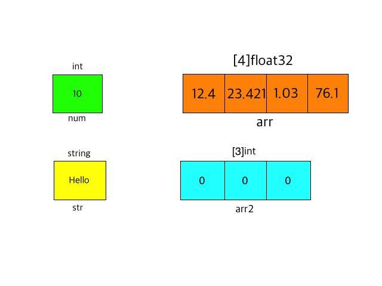
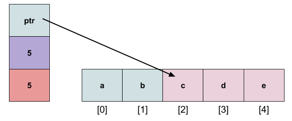

# 배열(Array)

Go언어에서는 두 개 이상의 변수를 모아 놓은 것을 '컬렉션'이라고 합니다. 배열을 포함한 컬렉션은 다수의 데이터를 저장하고 처리하는 경우에 유용하고 굉장히 많이 쓰입니다. 컬렉션은 그 기능에 따라 이름이 다른 세 가지 용법이 있습니다. 이번 강의에서 다룰 내용은 **배열(Array)**입니다.

Go언어에서의 배열은 정적입니다. 즉, **고정된 배열 크기** 안에 동일한 데이터를 연속적으로 저장할 수 있다는 뜻입니다. 그래서 크기를 동적으로 증가시키거나 부분 배열을 발췌하는 등의 기능을 가지고있지 않습니다. 배열의 선언은 **"var 배열이름 [배열크기]자료형"** 형식으로 합니다. 여기서 배열 크기를 데이터 타입 앞에 쓰는 것은 C언어와 Java 같은 다른 언어들과 다릅니다. **Go언어에서는 배열의 크기는 자료형을 구성하는 한 요소입니다.** 따라서, `[3]int`와 `[5]int`는 `string`과 `float32`처럼 타입 자체가 다른 것입니다. 배열이 선언되면 배열의 요소를 인덱스를 사용하여 읽거나 쓸 수 있습니다.

```go
package main

import "fmt"

func main() {
	var arr1 [5]int   //길이가 5인 int형 배열 arr1을 선언
	fmt.Println(arr1) //숫자를 선언하지 않고 출력해보기

	arr1 = [5]int{1, 2, 3, 4, 5}        //배열 초기화
	fmt.Println(arr1, arr1[0], arr1[4]) //배열 전체와 인덱스에 저장된 값들 출력해보기

	arr2 := [4]int{4, 5, 6, 7} //:= 를 이용해 선언
	arr2[0] = 32               //인덱스를 이용해 값을 초기화
	fmt.Println(arr2)          //arr2 전체 출력해보기

	var arr3 = [...]int{9, 8, 7, 6} //[...]을 이용한 배열 크기 자동 설정
	fmt.Println(arr3, len(arr3))    //arr3 전체와  배열 크기 출력해보기
}
```

```go
> [0 0 0 0 0]
[1 2 3 4 5] 1 5
[32 5 6 7]
[9 8 7 6] 4
```

예시 코드에서 보았듯이, 배열은 다양한 방법으로 선언하고 초기화할 수 있습니다. 위 예시에서 미리 설명하지 않은 용법이 쓰였습니다. 바로 배열의 길이를 알 수 있는 `len()` 함수와 `[...]` 용법입니다. Go언어에서 지원하는 내장 함수 `len()`을 사용하면 배열의 길이(요소의 개수)를 알 수 있습니다. 그리고 선언할 때 `[...]` 용법을 사용하면 배열 크기를 자동으로 설정해줍니다. 그렇다고해서 **이후에 크기를 바꿀 수 있는 것은 아니라는 것을 주의해야합니다.**


## 다차원 배열

다른 언어들과 마찬가지로 Go언어도 다차원 배열을 지원합니다. 배열을 선언하는 것에 있어 특별한 차이점은 없기때문에 간단한 형태만 보여주도록 하겠습니다.

```go
var multiArray [2][3][4]int //3차원 배열 선언
multiArray[1][1][2] = 10  // 인덱스를 이용한 값 초기화
```


또한, 배열을 행렬과 같은 형태로 보기 쉽게 묶어서 초기화할 수 있습니다. 차원은 얼마든지 늘릴 수 있지만 4차원 이상은 거의 쓰이지 않습니다.

```go
package main

import "fmt"

func main() {
    var a = [3][3]int{
		{1, 2, 3},        
		{4, 5, 6},
		{7, 8, 9}, //3x3배열 초기화
    }
	
    fmt.Println(a[1][2]) //2행 3열의 값 출력
}
```

```cmd
> 6
```


# 슬라이스(Slice)

Go언어에서 배열은 고정된 크기 안에 동일한 데이터를 연속으로 저장해 배열의 크기를 필요에 따라 동적으로 증가시키거나 부분 배열을 발췌하는 등의 기능을 가지고있지 않습니다. 그런데 `Slice`는 배열과 다르게 **고정된 크기를 미리 지정하지 않고 이후에 필요에 따라 크기를 동적으로 변경**할 수 있고, **부분 발췌**가 가능합니다. 그리고 다차원 선언을 비롯한 배열의 모든 기능을 똑같이 구현할 수 있습니다. 따라서 슬라이스는 배열의 여러 제약점들을 넘어 여러 값을 다룰 때 개발자에게 주로 쓰입니다.

이러한 장점을 가진 (상대적으로)좋은 자료형인 **슬라이스는 지금까지 배운 자료형과 내부적인 구조가 다르기때문에 선언 및 초기화를 할 때 주의해야합니다.** 지금까지 배운 자료형의 선언 및 초기화방법과 비교해서 설명하겠습니다.

지금까지 배운 정수형(int, int32 ...등등)과 실수형(float32, float64...등등), 배열 등과 같은 자료형을 선언할때 `var 변수이름 자료형` 형식으로 선언했습니다. 예를들어 `int`형 변수 `num`을 선언한다면 `var num int`와 같은 형태로 입력했습니다. 이 선언의 뜻은 **"한개의 `int`형의 변수가 들어갈 메모리를 만들었다."**는 말입니다. 그런데 Go언어에서는 아무런 값을 초기화 하지 않고 선언만 해도 정수나 실수형은 0, 문자열형은 `""`(빈칸)이 자동 할당된다고 자료형 챕터에서 배웠습니다. 따라서 정확히 말한다면 선언과 동시에 자동 초기화도 되는 것입니다(자동으로 0, ""이 할당되기때문에). 

다른 자료형과 마찬가지로, 배열도 크기를 지정하고 선언하기 때문에 명시한 개수만큼의 메모리를 만듭니다. 예를들어 아래 그림처럼 `var arr2 [3]int`라고 입력하면 3개의 int타입의 변수가 들어갈 메모리를 만들고, 초기화하지 않았기 때문에 자동으로 0이 할당됩니다. 따라서 선언만 했을 뿐인데 `len()` 함수를 이용해 배열의 크기가 3이라는 것을 확인할 수 있습니다.



하지만 슬라이스를 위에서 설명한 것과 같은 방법으로 `var a []int`와 같이 선언한다면 **배열의 일부분을 가리키는 포인터를 만듭니다.** 선언만 하고 초기화를 하지 않아서 슬라이스의 정보만 있는 배열만 생성되고, 실질적으로 어떠한 변수가 들어갈 공간(메모리)은 생성되지 않습니다. 그렇다면 '다른 자료형은 메모리를 만들고 자동으로 0이나 `""`을 할당하는데, 왜 슬라이스는 만들지 않을까?'와 같은 궁금증이 생길 수 있습니다.

정말 간단합니다. 왜냐하면 슬라이스는 크기를 미리 지정하지 않기 때문에 컴퓨터가 어디서부터 어디까지 0이나 `""`으로 채워야하는지 알 수 없기 때문입니다. 따라서 슬라이스의 초기 값을 지정하지 않고 선언만 한다면 'Nil silce'가 됩니다. 이것은 크기도 용량도 없는 상태를 의미합니다. 당연히 메모리를 만들지 않아서 존재하지도 않기 때문에 `a[0] = 1`과 같이 값을 지정할 수 없습니다.

아래 그림을 봅시다.

![img](data:image/png;base64,iVBORw0KGgoAAAANSUhEUgAAAyIAAADVCAYAAACrMkRiAAAeaElEQVR4Ae3d/a8dZYHA8RsBiwUqFFqkryyrvKlV0FoFRLtkC4sWIilGt2tlkZcV2O4CW00RtIBb0IqQilZQkCCKuK6ElWV9XY3KGlZhfY9mSTAh8Qf/iWfzzDKHcy+95855mTnPM/NpcnPvPWfOzDOf57lJv5k5984E/wgQIECAAAECBAgQINCwwEzDx3M4AgQIECBAgAABAgQIBCFiERAgQIAAAQIECBAg0LiAEGmc3AEJECBAgAABAgQIEBAi1gABAgQIECBAgAABAo0LCJHGyR2QAAECBAgQIECAAAEhYg0QIECAAAECBAgQINC4gBBpnNwBCRAgQIAAAQIECBAQItYAAQIEahB4w4YNYdWaNT7GMHjbeefXMDN2SYAAAQKpCAiRVGbCOAgQaJXAmrVrw8//8KyPMQxWrl7dqjXhZAgQIEBgtoAQme3hOwIECExEQIiMH2FCZCJL0U4IECCQrIAQSXZqDIwAgZwFhIgQyXn9GjsBAgSaEBAiTSg7BgECnRMQIkKkc4veCRMgQGBIASEyJJjNCRAgUEVAiAiRKuvENgQIEOiygBDp8uw7dwIEahMQIkKktsVlxwQIEGiJgBBpyUQ6DQIE0hIQIkIkrRVpNAQIEEhPQIikNydGRIBACwSEiBBpwTJ2CgQIEKhVQIjUymvnBAh0VUCICJGurn3nTYAAgaoCQqSqlO0IECAwhIAQESJDLBebEiBAoJMCQqST0+6kCRCoW0CICJG615j9EyBAIHcBIZL7DBo/AQJJCggRIZLkwjQoAgQIJCQgRBKaDEMhQKA9AkJEiLRnNTsTAgQI1CMgROpxtVcCBDouIESESMd/BJw+AQIEFhQQIgsS2YAAAQLDCwgRITL8qvEKAgQIdEtAiHRrvp0tAQINCQgRIdLQUnMYAgQIZCsgRLKdOgMnQCBlASEiRFJen8ZGgACBFASESAqzYAwECLROQIgIkdYtaidEgACBCQsIkQmD2h0BAgSigBARIn4SCBAgQGCwgBAZ7ONZAgQIjCQgRITISAvHiwgQINAhASHSocl2qgQINCcgRIRIc6vNkQgQIJCngBDJc96MmgCBxAWEiBBJfIkaHgECBKYuIESmPgUGQIBAGwWEiBBp47p2TgQIEJikgBCZpKZ9ESBA4DkBISJE/DAQIECAwGABITLYx7MECBAYSUCICJGRFo4XESBAoEMCQqRDk+1UCRBoTkCICJHmVpsjESBAIE8BIZLnvBk1AQKJC+QUIo/9+Cfh538YPxwmvY+Vq1cnPsuGR4AAAQLjCAiRcfS8lgABAvMI5BAiP/rlb8K73ntRWH3ssUJknnn0MAECBAjUJyBE6rO1ZwIEOiyQQ4jcfNsnw8zMTFixapUQ6fBadeoECBCYloAQmZa84xIg0GqBaYZIvNXq7/7xmhBD4wdP/aL4+rwtF4brd98Snvj900V0PPTYN8PGTWcXIXLYkiXFNvGx8rU7PrwrfPnf/j1cuPU9xXPl6yZ9+9Wg/bk1q9U/Ik6OAAECQYhYBAQIEKhBYJoh8vmvfLUIjJefcEI4atmy4ut45SN+nLJ+fREj5dWQ8vH4OT5WvjbGyeFLlxavOfqYY6ZyxUSI1LAw7ZIAAQIJCQiRhCbDUAgQaI9ACiES4+Ivz31bePh73w+fuve+sPiQQ4qwiFc7vvvTp8LF77+y+D7GSgyQ+FgZIvG1G854cxEnH7vzM0KkPUvTmRAgQCAZASGSzFQYCAECbRJIJUTirVnl7U9bL76kCI/T3/LW4rHyqkj/e0T6QyTeqlW+dhqfXRFp00+EcyFAgMALBYTIC008QoAAgbEFUgiReGtVf0CU4VH+lqzy+/lC5Mmnn5n1+v59NfG1EBl7GdoBAQIEkhYQIklPj8ERIJCrQAohEm+v6n+T+TUfuqG4IrLulFMrXRFpIjYGHUOI5Lr6jZsAAQLVBIRINSdbESBAYCiBVEJk500fLaIjBkl883qMk3iLVgyA3XfsLb7vfzN6/61ZgyKhieeEyFBLzsYECBDITkCIZDdlBkyAQA4CqYTIAQceGE5et674WyExQuIb1su/pH7/w48UIRIfjzESf72vEMlhdRkjAQIE2iEgRNoxj86CAIHEBFIJkfjbsuJ7QGJsxFuy4t8GKa9mxPeAnLP5vBBjJQbKRz62J8Q4idv3v2+k3L7pz66IJLaoDYcAAQITFhAiEwa1OwIECESBVEKk6XiY5PGEiJ8lAgQItFtAiLR7fp0dAQJTEhAiz/auvIwaJ0JkSovXYQkQINCQgBBpCNphCBDoloAQESLdWvHOlgABAsMLCJHhzbyCAAECCwpMM0RGvQKR2utcEVlwmdmAAAECWQsIkaynz+AJEEhVQIi4IpLq2jQuAgQIpCIgRFKZCeMgQKBVAkJEiLRqQTsZAgQI1CAgRGpAtUsCBAgIESHip4AAAQIEBgsIkcE+niVAgMBIAkJEiIy0cLyIAAECHRIQIh2abKdKgEBzAkJEiDS32hyJAAECeQoIkTznzagJEEhcQIgIkcSXqOERIEBg6gJCZOpTYAAECLRRQIgIkTaua+dEgACBSQoIkUlq2hcBAgSeExAiQsQPAwECBAgMFhAig308S4AAgZEEhgmR7/70qXDXlx4M/X9Q8PNf+WrY38fD3/t+sV18zUOPfXPWa/pf34av/UHDkZaeFxEgQCAbASGSzVQZKAECOQlUDZH7H34kxI/ztlxYxMiPfvmbIi5mZmbC0cccE1asWjXr472XXV48f/Ntnwyvf+ObhEhOi8JYCRAgQGCWgBCZxeEbAgQITEagaojs+PCucMLJrwyHLVkSztl8XvjGD37UC5HHfvyTeUNDiExmnuyFAAECBKYnIESmZ+/IBAi0WKBqiPzgqV8UIfK2d1wQYpSUt1TFKyLDhEi8tSteIYlXUGLQfOsn/93bV3z8U/feF05ety68/IQTwif23TXr+zs+d09v2/L4KXx2a1aLf0CcGgECBEIIQsQyIECAQA0CVUPkid8/XbwX5L9+87vicxkAMUSu+dANIV756P8or5j0XxH5wr98vbiiEoMixsulf789rD722BD3HfcX97XhjDeHr33ru+H63beERYsWhY2bzg7x/Sbl9+W25fFT+CxEaliYdkmAAIGEBIRIQpNhKAQItEegaojM9x/+GA/rTjm1uMoRr2iUH5+5/4EiLvpDJF5N2XrxJbOuasQrI/EqSBkiMVbKY8V997/RPX4/6OpL+bqmPwuR9vw8OBMCBAjsT0CI7E/FYwQIEBhTYBIhMigO+kMkRsrhS5fOelN7DJF4C1YZIv37mhsec79vOjjmO54QGXMRejkBAgQSFxAiiU+Q4REgkKdAkyFy+lveGq76pw/0rnjE/9j3v0dkbmgs9P18YdD040Ikz7Vv1AQIEKgqIESqStmOAAECQwhMIkTi7VTxSkb/RxkY/VdE4vs84hWQ+LdFYizE94IccOCBvduvFgqPuc83HRzzHU+IDLHgbEqAAIEMBYRIhpNmyAQIpC8wiRCJgTD3IwZH/I97f4g8+fQz4cKt7ynesH7K+vXF5503fbR3hWRuaCz0/Xxh0PTjQiT9dW6EBAgQGEdAiIyj57UECBCYR2DcEBnlP/3xjyHGqycp/gasUc5HiMyzuDxMgACBlggIkZZMpNMgQCAtgWmEyCj/2U/5NUIkrTVtNAQIEJi0gBCZtKj9ESBAIIQgRJ7t3Ro2auwIET9KBAgQaLeAEGn3/Do7AgSmJCBEhMiUlp7DEiBAIBsBIZLNVBkoAQI5CSxefEg47NCX+hjD4M+POymnKTdWAgQIEBhSQIgMCWZzAgQIVBFYs3ptePTB3/oYw+Bly1dWobYNAQIECGQqIEQynTjDJkAgbQEhMn6ECZG017jRESBAYFwBITKuoNcTIEBgPwJCRIjsZ1l4iAABAgT6BIRIH4YvCRAgMCkBISJEJrWW7IcAAQJtFRAibZ1Z50WAwFQFhIgQmeoCdHACBAhkICBEMpgkQyRAID8BISJE8lu1RkyAAIFmBYRIs96ORoBARwSEiBDpyFJ3mgQIEBhZQIiMTOeFBAgQmF9AiAiR+VeHZwgQIEAgCggR64AAAQI1CAgRIVLDsrJLAgQItEpAiLRqOp0MAQKpCAgRIZLKWjQOAgQIpCogRFKdGeMiQCBrASEiRLJewAZPgACBBgSESAPIDkGAQPcEhIgQ6d6qd8YECBAYTkCIDOdlawIECFQSECJCpNJCsREBAgQ6LCBEOjz5Tp0AgfoEhIgQqW912TMBAgTaISBE2jGPzoIAgcQEhIgQSWxJGg4BAgSSExAiyU2JAREg0AYBISJE2rCOnQMBAgTqFBAideraNwECnRUQIkKks4vfiRMgQKCigBCpCGUzAgQIDCMgRITIMOvFtgQIEOiigBDp4qw7ZwIEahcQIkKk9kXmAAQIEMhcQIhkPoGGT4BAmgJCRIikuTKNigABAukICJF05sJICBBokYAQESItWs5OhQABArUICJFaWO2UAIGuCwgRIdL1nwHnT4AAgYUEhMhCQp4nQIDACAJCRIiMsGy8hAABAp0SECKdmm4nS4BAUwJCRIg0tdYchwABArkKCJFcZ864CRBIWkCICJGkF6jBESBAIAEBIZLAJBgCAQLtExAiQqR9q9oZESBAYLICQmSynvZGgACBQmCaIfLXW64M8eOhe54Ijz44fhBMax8vW77SaiJAgACBFgsIkRZPrlMjQGB6AtMMkZmZmRA/7tn7HSEyvSXgyAQIECCwgIAQWQDI0wQIEBhFQIiMfyXGFZFRVp7XECBAIB8BIZLPXBkpAQIZCaQWIvE2rSsv2VXcsnXZtp3hi/t+OOtqyU077w5Xv3938fjeW78e3vPOfyg+4tduzcpo4RkqAQIEMhIQIhlNlqESIJCPQEoh8tnbHg1HLT26uF2rvG3r4IMXh498YF8vMl598huK50/fsCkccMABvW3j1//8oXt72zUZJa6I5LPejZQAAQKjCAiRUdS8hgABAgsIpBQirzjuVUVYbDxjc/jc7d8srozEIDni8KPC1+//nyIyyhBZctgRRaB8+uOPhLWrX1G87o2vP0uILDDfniZAgACB4QWEyPBmXkGAAIEFBVIJkRge5VWQL9/9eC8oyjiJt2TFqxxliFzw9r/tbRN/81Z8bXyuySsh5bFcEVlwmdmAAAECWQsIkaynz+AJEEhVIJUQueWG+3ohcvSylaH8ePFBi4rH4/tF+kNk+2U396IjvmdEiKS6woyLAAEC+QsIkfzn0BkQIJCgQCoh8vFdD/RCJIbF3I/yzejlFZH4fHlFQogkuLAMiQABAi0SECItmkynQoBAOgKphMjXvvCzUF79+MRNDxaREd8XEt8vEm+9Kn97lhBJZ+0YCQECBLoiIES6MtPOkwCBRgVSCZF4dePtZ28trorEN6Kf/1fbwomveE3xfbxNa+6b1V0RaXSZOBgBAgQ6LSBEOj39Tp4AgboEphki5ftA7vv094srII888Ktw4fmXhvgre8s3rr/21W8qfoNWeRvWmaedW7x/ZOfVd/RuzYpfx33F58rtmvzszep1rU77JUCAQBoCQiSNeTAKAgRaJjDNEBkUCzFOyqsgg7ZL4Tkh0rIfCqdDgACBOQJCZA6IbwkQIDAJgVRDJIXAqDoGITKJlWgfBAgQSFdAiKQ7N0ZGgEDGAkLkt2PfziVEMv4BMHQCBAhUEBAiFZBsQoAAgWEFhIgQGXbN2J4AAQJdExAiXZtx50uAQCMCQkSINLLQHIQAAQIZCwiRjCfP0AkQSFdAiAiRdFenkREgQCANASGSxjwYBQECLRMQIkKkZUva6RAgQGDiAkJk4qR2SIAAgRCEiBDxc0CAAAECgwWEyGAfzxIgQGAkASEiREZaOF5EgACBDgkIkQ5NtlMlQKA5ASEiRJpbbY5EgACBPAWESJ7zZtQECCQuIESESOJL1PAIECAwdQEhMvUpMAACBNooIESESBvXtXMiQIDAJAWEyCQ17YsAAQLPCVQNka994Wfhi/t+OPZfIX/0wfH/45/aPvxldT9OBAgQaLeAEGn3/Do7AgSmJFA1RK5+/+7w6pPfUClE3vc3O8Inbnqw0rapRcUo4xEiU1q8DkuAAIGGBIRIQ9AOQ4BAtwSqhsgwV0SOXrYy3HLDfUKkW0vJ2RIgQKC1AkKktVPrxAgQmKZA1RD5+K4HwkXvvqaIi/j1lZfsKr6PV0lO37ApfPa2R4vntl92czj44MXhda85I1x/7Z2diBFXRKa5gh2bAAEC9QsIkfqNHYEAgQ4KVA2R/luz4tcvPmhRuPD8S4srHxvP2BxWrTiuiI4YJEccflS4bNvOcM/e7wiRDq4pp0yAAIG2CQiRts2o8yFAIAmBUUPkuLUn9iIjxsfMzEzve7dmJTG1BkGAAAECExIQIhOCtBsCBAj0C4waIv1vXI9XPoRIv6qvCRAgQKBNAkKkTbPpXAgQSEZAiIz/64S9RySZ5WwgBAgQqEVAiNTCaqcECHRdoI4QOeZla8LOq+/o3ao1yq/Ezek1QqTrP0XOnwCBtgsIkbbPsPMjQGAqAnWEyNkbtxS/Oav8LVs5RcUoYxUiU1m6DkqAAIHGBIRIY9QORIBAlwSqhkj/3xHp/zr+x/2RB371gt+QFd838uW7H+/EVREh0qWfGOdKgEAXBYRIF2fdORMgULtA1RAZ5UpBV14jRGpfpg5AgACBqQoIkanyOzgBAm0VECLerN7Wte28CBAgMCkBITIpSfshQIBAn4AQESJ9y8GXBAgQILAfASGyHxQPESBAYFyBxS95STjsJYt9jGHw8pWrxp0GrydAgACBhAWESMKTY2gECOQrsHb16vCnu+7yMYbBmmXL8l0ARk6AAAECCwoIkQWJbECAAIHhBYTI+BEmRIZfd15BgACBnASESE6zZawECGQjIESESDaL1UAJECAwJQEhMiV4hyVAoN0CQkSItHuFOzsCBAiMLyBExje0BwIECLxAQIgIkRcsCg8QIECAwCwBITKLwzcECBCYjIAQESKTWUn2QoAAgfYKCJH2zq0zI0BgigJCRIhMcfk5NAECBLIQECJZTJNBEiCQm4AQESK5rVnjJUCAQNMCQqRpcccjQKATAkJEiHRioTtJAgQIjCEgRMbA81ICBAjMJyBEhMh8a8PjBAgQIPD/AkLESiBAgEANAkJEiNSwrOySAAECrRIQIq2aTidDgEAqAkJEiKSyFo2DAAECqQoIkVRnxrgIEMhaQIgIkawXsMETIECgAQEh0gCyQxAg0D0BISJEurfqnTEBAgSGExAiw3nZmgABApUEhIgQqbRQbESAAIEOCwiRDk++UydAoD4BISJE6ltd9kyAAIF2CAiRdsyjsyBAIDEBISJEEluShkOAAIHkBIRIclNiQAQItEFAiAiRNqxj50CAAIE6BYRInbr2TYBAZwWEiBDp7OJ34gQIEKgoIEQqQtmMAAECwwgIESEyzHqxLQECBLooIES6OOvOmQCB2gWEiBCpfZE5AAECBDIXECKZT6DhEyCQpoAQESJprkyjIkCAQDoCQiSduTASAgRaJCBEhEiLlrNTIUCAQC0CQqQWVjslQKDrAkJEiHT9Z8D5EyBAYCEBIbKQkOcJECAwgoAQESIjLBsvIUCAQKcEhEinptvJEiDQlIAQESJNrTXHIUCAQK4CQiTXmTNuAgSSFhAiQiTpBWpwBAgQSEBAiCQwCYZAgED7BISIEGnfqnZGBAgQmKyAEJmsp70RIECgEBAiQsSPAgECBAgMFhAig308S4AAgZEEphUiT+7eHfZs3RpuuOCC8KWrrgrP3nln+NNdz0dB/P7eyy8vnr/13e8OD23fHv64b19vm8dvvDE8fO21Ie7n13v2FPuK28Wv+/fTxNdrli0byd6LCBAgQCAPASGSxzwZJQECmQlMI0R2bN4cDnzRi8LMzEzv48QVK3oREeNixRFH9J4rtzv9+ON7MfKu004rnv+LV74yHLJoUW/bRQcdFO6/4opGY0SIZLboDZcAAQJDCgiRIcFsToAAgSoCTYdIvIoRwyKGyK4tW4orHa9du7Z4bPOppxYB8d4zzyy+37RuXXHV4zMXXxxiYMTX/ccHP1hsU4ZIfOzys84q9hO3j9+/dPHi8L+3395YjAiRKivNNgQIEMhXQIjkO3dGToBAwgJNh0gZEPFzedtUvM3qo+98Z/jGjh29x+JVkTImvn3ddWHpoYcWkRFDJr6u3M/rjjuu95p4O1eMkBgj8baucv91fxYiCS9wQyNAgMAEBITIBBDtggABAnMFmg6ReHtVDIV4e9Z8gRDfCxLf7xG37b/tKr5uboj0B03cX7n/neefP+/+5zvuqI8LkbmryvcECBBol4AQadd8OhsCBBIRmFaIXHPuub1QiOHxu9tu633/jvXri1iJ7xuJV0riFZHVRx653ysiWzZs6L0uhkR5m1e87WvUsBj2dUIkkcVsGAQIEKhJQIjUBGu3BAh0W6DpELli06YiKF61enXvjed3X3ppLzxiBJTvBymvfvTfclU+Vt6atXzJkvDM3r1FdPz81lt7r/3Xq68WIt1e2s6eAAECExMQIhOjtCMCBAg8L9B0iDxx8829261ijMQrGuXtV9vPOaeIh/Lqx5knnRRu37YtxM/xtqz+936UIRIf+7Ply4v3jJSv64+cYa9ujLK9KyLPrydfESBAoI0CQqSNs+qcCBCYukDTIRL/ox/flB7joYyLeAXkfRs39q6QxKse5ZvO4zbxt2HFYIlfx+3iPsoQib++tz9U4q1Z8crIKEEx6muEyNSXsQEQIECgVgEhUiuvnRMg0FWBaYRI+R/+GAzxt2OVt1aVj8fP8Xas+Fz/e0f6ny9DJH6Oj8d9NR0g5XiESFd/epw3AQJdERAiXZlp50mAQKMC0wyR8j/yo3yeGyKj7GNSrxEijS5ZByNAgEDjAkKkcXIHJECgCwJC5K6xb+MSIl34SXGOBAh0WUCIdHn2nTsBArUJ5Boi8ZatQbduTepqR5X9CJHalqcdEyBAIAkBIZLENBgEAQJtE8g1RKoEQlPbCJG2/VQ4HwIECMwWECKzPXxHgACBiQgIEbdmTWQh2QkBAgRaLCBEWjy5To0AgekJCBEhMr3V58gECBDIQ0CI5DFPRkmAQGYCQkSIZLZkDZcAAQKNCwiRxskdkACBLggIESHShXXuHAkQIDCOgBAZR89rCRAgMI+AEBEi8ywNDxMgQIDAcwJCxFIgQIBADQJCRIjUsKzskgABAq0SECKtmk4nQ4BAKgJCRIikshaNgwABAqkKCJFUZ8a4CBDIWqBqiDyzd2/49Z49Y/8V8qb+tkeTx/F3RLL+ETB4AgQILCggRBYksgEBAgSGF6gaIp+66KJw+vHHVwqR27dtC9++7rpK2zYZDHUdS4gMv+68ggABAjkJCJGcZstYCRDIRqBqiMSrIf95/fWV4mL1kUeGh6+9ttK2dcVBk/sVItksdwMlQIDASAJCZCQ2LyJAgMBggaohEiMkXhWJ/8GPX99/xRVhz9atYdO6deHys84KT+7eXTwXH3/p4sXhXaed1pkYESKD15hnCRAgkLuAEMl9Bo2fAIEkBaqGSP+tWfHrQxYtCu/buDE8tH17ESOvXbu2CJFv7NgRlh56aNh+zjmVr6A0efWijmMJkSSXtkERIEBgYgJCZGKUdkSAAIHnBUYNkRNXrOjdevX4jTeGmZmZ3vduzXre11cECBAgkL+AEMl/Dp0BAQIJCowaIv1vXI+3ZQmRBCfXkAgQIEBgIgJCZCKMdkKAAIHZAkLE3xGZvSJ8R4AAAQJzBYTIXBHfEyBAYAICdYXIl666qnerVh3vy0hpn94jMoGFaBcECBBIWECIJDw5hkaAQL4CdYTIlg0bit+ctWvLlk7EiBDJd/0bOQECBKoICJEqSrYhQIDAkAJVQ6T/L6v3fx2vTPxx377er++N3z97550h/vas8lf6pnT1oo6xCJEhF53NCRAgkJmAEMlswgyXAIE8BKqGSB3/gW/LPoVIHmvdKAkQIDCqgBAZVc7rCBAgMEBAiHiz+oDl4SkCBAgQCCEIEcuAAAECNQgIESFSw7KySwIECLRKQIi0ajqdDAECqQisWrEirFm+3McYButPOimV6TQOAgQIEKhBQIjUgGqXBAgQIECAAAECBAgMFhAig308S4AAAQIECBAgQIBADQJCpAZUuyRAgAABAgQIECBAYLCAEBns41kCBAgQIECAAAECBGoQECI1oNolAQIECBAgQIAAAQKDBYTIYB/PEiBAgAABAgQIECBQg4AQqQHVLgkQIECAAAECBAgQGCwgRAb7eJYAAQIECBAgQIAAgRoEhEgNqHZJgAABAgQIECBAgMBggf8DKsNR3+5ywJkAAAAASUVORK5CYII=)

기본적으로 슬라이스는 아무런 값도 초기화하지 않아도 배열의 위치를 가리키는 **ptr**과 배열의 길이인 **len**, 전체크기인 **cap** 메모리를 가지고 있습니다. 

그렇기 때문에 슬라이스를 `var a []int`와 같이 선언을 할 때는 주로 `var a []int = []int{1, 2, 3, 4}`같이 선언과 동시에 값을 초기화할 때만 사용합니다. 이는 **슬라이스를 선언함과 동시에 1, 2, 3, 4를 위한 메모리를 만든다는 뜻입니다**. 이때부터 `a[1] =18`과 같이 메모리에 저장돼있는 값을 바꿀 수 있고, 슬라이스의 길이와 용량을 확인하는 함수를 사용할 수 있습니다.


이러한 내부 구조를 이해한다면 슬라이스 복사를 쉽게 이해할 수 있습니다. 배열은 다른 배열의 값을 대입하면 값 자체가 대입됩니다. 하지만 슬라이스는 참조 타입이기 때문에 **슬라이스를 복사해온다는 것은 사실 같은 주소를 참조한다는 것**과 같은 말입니다. 예를 들어, 슬라이스는 다른 슬라이스를 부분 복사할 수 있는 기능이 있는데 슬라이스 a를 부분 복제하려고 하는 슬라이스 `l`은 `l = a[2:5]`를 입력함으로써 슬라이스 a의 인덱스2 요소부터 4요소까지 참조합니다. 그렇기 때문에 슬라이스는 데이터의 복사 없이 데이터를 사용 할 수 있다는 장점이 있습니다. 이는 아래 그림과 같이 묘사 할 수 있습니다. 

여기에 배열이 제공하지 않는 기능들을 사용하고 있으니 Go언어의 장점인 슬라이스를 잘 활용하는 것이 좋습니다.



참고로 슬라이스의 길이와 용량을 지정하지 않고 슬라이스를 선언만 해서 Nil slice만들면 nil과 비교할 수 있고 true을 반환합니다.  

```go
package main

import "fmt"

func main() {
	var a []int        //슬라이스 변수 선언 아무것도 초기화 되지 않은 상태
	a = []int{1, 2, 3} //슬라이스에 리터럴값 지정

	a[1] = 10 //값이 할당되어 메모리가 생겼기 때문에 이렇게 접근 가능

	fmt.Println(a)

	var b []int //nil slice 선언

	if b == nil {
		fmt.Println("용량이", cap(b), "길이가", len(b), " Nil Slice입니다.")
	}
}
```

```go
> [1 10 3]
용량이 0길이가 0 Nil Slice입니다.
```


## make() 함수를 이용한 슬라이스 선언

지금까지 슬라이스의 내부 구조에 대해 배우고 이에따른 선언과 초기화의 원리를 배웠습니다. 그렇다면 지금부터 슬라이스를 선언만 하면서 크기를 미리 지정할 수 있는 방법(즉, 값을 저장할 수 있는 메모리를 선언만 함으로써 생성)에 대해 배우겠습니다. 슬라이스를 생성하는 또 다른 방법으로는 Go언어의 내장 함수인 make() 함수를 이용한 선언입니다. 이 함수는 개발자가 슬라이스를 생성함과 동시에 슬라이스의 길이(len), 슬라이스의 용량(cap)을 저장할 수 있습니다. make() 함수는 **"make(슬라이스 타입, 슬라이스 길이, 슬라이스의 용량)"** 형태로 선언합니다.여기서 용량(Capacity)은 생략해서 선언할 수 있습니다. 용량을 생략한다면 슬라이스의 길이와 똑같은 값으로 선언됩니다. 이렇게 make() 함수를 이용해 선언한다면 비로소 모든 요소가 0인 슬라이스를 만들게 됩니다.


여기서 슬라이스의 길이와 용량의 개념이 헷갈릴 수 있습니다. 

- 길이 : 초기화된 슬라이스의 요소 개수 즉, 슬라이스에 5개의 값이 초기화된다면 길이는 5가 됩니다. 그 후에 값을 추가하거나 삭제한다면 그만큼 길이가 바뀌게 됩니다. **"len(컬렉션이름)"**으로 길이를 알 수 있습니다.
- 용량 : 슬라이스는 배열의 길이가 동적으로 늘어날 수 있기 때문에 **길이와 용량을 구분**합니다. 예를 들어, 동호회에서 야유회를 가기위해 버스를 대절한다고 생각해봅시다. 야유회를 가기 위해 모인 인원은 125명이고 버스는 25인승입니다. 125명은 배정이 완료 되어서 버스를 5대를 대절했는데, 11명이 추가로 가고싶다고 합니다. 그래서 추가로 25인승짜리 버스 한 대를 대절했습니다. 여기서 총 승객 136명은 "길이"입니다. 그리고 버스가 한번에 태울 수 있는 승객은 "용량"입니다. 다시 Go언어로 돌아와서 make() 함수를 이용해 슬라이스를 선언한다고 생각해봅시다. 선언한 슬라이스의 용량이 25인데 101개의 값을 초기화하기 위해서는 125의 용량이 필요하게됩니다. 이러한 방식으로 메모리를 관리하는 것입니다. 용량은 **"cap(컬렉션이름)"**으로 용량을 알 수 있습니다.

그리고 주의해야할 점은 make() 함수를 이용해 슬라이스의 메모리를 할당하고 난 후에 `[]int{1,2,3,4}`와 같은 식으로 입력하여 값을 초기화하면 **새로운 메모리를 할당하면서 그 전의 값은 없어집니다**. 어느 부분에서든 동일하게 적용되는 당연한 것입니다. 기존의 메모리를 사용하고 값을 추가하기 위해서는 아래에서 배우는 append() 함수를 사용해야합니다.

```go
package main

import "fmt"

func main() {
	s := make([]int, 0, 3) // len=0, cap=3 인 슬라이스 선언

	for i := 1; i <= 10; i++ { // 1부터 차례대로 한 요소씩 추가
		s = append(s, i)

		fmt.Println(len(s), cap(s)) // 슬라이스 길이와 용량 확인
	}

	fmt.Println(s) // 최종 슬라이스 출력
}
```

```go
> 1 3
2 3
3 3
4 6
5 6
6 6
7 12
8 12
 :
[1 2 3 4 5 6 7 8 9 10]
```


## 슬라이스 추가, 병합, 복사

또한 **`append()` 함수를 이용해서 슬라이스에 데이터를 추가할 수 있습니다.** 위 예시를 보고 이미 눈치챘을 겁니다. 슬라이스 용량이 남아있는 경우에는 그 용량 내에서 슬라이스의 길이를 변경하여 데이터를 추가하고, 용량이 초과하는 경우에는 설정한 용량만큼 새로운 배열을 생성하고 기존 배열 값들을 모두 새 배열에 복제한 후 다시 슬라이스를 할당하는 방식입니다.

그리고 데이터를 추가할수 있을 뿐만이 아니라 **슬라이스에 슬라이스를 추가해서 붙일 수 있습니다.** 여기서 슬라이스에 슬라이스를 추가하기 위해 주의할 점은 추가하는 슬라이스 뒤에 `...`을 입력해야 한다는 것입니다. `...`은 슬라이스의 모든 요소들의 집합을 표현하는 것으로 아래 예제의 `sliceB...`은 슬라이스의 요소 집합인 `{4, 5, 6}`으로 치환되는 것입니다. 따라서 **사실상 슬라이스에 슬라이스를 추가하는 것이 아니라, sliceA에 {4, 5, 6}이라는 요소들이 추가되는 것입니다.**

```go
package main
 
import "fmt"
 
func main() {
    sliceA := []int{1, 2, 3}
    sliceB := []int{4, 5, 6}
 
    sliceA = append(sliceA, sliceB...)
    //sliceA = append(sliceA, 4, 5, 6)
 
    fmt.Println(sliceA) // [1 2 3 4 5 6] 출력
}
```

```cmd
> [1 2 3 4 5 6]
```


그리고 copy() 함수를 이용해 한 슬라이스를 다른 슬라이스로 복사할 수 있습니다. copy() 함수는 **"copy(붙여넣을 슬라이스, 복사할 슬라이스)"** 형식으로 사용합니다. 당연히 복사할 슬라이스와 붙여넣을 슬라이스 모두 선언이 선행돼야 합니다.

```go
package main

import "fmt"

func main() {
	sliceA := []int{0, 1, 2}
	sliceB := make([]int, len(sliceA), cap(sliceA)*2) //sliceA에 2배 용량인 슬라이스 선언

	copy(sliceB, sliceA)                              //A를 B에 붙여넣는다

	fmt.Println(sliceB)                               // [0 1 2 ] 출력
	println(len(sliceB), cap(sliceB))                 // 3, 6 출력
}
```


슬라이스는 원래 '자르기'라는 뜻입니다.  그래서인지 슬라이스는 슬라이스의 부분만 잘라서 복사할 수도 있습니다. 이때 **`붙여넣을 슬라이스 := 복사할 슬라이스[복사할 첫 인덱스:복사할 마지막 인덱스+1]`**이라고 하면 잘라서 복사할 수 있습니다(`:=` 용법을 이용해 바로 선언과 동시에 값을 저장함). 예를 들어 `l := sliceA[2:5]`라고 한다면 슬라이스 `l`에 sliceA의 인덱스 2요소부터 4요소까지 잘라서 복사한다는 것입니다. **마지막 요소는 복사하지 않습니다.** 그리고 처음과 마지막 인덱스를 생략하면 첫 요소와 맨 마지막 요소를 의미합니다. 예를 들어 `l := sliceA[:5]`라면 sliceA의 처음부터 인덱스 4의 요소까지 복사한다는 것입니다. 반대의 경우도 마찬가지로 쓸 수 있습니다.

```go
package main

import "fmt"

func main() {
	c := make([]int, 0, 3) //용량이 3이고 길이가0인 정수형 슬라이스 선언
	c = append(c, 1, 2, 3, 4, 5, 6, 7)
	fmt.Println(len(c), cap(c))

	l := c[1:3] //인덱스 1요소부터 2요소까지 복사
	fmt.Println(l)

	l = c[2:] //인덱스 2요소부터 끝까지 복사
	fmt.Println(l)

	l[0] = 6

	fmt.Println(c) //슬라이스 l의 값을 바꿨는데 c의 값도 바뀜
	//값을 복사해온 것이 아니라 기존 슬라이스 주솟값을 참조
}
```

```go
> 7 8
[2 3]
[3 4 5 6 7]
[1 2 3 4 5 6 7]
```

위 코드를 눈여겨 봤으면 특이한 점을 알았을 것입니다. 복사해온 슬라이스의 값을 바꿨는데 기존 복사한 슬라이스의 값도 바뀐 것을 확인할 수 있습니다. 왜냐하면 앞서 말했듯이, **슬라이스는 배열과 다르게 값을 복사해오는 것이 아니라 슬라이스 자체가 참조하고있는 주소값을 같이 참조하는 것을 의미하기 때문입니다.** 하지만 같은 상황이라면 배열은 단순히 값을 복사해서 초기화합니다


# 맵(Map)

앞선 두 강의에서 배열과 슬라이스를 배웠습니다. 두 컬렉션의 공통점은 인덱스 번호를 임의대로 바꿀 수 없다는 것입니다. 예를 들어, 단어 사전을 배열 혹은 슬라이스를 이용해 만든다고 생각해봅시다. 단어를 추가할 때마다 인덱스 0번부터 Love, loyalty, root, submit ... 등등의 단어를 순차적으로 저장하고 해당하는 인덱스 번호를 통해 저장돼 있는 값을 쓰거나 저장할 수 있는 것이 전부입니다.

그렇기 때문에 사전의 고유 형태인 '단어 : 뜻' 형태로 저장할 수 없습니다. 그래서 필요한 것이 바로 key 값과 그에 해당하는 value 값을 매핑해 저장하는 'Hash table'입니다. 이것을 Go언어에서도 제공하는데 바로 'map(이하 맵)'이라는 컬렉션입니다. 이는 Ruby에서의 hash와 python에서의 dicts와 같은 기능을 합니다. map은 **"key : value"** 형식으로 값을 매핑해서 저장합니다. 따라서, 맵을 활용한다면 "love:사랑, root:뿌리, submit:제출하다"와 같은 형식으로 값을 저장할 수 있습니다.


그리고 슬라이스와 맵의 공통점은 두 컬랙션 모두 값을 직접적으로 저장하는 것이 아닌 '참조 타입(Reference type)'이라는 점입니다. 따라서 선언과 값을 초기화 함에 있어서 슬라이스와 같은 방법과 이유를 가진다고 생각하면 됩니다(참조 타입의 선언 방법은 Slice 강의 참고). 맵의 선언은 **"var 맵이름 map[key자료형]value자료형"** 형식으로 합니다. 예를 들어, int형 key값과 string형 value값을 가지는 `a`라는 이름의 맵을 선언할 때는 `var a  map[int]string`과 같이 선언할 수 있습니다. 이전 강의에서 말했다시피, 이렇게 선언만 하고 값을 초기화하지 않았다면 'Nil map'이 됩니다.

```go
package main

import "fmt"

func main() {
	var a map[int]string

	if a == nil {
		fmt.Println("nil map")
	}

	var m = map[string]string{ //key:value, 형식으로 초기화한다
		"apple":  "red",
		"grape":  "purple",
		"banana": "yellow",
	}

	fmt.Println(m, "\nm의 길이는", len(m))
}
```

```cmd
> nil map
map[apple:red grape:purple banana:yellow]
m의 길이는 3
```


### map 변수의 추가, 갱신, 삭제

------

맵 컬렉션에 메모리가 할당(make() 함수 혹은 {}를 사용한 값 초기화)됐으면 값을 추가, 갱신, 삭제할 수 있습니다. 슬라이스는 값을 추가하기 위해 append() 함수를 사용했지만, 맵에서의 key값은 특별(unique)하기 때문에 **"맵이름[key] = value"** 형식으로 값을 추가할 수 있습니다. 주의할 점은 **이미 있는 key값에 다시 다른 value값을 저장한다면 최근 저장한 값으로 갱신됩니다.**

그리고 delete() 함수를 이용해 저장된 값을 삭제할 수 있습니다. **"delete(맵이름, key)"** 형식을 입력하면 key값에 해당되는 value값이 같이 삭제됩니다.

```go
package main

import "fmt"

func main() {
	//지역번호와 지역 저장
	var m = make(map[string]string)

	m["02"] = "서울특별시"
	m["031"] = "경기도"
	m["032"] = "충청남도"
	m["053"] = "대구광역시"

	fmt.Println(m)

	//동일한 key값으로 value값을 저장하면 갱신이 된다
	m["032"] = "인천"

	fmt.Println(m)

	//m에 있는 "031"key의 value와 함께 삭제
	delete(m, "031")

	fmt.Println(m)
}
```

```cmd
> map[02:서울특별시 031:경기도 032:충청남도 053:대구광역시]
map[02:서울특별시 031:경기도 032:인천 053:대구광역시]
map[02:서울특별시 032:인천 053:대구광역시]
```


### Map의 key 체크와 value 읽기

------

맵을 사용하다 보면 key가 사용되고 있는지(occupied), 만약 사용된다면 어떤 value값이 저장돼 있는지 알아야 할 때가 있습니다. 이럴 때는 '맵이름[key]'의 값을 반환하면 됩니다.

이것은 즉 '컬렉션이름[인덱스]'를 의미하는데 앞서 배운 두 컬렉션에서 '컬렉션이름[인덱스]'는  단순히 해당 컬렉션의 인덱스에 저장돼 있는 값을 반환했습니다. 예를 들어, 배열이나 슬라이스의 arr[3]은 인덱스 3에 저장돼 있는 값을 반환합니다. 그리고 만약 인덱스의 범위를 넘는다면 에러가 발생합니다.

하지만 맵은 '컬렉션이름[인덱스]'의 사용에 있어서 다른 두 컬렉션과 차이점이 있습니다. '**맵이름[key]'는 key에 저장돼 있는 value 값을 반환할 뿐만 아니라, 해당 키에 값이 존재하는지 안 하는지 즉, 사용하고 있는 key 값인지 아닌지 판별해주는 true/false 값도 반환합니다.** key값이 사용되고 있다면 true를 사용되고 있지 않다면 false를 반환합니다.  그리고 존재하지 않는 key값을 입력했다면 자료형에 따라 0이나 ""이 반환됩니다.

쉽게 말해, 위에 예시에서 `m["031"]`은 "경기도"와 "true"를 반환합니다. 하지만 이 용법에는 몇 가지 주의할 점이 있습니다.

1. 콘솔 출력 함수에 "맵이름[key]"을 바로 입력할 때는 key 값에 해당되는 value 값만 출력됩니다. 
2. value 값과 true/false 값을 반환받기 위해서는 변수 두 개를 선언한 후에 각각 할당받아야 합니다. 예를 들어 val, exist := 맵이름[key]형식으로 입력해야만 val에는 value 값이, exist에는 true/false 값이 초기화됩니다.
3. value 값만 반환받고 싶다면 변수 한 개만 선언해 할당받으면 됩니다. 예를 들어 val := 맵이름[key]형식으로 입력하면 val에 value 값이 초기화됩니다. **꼭 두 개의 값을 반환하는 것은 아닙니다.**
4. true/false 값만 반환받고 싶다면 "_, bool변수"형식으로 선언해 할당받으면 됩니다. 예를 들어 _, exist := 맵이름[key]형식으로 입력하면 exist에 true/false 값이 초기화됩니다. 왜냐하면 '**맵이름[key]'는 꼭 'value, true/false' 순서로 반환**하기 때문입니다. 따라서 앞에 value 값을 받는 인자를 '_,' 용법을 써 생략한다면 true/false 값만 반환받을 수 있는 것입니다. 

```go
package main

import "fmt"

func main() {
	//지역번호와 지역 저장
	var m = make(map[string]string)

	m["02"] = "서울특별시"
	m["031"] = "경기도"
	m["032"] = "인천"
	m["053"] = "대구광역시"

	fmt.Println(m["032"])
	fmt.Println(m["042"], "빈 칸입니다.") //string형태로 존재하지 않는 key값은 ""가 출력된다

	val, exist := m["02"] //존재하는 key
	fmt.Println(val, exist)

	val, exist = m["042"] //존재하지 않는 key
	fmt.Println(val, exist)

	val = m["053"] //value 값만 반환
	fmt.Println(val)

	_, exist = m["053"] //true/false 값만 반환
	fmt.Println(exist)

	//맵도 똑같이 len() 함수를 사용할 수 있다 하지만 cap() 함수는 사용할 수 없다
	fmt.Println(len(m))
}
```

```cmd
> 인천
 빈 칸입니다.
서울특별시 true
 false
대구광역시
true
4
```

