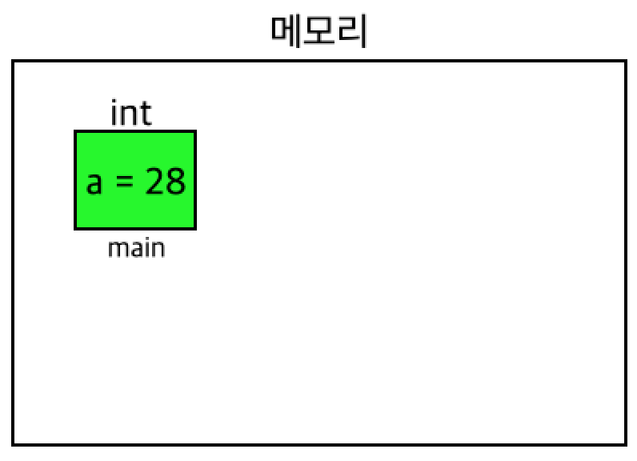
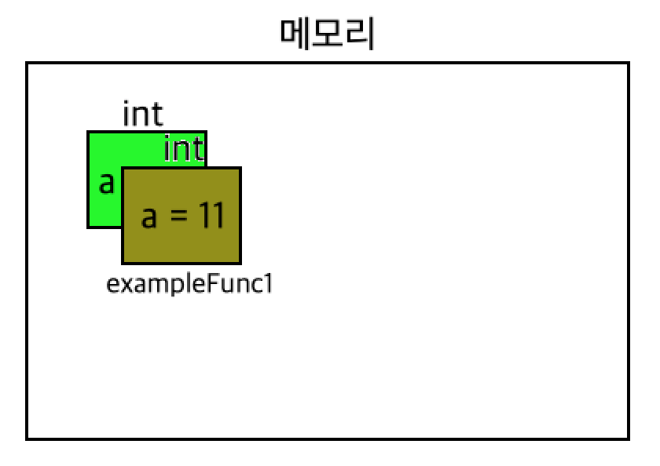
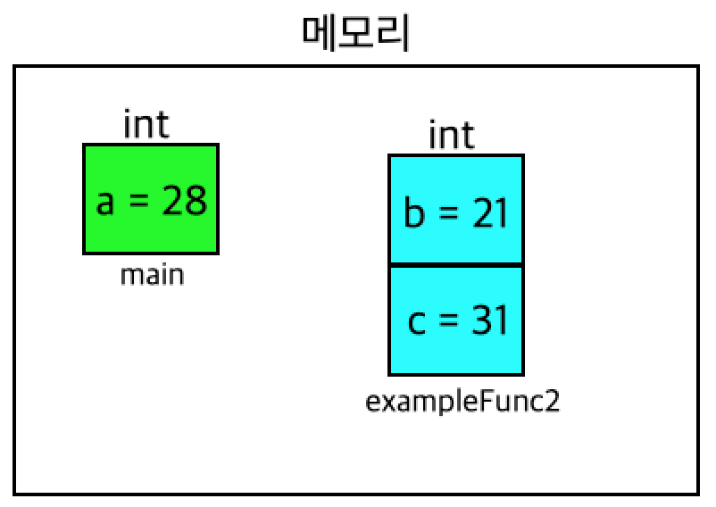

# Go언어에서의 함수
함수는 특정 기능을 위해 만든 여러 문장을 묶어서 실행하는 코드 블록 단위입니다. 쉽게 말해, 프로그램의 특정 기능들을 기능별로 묶어 구현해 놓은 것입니다. 그렇기 때문에 코드의 양이 많아질수록 함수는 필수이고, 얼마나 함수를 잘 활용하였는지에 따라 프로그램의 가치가 많이 달라집니다.

Go언어에서는 함수를 다양한 방법으로 활용할 수 있도록 쓰임새를 유연하게 만들었습니다. 하지만 역시 Go언어의 개발자들은 가독성 좋은 코드를 지향하기 때문에 몇 가지 지켜야 할 문법들도 있습니다. 기본적인 형태의 함수 선언은 "func 함수이름 (매개변수이름 매개변수형) 반환형"입니다. 형식과 함께 기본적인 특징을 알아보겠습니다. 

---

- 함수를 선언할 때 쓰는 키워드는 `func`이다.
- '반환형'이 괄호(()) 뒤에 명시된다. 물론 '매개변수형'도 '매개변수이름' 뒤에 명시된다.
- 함수는 패키지 안에서 정의되고 호출되는 함수가 꼭 호출하는 함수 앞에 있을 필요는 없다. 
- '반환값'이 여러 개일 수 있다. 이럴 때는 '반환형'을 괄호로 묶어 개수만큼 입력해야한다. (`(반환형1, 반환형2)`형식, 두 형이 같더라도 두 번 써야 한다)
- 블록 시작 브레이스(`{`)가 함수 선언과 동시에 첫 줄에 있어야 한다(모든 용법을 이렇게 쓰는 것이 좋습니다).

다른 언어들은 '반환형'을 괄호 앞에 쓰는 경우가 많습니다. 괄호 뒤에 적을 수 있도록 주의해야합니다. 그리고 C언어와 같은 절차 지향언어에서는 호출되는 함수가 꼭 호출하는 함수 앞에 있어야 했습니다. 적어도 빈껍데기 선언이라도 해야합니다. 하지만 Go언어는 객체 지향을 따르는 언어이기 때문에 꼭 앞에 명시하지 않아도 됩니다. 또한, 함수에 매개변수 쓰지 않거나 여러 개 쓸 수 있다는 것은 익숙할것입니다. 여기서 특이한 점은 Go언어에서는 반환 값도 여러 개일 수 있다는 것입니다.

함수는 기본적으로 매개변수와 리턴 값의 유 무에 따라서 네 개의 형태로 나눌 수 있습니다.
이 형태들을 보여주는 아래에 함수의 기본 활용 코드를 바로 실행해보세요.

```go
package main

import "fmt"

/*기능들만 모아놓은 함수들*/
func guide() { //매개변수 X 반환 값 X
	fmt.Println("두 정수를 입력받고 곱한 결과를 출력하는 프로그램입니다.\n두 정수를 차례로 띄어 써주세요.")
	fmt.Print("두 정수를 입력해주세요 :")
}

func input() (int, int) { //매개변수 X 반환 값 O(두 개)
	var a, b int
	fmt.Scanln(&a, &b)
	return a, b
}

func multi(a, b int) int { //매개변수 O, 반환 값 O
	return a * b
}

func printResult(num int) { //매개변수 O, 반환 값 X
	fmt.Printf("결과값은 %d입니다. 프로그램을 종료합니다.\n", num)
}

func main() { //간결해진 main문
	guide()
	num1, num2 := input()
	result := multi(num1, num2)
	printResult(result)
}
```


<br>
<br>


## 전역변수와 지역변수
매개변수는 값 자체를 전달하는 방식(Pass by value)과 값의 주소를 전달하는 방식(Pass by reference)이 있습니다.
**매개변수에 전달하려는 변수가 어떤 유형의 변수이냐에 따라 사용 방법과 결과가 다릅니다.**

지역변수와 전역변수는 선언되는 위치에 따라 그 유형이 결정됩니다. 지역변수는 중괄호({}) 안에서 선언된 변수를 말합니다. 이렇게 선언된 지역변수는 선언된 지역 내에서만 유효합니다. 전역변수는 특정 지역(중괄호) 밖에서 선언된 변수를 말합니다. 이 변수는 지역과 관계없이 어느 곳에든 유효합니다.  따라서 이 두 변수는 두 가지에 차이점이 있습니다.

- 메모리에 존재하는 시간
- 변수에 접근할 수 있는 범위 

지역변수는 해당 지역에서 선언되는 순간 메모리가 생성되고 해당 지역을 벗어나면 자동으로 소멸됩니다.  하지만 전역변수는 코드가 시작되어 선언되는 순간 메모리가 생성되고 코드 전체가 끝날때까지 메모리를 차지하고 있습니다. 이것이 바로 '메모리에 존재하는 시간'에 대한 설명입니다. 

---

아래 지역변수에 대한 예시 코드
```go
package main

import "fmt"

func exampleFunc1() {
	var a int = 10 //지역변수 선언
	
	a++
	
	fmt.Println("exampleFunc1의 a는 ", a)
}

func exampleFunc2() {
	var b int = 20 //지역변수 선언
	var c int = 30 //지역변수 선언

	b++
	c++

	fmt.Println("b와 c는 ", b, c)
}

func main() {
	var a int = 28 //지역변수 선언

	exampleFunc1()
	exampleFunc2()

	fmt.Println("main의 a는", a)
}

```

위 코드에서는 3개의 함수에서 총 4개의 변수가 선언되고 초기화됩니다. 지역변수는 해당 지역에서만 유효하다는 것을 보여주기 위해 일부러 main 함수 안의 `a`와 `exampleFunc1` 함수 안의 `a`의 변수 이름을 똑같이 설정했습니다.

우선 main 함수가 호출되면서 지역변수 `a`가 선언되고 메모리상에 `a`라는 이름의 변수가 할당되고 28로 초기화됩니다.

<p align="center">
    
</p>

`var a int = 28` 다음 문장을 실행하면 바로 `exampleFunc1` 함수가 호출되고 지역변수 `a`를 선언하고 초기화를 했기 때문에 메모리 공간에는 추가로 변수 `a`가 할당되고 10으로 초기화됩니다. 하지만 이 상태는 main 함수가 종료된 상황이 아니기 때문에 main 함수 호출 시 할당된 변수 `a`도 메모리 공간에 함께 존재하게 됩니다. 위에 설명한 것처럼 지역변수는 실행되고 있는 지역에서만 유효하므로 다른 지역의 변수의 변수명과 관계없습니다. 따라서 변수명이 같으면 가린다는 느낌이 듭니다. 

<p align="center">
    
</p>

그리고 `exampleFunc1`의 코드를 차례로 실행하고 함수가 종료되면 `exampleFunc1` 함수에서 선언된 변수 `a`는 메모리 공간에서 사라지게 됩니다. 그래서 메모리 공간에는 main 함수의 변수 `a`만 남게됩니다. 그리고나서 코드의 흐름은 다시 main 함수로 돌아와 `exampleFunc2` 함수를 호출합니다. `exmapleFunc2` 함수 역시 지역변수 `b`와 `c`를 선언해 메모리 공간에 변수 `b`와 `c`가 각각 할당되고 20, 30으로 초기화 됩니다.

<p align="center">
    
</p>
그리고 `exampleFunc2`의 코드를 차례로 실행하고 함수가 종료되면, 또 함수 내에서 선언했던 변수 `b`와 `c`는 소멸하게 되고 코드의 흐름이 다시 main 함수로 돌아와 a만 메모리에 남게됩니다. 그리고 main 함수도 종료되면  메모리 공간의 모든 변수가 소멸되는 것입니다.

<p align="center">
    
</p>

지역변수를 이해했다면 전역변수는 수월할 것입니다. 아래 코드는 예시입니다.

```go
package main

import "fmt"

var a int = 1 //전역변수 선언

func localVar() int { //지역변수로 연산
	var a int = 10 //지역변수 선언

	a += 3

	return a
}

func globalVar() int { //전역변수로 연산
	a += 3
		
	return a
}

func main() {
	fmt.Println("지역변수 a의 연산: ", localVar())
	fmt.Println("전역변수 a의 연산: ", globalVar())
}
```

코드가 실행되고 main 함수가 호출되기 전에 전역변수로 선언한 `a`가 메모리 공간에 할당됩니다. 이 변수는 프로그램이 종료될 때까지 메모리 공간에 남아있을 것이고, 어느 지역에서든 사용할 수 있습니다. 그리고 main 함수가 호출되고 `localVar` 함수도 호출됩니다. `localVar` 함수에서 지역변수 `a`가 선언되고 10으로 초기화됩니다. 아까 말한 것처럼 전역변수와 이름이 같아도 지역변수는 해당 지역에서 유효하다고 했기 때문에 오류가 나는 것이 아니라 전역변수를 가리게 됩니다. 따라서 지역변수 `a`로 연산을 수행하고 종료합니다. 그리고 이어서 `globalVar` 함수를 호출하게되는데 이 함수에서는 변수를 선언하지 않았습니다. 전역변수는 어느 지역에서든 사용이 가능하기때문에 특별한 선언 없이 바로 전역변수를 사용해 연산을 하고 그 값을 반환합니다. 이렇게 지역변수를 활용한 함수와 전역변수를 활용한 함수의 쓰임과 원리를 확인했습니다.


<br>

<br>


## 매개변수

Go언어에서 함수는 **"func 함수이름 (매개변수이름 매개변수형) 반환형"**이 기본적인 형식

매개변수는 언어를 불문하고 개발자들이 개발을 하면서 많이 헷갈려하는 부분입니다. 왜냐하면 코드가 길어지고 많은 변수를 사용하다보면 변수가 전역변수인지 지역변수인지 헷갈리게 됩니다.

Go언어에서 매개변수는 Pass by value, Pass by reference, 가변 인자가 있습니다.

<br>


### Pass by value

---

Pass by value는 어렵지 않고 다른 언어에서도 동일하게 쓰이기 때문에 간단하게 하고 넘어가겠습니다.

```go
package main

import "fmt"

func printSqure(a int) {
	a *= a
		
	fmt.Println(a)
}
func main() {
	a := 4 //지역변수 선언
		
	printSqure(a)
		
	fmt.Println(a)
}
```

<br>


### Pass by reference

---

사실 Java에 익숙한 개발자들이라면 Pass by reference의 개념에 익숙하다. Java는 객체 지향 언어로서 기본형 데이터 이외에 클래스 변수들은 전부 pass by reference를 기초로 두고있기 때문입니다.  Go언어는 분명 객체 지향을 따른다고 했지만 형태와 용법을 보았다시피 C언어와 비슷한 모습을 보입니다.

**Go언어에서는 C/C++ 언어에서 핵심 개념인 '포인터'라는 개념을 지원합니다.**  (**`&` : 주소, `*` : 직접참조**)

- 언어에서는 배열이름 자체가 배열의 첫번째 인덱스 요소의 주솟값인데 Go언어는 그런 것이 없습니다. 주솟값은 어떤 변수 앞에 `&`를 붙이는 것만 기억하면 됩니다.
- C언어에서는 "`*`(배열이름+인덱스)"는 "배열이름[인덱스]"와 같은 기능을 했는데 Go언어는 그런 것이 없습니다. 직접 참조를 원하면 포인터 변수 앞에 `*`를 붙이는 것만 기억하면 됩니다.
- 함수를 호출할 때는 주솟값 전달을 위해 **"함수이름(&변수이름)"**을 입력하고 함수에서 매개변수이름을 입력할 때는 값을 직접 찹조하기 위해 `*`**을 매개변수형 앞에 붙입니다.** 그리고 함수 안에서 매개변수앞에 모두 `*`를 붙여야합니다.

```go
package main

import "fmt"

func printSqure(a *int) {
	*a *= *a
	
	fmt.Println(*a)
}
func main() {
	a := 4         //지역변수 선언
	
	printSqure(&a) //참조를 위한 a의 주솟값을 매개변수로 전달	// 16
		
	fmt.Println(a)	// 16
}
```

이렇게 main의 변수인 `a`의 값을 `printSqure` 함수 안에서 참조함으로써 다른 함수에서 연산을했음에도 불구하고 원래 값이 바뀝니다.  

<br>


### 가변 인자 함수

---

**'가변 인자 함수'는 전달하는 매개변수의 개수를 고정한 함수가 아니라 함수를 호출할 때마다 매개변수의 개수를 다르게 전달할 수 있도록 만든 함수입니다.**

분명 함수를 사용하다보면 전달하려는 매개변수의 개수가 변할 수 있어서 같은 기능은 같은데 매개변수의 개수만 다른 함수를 더 만들어야할 지 고민할 때가 있습니다. 기능이 좀 다르지만  비슷한 개념으로 Java에서는 메소드 '오버로딩'이 있습니다.

**Go언어의 가변 인자 함수는 동일한 형의 매개변수를 n개 전달할 수 있습니다.** 예를 들어 숫자들을 더하는 함수를 만든다고 할 때, 더하는 값의 개수에 따라 각각 함수를 만들 필요가 없다는 것입니다. 가변 인자 함수를 사용할 때 몇 가지 특징을 알아보겠습니다.

- n개의 **동일한 형**의 매개변수를 전달합니다.
- 전달된 변수들은 **슬라이스** 형태입니다. 변수를 다룰 때 슬라이스를 다루는 방법과 동일합니다.
- 함수를 선언은 **"func 함수이름(매개변수이름 ...매개변수형) 반환형"** 형식으로 합니다. '매개변수형' 앞에 '...'을 붙이면 됩니다.
- 매개변수로 슬라이스를 전달할 수 있습니다. 다른 컬렉션 형태는 불가능합니다. 슬라이스를 전달할 때는 **슬라이스 이름 뒤에 ...를 붙여서 "함수이름(슬라이스이름...)"** 형식으로 함수를 호출하면 됩니다.

```go
package main

import "fmt"

func addOne(num ...int) int {
	var result int

	for i := 0; i < len(num); i++ { //for문을 이용한 num[i] 순차 접근
		result += num[i]
	}
	
	return result
}

func addTwo(num ...int) int {
	var result int

	for _, val := range num { //for range문을 이용한 num의 value 순차 접근
		result += val
	}
	
	return result
}

func main() {
	num1, num2, num3, num4, num5 := 1, 2, 3, 4, 5
	nums := []int{10, 20, 30, 40}

	fmt.Println(addOne(num1, num2))
	fmt.Println(addOne(num1, num2, num4))
	fmt.Println(addOne(nums...))
	fmt.Println(addTwo(num3, num4, num5))
	fmt.Println(addTwo(num1, num3, num4, num5))
	fmt.Println(addTwo(nums...))
}

//	3
//	7
//	100
//  12
```

위 코드는 기능은 다르지 않고 슬라이스의 접근 방법을 다르게 활용한 `addOne`과 `addTwo` 가변 인자 함수를 보여줍니다. 


<br>

<br>


## 반환값(리턴값)

함수의 제일 기본적인 기능은 입력된 값의 연산 후 출력입니다. 예를 들어, 덧셈 기능을 하는 함수라면 3과 4가 입력됐을 때 7이라는 값이 반환되어야 하는 것입니다. Go언어는 다른 언어와 다른 반환값의 특징이 있습니다. 바로 **Go언어에서는 복수개의 반환값을 반환할 수 있다는 것입니다.**

- 환값의 개수만큼 반환형을 명시해야 합니다. 2개 이상의 반환형을 입력할 때는 괄호(())안에 명시합니다.
- 동일한 반환형이더라도 모두 명시해야합니다.((int, int, int)) 

```go
package main

import "fmt"

func add(num ...int) (int, int) {
	var result int
	var count int
	
	for i := 0; i < len(num); i++ { //for문을 이용한 num[i] 순차 접근
		result += num[i]
		count++
	}
	
	return result, count
}

func main() {
	nums := []int{10, 20, 30, 40, 50}

	fmt.Println(add(nums...))	// 150 5
}
```

숫자를 모두 더한 값인 `result`와 몇개의 매개변수가 전달됐는지 확인하는 `count`가 반환됩니다.

<br>


### Named Return Parameter

------

Named return parameter는 직역하면 '이름이 붙여진 반환 인자'입니다. 여러 개의 값을 반환할 때 괄호 안에 반환형을 모두 명시해야 한다고 했습니다. 그런데 반환 값이 많고 반환형이 다양하다면 가독성이 좋지 않을 수 있습니다. 따라서 Named return parameter는 반환형과 반환 값의 이름을 같이 명시하는 것을 말합니다.

- (반환값이름1 반환형1, 반환값이름2 반환형2, 반환값이름3 반환형3, ...) 형식으로 입력합니다.
- **"반환값이름 반환형" 자체가 변수 선언입니다**. 따라서 함수 안에서 따로 선언할 필요가 없습니다. 만약 선언하면 에러가 발생합니다.
- 'return'을 생략하면 안 됩니다. 반환 값이 있을 때는 반드시 return을 명시해야합니다.
- 반환 값이 하나라도 반환값이름을 명시했다면 괄호 안에 써야합니다.

```go
package main

import "fmt"

func dessertList(fruit ...string) (count int, list []string) { //여기서 이미 선언된 것이다

	for i := 0; i < len(fruit); i++ {
		list = append(list, fruit[i])
		count++
	}

	return //생략하면 안 된다
}

func inputFruit() (list []string) { //Named return parameter는 값이 하나라도 괄호를 써야한다

	for {
		var fruit string
		fmt.Print("과일을 입력하세요:")
		fmt.Scanln(&fruit)

		if fruit != "1" {
			list = append(list, fruit)
		} else {
			fmt.Println("입력을 종료합니다.\n")
			break //반복문을 빠져나간다
		}
	}

	return
}

func main() {
	fmt.Println("디저트로 먹을 과일을 입력하고 출력합니다. \n1을 입력하면 입력을 멈춥니다.\n")
	count, list := dessertList(inputFruit()...) //함수를 변수처럼 사용할 수 있습니다
	fmt.Printf("%d개의 과일을 입력하셨고, 입력한 과일의 리스트는 %s입니다.\n", count, list)
}
```

`dessertList` 함수 안에 `inputFruit` 함수를 심지어 뒤에 `... `용법까지 사용했습니다. 이는 함수 자체를 전달인자로 사용했다는 것입니다. 이렇게 무조건 함수의 반환값을 변수를 따로 선언해서 초기화할 필요는 없습니다. 필요에 따라 **함수를 변수처럼 사용할 수 있습니다.**

