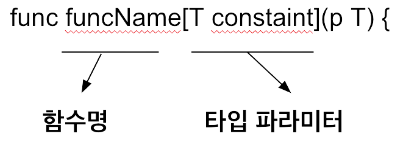

# Go Collections With Generics
Golang `1.18` version 이후로 새롭게 추가된 기능인 Generic 프로그래밍에 대해 알아보자.

제너릭은 타입 파라미터를 통해서 하나의 함수나 타입이 여러 타입에 대해서 동작하도록 해주는 프로그래밍 기법입니다. 자바나 C++, C#과 같은 다른 언어에서 
이미 제공되던 기능으로 Go에서도 기능이 생겼습니다.

일단, 기본적인 코드를 보겠습니다.
```go
// SumInts adds together the values of m.
func SumInts(m map[string]int64) int64 {
    var s int64
    for _, v := range m {
        s += v
    }
    return s
}

// SumFloats adds together the values of m.
func SumFloats(m map[string]float64) float64 {
    var s float64
    for _, v := range m {
        s += v
    }
    return s
}
```
위의 코드는 맵의 값을 더하고 합계를 반환하는 두 함수를 선언합니다.
- `SumFloats`은 string 키값에 대한 float64 value 의 맵을 가져 옵니다.
- `SumInts`은 string 키값에 대한 int64 value 의 맵을 가져 옵니다.

그러면 위의 코드를 제네릭을 활용하여 알아봅시다.

<br>
<br>

## Using Generics With Multiple Types

**제네릭함수는 타입 파라미터를 통해서 여러 타입에 대해서 동작하는 함수를 말합니다.**



제네릭 함수는 위와 같이 정의합니다. func 함수 키워드를 적고 그 뒤 함수명을 적습니다. 그런 다음 대괄호를 열고 타입 파라미터를 적습니다. 
타입 파라미터는 파라미터 이름으로, 위 그림에서는 T가 파라미터 이름입니다. 그 뒤 타입 제한을 적습니다. **타입 파라미터는 필요에 따라 여러 개를 적을 수 있습니다.**

여기서 주의사항은 서로 다른 타입의 두 인자 모두 `T`타입으로 정의되어 있을때 `T`타입을 하나의 타입으로 정의하면 에러가 발생합니다.
만약 여러 개의 다른 타입에서도 동작하게 만들고 싶을 때는 각 타입 갯수에 맞는 함수 파라미터를 정의해 줘야 합니다.

그런 뒤 대괄호를 닫고 소괄호를 열고 일반 함수처럼 입력과 출력을 씁니다. **이때 타입 파라미터에 사용한 타입 파라미터 이름을 특정 타입 대신 사용할 수 있습니다.**

```go
func SumIntsOrFloats[K comparable, V int64 | float64](m map[K]V) V {
    var s V
    for _, v := range m {
        s += v
    }
    return s
}
```
위 코드는 다음을 수행합니다.

- `SumIntsOrFloats`의 두개의 유형 매개변수(대괄호 안에 있음) `K`와 `V` 매개변수를 사용하는 하나의 인수가 있는 함수 `mmap[K]V`를 선언합니다. 
함수는 type `V` 값을 반환합니다.


- `K`유형 매개변수에 constraint 유형인 `comparable` 을 지정합니다. Go에서 미리 선언된 `comparable`제약 조건은 `==`, `!=`값 비교 연산자의 피연산자로 사용될 수 있는 모든 유형을 허용합니다. 
Go는 지도 키가 비교 가능해야 합니다. 따라서 맵 변수의 키로 사용할 수 있도록 필요한 `K`를 선언 합니다.


- `V`유형 매개변수에 대해 두 가지 유형 `int64`및 `float64`을 제약 조건으로 지정합니다. `|`은 두 유형의 합집합을 지정합니다. 
즉, 이 제약 조건은 두 유형 중 하나를 허용합니다. 두 유형 모두 호출 코드의 인수로 컴파일러에서 허용됩니다.


- `K`및 `V`는 유형 매개변수에 대해 이미 지정된 유형입니다. `map[K]V`는 비교할 수 있는 유형이므로 유효한 지도 유형 임을 알고 있습니다.

<br>
<br>


## Declare a type constraint
함수에서 타입 제한은 `any`를 사용했습니다. **`any`는 모든 타입이 다 가능하다는 뜻입니다.** 

아래 간단한 함수를 살펴보겠습니다.
```go
func add[T any](a, b T) T {
    return a + b
}
```
add() 함수는 `T`타입 파라미터가 정의되어 있고 `T`타입 제한은 `any`입니다. 따라서 `a`, `b` 두 개의 인자는 모든 타입이 가능합니다. 
하지만 이 함수는 다음과 같은 빌드 에러가 발생합니다.

```
invalid operation: operator + not defined on a (variable of type T constrained by any)
```

위의 내용은 `T`타입 제한 **`any`에는 `+` 연산자가 정의되어 있지 않다는 뜻입니다.** `T`타입 제한이 `any`이기 때문에 모든 타입이 가능합니다. 하지만, 어떤 타입이 올지 모르기 때문에 
**그 타입이 `+`연산자가 지원되는지 알 수 없어 이 에러가 발생한 겁니다.** 우리는 특정 조건을 정의해서 그 타입이 `+`연산자를 지원하고 있음을 알려줘야 합니다.

```go
func add[T int8 | int16 | int32 | int64 | int](a, b T) T {
    return a + b
}
```
이렇듯 타입의 특정 연산이나 기능을 사용하기 위해서는 타입 제한을 통해 그 연산자나 기능이 가능함을 보여줘야 합니다.
하지만 매번 이렇게 조건을 길게 적어주는 건 귀찮겠죠. 

그래서 밑의 코드와 같이 타입 제한만 따로 정의할 수 있습니다.

```go
type Integer interface {
    int8 | int16 | int32 | int64 | int
}

func add[T Integer](a, b T) T {
    return a + b
}
```

<br>
<br>


## Generic Refactoring
지금까지 제네릭에 대해 조금 배우고, 제네릭을 활용해보기 위해서 저희 회사코드중 제네릭이 필요한 코드를 가져왔습니다. 밑의 코드는 Gorm Model 타입과
Protobuf 타입을 서로 변환해주는 코드입니다. 

아래의 코드가 리시버 인자와 내부 Gorm Model 변수가 다른것 외엔 코드가 계속 반복이 되고있는데 제네릭을 이용해 하나로 만들어 보겠습니다.  
```go
// ProtoToModel proto file 을 Gorm Model 로 변환하여 반환
func (x *Node) ProtoToModel() (*model.Node, error) {
   b, err := json.Marshal(x)
   if err != nil { return nil, err }
   
    var m model.Node
    if err := json.Unmarshal(b, &m); err != nil { return nil, err }

    return &m, nil
}
   
// ModelToProto Gorm Mode 을 proto file 로 변환하여 반환
func (x *Node) ModelToProto(m *model.Node) error {
   b, err := json.Marshal(m)
   if err != nil { return err }

   _ = json.Unmarshal(b, x)
   
   return nil
}

// ProtoToModel proto file 을 Gorm Model 로 변환하여 반환
func (x *Object) ProtoToModel() (*model.Object, error) {
    b, err := json.Marshal(x)
    if err != nil { return nil, err }

    var m model.Object
    if err := json.Unmarshal(b, &m); err != nil { return nil, err }
    
    return &m, nil
}

// ModelToProto Gorm Mode 을 proto file 로 변환하여 반환
func (x *Object) ModelToProto(m *model.Object) error {
    b, err := json.Marshal(m)
    if err != nil { return err }
    
    _ = json.Unmarshal(b, x)
    
    return nil
}
                                            :
                                            :
```

<br>

---
위의 코드에서 json을 `Marshal -> Unmarshal` 하는 코드는 다 똑같습니다. 그 외의 다른 부분이 Proto 인자와 Model 변수입니다.
그 값을 인풋에 넣도록 하겠습니다.
```go
func GeModel[T1 any, T2 any](from *T1, to *T2) error {
    b, err := json.Marshal(from)
    if err != nil {
        return err
    }
	
    if err = json.Unmarshal(b, to); err != nil {
        return err
    }

    return nil
}
```
위의 코드와 같이 `T1`과 `T2`를 제네릭으로 `any`값을 주고 인풋인자에 넣었습니다. 여기서 둘다 포인트로 준 이유는 아웃풋이 `error`만 있어도
외부에서 바뀐값을 가져오기 위해서 입니다.

`ModelToProto`와 `ProtoToModel` 두개의 함수를 하나로 만들 뿐만아니라 다른 인풋에 따른 여러개의 함수들도 하나로 만들었습니다.
이처럼 제네릭이 쓰일 수 있는 경우라면 쓰는게 좋겠죠?

하지만 제네릭 프로그래밍을 너무 많이 사용하면 코드 가독성이 떨어집니다. **“동작하는 코드 먼저, 제네릭은 나중에”** Go 언어에 특징이 있다면 동작하는 
코드를 빠르고 쉽게 만들 수 있도록 해준다는 점이 있습니다. 

제네릭 프로그래밍을 할지 안 할지 고민하기보다는 먼저 동작하는 코드에 집중하고 나중에 여러 타입에 공통적으로 쓰이는 부분에 대해서 부분적으로 제네릭 프로그래밍을 적용하는 게 좋습니다.

<br>
<br>

### 제네릭을 사용하기 좋은 곳
#### - 자료구조 (Data structure)

제네릭을 사용하기 좋은 대표적인 곳은 일반적인 데이터 타입에 대해서 공통적으로 사용되는 자료구조에 사용할 수 있습니다. 트리, 그래프, 리스트, 
맵과 같은 자료구조는 일반적인 타입에 대해서 같은 동작을 보장해야 하기 때문에 제네릭을 사용하기 좋습니다. 일반적이라는 뜻을 가진 제네릭이 가장 잘 어울리는 케이스입니다.

#### - 다양한 타입에 대해서 비슷한 동작을 하는 경우

어떤 리스트를 순회하면서 값을 변경하는 경우, 그래프를 순회하면서 길찾기를 하는 것과 같이 정해지지 않은 다양한 타입에 대해서 비슷한 동작을 하는 코드가 
필요한 경우 제네릭을 사용해서 중복 코드를 없애고 코드 재사용성을 늘릴 수 있습니다. 여러 타입에 대해서 중복된 기능이 필요해서 복사/붙여넣기를 하게 
된다면 제네릭을 사용할 기회라고 생각할 수 있습니다.

<br>

### 제네릭을 사용하기 좋지 않은 곳

객체의 타입이 아닌 객체의 기능이 강조되는 곳에서는 제네릭이 아닌 인터페이스를 사용하시는 게 좋습니다.

```go
// io package
type Reader interface {
    Read(p []byte) (n int, err error)
}
// bufio package
func NewReader(rd io.Reader) *Reader
```

위는 `io` 패키지의 `Reader` 인터페이스와 이를 사용하는 bufio 패키지의 `NewReader()` 함수입니다. `bufio.NewReader()` 함수는 인자로 들어오는 
`io.Reader`의 타입이 궁금한 것이 아니라 그 객체가 `Read()`라는 메서드가 있는지 여부만 중요합니다. 위와 같이 타입이 아니라 객체의 기능이 중요한 
곳에서는 제네릭이 아닌 인터페이스를 사용하는 게 좋습니다. 

사실 제네릭과 인터페이스는 그 쓰임이 비슷하고 개념이 다를 뿐이라서 어떤 때 제네릭을 쓰고 어떤 때 인터페이스를 쓰라고 확정하기 힘듭니다. 하지만, 
한 가지 말씀드릴수 있는 건 앞서 살펴본 제네릭을 사용하기 좋은 곳이 아닌 곳에서는 제네릭이 아닌 인터페이스나 다른 방법을 사용하시는 게 좋다는 점입니다.


<br>
<br>

### 출처
- https://go.dev/doc/tutorial/generics
- https://itnext.io/how-to-use-golang-generics-with-structs-8cabc9353d75
- https://goldenrabbit.co.kr/2022/01/28/%EC%83%9D%EA%B0%81%ED%95%98%EB%8A%94-go-%EC%96%B8%EC%96%B4-%ED%94%84%EB%A1%9C%EA%B7%B8%EB%9E%98%EB%B0%8D-go-%EC%A0%9C%EB%84%A4%EB%A6%AD%EC%9D%98-%EC%9D%B4%ED%95%B4/
- https://www.digitalocean.com/community/tutorials/how-to-use-generics-in-go