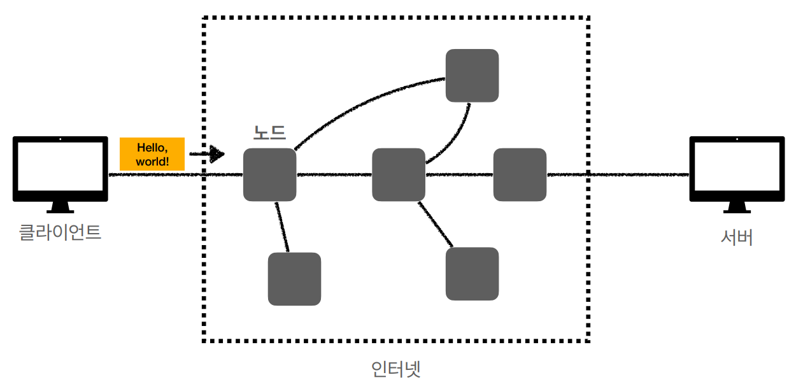
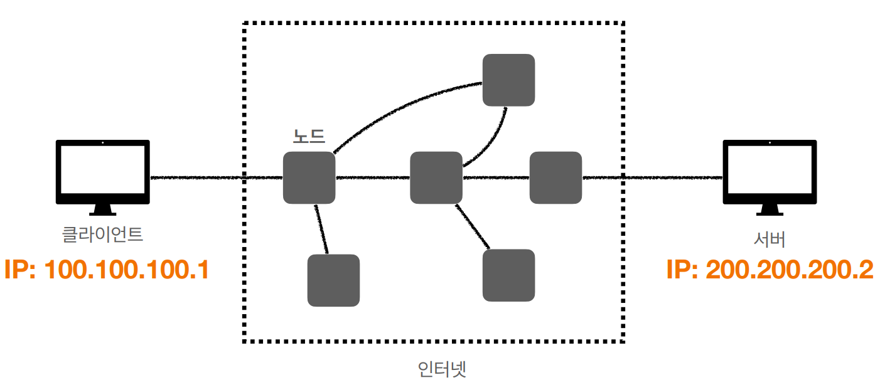
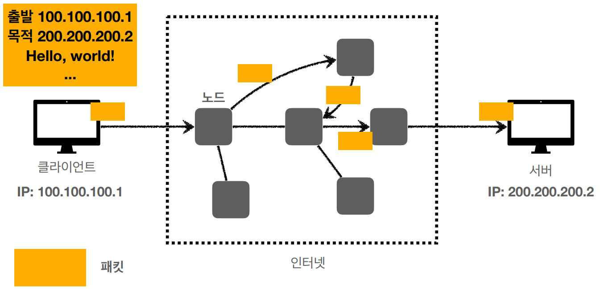
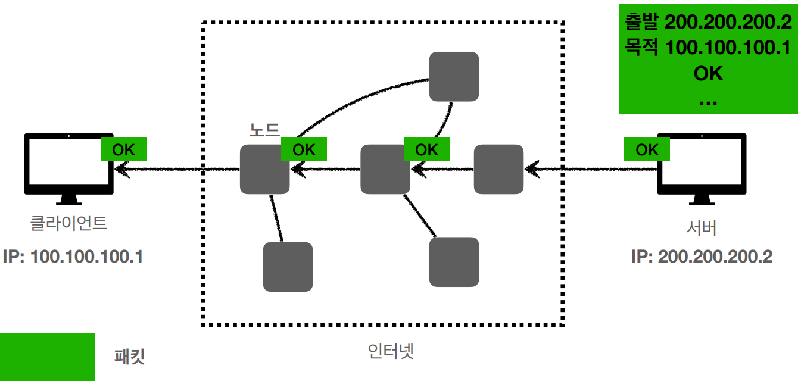
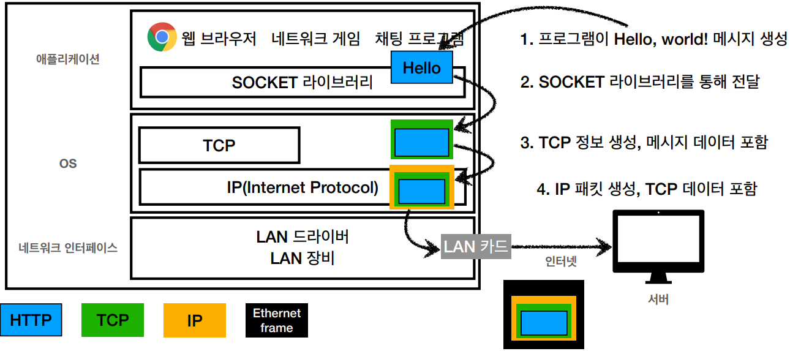
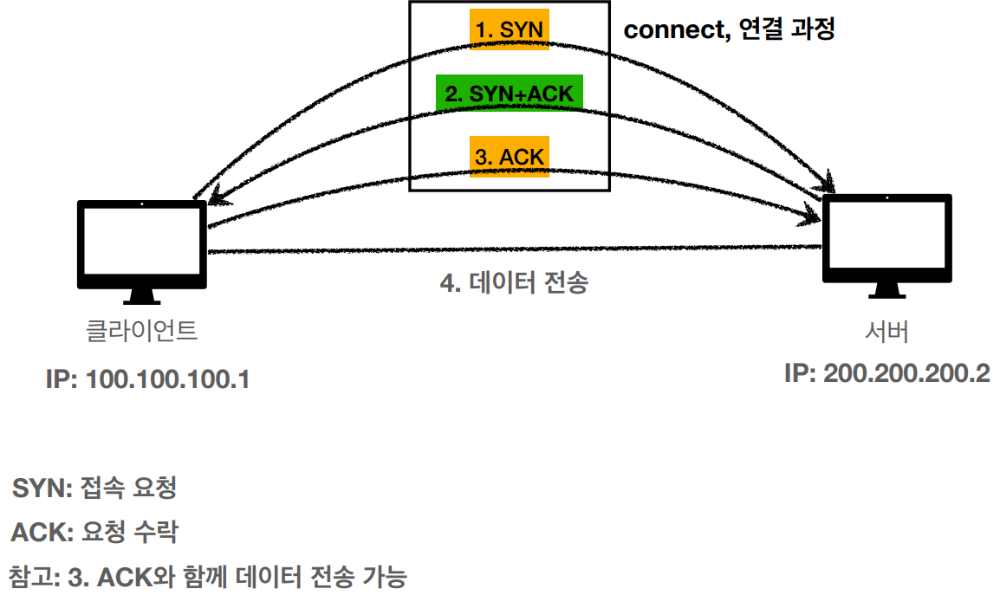
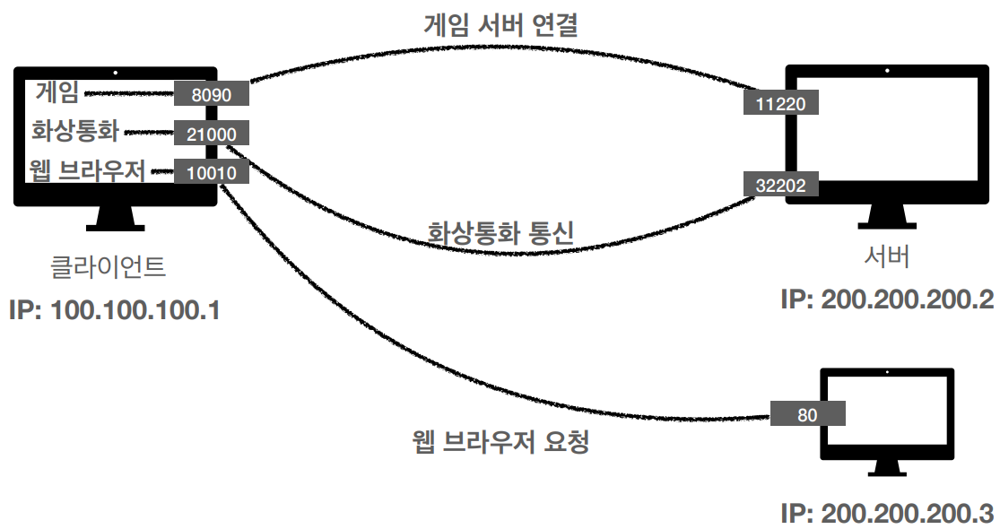

# 시작하기에 앞서..

비전공자로서 기반지식없이 웹사이트를 만들면서 로그인기능을 만들때 HTTP통신때문에 많은 에러와 어려움을 겪은 경험이 있었다.

처음엔 내가 구현하는부분에 대해서만 대충 알아가면서 코드작성을 하였지만, 점점 한계에 부딪혔고 인프런 강의를 통해 제대로 배우고 공부하기위해 작성하는 MD파일.

# 인터넷 네트워크

- 인터넷 통신
- IP(Internet Protocal)
- TCP, UDP
- PORT
- DNS

## 인터넷 통신

- 인터넷에서 컴퓨터 둘은 어떻게 통신할까?

**(중요)인터넷은 수많은 노드를 거쳐서 목적지까지 도착할려면 IP에 대해서 학습이 필요합니다.**

## IP(Internet Protocal)

#### 1. 인터넷 프로토콜 역할

- 지정한 IP 주소(IP Address)에  데이터 전달

- 패킷(Packet)이라는 통신 단위로 데이터 전달

##### 클라이언트 패킷 전달

##### 서버 패킷 전달

#### 2. IP 프로토콜의 한계

- 비연결성
  - 패킷을 받을 대상이 없거나 서비스 불능 상태여도 패킷 전송
- 비신뢰성
  - 중간에 패킷이 사라지면?
  - 패킷이 순서대로 안온다면?
- 프로그램 구분
  - 같은 IP를 사용하는 서버에서 통신하는 애플리케이션이 둘 이상이라면?
- 패킷 전달 순서 문제 발생
  - 데이터 크기가 크다면 보낸 순서와 다르게 받을때는 다른 순서로 받는 상황
- **위와 같은 문제 해결을위해 TCP, UDP를 사용**

## 인터넷 프로토콜 스택의 4계층

- 애플리케이션 계층 - HTTP, FTP
- 전송 계층 - TCP, UDP
- 인터넷 계층 - IP
- 네트워크 인터페이스 계층

## 프로토콜 계층

#### IP 패킷 정보

- 출발지 IP, 목적지 IP, 기타..

#### TCP/IP 패킷 정보

- 출발지 PORT, 목적지 PORT, 전송 제어, 순서, 검증 정보...

### 1. TCP 특징

전송 제어 프로토콜(Transmission Control Protocol)

- 연결지향 - **TCP 3 way handshake** (가상 연결)
- 데이터 전달 보증
- 순서 보장
- **하지만, 3 handshake를 하기위해 시간이 걸리고 전송속도를 빨리 보내기 어려움.  사용화 하지 못함.**

- 신뢰할 수 있는 프로토콜
- 현재는 대부분 TCP 사용

#### TCP 3 way handshake란?

- 클라이언트와 서버가 서로 응답이 완료가 되어야 데이터를 전송합니다.

### 2. UDP 특징

사용자 데이터그램 프로토콜(User Datagram Protocal)

- 하얀 도화지에 비유(기능이 거의 없음)
- 연결지향 - TCP 3 way handshake X
- 데이터 전달 보증 X
- 순서 보장 X
- 데이터 전달 및 순서가 보장되지 않지만, 단순하고 빠름
- 정리
  - IP와 거의 같다. +PORT +체크섬 정도만 추가
  - 애플리케이션에서 추가 작업 필요
    - 하얀 백지와 같아서 사용자에 맞게 변화를 줄수있음

## PORT

> 한번에 둘 이상 연결해야 한다면?

#### PORT - 같은 IP내에서 프로세스 구분

- ex) 하나의 아파트단지에서 IP가 몇동 이라면 몇호가 PORT의 역할

- 0 ~ 65535 할당 가능
- 0 ~ 1023 : 잘 알려진 포트, 사용하지 않는 것이 좋음
  - FTP - 20, 21
  - TELNET - 23
  - HTTP - 80
  - HTTPS - 443

## DNS(Domain Name System)

> 1. IP는 기억하기 어렵다.
>
> 2. IP는 변경될 수 있다.

- 전화번호부
- 도메인 명을 IP 주소로 변환

도메인 명(**`google.com`, `naver.com`**)에 접속하면 그 도메인에 따른 IP로 접근합니다.

