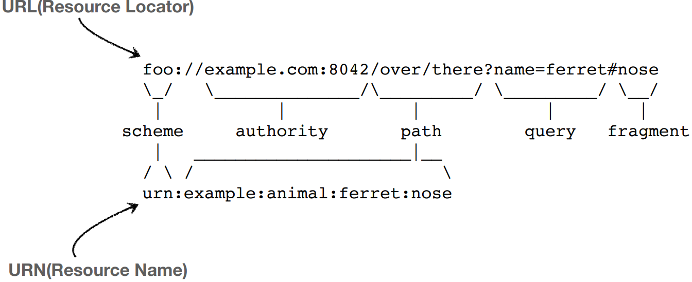
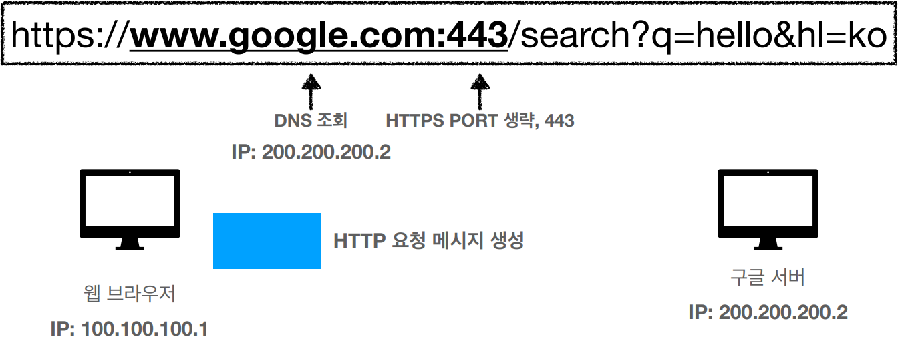
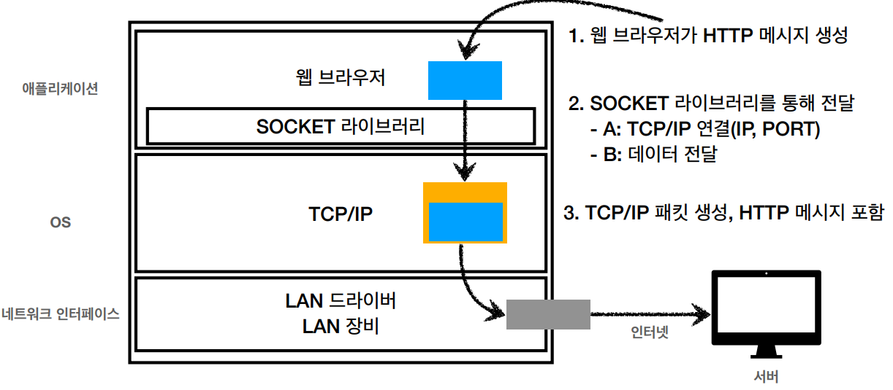

# URI와 웹 브라우저 요청 흐름

- **URI(Uniform Resource Identifier)**

  > **Uniform** : 리소스 식별하는 통일된 방식
  >
  > **Resource** : 자원, URI로 식별할 수 있는 모든 것(제한 없음)
  >
  > **Identifier** : 다른 항목과 구분하는데 필요한 정보

  - 로케이터(Locator), 이름(name) 또는 둘다 추가로 분류될 수 있다.
  - URI에 URL과 URN이 포함됩니다.
  
  
  
  


- **웹 브라우저 요청 흐름**


# URL, URN

- **URL(Uniform Resource Locator**) - Locator: 리소스가 있는 위치를 지정
- **URN(Uniform Resource Name)** - Name: 리소스에 이름을 부여
  - URN은 이름을 부여하면 주소를 찾을수가 없어서 URL만 사용
- 위치는 변할 수 있지만, 이름은 변하지 않는다. 
- urn:isbn:8960777331 (어떤 책의 isbn URN) 
  - 예전에 한번 사용해봤던 방식
- URN 이름만으로 실제 리소스를 찾을 수 있는 방법이 보편화 되지 않는다
- **URI를 URL과 같은 의미로 이야기하겠습니다.**


### URL 전체 문법

##### `scheme://[userinfo@]host[:port][/path][?query][#fragment]`

##### `https://www.google.com:443/search?q=hello&hl=ko` 

- 프로토콜(https) 
- 호스트명(www.google.com) 
- 포트 번호(443) 
- 패스(/search) 
- 쿼리 파라미터(q=hello&hl=ko)


### URL scheme

> **scheme:**
>
> **https:**

##### `scheme://[userinfo@]host[:port][/path][?query][#fragment]`

##### `https://www.google.com:443/search?q=hello&hl=ko`

- 주로 프로토콜 사용 
- 프로토콜: 어떤 방식으로 자원에 접근할 것인가 하는 약속 규칙 
  - 예) http, https, ftp 등등
- http는 80 포트, https는 443 포트를 주로 사용, 포트는 생략 가능 
- https는 http에 보안 추가 (HTTP Secure)


### URL userinfo

> **[userinfo@]**

##### `scheme://[userinfo@]host[:port][/path][?query][#fragment]`

##### `https://www.google.com:443/search?q=hello&hl=ko`

- URL에 사용자정보를 포함해서 인증
- 거의 사용하지 않음


### URL host

> **host**
>
> **www.google.com**

##### `scheme://[userinfo@]host[:port][/path][?query][#fragment]` 

##### `https://www.google.com:443/search?q=hello&hl=ko`

- 호스트명
- 도메인명 또는 IP주소를 직접 사용가능


### URL PORT

> **[:PORT]**
>
> **:443**

##### `scheme://[userinfo@]host[:port][/path][?query][#fragment]` 

##### `https://www.google.com:443/search?q=hello&hl=ko`

- 포트(PORT)
- 접속 포트
- 일반적으로 생략, 생략시 http는 80, https는 443


### URL path

> **[/path]**
>
> **/search**

##### `scheme://[userinfo@]host[:port][/path][?query][#fragment]` 

##### `https://www.google.com:443/search?q=hello&hl=ko`

- 리소스 경로(path), 계층적 구조
- 예)
  - /home/file1.jpg
  - /members
  - /members/100, /items/iphone12


### URL query

> **[?query]**
>
> **q=hello&hl=ko**

##### `scheme://[userinfo@]host[:port][/path][?query][#fragment]` 

##### `https://www.google.com:443/search?q=hello&hl=ko`

- **key=value 형태 **
- **?로 시작**, **&로 추가 가능** ?keyA=valueA&keyB=valueB 
- query parameter, query string 등으로 불림, 웹서버에 제공하는 파라미터, 문자 형태


### URL fragment

> **[#fragment]**
>
> **#getting-started-introducing-spring-boot**

##### `scheme://[userinfo@]host[:port][/path][?query][#fragment]` 

##### `https://docs.spring.io/spring-boot/docs/current/reference/html/getting-started.html#getting-started-introducing-spring-boot`

- fragment 
- html 내부 북마크 등에 사용 
- 서버에 전송하는 정보 아님


# 웹 브라우저 요청 흐름




- **GET** /search?q=hello&hl=ko HTTP/1.1


### HTTP 메세지 전송



- 노란색박스 - TCP/IP 패킷
  - 출발지 IP, PORT, 목적지 IP, PORT, 전송데이터 등..


### HTTP 응답 메세지

```html
HTTP/1.1 200 OK
Content-Type: text/html;charset=UTF-8
Content-Length: 3423

<html>
    <body>...</body>
</html>
```

