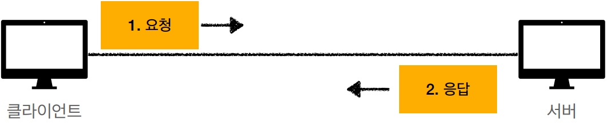
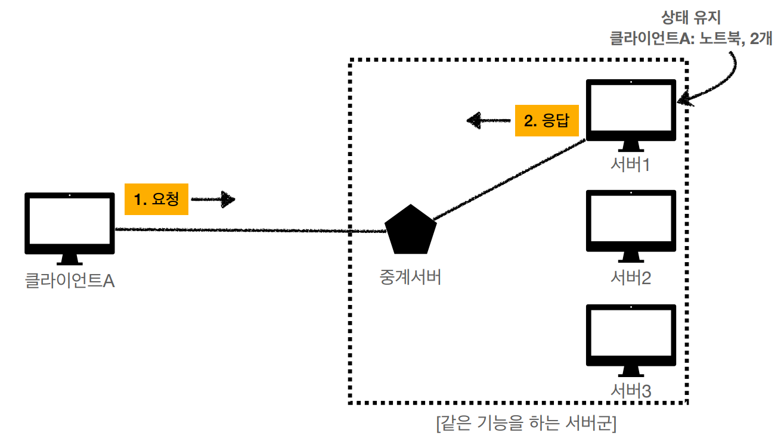
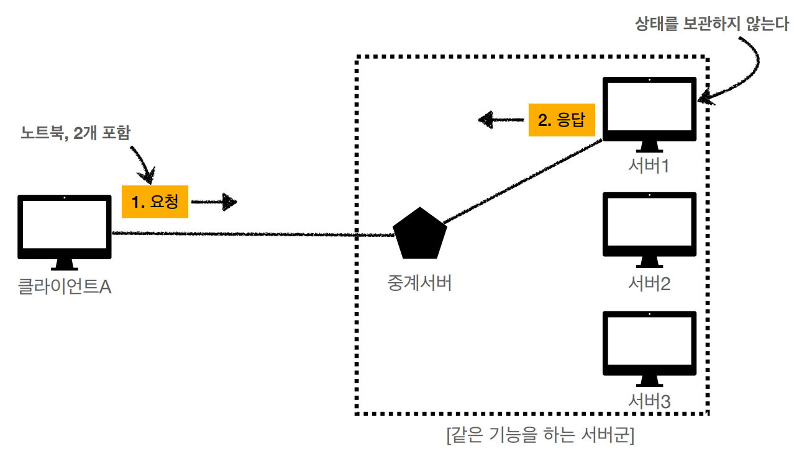
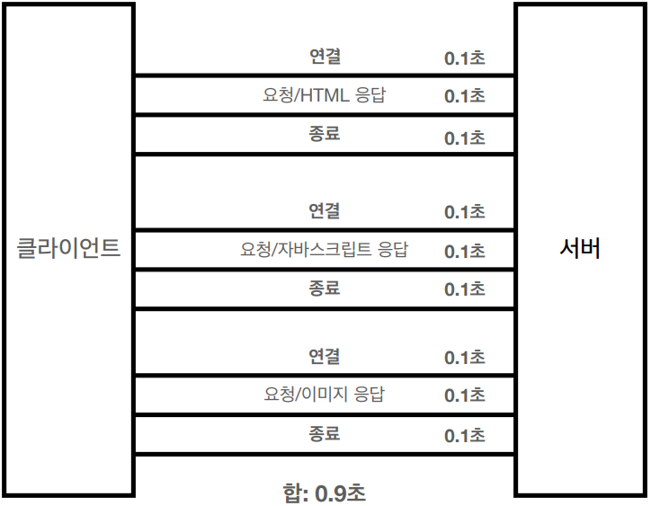
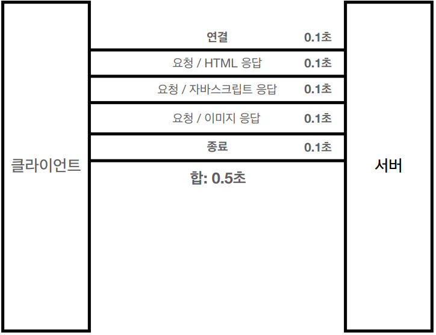

# HTTP(HyperText Transfer Protocol)

- 모든 것이 HTTP
- 클라이언트 서버 구조
- Stateful, Stateless
- 비 연결성(connectionless)
- HTTP 메시지


## 모든 것이 HTTP

> HTTP 메시지에 모든 것을 전송

- HTML, TEXT
- IMAGE, 음성, 영상, 파일
- JSON, XML(API)
- 거의 모든 형태의 데이터 전송 가능
- 서버간에 데이터를 주고 받을 때도 대부분 HTTP사용
- **지금은 HTTP 시대!**


### 기반 프로토콜

- TCP : HTTP/1.1, HTTP/2
- UDP : HTTP/3
- 현재 HTTP/1.1 주로 사용
  - HTTP/2, HTTP/3도 점점 증가


### HTTP 특징

- 클라이언트 서버 구조
- 무상태 프로토콜(스테이스리스), 비연결성
- HTTP 메시지
- 단순함, 확장 가능


## 클라이언트 서버 구조

- Request Response 구조
- 클라이언트는 서버에 요청을 보내고, 응답을 대기
- 서버가 요청에 대한 결과를 만들어서 응답




## 무상태 프로토콜

> 스테이스리스(Stateless)

- 서버가 클라이언트의 상태를 보존x
- 장점 : 서버 확장성 높음(스케일 아웃)
- 단점 : 클라이언트가 추가 데이터 전송


### Stateful, Stateless 차이

#### 1.상태 유지 - Stateful

``````
- 고객 : 이 **노트북** 얼마인가요?
- 점원 : 100만원 입니다. **(노트북 상태 유지)**


- 고객 : **2개** 구매하겠습니다.
- 점원 : 200만원 입니다. **신용카드, 현금중**에 어떤 걸로 구매 하시겠어요? **(노트북, 2개 상태 유지)**


- 고객 : 신용카드로 구매하겠습니다. 
- 점원 : 200만원 결제 완료되었습니다. **(노트북, 2개, 신용카드 상태 유지)**
``````

- **상태 유지** : 중간에 다른 점원으로 바뀌면 안된다. (중간에 다른 점원으로 바뀔 때 상태 정보를 다른 점원에게 미리 알려줘야 한다.)



##### 중간에 서버가 장애발생한다면?

응답이 클라이언트로 전송을 하지못한다.


#### 2. 무상태 - Stateless, 점원이 중간에 바뀌면?

``````
- 고객 : 이 **노트북** 얼마인가요?
- 점원A : 100만원 입니다. **(노트북 상태 유지)**


- 고객 : **2개** 구매하겠습니다.
- 점원B : 200만원 입니다. **신용카드, 현금중**에 어떤 걸로 구매 하시겠어요? **(노트북, 2개 상태 유지)**


- 고객 : 신용카드로 구매하겠습니다. 
- 점원C : 200만원 결제 완료되었습니다. **(노트북, 2개, 신용카드 상태 유지)**
``````

- **무상태** : 중간에 다른 점원으로 바뀌어도 된다. 
  - 갑자기 고객이 증가해도 점원을 대거 투입할 수 있다. 
  - 갑자기 클라이언트 요청이 증가해도 서버를 대거 투입할 수 있다. 
    - **스케일 아웃** - 수평 확장 유리
- 무상태는 응답 서버를 쉽게 바꿀 수 있다. -> **무한한 서버 증설 가능**



##### 중간에 서버가 장애발생한다면?

다른 서버가 응답을 하면된다.


#### 3. Stateless 실무 한계

- 모든 것을 무상태로 설계 할 수 있는 경우도 있고 없는 경우도 있다. 
- 무상태
  - 예) 로그인이 필요 없는 단순한 서비스 소개 화면 
- 상태 유지
  - 예) 로그인
- 로그인한 사용자의 경우 로그인 했다는 상태를 서버에 유지 
- 일반적으로 브라우저 쿠키와 서버 세션등을 사용해서 상태 유지 
- 상태 유지는 최소한만 사용


## 비 연결성(connectionless)

- HTTP는 기본이 연결을 유지하지 않는 모델 
- 일반적으로 초 단위의 이하의 빠른 속도로 응답 
- 1시간 동안 수천명이 서비스를 사용해도 실제 서버에서 동시에 처리하는 요청은 수십개 이 하로 매우 작음 
  - 예) 웹 브라우저에서 계속 연속해서 검색 버튼을 누르지는 않는다.
- 서버 자원을 매우 효율적으로 사용할 수 있음


### 한계와 극복

- TCP/IP 연결을 새로 맺어야 함 - 3 way handshake 시간 추가 
- 웹 브라우저로 사이트를 요청하면 HTML 뿐만 아니라 자바스크립트, css, 추가 이미지 등 등 수 많은 자원이 함께 다운로드 
- 지금은 HTTP 지속 연결(Persistent Connections)로 문제 해결 
- HTTP/2, HTTP/3에서 더 많은 최적화


### HTTP 초기 - 연결, 종료 낭비




### HTTP 지속 연결(Persistent Connections)




### 스테이스리스를 기억하자 

> 서버 개발자들이 어려워하는 업무

- 정말 같은 시간에 딱 맞추어 발생하는 대용량 트래픽 
- 예) 선착순 이벤트, 명절 KTX 예약, 학과 수업 등록 
- 예) 저녁 6:00 선착순 1000명 치킨 할인 이벤트 -> 수만명 동시 요청

