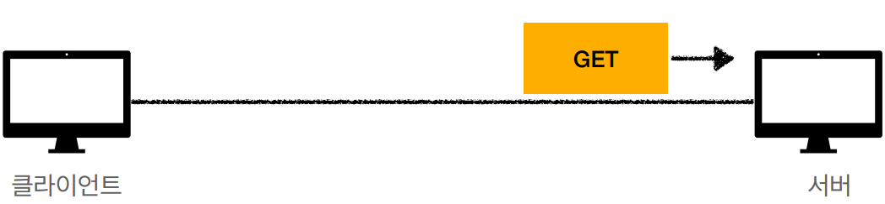
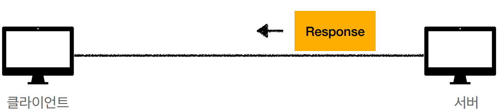

# HTTP 메서드

### API URI 설계

> URI(Uniform Resource Identifier)

- 회원 목록 조회 / read-member-list
- 회원 조회 /read-member-by-id 
- 회원 등록 /create-member 
- 회원 수정 /update-member 
- 회원 삭제 /delete-member

 

#### 위와같이 URI를 설계할때 좋은 설계일까?

답은 아닙니다. 가장 중요한 것은 **리소스 식별**입니다.


### API URI 고민

- **리소스의 의미**
  - 회원을 등록하고 수정하고 조회하는게 리소스는 아닙니다.
  - 예) 미네랄을 캐라 => 미네랄이 리소스
  - **회원이라는 개념 자체가 바로 리소스**
- 리소스를 어떻게 식별하는게 좋을까?
  - 회원을 등록하고 수정하고 조회하는 것을 모두 배제
  - **회원이라는 리소스만 식별하면 된다. => 회원 리소스를 URI에 매핑**


## 다시 API URI을 설계 해보자

> 리소스 식별, URI 계층 구조 활용

- 회원 목록 조회 /members 
- 회원 조회 /members/{id} 
- 회원 등록 /members/{id} 
- 회원 수정 /members/{id} 
- 회원 삭제 /members/{id} 
- 참고: 계층 구조상 상위를 컬렉션으로 보고 복수단어 사용 권장(member -> members)


#### 위와같이 `members/{id}` 를 어떻게 구분할까?


### 리소스와 행위을 분리

> **가장 중요한 것은 리소스를 식별하는 것**

- **URI는 리소스만 식별!**
- **리소스**와 해당 리소스를 대상으로 하는 **행위**를 분리
  - 리소스 : 회원
  - 행위 : 조회, 등록, 삭제, 변경
- 리소스는 명사, 행위는 동사
- 행위(메서드)는 어떻게 구분할까?


# HTTP 메서드 - GET, POST

### HTTP 메서드 종류

- GET : 리소스 조회
- POST: 요청 데이터 처리, 주로 등록에 사용 
- PUT: 리소스를 대체, 해당 리소스가 없으면 생성 
- PATCH: 리소스 부분 변경 
- DELETE: 리소스 삭제


### 기타 메서드

- **HEAD** : GET과 동일하지만 메시지 부분을 제외하고, 상태 줄과 헤더만 반환 
- **OPTIONS** : 대상 리소스에 대한 통신 가능 옵션(메서드)을 설명(주로 CORS에서 사용) 
- **CONNECT** : 대상 자원으로 식별되는 서버에 대한 터널을 설정 
- **TRACE** : 대상 리소스에 대한 경로를 따라 메시지 루프백 테스트를 수행


## GET

```http
GET /search?q=hello&hl=ko HTTP/1.1
Host: www.google.com
```

- 리소스 조회
- 서버에 전달하고 싶은 데이터는 Query(쿼리 파라미터, 쿼리 스트링)를 통해서 전달
- 메시지 바디를 사용해서 데이터를 전달할 수 있지만, 지원하지 않는 곳이 많아서 권장하지 않음


#### 리소스 조회 - 메시지 전달

- 클라이언트

```http
GET /members/100 HTTP/1.1
Host: localhost:8080
```


- 서버 - `/members/100`

```json
{
 "username": "young",
 "age": 20
}
```




### 리소스 조회 - 응답 데이터

- 클라이언트 - 응답 데이터

```http
HTTP/1.1 200 OK
Content-Type: application/json
Content-Length: 34

{
 "username": "young",
 "age": 20
}
```


- 서버 - `/members/100`

```json
{
 "username": "young",
 "age": 20
}
```

