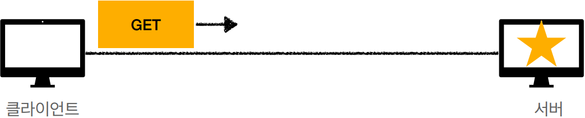
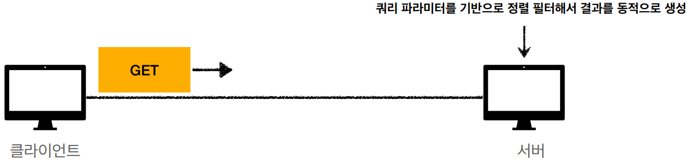
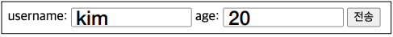
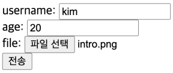

# HTTP 메서드 활용

- 클라이언트에서 서버로 데이터 전송
- HTTP API 설계 예시


## 1. 클라이언트에서 서버로 데이터 전송

### 데이터 전달 방식은 크게 2가지

- 쿼리 파라미터를 통한 데이터 전송
  - GET
  - 주로 정렬 필터(검색어)
- **메시지 바디를 통한 데이터 전송**
  - POST, PUT, PATCH
  - 회원 가입, 상품 주문, 리소스 등록, 리소스 변경


### 4가지 상황

1. **정적 데이터 조회**
   - 이미지, 정적 텍스트 문서

2. **동적 데이터 조회**
   - 주로 검색, 게시판 목록에서 정렬 필터(검색어)

3. **HTML Form을 통한 데이터 전송**
   - 회원 가입, 상품 주문, 데이터 변경
4. **HTTP API를 통한 데이터 전송**
   - 회원 가입, 상품 주문, 데이터 변경
   - 서버 to 서버, 앱 클라이언트, 웹 클라이언트(Ajax)


### 1. 정적 데이터 조회

#### 쿼리 파라미터 미사용

클라이언트

```http
GET /static/star.jpg HTTP/1.1
Host: localhost:8080
```


서버 - `/static/star.jpg`

```http
HTTP/1.1 200 OK
Content-Type: image/jpeg
Content-Length: 34012
lkj123kljoiasudlkjaweioluywlnfdo912u34ljko98udjkla
slkjdfl;qkawj9;o4ruawsldkal;skdjfa;ow9ejkl3123123
```




#### 정리

- 이미지, 정적 텍스트 문서
- 조회는 GET 사용
- 정적 데이터는 일반적으로 쿼리 파라미터 없이 리소스 경로로 단순하게 조획 ㅏ능


### 2. 동적 데이터 조회

#### 쿼리 파라미터 사용

`https://www.google.com/search?q=hello&hl=ko`

```http
GET /search?q=hello&hl=ko HTTP/1.1
Host: www.google.com
```

- `?q=hello&hl=ko` - 쿼리 파라미터





#### 정리

- 주로 검색, 게시판 목록에서 정렬 필터(검색어)
- 조회 조건을 줄여주는 필터, 조회 결과를 정렬하는 정렬 조건에 주로 사용
- 조회는 GET 사용
- GET은 쿼리 파라미터 사용해서 데이터를 전달


### 3. HTML Form을 통한 데이터 전송

#### POST 전송 - 저장



```html
<form action="/save" method="post">
 <input type="text" name="username" />
 <input type="text" name="age" />
 <button type="submit">전송</button>
</form>
```


웹 브라우저가 생성한 요청 HTTP 메시지

```http
POST /save HTTP/1.1
Host: localhost:8080
Content-Type: application/x-www-form-urlencoded
username=kim&age=20
```


#### GET 전송 - 저장


```html
<form action="/save" method="get">
 <input type="text" name="username" />
 <input type="text" name="age" />
 <button type="submit">전송</button>
</form>
```


웹 브라우저가 생성한 요청 HTTP 메시지

```http
GET /save?username=kim&age=20 HTTP/1.1
Host: localhost:808
```

- **주의! GET은 조회에만 사용!  리소스 변경이 발생하는 곳에 사용하면 안됨!**


#### GET 전송 - 조회


```html
<form action="/save" method="get">
 <input type="text" name="username" />
 <input type="text" name="age" />
 <button type="submit">전송</button>
</form>
```


웹 브라우저가 생성한 요청 HTTP 메시지

```http
GET /members?username=kim&age=20 HTTP/1.1
Host: localhost:8080
```


#### multipart/form-data



```html
<form action="/save" method="post" enctype="multipart/form-data">
 <input type="text" name="username" />
 <input type="text" name="age" />
 <input type="file" name="file1" />
 <button type="submit">전송</button>
</form>
```


웹 브라우저가 생성한 요청 HTTP 메시지

```http
POST /save HTTP/1.1
Host: localhost:8080
Content-Type: multipart/form-data; boundary=-----XXX 
Content-Length: 10457
------XXX
Content-Disposition: form-data; name="username"
kim
------XXX
Content-Disposition: form-data; name="age"
20
------XXX
Content-Disposition: form-data; name="file1"; filename="intro.png"
Content-Type: image/png
109238a9o0p3eqwokjasd09ou3oirjwoe9u34ouief...
------XXX--
```

- 끝에는 `--` 추가


#### 정리

- HTML Form submit시 POST 전송
  - 예) 회원 가입, 상품 주문, 데이터 변경
- Content-Type : application/x-www-form-urlencoded 사용
  - form의 내용을 메시지 바디를 토앻서 전송(key=value, 쿼리 파라미터 형식)
  - 전송 데이터를 url encoding 처리
    - 예) abc김 => abc%EA%B9%80
- HTML Form은 GET 전송도 가능
- Content-Type : multipart/form-data
  - 파일 업로드 같은 바이너리 데이터 전송시 사용
  - 다른 종류의 여러 파일과 폼의 내용 함께 전송 가능(그래서 이름이 multipart)
- 참고 : HTML Form 전송은 GET, POST만 지원


### 4. HTTP API 데이터 전송