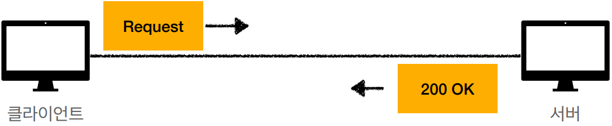
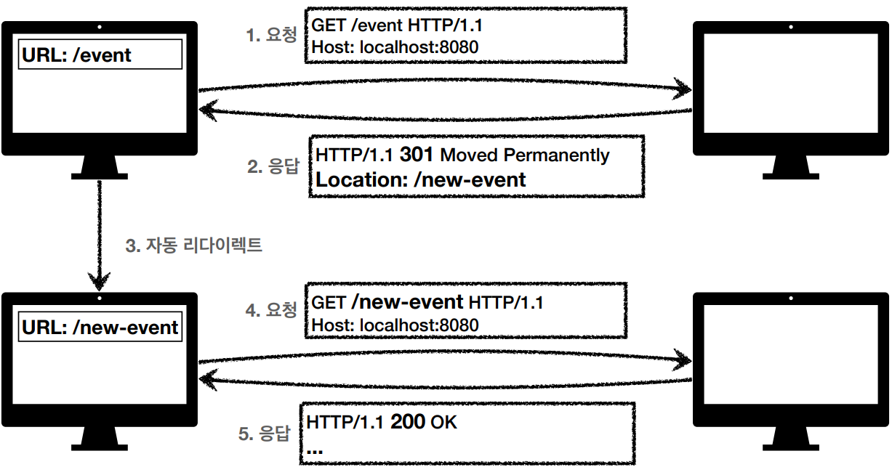
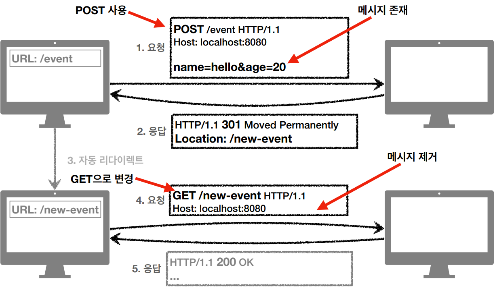
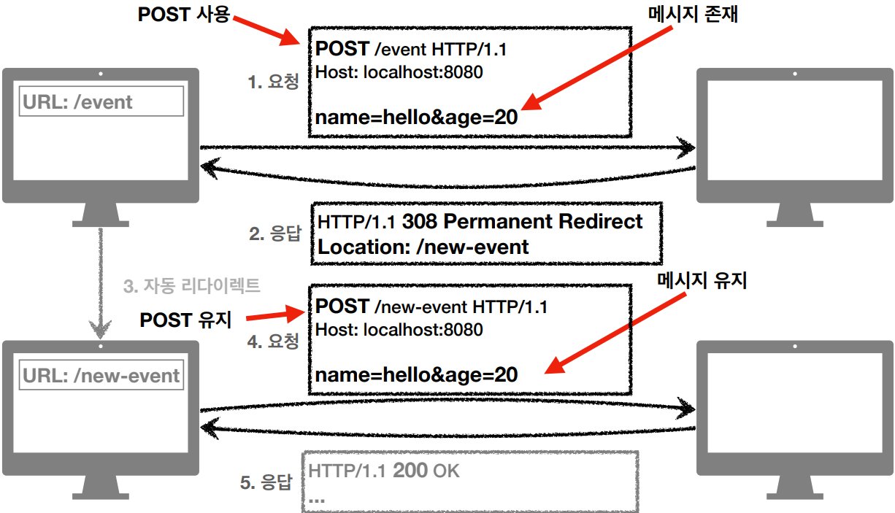
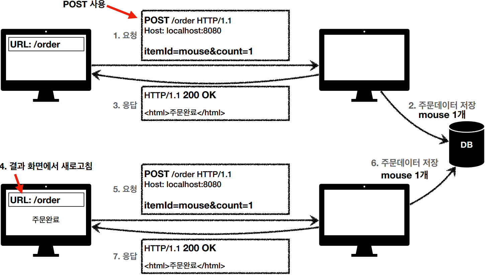
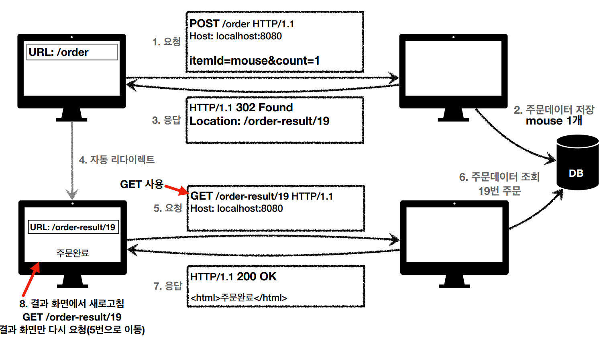

# HTTP 상태코드

> 클라이언트가 보낸 요청의 처리 상태를 응답에서 알려주는 기능

- 1xx (Informational): 요청이 수신되어 처리중 
- 2xx (Successful): 요청 정상 처리 
- 3xx (Redirection): 요청을 완료하려면 추가 행동이 필요 
- 4xx (Client Error): 클라이언트 오류, 잘못된 문법등으로 서버가 요청을 수행할 수 없음 
- 5xx (Server Error): 서버 오류, 서버가 정상 요청을 처리하지 못함


### 만약 모르는 상태 코드가 나타나면?

- 클라이언트가 인식할 수 없는 상태코드를 서버가 반환하면? 
- 클라이언트는 상위 상태코드로 해석해서 처리 
- 미래에 새로운 상태 코드가 추가되어도 클라이언트를 변경하지 않아도 됨 
- 예) 
  - 299 ??? -> 2xx (Successful) 
  - 451 ??? -> 4xx (Client Error) 
  - 599 ??? -> 5xx (Server Error)


## 1xx (Informational) 

> 요청이 수신되어 처리중 

- 거의 사용하지 않으므로 생략


## 2xx (Successful)

> 클라이언트의 요청을 성공적으로 처리

- 200 OK
- 201 Created 
- 202 Accepted 
- 204 No Content


### 200 OK

Request

```http
GET /members/100 HTTP/1.1
Host: localhost:8080
```


Response

```http
HTTP/1.1 200 OK
Content-Type: application/json
Content-Length: 34
{
 "username": "young",
 "age": 20
}
```





### 201 Created

> 요청 성공해서 새로운 리소스가 생성됨

Request

```http
POST /members HTTP/1.1
Content-Type: application/json
{
 "username": "young",
 "age": 20
}
```


Response

```http
HTTP/1.1 201 Created
Content-Type: application/json
Content-Length: 34
Location: /members/100 
{
 "username": "young",
 "age": 20
}
```

- `Location: /members/100` - 생성된 리소스는 응답의 Location 헤더 필드로 식별


### 202 Accepted

> 요청이 접수되었으나 처리가 완료되지 않았음

- 배치 처리 같은 곳에서 사용 
- 예) 요청 접수 후 1시간 뒤에 배치 프로세스가 요청을 처리함


### 204 No Content

> 서버가 요청을 성공적으로 수행했지만, 응답 페이로드 본문에 보낼 데이터가 없음

- 예) 웹 문서 편집기에서 save 버튼
- save 버튼의 결과로 아무 내용이 없어도 된다. 
- save 버튼을 눌러도 같은 화면을 유지해야 한다. 
- 결과 내용이 없어도 204 메시지(2xx)만으로 성공을 인식할 수 있다


## 3xx - 리다이렉션

> 요청을 완료하기 위해 유저 에이전트의 추가 조치 필요

- 300 Multiple Choices 
- 301 Moved Permanently 
- 302 Found 
- 303 See Other 
- 304 Not Modified 
- 307 Temporary Redirect 
- 308 Permanent Redirect


### 리다이렉션 이해

- 웹 브라우저는 3xx 응답의 결과에 Location 헤더가 있으면, Location 위치로 자동 이동 (리다이렉트)


- **영구 리다이렉션** - 특정 리소스의 URI가 영구적으로 이동 
  - 예) /members -> /users 
  - 예) /event -> /new-event 
- **일시 리다이렉션** - 일시적인 변경 
  - 주문 완료 후 주문 내역 화면으로 이동 
  - PRG: Post/Redirect/Get
- **특수 리다이렉션**
  - 결과 대신 캐시를 사용


### 자동 리다이렉트 흐름




### 영구 리다이렉션

> 301, 308

- 리소스의 URI가 영구적으로 이동 
- 원래의 URL를 사용X, 검색 엔진 등에서도 변경 인지 
- **301 Moved Permanently **
  - **리다이렉트시 요청 메서드가 GET으로 변하고, 본문이 제거될 수 있음(MAY) **
- **308 Permanent Redirect  **
  - 301과 기능은 같음 
  - **리다이렉트시 요청 메서드와 본문 유지(처음 POST를 보내면 리다이렉트도 POST 유지)**


#### 301




#### 308




### 일시적인 리다이렉션

> 302, 307, 303

- 리소스의 URI가 일시적으로 변경 
- 따라서 검색 엔진 등에서 URL을 변경하면 안됨 
- **302 Found  **
  - **리다이렉트시 요청 메서드가 GET으로 변하고, 본문이 제거될 수 있음(MAY) **
- **307 Temporary Redirect  **
  - 302와 기능은 같음 
  - **리다이렉트시 요청 메서드와 본문 유지(요청 메서드를 변경하면 안된다. MUST NOT) **
- **303 See Other **
  - 302와 기능은 같음 
  - **리다이렉트시 요청 메서드가 GET으로 변경**


#### 예시

- POST로 주문후에 웹 브라우저를 새로고침하면? 
- 새로고침은 다시 요청 
- 중복 주문이 될 수 있다.


PRG: 사용전




### PRG: Post/Redirect/Get

> 일시적인 리다이렉션 - 예시

- POST로 주문후에 새로 고침으로 인한 중복 주문 방지 
- POST로 주문후에 주문 결과 화면을 GET 메서드로 리다이렉트 
- 새로고침해도 결과 화면을 GET으로 조회 
- 중복 주문 대신에 결과 화면만 GET으로 다시 요청
- PRG 이후 리다이렉트 
  - URL이 이미 POST -> GET으로 리다이렉트 됨 
  - 새로 고침 해도 GET으로 결과 화면만 조회


PRG: Post/Redirect/Get




### 그래서 뭘 써야 하나요?

> 302, 307, 303

- 잠깐 정리 
  - 302 Found -> GET으로 변할 수 있음 
  - 307 Temporary Redirect -> 메서드가 변하면 안됨 
  - 303 See Other -> 메서드가 GET으로 변경
- 역사 
  - 처음 302 스펙의 의도는 HTTP 메서드를 유지하는 것 
  - 그런데 웹 브라우저들이 대부분 GET으로 바꾸어버림(일부는 다르게 동작) 
  - 그래서 모호한 302를 대신하는 명확한 307, 303이 등장함(301 대응으로 308도 등장) 
- 현실 
  - 307, 303을 권장하지만 현실적으로 이미 많은 애플리케이션 라이브러리들이 302를 기본값으로 사용 
  - 자동 리다이렉션시에 GET으로 변해도 되면 그냥 302를 사용해도 큰 문제 없음


### 기타 리다이렉션

> 300, 304

- 300 Multiple Choices: 안쓴다. 
- 304 Not Modified 
  - 캐시를 목적으로 사용 
  - 클라이언트에게 리소스가 수정되지 않았음을 알려준다. 따라서 클라이언트는 로컬PC에 저장된 캐시를 재사용한다. (캐시로 리다이렉트 한다.) 
  - 304 응답은 응답에 메시지 바디를 포함하면 안된다. (로컬 캐시를 사용해야 하므로) 
  - 조건부 GET, HEAD 요청시 사용


## 4xx (Client Error)
> 클라이언트 오류
> 

- 클라이언트의 요청에 잘못된 문법등으로 서버가 요청을 수행할 수 없음 
- **오류의 원인이 클라이언트에 있음 **
- 중요! 클라이언트가 이미 잘못된 요청, 데이터를 보내고 있기 때문에, 똑같은 재시도가 실 패함


### 400 Bad Request

> 클라이언트가 잘못된 요청을 해서 서버가 요청을 처리할 수 없음

- 요청 구문, 메시지 등등 오류 
- 클라이언트는 요청 내용을 다시 검토하고, 보내야함 
- 예) 요청 파라미터가 잘못되거나, API 스펙이 맞지 않을 때