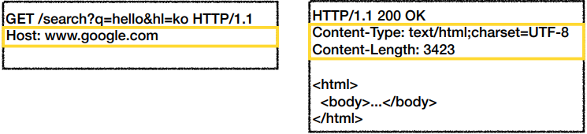
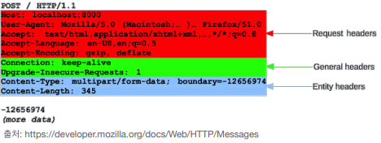

# HTTP Header
- header-field = `field-name ":" OWS field-value OWS` (OWS:띄어쓰기 허용)
- field-name은 대소문자 구문 없음

 

### 용도
- HTTP 전송에 필요한 모든 부가정보
  - 예) 메시지 바디의 내용, 메시지 바디의 크기, 압축, 인증, 요청 클라이언트, 서버 정보, 캐
시 관리 정보...
- 표준 헤더가 너무 많음
  - https://en.wikipedia.org/wiki/List_of_HTTP_header_fields
- 필요시 임의의 헤더 추가 가능
  - helloworld: hihi

 

### 분류
> RFC2616(과거)

- 헤더 분류
  - **General 헤더**: 메시지 전체에 적용되는 정보, 예) Connection: close
  - **Request 헤더**: 요청 정보, 예) User-Agent: Mozilla/5.0 (Macintosh; ..)
  - **Response 헤더**: 응답 정보, 예) Server: Apache
  - **Entity 헤더**: 엔티티 바디 정보, 예) Content-Type: text/html, Content-Length: 3423

 

## HTTP Body
> message body - RFC2616(과거)
- 메시지 본문(message body)은 엔티티 본문(entity body)을 전달하는데 사용
- 엔티티 본문은 요청이나 응답에서 전달할 실제 데이터
- **엔티티 헤더는 엔티티 본문**의 데이터를 해석할 수 있는 정보 제공
- 데이터 유형(html, json), 데이터 길이, 압축 정보 등등

 
 

---

### 그러나 지금은 `RFC2616`에서 `RFC7230 ~ 7235`가 등장하여 사용

---

## RFC723x 변화
- 엔티티(Entity) -> 표현(Representation)
- Representation = representation Metadata + Representation Data
- 표현 = 표현 메타데이터 + 표현 데이터

## HTTP Body
> message body - RFC7230(현재 기준 최신)
- 메시지 본문(message body)을 통해 표현 데이터 전달
- 메시지 본문 = 페이로드(payload)
- 표현은 요청이나 응답에서 전달할 실제 데이터
- **표현 헤더는 표현 데이터**를 해석할 수 있는 정보 제공
  - 데이터 유형(html, json), 데이터 길이, 압축 정보 등등
- 참고: 표현 헤더는 표현 메타데이터와, 페이로드 메시지를 구분해야 하지만, 여기서는 생략

 

### 표현
- Content-Type: 표현 데이터의 형식
- Content-Encoding: 표현 데이터의 압축 방식
- Content-Language: 표현 데이터의 자연 언어
- Content-Length: 표현 데이터의 길이
- 표현 헤더는 전송, 응답 둘다 사용

 
 

## Content-Type
> 표현 데이터의 형식 설명
- 미디어 타입, 문자 인코딩
  - 예)
  - text/html; charset=utf-8
  - application/json
  - image/png