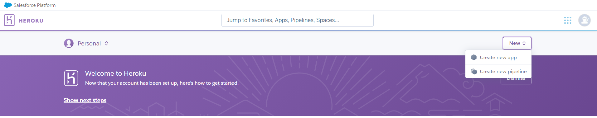
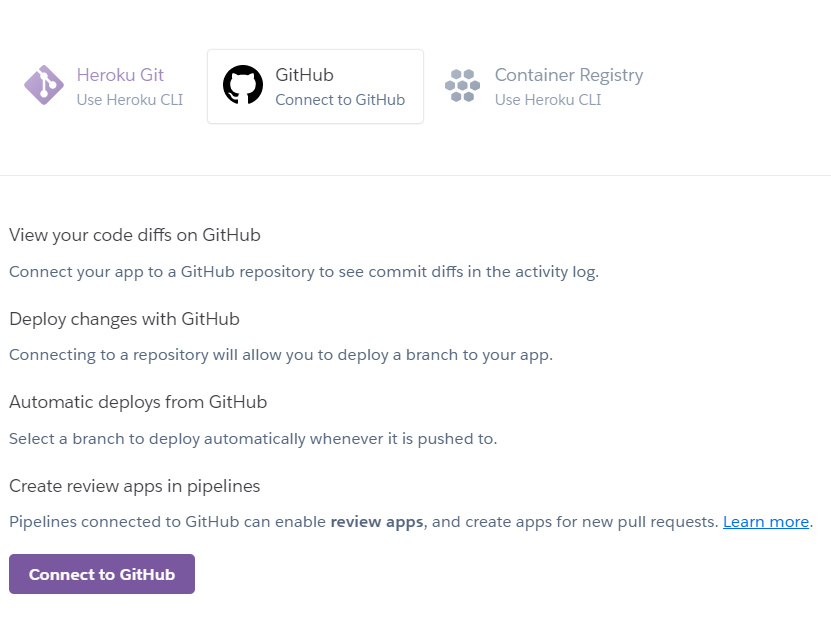
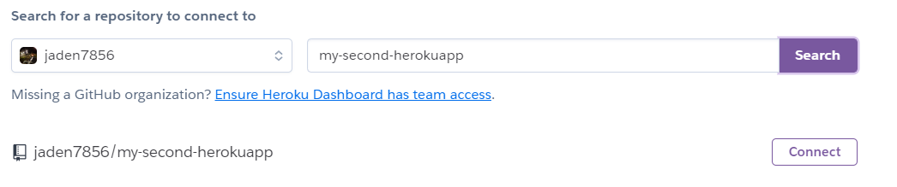

# Heroku란?

Heroku(헤로쿠)는 제작한 웹사이트를 인터넷에 올릴 수 있도록 서버를 제공하는 사이트들 중 하나입니다.

자신이 만든 사이트들은 자신의 컴퓨터를 서버로 하여다른 컴퓨터에서 접속할 수 없죠. 작성한 코드를 인터넷을 통해 다른 컴퓨터에서 볼 수 있는 방법에는 여러가지가 있는데, 헤로쿠를 통해 인터넷과 연결하는 방법이 있습니다.

## Heroku 가입

[https://www.heroku.com](https://www.heroku.com/) 로 이동하여 우측 상단에 Sign up 버튼을 누릅니다.

가입 절차대로 가입합니다.

## Heroku CLI 다운로드

내 컴퓨터에서 헤로쿠를 사용하기 위해서는 Heroku CLI(command line interface)를 [설치](https://devcenter.heroku.com/articles/heroku-cli#download-and-install)해야 합니다. 자신의 운영체제에 맞게 설치하시면 됩니다.

## Heroku 사용법

1. `$ heroku login`

   - 생성한 헤로쿠 계정으로 로그인을 하는 명령어입니다.   Heroku CLI의 기능을 사용하기 위해서는 먼저 로그인을 해야합니다.

   - `$ heroku logout`

2. Github에 새로운 repository를 생성하고, Heroku에서도 아래 New버튼 클릭 후 new app을 선택한다.

   

   

3. app을 생성한 후 GitHub을 Connect 하기 클릭

   

   

4. GitHub 로그인 후 생성했던 repository의 이름을 검색후 `connect` 클릭

   

   - 만약 밑에 오류가 뜬다면 저 GitHub repository에 어떤 파일도 없을때 뜰것이다. 그럴땐 자신의 파일을 `push` 하여 해결

     

5. `$ git add .`

6. `$ git commit -m "messege"`

7. `$ git push heroku master`

   

**만약에 GitHub에 push를 하면 자동으로 Heroku에 적용을 하고싶을 때는 밑의 버튼을 클릭**

