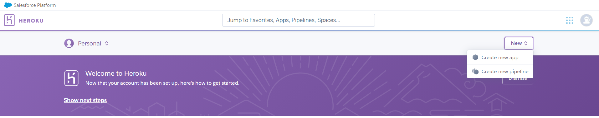
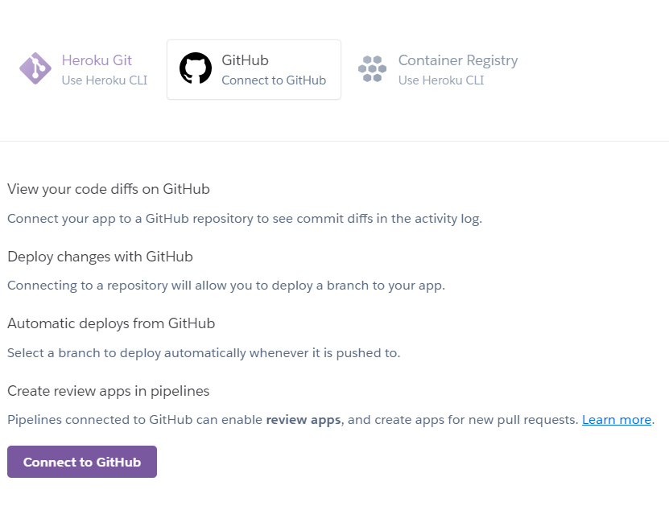
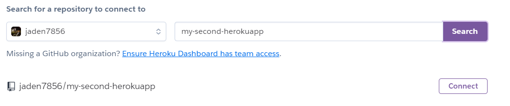

## Heroku 사용법

1. `git init`/`clone`이 활성된 디렉토리로 이동
2. `$ git remote add origin "[URL]"`

3. `$ heroku login`
   - 생성한 헤로쿠 계정으로 로그인을 하는 명령어입니다.   Heroku CLI의 기능을 사용하기 위해서는 먼저 로그인을 해야합니다.

   - `$ heroku logout`

4. Github에 새로운 repository를 생성하고, Heroku에서도 아래 New버튼 클릭 후 new app을 선택한다.

   

   

5. app을 생성한 후 GitHub을 Connect 하기 클릭

   

   

6. GitHub 로그인 후 생성했던 repository의 이름을 검색후 `connect` 클릭

   

   - 만약 밑에 오류가 뜬다면 저 GitHub repository에 어떤 파일도 없을때 뜰것이다. 그럴땐 자신의 파일을 `push` 하여 해결

     

7. `$ git add .`

8. `$ git commit -m "messege"`

9. `$ git push heroku master`

   

**만약에 GitHub에 push를 하면 자동으로 Heroku에 적용을 하고싶을 때는 밑의 버튼을 클릭**

