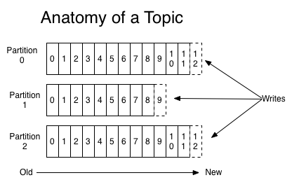
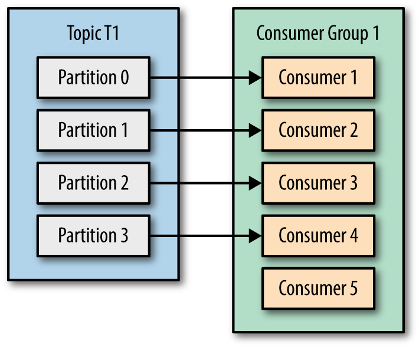

# Kafka 란

Apache Kafka는 실시간으로 기록 스트림을 게시, 구독, 저장 및 처리할 수 있는 분산 데이터 스트리밍 플랫폼입니다. 이는 여러 소스에서 데이터 스트림을 처리하고 여러 사용자에게 전달하도록 설계되었습니다. 간단히 말해, A지점에서 B지점까지 이동하는 것뿐만 아니라 A지점에서 Z지점을 비롯해 필요한 모든 곳에서 대규모 데이터를 동시에 이동할 수 있습니다.

Apache Kafka는 전통적인 엔터프라이즈 메시징 시스템의 대안입니다. 하루에 1조4천억 건의 메시지를 처리하기 위해 LinkedIn이 개발한 내부 시스템으로 시작했으나, 현재 이는 다양한 기업의 요구사항을 지원하는 애플리케이션을 갖춘 오픈소스 데이터 스트리밍 솔루션이 되었습니다.


### 페이지 캐시
카프카는 **파일 I/O의 성능을 향상시키기 위해 한번 읽은 파일의 내용을 페이지 캐시라는 영역에 저장해두었다가, 동일한 접근이 있을 시 페이지 캐시에서 읽음으로써 상대적으로 속도가 느린 디스크로의 접근을 최소화하고 있습니다.** 
실제로 카프카 공식 문서에서도 디스크 중 가격이 가장 저렴한 SATA 디스크를 사용해도 무방하다고 적혀있을 정도로 페이지 캐시에 의한 성능 향상은 유의미합니다.

하지만 **OS는 물리적 메모리에서 카프카 애플리케이션이 사용하는 부분을 제외한 잔여 메모리를 이용해 페이지 캐시로 이용하기 때문에 하나의 시스템에 카프카를 제외한 다른 애플리케이션을 함께 실행시키는 것을 권장하지 않습니다.**

### 배치
서버와 클라이언트가 통신하게 되면 필연적으로 I/O가 발생하게 됩니다. TCP로 통신하게 될 경우 매번 3way-handshaking과 4way-handshaking이 발생하기 때문에 이 역시 속도를 저하시키는 원인이 됩니다. 
이와 같은 성능을 개선하기 위해서 카프카는 작은 I/IO를 여러 개 묶어서 처리할 수 있도록 배치 작업으로 처리하게 됩니다.

<br> 

### 아파치 카프카 사용 이유(The reason why we use kafka)
- 병렬처리에 의한 데이터 처리율 향상 : 카프카는 데이터를 병렬로 처리함으로서 데이터를 빠르고 효과적으로 처리할 수 있습니다. disk에 순차적으로 데이터를 적재하기 때문에 임의 접근(random access) 방식보다 훨씬 더 빠르게 데이터를 처리합니다.
- 데이터 유실 방지 : disk에 적재되기 때문에 만약 불의의 사고로 서버가 다운되었을 시에도 데이터가 유실되는 일 없이 재시작하여 기존 데이터를 안정적으로 처리 가능합니다.
- 클러스터링에 의한 고가용성 서비스 : Scale-out이 가능하여 시스템 확장이 용이하며 어떤 하나 혹은 몇 개의 서버가 다운되도 서비스 자체가 중단될 일 없이 시스템이 운용가능합니다.

<br>

### ARCHITECTURE

[출처](https://engkimbs.tistory.com/691)

카프카 클러스터를 중심으로 프로듀서와 컨슈머가 데이터를 push하고 pull하는 구조입니다. Producer, Consumer는 각기 다른 프로세스에서 비동기로 동작하고 있죠. 이 아키텍처를 좀 더 자세히 표현하면 다음과 같습니다.

<br>
<br>

## 용어

### **Kafka** 
- 프로듀서가 보낸 메시지를 저장하는 역할

### **Broker** 
- **브로커는 카프카 서버라고도 불립니다.** 브로커 내부에 여러 토픽들이 생성될 수 있고, 이러한 토필들에 의해 생성된 파티션들이

카프카의 브로커는 리더(Leader)와 팔로워(Follower)로 이루어지게 됩니다. 오직 **리더에만 쓰기와 읽기 작업을 할 수 있고**, 
만약 **리더 브로커에서 장애가 발생하게 되면, 팔로워 중 하나를 새롭게 리더로 선출**하게 됩니다.


이러한 이유로 카프카에서는 브로커 중 하나라도 살아있다면 데이터가 손실되지 않지만, 간혹 모든 브로커가 다운 되었을 경우에는 가장 먼저 정상화된 브로커의 데이터를 동기화하게 됩니다. 
따라서 먼저 가장 먼저 정상화된 브로커가 가진 데이터가 이전의 버전이라면 일부 데이터의 손실이 일어나게 됩니다. 
그래서 카프카는 0.11.0.0 버전부터는 가장 마지막에 다운된 리더가 정상화되기를 기다리는 방안을 선택했습니다.

```shell
# vi config/server/properties

unclean.leader.election.enable = false
```
`false`일 경우 가장 마지막에 다운된 리더의 정상화를 기다리고, `true`는 서비스적 관점에서 메시지의 손실이 발생하더라도 빠른 서비스를 제공을 위해 가장 빨리 정상화된 브로커의 데이터를 동기화하는 설정입니다.

<br>

너무 많은 파티션의 수는 단점으로 작용할 수도 있듯이 너무 많은 리플리케이션의 수 역시 문제점을 야기할 수 있습니다.

#### 저장공간

첫 번째로 저장 공간의 문제점이 생깁니다. 예를 들어 파티션의 사이즈가 100GB인 브로커가 있습니다. 그리고 만약 이 브로커의 리플리케이션 팩터는 3이라면 (자신을 포함) 카프카 클러스터 내 필요한 총저장소의 크기는 300GB가 됩니다.


#### 브로커 리소스 사용량 증가

브로커에서는 완벽한 리플리케이션을 위해서 사용자가 알아차리지 못하는 사이 비활성화된 토픽이 리플리케이션이 잘되고 있는지 계속해서 상태를 체크하는 작업이 이루어집니다. 

<br>

---

### **Topic**
- 메시지를 받을 수 있는 논리적인 모델로 데이터를 구분하기 위한 단위
    - ex) A라는 사람에게서 받은 메일과 B라는 사람에게서 받은 메일을 구분하기 위해서 이메일 주소를 사용하는 것과 비슷한 논리
  
### **Partition**
- Topic의 처리량 향상을 위한 병렬 처리가 가능하도록 Topic을 부분적으로 복수개로 나눈 단위

<br>

이와 같이 토픽을 파티셔닝 하는 이유는 **프로듀서로부터 도착한 메시지의 순서가 보장**되어야 하면서 동시에 성능을 향상하기 위해서입니다.

예를 들어 4개의 프로듀서에서 전송되는데 1초가 걸리는 메시지를 하나의 파티션에 전송했다고 가정해보겠습니다. 
일반적인 분산 시스템의 경우 메시지의 처리시간이 1초일 확률이 높지만, 메시징 큐 시스템에서는 한 가지 제약 조건이 존재합니다. 
바로 **메시지의 순서가 보장되어야 한다는 것입니다.** 때문에 결과적으로 4개의 프로듀서에서 메시지를 전송하였다고 하더라도 이를 모두 처리하는 데에는 4초가 걸리게 됩니다.

이와 같이 순서를 지키며 병렬적으로 메시지를 처리하기 위해서 **카프카는 하나의 토픽안에 여러 개의 파티션을 둠으로서 메시지를 병렬적으로 처리**하게 됩니다. 
즉, **프로듀서 4개에 4개의 파티션이 있다면 이를 모두 처리하는 데에 1초의 시간만** 있으면 되는 것입니다.

<div style="text-align:center"></div>

그렇다면 무조건 파티션의 수를 늘리는 것만이 능사일까요?

꼭 그렇지는 않습니다. 각 파티션은 카프카 브로커의 디렉토리와 매핑되고 저장되는 데이터마다 2개의 데이터가 저장됩니다.

| Index | 실제 데이터 |
|-------|--------|


카프카는 모든 디렉토리의 파일에 대해 핸들을 열게 되고, 결국 **파티션의 수가 많을 수록 파일 핸들 수 역시 많아지게 되므로 리소스가 낭비되게 됩니다.**

또한, **장애 복구 시간이 증가**하게 됩니다. 카프카에서는 파티션마다 리플리케이션이 동작하게 되어 한 개의 리더와 나머지 파티션은 팔로워의 역할을 하게 됩니다. 
그래서 만약 브로커에 장애가 발생했을 경우 각 파티션에 관한 리더를 선출해야 하므로 파티션의 수가 증가함에 따라 시간이 새로운 리더 선출에 대한 시간이 비례하여 상승하게 됩니다.

특히 **카프카에서 파티션을 증가하는 것은 아무 때나 변경이 가능하지만, 반대로 파티션의 수를 줄이는 것은 토픽을 삭제하는 방법 말고는 존재하지 않습니다.**

※ 카프카에서는 브로커당 약 2천 개 정도의 최대 파티션 수를 권장하고 있습니다.

<br>

---

### **Producer**

카프카로 메시지를 보내는 역할입니다. 만약 전송하는 메시지에 키 값을 지정하게 된다면 원하는 파티션으로 전송되게 됩니다. 하지만 키 값을 지정하지 않는다면, 파티션은 Round-Robin 방식으로 각 파티션에 메시지를 균등하게 분배합니다.

<br>

#### Sync 전송
메시지가 브로커에게 메시지를 성공적으로 전달했는지 확인할 수 있기 때문에 더욱 신뢰성 있는 메시지 전송을 할 수 있다는 장점이 있습니다.

#### Async 전송
Sync 전송은 프로듀서가 보낸 모든 메시지에 대해 응답을 기다리며 스레드들이 정지한다면 효율성이 떨어지고 시간이 오래 걸리게 됩니다. 
하지만 비동기적으로 전송하게 된다면 응답을 기다리지 않고 바로 다음 일을 수행할 수 있기 때문에 더욱 빠른 전송을 할 수 있습니다.

#### acks
`ack=0`
- 프로듀서는 카프카로부터 어떠한 ack도 기다리지 않습니다. 즉 프로듀서에서 전송한 메시지가 실패하더라도 결과를 알지 못하기 때문에 재요청 설정도 적용되지 않습니다. 하지만 매우 빠르게 메시지를 보낼 수 있어 높은 처리량으로 기능을 수행할 수 있습니다.

`ack=1`
- 카프카 리더에 한해서 데이터를 정상적으로 받았다는 응답을 받습니다. 하지만 모든 팔로워에까지 메시지가 정상적으로 도착했는지에 관해서는 응답받지 않습니다.

`ack=all / ack=-1`
- all 또는 -1로 설정하는 경우 모든 팔로워로부터 데이터에 대한 ack를 기다리기 때문에 하나 이상의 팔로워가 존재하는 한 데이터는 손실되지 않습니다. 때문에 데이터 무손실에 대해 가장 강력하게 보장하지만, 동시에 모든 팔로워로부터 ack 응답을 기다려야 하므로 성능이 떨어집니다.

<br>

---

### **Consumer**
카프카에 저장되어 있는 메시지를 가져오는 역할입니다. 주요 기능은 특정 파티션을 관리하고 있는 파티션 리더에게 메시지를 가져오기 요청을 하는 것입니다. 
각 요청은 로그의 오프셋을 명시하고 그 위치로부터 로그 메시지를 수신합니다.

<br>

#### Partition Message 순서
컨슈머에 들어오는 메시지들의 순서는 파티션 단위로 지켜집니다. 예를 들어 아래 이미지와 같이 파티션이 4개가 있는 토픽이 있을 때 `0, 1, 2, 3, 4, 5`라는 메시지를 전송했으면, 
각각의 파티션은 병렬로 메시지를 받기 때문에 **offset 1**에 `0, 1, 2, 3`이 들어오고 **offset 2**에 `4, 5`가 들어옵니다.
카프카는 offset 기준으로만 메시지를 가져오기 때문에 offset이 1인 `0, 1, 2, 3`은 offset이 2인 `4, 5`에 비해서는 확실히 먼저 도착한 것이보장되지만 
같은 offset을 가진 메시지끼리는 순서를 보장하지 않습니다.

<div style="text-align:center"></div>

파티션끼리도 메시지의 순서를 보장하기 위해서는 파티션을 1개만 지정해서 사용해야합니다. 하지만 파티션 수를 1로 지정하면 모든 메시지의 순서를 보장할 수 있지만 파티션 수가 하나이기 때문에 분산해서 처리할 수 없고 하나의 컨슈머에서만 처리할 수 있기 때문에 처리량이 높지 않습니다.

#### Consumer Group
컨슈머 그룹은 **하나의 토픽에 여러 컨슈머 그룹이 동시에 접근해서 메시지를 순서를 유지하며 가져올 수 있습니다.** 즉 하나의 데이터를 일관성 있게 다수의 그룹에서 불러옴으로써 다양한 형태로 데이터를 변형 및 사용할 수 있게 됩니다.

아래의 이미지처럼 컨슈머 그룹 내에 컨슈머가 증가하게 되면 리밸런스 과정을 거치게 되는데, 리밸런스가 일어나게 되면 토픽의 각 파티션마다 하나의 컨슈머가 연결됩니다. 그리고 리밸런스가 끝나게 되면 컨슈머들은 각자 담당하고 있는 파티션으로부터 메시지를 가져오게 됩니다.


하지만 이미지처럼 4개의 컨슈머를 추가했음에도 프로듀서가 보내는 메시지보다 컨슈머가 가져가는 메시지의 양이 적다면
토픽의 파티션에는 하나의 컨슈머만 연결할 수 있기 때문에 추가한 새로운 컨슈머는 대기상태에 놓이게 됩니다.
픽의 파티션 수와 동일하게 컨슈머 수를 늘렸음에도 프로듀서가 보내는 메시지의 속도를 따라가지 못한다면 **컨슈머만 추가하는 것이 아니라, 토픽의 파티션과 컨슈머를 같이 늘려줘야 합니다.**



또한 반대로 잘 동작하고 있던 consumer4가 갑자기 다운될 경우를 생각해 보겠습니다. 이러한 경우에는 consumer4로 메시지를 보내던 partition3이 consumer3으로 리밸런스 되어서 partition2와 3이 모두 consumer3에게 할당되게 됩니다. 이런 경우 consumer 1, 2에 비해 처리량이 불균등해지기 때문에 지속적인 모니터링을 통해서 추가적으로 컨슈머를 할당해줄 필요가 있습니다.

<br>

하나의 토픽에 두 개 이상의 컨슈머 그룹뿐만 아니라 그 이상의 컨슈머 그룹이 연결되어도 다른 컨슈머 그룹에 영향 없이 메시지를 가져갈 수 있게 됩니다.


<br>

---

### **Zookeeper** 
- 카프카가 분산 코디네이터인 주키퍼와 연결하여 메타 데이터 및 클러스터 노드 관리

### **Segment** 
- Producer가 전송한 메시지(데이터)가 저장되는 물리 File 단위

<br>

[출처](https://ooeunz.tistory.com/115?category=873807)

---

- `server.properties` Kafka config
```shell
# config/server.properties
 
############################# Server Basics #############################
 
# Broker의 ID로 Cluster내 Broker를 구분하기 위해 사용(Unique 값)
broker.id=0
 
############################# Socket Server Settings #############################
 
# Broker가 사용하는 호스트와 포트를 지정, 형식은 PLAINTEXT://your.host.name:port 을 사용
listeners=PLAINTEXT://:9092
 
# Producer와 Consumer가 접근할 호스트와 포트를 지정, 기본값은 listeners를 사용
advertised.listeners=PLAINTEXT://localhost:9092
 
 
# 네트워크 요청을 처리하는 Thread의 개수, 기본값 3
num.network.threads=3
 
# I/O가 생길때 마다 생성되는 Thread의 개수, 기본값 8
num.io.threads=8
 
# socket 서버가 사용하는 송수신 버퍼 (SO_SNDBUF, SO_RCVBUF) 사이즈, 기본값 102400
socket.send.buffer.bytes=102400
socket.receive.buffer.bytes=102400
 
# 서버가 받을 수 있는 최대 요청 사이즈이며, 서버 메모리가 고갈 되는 것 방지
# JAVA의 Heap 보다 작게 설정해야 함, 기본값 104857600
socket.request.max.bytes=104857600
 
############################# Log Basics #############################
 
# 로그 파일을 저장할 디렉터리의 쉼표로 구분할 수 있음
log.dirs=C:/dev/kafka_2.13-2.6.0/logs
 
# 토픽당 파티션의 수를 의미, 
# 입력한 수만큼 병렬처리 가능, 데이터 파일도 그만큼 늘어남
num.partitions=1
 
# 시작 시 log 복구 및 종료 시 flushing에 사용할 데이터 directory당 Thread 개수
# 이 값은 RAID 배열에 데이터 directory에 대해 증가하도록 권장 됨
num.recovery.threads.per.data.dir=1
 
############################# Internal Topic Settings #############################
# 내부 Topic인 "_consumer_offsets", "_transaction_state"에 대한 replication factor
# 개발환경 : 1, 운영할 경우 가용성 보장을 위해 1 이상 권장(3 정도)
offsets.topic.replication.factor=1
transaction.state.log.replication.factor=1
transaction.state.log.min.isr=1
 
############################# Log Retention Policy #############################
 
# 세그먼트 파일의 삭제 주기, 기본값 hours, 168시간(7일)
# 옵션 [ bytes, ms, minutes, hours ] 
log.retention.hours=168
 
# 토픽별로 수집한 데이터를 보관하는 파일
# 세그먼트 파일의 최대 크기, 기본값 1GB
# 세그먼트 파일의 용량이 차면 새로운 파일을 생성
log.segment.bytes=1073741824
 
# 세그먼트 파일의 삭제 여부를 체크하는 주기, 기본값 5분(보존 정책)
log.retention.check.interval.ms=300000
 
############################# Zookeeper #############################
 
# 주키퍼의 접속 정보
# 쉼표(,)로 많은 연결 서버 포트 설정 가능
# 모든 kafka znode의 Root directory
zookeeper.connect=localhost:2181
 
# 주키퍼 접속 시도 제한시간(time out)
zookeeper.connection.timeout.ms=18000
 
 
############################# Group Coordinator Settings #############################
 
# GroupCoordinator 설정 - 컨슈머 rebalance를 지연시키는 시간
# 개발환경 : 테스트 편리를 위해 0으로 정의
# 운영환경 : 3초의 기본값을 설정하는게 좋음
 group.initial.rebalance.delay.ms=0
```

---

카프카를 활용하기 위해서는 클러스터 구성이 반드시 필요합니다. 일반적으로 주키퍼 replication 방식이 홀수를 유지해야 하기 때문에 최소 3대를 구성해야 합니다.

카프카를 사용하기 위해서는 주키퍼(Zookeeper) 사용이 필수적이며, 주키퍼는 분산 시스템에서 필수적인 계층 구조인 **Key-Value 저장 구조를 통해서 대규모 시스템에 분산된 설정 서비스, 동기화 서비스, 네이밍 등록에 사용될 수 있습니다.**

<br>
<br>

# Kafka 설치

[Kafka](https://kafka.apache.org/downloads.html) 에서 최신에 나온 버전을 다운로드를 받습니다. 저는 `3.1.0` 버전을 다운받았습니다. 다운 받을때의 OS는 WindowOS, MacOS의 차이는 없습니다.

```
$ wget http://apache.mirror.cdnetworks.com/kafka/3.1.0/kafka_2.13-3.1.0.tgz

$ tar -zxvf kafka_2.13-3.1.0.tgz

$ mkdir /root/zookeeper & mv /root/kafka_2.13-3.1.0 /root/zookeeper/
```
<br>

### java 설치
```
$ yum install -y java-11-openjdk.x86_64
```

<br>

### firewalld 중지
```
$ systemctl stop firewalld && systemctl disable firewalld
```

<br>
<br>

# Kafka 실행
> $KAFKA_HOME = /root/zookeeper/
### STEP 1: START THE KAFKA ENVIRONMENT

```shell
$ vi config/zookeeper.properties


dataDir=/root/zookeeper/

clientPort=2181

maxClientCnxns=0

# 팔로워가 리더와 초기에 연결하는 시간에 대한 타임아웃
initLimit=5 

# 팔로워가 리더와 동기화 하는데에 대한 타임아웃. 즉 이 틱 시간안에 팔로워가 리더와 동기화가 되지 않는다면 제거 된다.
syncLimit=2


server.1=192.168.33.131:2888:3888

server.2=192.168.33.132:2888:3888

server.3=192.168.33.133:2888:3888
```
`initLimit`, `syncLimit`이 두값은 dafault 기본값이 없기 때문에 반드시 설정해야 하는 값이다.
`server`는 자신이 만든 kafka 서버를 만든 만큼 설정한다.
`2888` : 서버 노드끼리 통신을 위해 사용, `3888` 리더 선출을 위해 사용


<br>

그리고 server.1,2,3의 숫자는 인스턴스 ID이다. ID는 `dataDir=/root/zookeeper/` 폴더에 `myid`파일에 명시가 되어야 한다.
 `myid` 파일을 생성하여 각각 서버의 고유 ID값을 부여해야 한다.
- `server1`
```
$ cd $KAFKA_HOME
$ echo 1 > myid
```
- `server2`
```
$ cd $KAFKA_HOME
$ echo 2 > myid
```
- `server3`
```
$ cd $KAFKA_HOME
$ echo 3 > myid
```

<br>

Kafka의 `config/server.properties` 파일은 하나의 Kafka를 실행하는데 쓰이는 설정 파일이다. Zookeeper와 마찬가지로 여러개의 설정파일을 만들고 다중 실행을 할 수 있다.

설정파일 `${$KAFKA_HOME}/config/server.properties`에 3대 서버 각 환경에 맞는 정보를 입력해 준다.
- `server1`
```shell
broker.id=1

listeners=PLAINTEXT://:9092

advertised.listeners=PLAINTEXT://192.168.33.131:9092

zookeeper.connect=192.168.33.131:2181, 192.168.33.132:2181, 192.168.33.133:2181
```
- `server2`
```shell
broker.id=2

listeners=PLAINTEXT://:9092

advertised.listeners=PLAINTEXT://192.168.33.131:9092

zookeeper.connect=192.168.33.131:2181, 192.168.33.132:2181, 192.168.33.133:2181
```
- `server3`
```shell
broker.id=3

listeners=PLAINTEXT://:9092

advertised.listeners=PLAINTEXT://192.168.33.131:9092

zookeeper.connect=192.168.33.131:2181, 192.168.33.132:2181, 192.168.33.133:2181
```

### 실행
백그라운드로 실행하려면 `-daemon` 옵션을 추가하여 기동

```
$ cd $KAFKA_HOME

$ bin/zookeeper-server-start.sh {-daemon} config/zookeeper.properites

$ bin/kafka-server-start.sh {-daemon} config/server.properties
```

<br>


### STEP 2: CREATE A TOPIC TO STORE YOUR EVENTS
> `Kafka default port -- 9092`, `zookeeper default port -- 2181`

```
$ bin/kafka-topics.sh --create --topic <TOPIC_NAME> /
--bootstrap-server <IP>:9092 /
--partitions 3 /
--replication-factor 3

Created topic <TOPIC_NAME>
```
`--partitions` 와 `--replication-factor`를 설정하지 않으면 클러스터 없이 단일로 사용합니다.

`bootstrap-server`는 활성 Kafka 브로커 중 하나의 주소를 가리킵니다. 모든 브로커는 Zookeeper를 통해 서로에 대해 알고 있으므로 어느 브로커를 선택하든 상관 없습니다.

- `--partitions` : 파티션을 사용하면 데이터를 분할할 브로커 수를 결정할 수 있습니다. 일반적으로 브로커 수와 동일하게 설정합니다. 3개의 브로커를 설정했으므로 이 옵션을 3으로 설정합니다. 
- `--replication-factor` :  하는 데이터 복사본의 수를 나타냅니다(브로커 중 하나가 다운되는 경우에도 다른 브로커에 데이터가 남아 있음). 이 값을 3로 설정했으므로 데이터는 브로커에 복사본 두 개를 더 갖습니다.

<br>

#### Topic list
```
$ bin/kafka-topics.sh --list --bootstrap-server <IP>:9092
```

- 해당 kafka의 상세정보
```
$ bin/kafka-topics.sh --describe --topic <TOPIC_NAME> --bootstrap-server <IP>:9092

Topic: my-kafka-topic   TopicId: 2c7cvTC1QGKy2bu18revoA PartitionCount: 3       ReplicationFactor: 3    Configs: segment.bytes=1073741824
        Topic: my-kafka-topic   Partition: 0    Leader: 3       Replicas: 3,1,2 Isr: 3,1,2
        Topic: my-kafka-topic   Partition: 1    Leader: 1       Replicas: 1,2,3 Isr: 1,2,3
        Topic: my-kafka-topic   Partition: 2    Leader: 2       Replicas: 2,3,1 Isr: 2,3,1
```

주제의 파티션 및 복제본에 대한 세부 정보를 출력합니다. Partition, Leader/follower, Replicas, Isr(In Sync Replica) 정보를 보여줍니다. 

여기서 `Isr`은 kafka 리더 파티션과 팔로워 파티션이 모두 싱크가 된 상태를 나타냅니다. 만일, 브로커 중 1대의 서버가 중지된 상태라면 `Isr` 은 2개 만 표시됩니다. 3번 브로커 서버가 중지되었다면 `Leader는` 1 또는 2가 되고 `Isr` 은 1,2 가 됩니다.

<br>


### STEP 3: WRITE AND READ SOME EVENTS INTO THE TOPIC

Consumer를 실행시키고 새로운 터미널 창을열어서 Producer를 실행시킵니다.

Producer 창에서 원하는 문장을 입력하면 Consumer창에서 문장이 출력이 되는것을 볼 수 있습니다.

**Windows**

- `> bin\windows\kafka-console-consumer.bat --topic <TOPIC_NAME> --from-beginning --bootstrap-server <IP>:9092`
  - `--from-beginning` -- 새로운 consumer 창을 실행시키면 기존의 데이터를 다 가져와서 출력시킨다.


- `> bin\windows\kafka-console-producer.bat --topic <TOPIC_NAME> --bootstrap-server <IP>:9092`


<br>


### STEP 4: DELETE TOPIC

```cmd
$ bin/kafka-topics.sh --delete --topic <TOPIC_NAME> --bootstrap-server <IP>:9092
```

※ Windows에서 `topic`을 삭제하면 삭제가 되고나서 kafka server가 강제 종료가 되어 버립니다.  kafka server를 다시 실행해도 shutdown이 되기 때문에 `C:\tmp`에서 `kafka-logs`파일을 삭제하고 zookeeper server도 종료 한뒤 `zookeeper`파일도 삭제 해 주셔야 합니다.
이러한 일이 발생하는 이유는 Kafka자체가 Linux기반이기 때문에 Window에서 작은 오류가 발생하는 것 같습니다. 이러한 문제를 해결 하기 위해서는 `topic`을 삭제하기 보다는 새로 만드는 것을 추천 드립니다.


