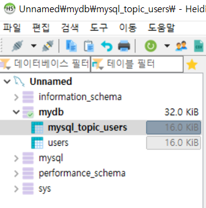

# Kafka Connect

### Kafka Connect 설치

- Maria를 사용한다면 [MariaDB Java Client](https://mvnrepository.com/artifact/org.mariadb.jdbc/mariadb-java-client) 에서 원하는 버전을 설치

- MySQL을 사용한다면 [MySQL Java](https://mvnrepository.com/artifact/mysql/mysql-connector-java)에서 MySQL 버전과 같은 버전을 설치

다운 받은 `.jar` 파일을 `./share/java/kafka/` 폴더에 넣어주세요

터미널을 Kafka 설치한 폴더에 접속

```cmd
> curl -O http://packages.confluent.io/archive/6.1/confluent-community-6.1.0.tar.gz
> tar xvf confluent-community-6.1.0.tar.gz
> cd confluent-6.1.0
```


### Kafka Connect 실행

```cmd
> .\bin\windows\connect-distributed.bat .\etc\kafka\connect-distributed.properties
Classpath is empty. Please build the project first e.g. by running 'gradlew jarAll'
```


위에 처럼 **empty 오류**가 난다면 `code .\bin\windows\kafka-run-class.bat` 에 접속

 `rem Classpath addition for core` 코드 위에 밑의 코드를 추가

```bat
rem classpath addition for LSB style path
if exist %BASE_DIR%\share\java\kafka\* (
	call:concat %BASE_DIR%\share\java\kafka\*
)
```


다시 실행

```cmd
> .\bin\windows\connect-distributed.bat .\etc\kafka\connect-distributed.properties
java.io.FileNotFoundException: ../tools-log4j.properties (지정된 경 로를 찾을 수 없습니다)
```

위의 에러가 뜨면 경로를 복사하고 `code <경로>/tools-log4j.properties`를 실행

코드를 추가 후 다시 실행

```properties
log4j.rootLogger=ERROR
```


새로운 터미널을 열고 명령어 실행 후 아래와 같은 리스트가 뜨면 정상입니다.

```cmd
> .\bin\windows\kafka-topics.bat --list --bootstrap-server localhost:9092
__consumer_offsets
connect-configs
connect-offsets
connect-status
```


### JDBC Connector 설정

[JDBC Connector Download](https://www.confluent.io/hub/confluentinc/kafka-connect-jdbc?_ga=2.152532284.441411510.1617326272-1335399789.1617326272&_gac=1.122956153.1617326284.CjwKCAjw3pWDBhB3EiwAV1c5rH5Je7GaFogElbEloT4j0wkWI69Ow301aEKx8mSThY3MVFkEbLJwWhoC4_cQAvD_BwE)에서 Download installation 부분의 버틀을 클릭합니다.

압축폴더를 원하는 위치에 해제하고 폴더 하위 lib폴더의 경로를 복사합니다.

아래의 파일을 열기

```cmd
> code .\etc\kafka\connect-distributed.properties
```


파일 마지막에 아래 plugin 정보 추가

- windows라면 `\\` 역슬래시를 두개 넣어줘야 적용이 됩니다.

```properties
plugin.path=\C:\\..\\Kafka\\confluentinc-kafka-connect-jdbc-10.1.0\\lib
```


설정을 적용하기위해 `kafka connect`를 작동중이던 터미널에서 접속헤재 후 다시 접속하겠습니다.

```cmd
> .\bin\windows\connect-distributed.bat .\etc\kafka\connect-distributed.properties
```


### Kafka Source Connect 테스트

#### 1. DB TABLE 생성

DB Client -- 저는 HeidiSQL을 사용하여 접속 후 쿼리문을 작성하겠습니다.

```mariadb
CREATE DATABASE <DATABASE_NAME>;
USE mydb;
CREATE TABLE users(
	id int auto_increment primary KEY,
	user_id varchar(20) not null,
	pwd varchar(20) not null,
	created_at DATETIME DEFAULT NOW()
);
```


#### 2. Kafka Source Connect 추가 (MariaDB)

**Postman**

- POST -- `http://http://localhost:8083/connectors`
- Header -- `key : Content-Type`, `value : application/json`
- raw

```cmd
{
	"name" : "my-source-connect",
	"config" : {
		"connector.class" : "io.confluent.connect.jdbc.JdbcSourceConnector",
		"connection.url":"jdbc:mysql://localhost:3306/mydb",
		"connection.user":"root",
		"connection.password":"mysql",
		"mode": "incrementing",
		"incrementing.column.name" : "id",
		"table.whitelist":"users",
		"topic.prefix" : "my_topic_",
		"tasks.max" : "1"
	}
}
```


- GET-- `http://http://localhost:8083/connectors` 를 하고 값이 뜬다면 성공

```cmd
[
    "my-source-connect"
]
```


**Terminal**

```cmd
echo '
{
    "name" : "my-source-connect",
    "config" : {
        "connector.class" : "io.confluent.connect.jdbc.JdbcSourceConnector",
        "connection.url":"jdbc:mysql://localhost:3306/<DATABASE_NAME>",
        "connection.user":"root",
        "connection.password":"<DB_PASSWORD>",
        "mode": "incrementing",
        "incrementing.column.name" : "id",
        "table.whitelist":"users",
        "topic.prefix" : "my_topic_",
        "tasks.max" : "1"
	}
}
' | curl -X POST -d @- http://localhost:8083/connectors --header "content-Type:application/json"
```

```cmd
> curl http://localhost:8083/connectors | jq

[
    "my-source-connect"
]
```


####  MariaDB에서 데이터 추가

```mariadb
INSERT INTO users (user_id, pwd) VALUES('IU', 'test12');
```


- Topic이 생성되었는지 확인 후 Consumer 확인

```cmd
> .\bin\windows\kafka-topics.bat --list --bootstrap-server localhost:9092
__consumer_offsets
connect-configs
connect-offsets
connect-status
my_topic_users		# 생성이 되면 성공
```

```cmd
> bin\windows\kafka-console-consumer.bat --topic my_topic_users --from-beginning --bootstrap-server localhost:9092
{"schema":{"type":"struct","fields":[{"type":"int32","optional":false,"field":"id"},{"type":"string","optional":false,"field":"user_id"},{"type":"string","optional":false,"field":"pwd"},{"type":"int64","optional":true,"name":"org.apache.kafka.connect.data.Timestamp","version":1,"field":"created_at"}],"optional":false,"name":"users"},"payload":{"id":15,"user_id":"IU","pwd":"test12","created_at":1617341074000}}
```


### Kafka Sink Connect 테스트

- POST -- `http://http://localhost:8083/connectors`
- Header -- `key : Content-Type`, `value : application/json`
- raw

```cmd
{
	"name":"my-sink-connect",
	"config":{
		"connector.class":"io.confluent.connect.jdbc.JdbcSinkConnector",
		"connection.url":"jdbc:mysql://localhost:3306/<DATABASE_NAME>",
		"connection.user":"root",
		"auto.create":"true",
		"connection.password":"<DB_PASSWORD>",
		"auto.evolve":"true",
		"delete.enabled":"false",
		"tasks.max":"1",
		"topics":"my_topic_users"
	}
}
```


- GET -- `http://localhost:8083/connectors`

```cmd
[
    "my-sink-connect",
    "my-source-connect"
]
```


- HeidiSQL에서 `my_topic_users`가 생성된다면 성공!




- Consumer에 출력되는 양식은 아래와 같습니다. 만약 Python을 통해 Data를 추가를 할 때 밑의 양식을 따라야 적용이 됩니다.

```json
{
    "schema":{
        "type":"struct",
        "fields":[
            {"type":"int32","optional":false,"field":"id"},{"type":"string","optional":false,"field":"user_id"},{"type":"string","optional":false,"field":"pwd"},{"type":"int64","optional":true,"name":"org.apache.kafka.connect.data.Timestamp","version":1,"field":"created_at"}
        ],
        "optional":false,
        "name":"users"
    },
    "payload":{
        "id":18,
        "user_id":"user_5",
        "pwd":"test46",
        "created_at":1617350192000}}
```

저희가 바꿀껀 `playload`부분을 바꾸면 되겠죠