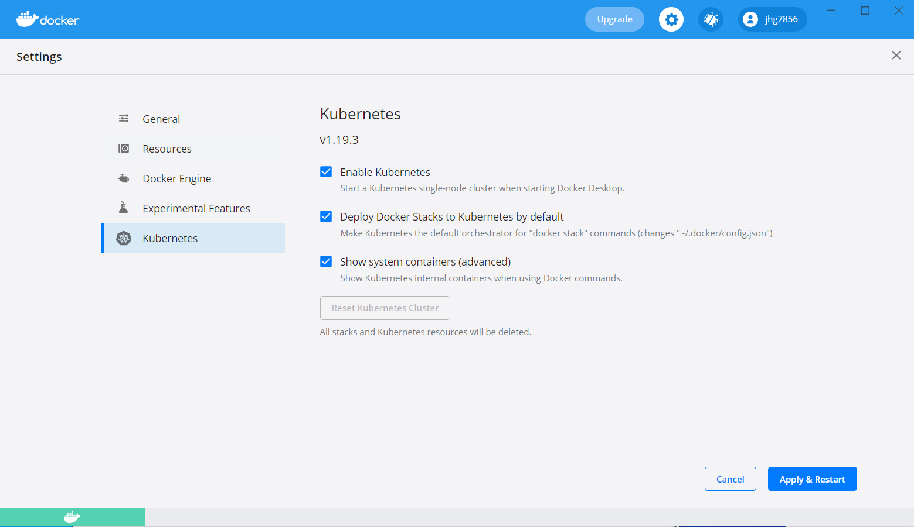
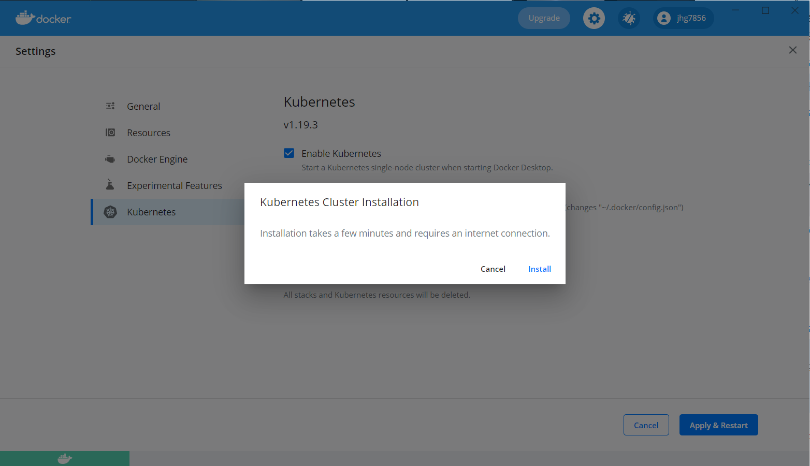
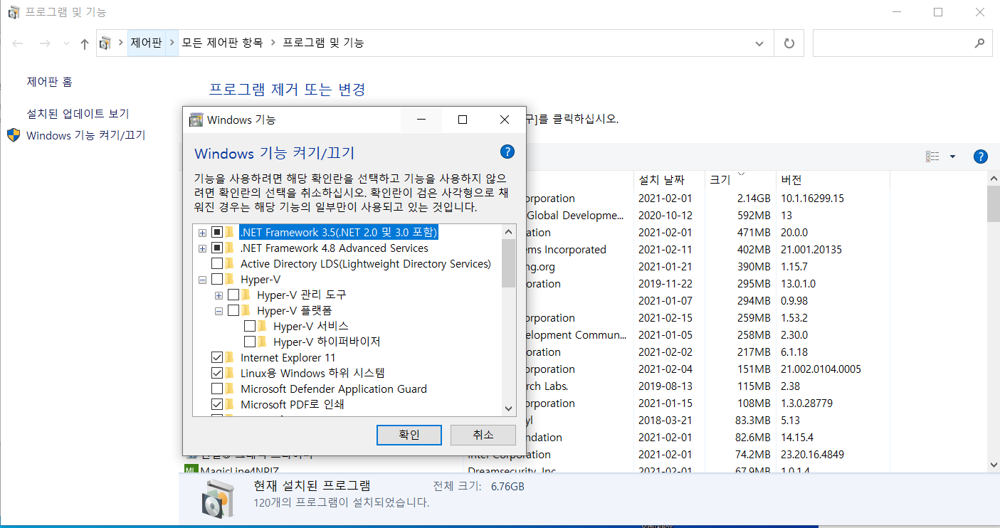
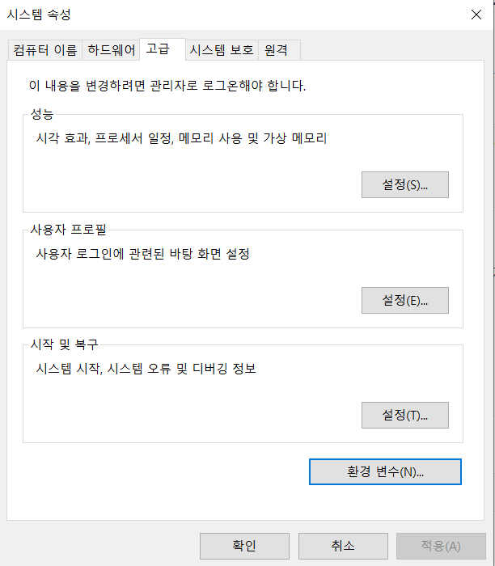
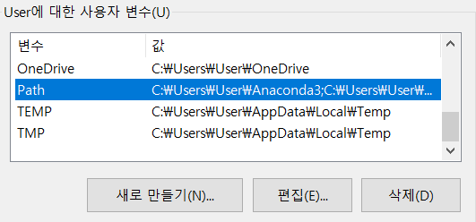
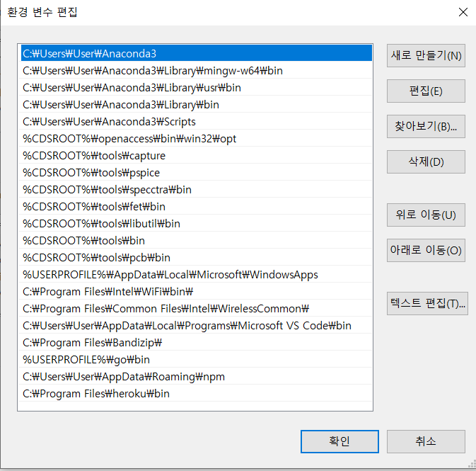

# Docker에서 Kubernetes 설치

- pply & Restart 클릭




- `install` 클릭




#### 만약 설치오류가 떠서 되지 않는다면 minikube를 설치해보자! 

> 위의 설치가 된다면 하지않아도 된다.

- 제어판 -> 프로그램 및 기능 -> Windows 기능 켜기/끄기 -> Hyper-V를 체크! (Windows 10 Pro 화면입니다.)




- 원하는 장소에 minikube라는 이름의 폴더를 생성후, 다음 명령으로 최신 릴리스를 다운로드한 파일을  minikube 폴더에 옮긴다.

```
curl -LO "https://storage.googleapis.com/kubernetes-release/release/$(curl -s https://storage.googleapis.com/kubernetes-release/release/stable.txt)/bin/linux/amd64/kubectl"
```


-  [minikube-windows-amd64.exe](https://github.com/kubernetes/minikube/releases/download/v1.17.1/minikube-windows-amd64.exe) 를 다운로드 해서 minikube 폴더에 저장후 경로를 복사

-  시작에서 검색하여 `시스템 환경 변수 편집`을 클릭



`환경 변수`를 클릭




Path에서 편집 클릭




새로 만들기를클릭하여 복사했던 경로를 추가한다.


- 다음 명령 프롬프트 창을 열어서

  - `$  minikube version`을 해서 확인
  - `$ minikube start`


# Virtual Box에서 Kubernetes 사용

> Vagrant를 사용하지 않고, 직접 VM을 구성하셔도 됩니다. (VirrualBox or VMWare)
> Windows 10의 Docker Desktop은 Cluster 구성이 되지 않기 때문에, VM사용을 권장합니다.


## 0. VirutalBox를 사용하기 위해 HyperV off

- 관리자 모드로 cmd(terminal) 실행

```
C:> bcdedit # 명령어로 현재 활성화되어 있는 기능 확인 
      -> hypervisorlaunchtype Auto # off로 변경해야 VirualBox, VMware 설치 가능
C:> bcdedit /set hypervisorlaunchtype off
```


## 1. Virtual Box 설치

- https://www.virtualbox.org/


## 2. Vagrant 설치

- https://www.vagrantup.com/


## 3. 작업 폴더 생성

```
ex) C:\Work\vagrant
```


- Vagrant VM 초기화

```
C:\Work\vagrant>vagrant init
```


- Vagrant VM 실행
  - vagrant 폴더의 Vaganrtfile을 C:\Work\vagrant 폴더로 복사

```
C:\Work\vagrant>vagrant up
```


- Vagrant VM 확인

```
C:\Work\vagrant>vagrant status

# Vagrantfile 작성에따라 다르다.
node-1                    running (virtualbox)
node-2                    running (virtualbox)
master                    running (virtualbox)
```


- Vagrant VM 실행

```
C:\Work\vagrant>vagrant ssh [Vagrant VM 이름] 
        ex) vagrant ssh jenkins-server
```


## 4. 사전 준비 - Master, Node 모두

- Root 계정 변경 (Password: vagrant)

```
su - 
```


- SELinux 설정

```
setenforce 0
sestatus
sed -i 's/^SELINUX=enforcing$/SELINUX=permissive/' /etc/selinux/config
```


- 방화벽 해제

```
systemctl stop firewalld && systemctl disable firewalld
systemctl stop NetworkManager && systemctl disable NetworkManager
```


- SWAP 비활성화

```
swapoff -a && sed -i '/ swap / s/^/#/' /etc/fstab
```


- Iptables 커널 옵션 활성화

```
cat <<EOF >  /etc/sysctl.d/k8s.conf
net.bridge.bridge-nf-call-ip6tables = 1
net.bridge.bridge-nf-call-iptables = 1
EOF
sysctl --system
```


- 쿠버네티스를 위한 yum repository 설정

```
cat <<EOF > /etc/yum.repos.d/kubernetes.repo
[kubernetes]
name=Kubernetes
baseurl=https://packages.cloud.google.com/yum/repos/kubernetes-el7-x86_64
enabled=1
gpgcheck=1
repo_gpgcheck=1
gpgkey=https://packages.cloud.google.com/yum/doc/yum-key.gpg https://packages.cloud.google.com/yum/doc/rpm-package-key.gpg
EOF
```


- Centos Update

```
yum update
```


- Hosts 파일 수정

```
vi /etc/hosts
192.168.56.10 master
192.168.56.11 node1
192.168.56.12 node2

ping master
```


## 5. Vagrant에서 Kubernetes 설치 - Master, Node 모두

```
yum install -y yum-utils device-mapper-persistent-data lvm2 
yum-config-manager --add-repo https://download.docker.com/linux/centos/docker-ce.repo
yum update && yum install docker-ce
useradd dockeradmin
```

```
passwd dockeradmin <-- password: dockeradmin
usermod -aG docker dockeradmin
systemctl enable --now docker && systemctl start docker
```


## 5-1. Docker compose 설치

  ```
curl -L "https://github.com/docker/compose/releases/download/1.24.1/docker-compose-$(uname -s)-$(uname -m)" -o /usr/local/bin/docker-compose
chmod +x /usr/local/bin/docker-compose
ln -s /usr/local/bin/docker-compose /usr/bin/docker-compose
docker-compose -version 
  ```


## 5-2. Docker 설치 확인

  ```
docker run hello-world
  ```


## 6. Kubernetes 설정 - Master

- 실행

```
systemctl enable --now kubelet
```


- 초기화

```
kubeadm init --pod-network-cidr=10.96.0.0/16 --apiserver-advertise-address=192.168.56.10
- 설치 성공 후 아래 커맨드 부분을 복사 (생성되는 값은 본인의 환경에 따라 다름)

kubeadm join 192.168.56.10:6443 --token x1qogf.3i1d8zc267sm4gq8 \
--discovery-token-ca-cert-hash sha256:1965b56832292d3de10fc95f92b8391334d9404c914d407baa2b6cec1dbe5322
```


- 환경 변수 설정

```
mkdir -p $HOME/.kube

sudo cp -i /etc/kubernetes/admin.conf $HOME/.kube/config

sudo chown $(id -u):$(id -g) $HOME/.kube/config

kubectl get pods --all-namespaces # 모든 pods가 Running 상태인지 확인 
```


- Calico 기본 설치 (Kubernetes Cluster Networking plugin)

```
kubectl apply -f https://docs.projectcalico.org/v3.8/manifests/calico.yaml
kubectl get pods --all-namespaces
```


- Calico는 기본적으로 192.68.0.0/16 대역 사용하기 때문에, IP가 중복 될 경우에는 위의 방법 말고(kubectl apply) calico.yaml 파일을 다운로드 후 코드 수정, Calico 설치

```
curl -O https://docs.projectcalico.org/v3.8/manifests/calico.yaml  
sed s/192.168.0.0\\/16/10.96.0.0\\/12/g -i calico.yaml
kubectl apply -f calico.yaml
```


## 8. Kubernetes 노드 연결 - Node

- 연결 (Master의 init 작업에서 복사 한 커맨드를 사용)

```
kubeadm join 192.168.56.10:6443 --token x1qogf.3i1d8zc267sm4gq8 \
--discovery-token-ca-cert-hash sha256:1965b56832292d3de10fc95f92b8391334d9404c914d407baa2b6cec1dbe5322  
```


- 연결 시 오류 발생하면 kubeadm reset 명령어로 초기화 후 다시 실행 (Node 모두 초기화)

```
kubeadm reset
```


- 확인 (Master에서)

```
kubectl get nodes
```


## 10. 테스트

- Pod 실행

```
kubectl run nginx-test --image=nginx --port 80 --generator=run-pod/v1
```


- Service 실행

```
kubectl expose pod nginx-test 
kubectl get services
```


- Service Type 변경

```
kubectl edit service nginx-test # (ClusterIp -> NodePort)
```


- 확인 (port는 service에서 forwarding 된 port 사용)

```
http://192.168.56.10:30039/ # (<- port forwarding)
http://192.168.56.11:30039/ # (<- port forwarding)
```