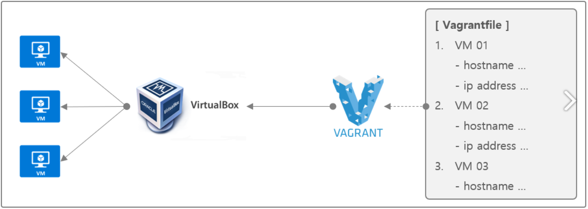

# Vagrant란?

가상화(Virtualization)는 실제 운영체제 위에 가상화 소프트웨어를 설치한 후에 소프트웨어를 통해 하드웨어(CPU, Memory, Disk, NIC 등)를 에뮬레이션한 후에 이 위에 운영체제(Guest OS)를 설치하는 것을 의미합니다. 가상화를 해 주는 소프트웨어를 하이퍼바이저(Hypervisor) 라고 하며 종류로는  VirtualBox, 그리고 VMWare, Xen 등이 있습니다.

가상화는 다양한 운영체제와 애플리케이션을 논리적으로 분리할 수 있으므로 여러 운영제체와 애플리케이션을 구동하는 개발 환경등 복잡한 환경을 추상화할 수 있는 좋은 방법이지만 가상 머신을 통해 개발환경을 구성하려면 부딪히는 중요한 문제가 있습니다. 가상 머신을 설치하고 관리해야 하는 부담이 더 늘었습니다.

Vagrant 는 이런 문제를 해결하기 위한 솔루션으로 설정 스크립트를 기반으로 특정 환경의 가상 머신을 만들어서 신속하게 개발 환경을 구축하고 공유할 수 있게 만들어진 솔루션입니다.




# Vagrant 명령어

> [option]은 넣지않는다면 전체적용이고 넣으면 특정 노드에대한 실행이다.

### Creating a VM

- `$ vagrant init` -- 지정된 기본 이미지를 사용하지 않고 Vagrantfile 및 ./.vagrant 디렉토리로 Vagrant를 초기화합니다. `vagrant up`을 수행하기 전에 Vagrantfile에 기본 이미지를 지정해야합니다.
- `$ vagrant init <boxpath>` -- specific box를 찾고싶을때 [public Vagrant box catalog](https://app.vagrantup.com/boxes/search)에 가서 찾으시면 됩니다. For example, `vagrant init ubuntu/trusty64`.


### Starting a VM

- `$ vagrant up` -- Vagrantfile이 있는 폴더로 이동을 하고 `up`명령어를 하면 Vagrantfile에 있는 코드대로 설치를 하거나 이미 가상화가 설치되어 있다면 start 명령이기도 하다.
- `$ vagrant resume` -- 일시 중단 된 컴퓨터를 다시 시작합니다 (`vagrant up`도 잘 작동합니다)
- `$ vagrant provision` -- forces reprovisioning of the vagrant machine
- `$ vagrant reload` -- `vagrant halt`를 하고 다시 `up`을 할 필요없이 `reload`로 한번에 가능하다.
- `$ vagrant reload --provision` -- 가상 머신을 다시 시작하고 강제 프로비저닝


### Getting into a VM

- `$ vagrant ssh` -- SSH를 통해 머신에 연결
- `$ vagrant ssh <boxname>` -- Vagrantfile에서 상자에 이름을 지정하면 boxname으로 ssh 할 수 있습니다. 모든 디렉토리에서 작동합니다.


### Stopping a VM

- `$ vagrant halt` -- node running에서 poweroff를 한다.
- `$ vagrant suspend` -- 가상 머신 일시 중지 (상태 기억)


### Cleaning Up a VM

- `$ vagrant destroy` -- 모든 흔적을 중지하고 삭제합니다.
- `$ vagrant destroy -f` -- 위와 같은 기능의 강제 실행


### Boxes

- `$ vagrant box list` -- 설치된 box list 검색
- `$ vagrant box add [name] [url]` -- download a box image 
- `$ vagrant box outdated` -- 업데이트 확인
- `$ vagrant boxes remove [name]` -- 삭제
- `$ vagrant package` -- 재사용 가능한 box에 실행중인 virtual box 환경을 패키징합니다.


### Saving Progress

- `$ vagrant snapshot save [options] [vm-name] <name>` -- vm-name은 종종`default`입니다. 나중에 롤백 할 수 있도록 저장할 수 있습니다.


### Tips

- `$ vagrant -v` -- vagrant version

- `$ vagrant status` -- vagrant machine 상태확인

  - ```
    node-1                    running (virtualbox)
    node-2                    running (virtualbox)
    master                    running (virtualbox)
    ```

- `$ vagrant global-status` -- 모든 vagrant machines 상태확인

- `$ vagrant global-status --prune` -- 위와 동일하지만 유효하지 않은 항목을 정리합니다

- `$ vagrant provision --debug` -- 디버그 플래그를 사용하여 출력의 상세도를 높입니다.

- `$ vagrant push` -- [코드](http://docs.vagrantup.com/v2/push/index.html)를 배포하도록 vagrant를 구성 할 수 있습니다.

- `$ vagrant up --provision | tee provision.log` -- `vagrant up`을 실행하고 프로비저닝을 강제 실행하고 모든 출력을 파일에 기록합니다.


### Plugins

- [vagrant-hostsupdater](https://github.com/cogitatio/vagrant-hostsupdater) : `$ vagrant plugin install vagrant-hostsupdater`는 vagrant box를 시작 / 중지 할 때마다`/ etc / hosts` 파일을 자동으로 업데이트합니다.