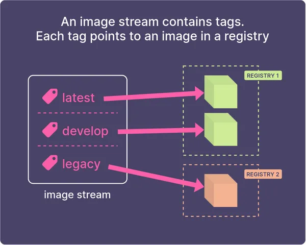

# Image Streams in OpenShift

OpenShift를 사용하다보면 이미지 스트림 이라고 봤을 수 있습니다. 이미지 스트림 이 "클러스터에서 이미지를 사용할 수 있게 하는 것입니까?"
라고 물어본다면 "예" 라고 하지만 정확이 무엇인지, 어떻게 사용하는지, 그리고 정말 알아야 할 것이 무엇인지 이번 문서에서 이미지 스트림을 이해하는
방법과 사용하는 방법을 알려드리겠습니다.

<br>

### 용어 문제

일단 "stream" 이라는 이름은 설명하는데 있어 혼란을 야기합니다. **여기에는 스트리밍이 포함되지 않습니다.** 

이미지 스트림은 **도커 이미지를 가리키는 참조(태그)의 집합일 뿐입니다.** 

만약 이미지 스트림의 이름을 바꿀 수 있다면 `image references`가 더 알맞을 것 같습니다.


<br>
<br>

## What does an image stream do?

**이미지 스트림은 이미지 세트에 대한 포인터 역할을 합니다.** 그 말은 지름길이나 참조와 같습니다.



이미지 스트림에는 도커 이미지 자체가 포함되어 있지 않습니다. 이미지에 대한 푯말로, OpenShift 내부 레지스트리 또는 외부 레지스트리에 있을 수 있습니다.

OpenShift에서 build 및 deploy 할때 이미지 스트림을 정기적으로 사용합니다.

<br>
<br>

## Why would you use them?

### 관련 이미지 세트를 참조할 수 있는 단일 위치

이미지 스트림은 관련 이미지 세트에 대한 단일 포인터입니다.

하나의 이미지 스트림은 레지스트리의 이미지를 가리키는 여러 태그(`latest`, `develop`, `1.0`, etc)를 포함할 수 있습니다.

프로젝트에 응용 프로그램을 배포할 때마다 레지스트리 URL 및 Tag를 하드 코딩할 필요 없이 이미지 스트림 태그를 참조할 수 있습니다.

나중에 소스 이미지의 위치가 변경되면 모든 배포를 개별적으로 업데하는 대신 이미지 스트림 정의만 업데이트하면 됩니다.

<br>

### 이미지가 변경되면 새 빌드 또는 배포를 트리거합니다.

이미지 스트림을 트리거로 사용할 수도 있습니다. 즉, 이미지 스트림을 빌드 또는 배포의 소스로 설정할 수 있다는 얘기입니다.
이미지가 변경되면 **새 빌드가 트리거되거나 앱의 redeployment**가 트리거될 수 있습니다.

<br>

### 이미지 액세스 제어

개인 레지스트리에 이미지를 잠그고 이미지 스트림을 통해 이미지에 대한 액세스를 제어할 수 있습니다.

이미지 스트림은 OpenShift의 다른 개체와 같기 때문에 원하는 경우 제한할 수 있습니다. 따라서 이미지를 특정 서비스 계정에서만 사용하도록 제한할 수 있습니다.

<br>
<br>

## How do you create an image stream?

`oc import-image` 명령을 사용하여 이미지 스트림을 만듭니다. 이미지 스트림에 이름을 지정한 다음 가져올 이미지를 지정합니다.

```
$ oc import-image approved-apache:2.4 \
    --from=bitnami/apache:2.4 \
    --confirm
```

그러면 프로젝트에 승인된 아파치라는 이미지 스트림이 생성됩니다. 이미지 `bitnami/apache`의 태그 `2.4`를 가리키는 이미지 `approved-apache`의 태그 `2.4`가 하나 있습니다.

##### 혹시, 레지스트리를 지정하지 않으셨나요?

맞습니다. **Docker Hub는 OpenShift의 기본 검색 레지스트리 중 하나로 구성되어 있기 때문에 여기에 레지스트리를 지정하지 않습니다.**
그래서 Red Hat 레지스트리와 Docker Hub에서 이미지를 검색할 것입니다. 그런 다음 이미지가 OpenShift의 내부 레지스트리로 이동됩니다.

만약 클러스터 관리자인 경우 `oc get images`를 입력하여 OpenShift 레지스트리에서 이미지를 볼 수 있습니다.

```
$ oc get images | grep bitnami
sha256:172ce7c98a8992190...   bitnami/apache@sha256:172ce7c98a8992190...
```

<br>

### Declaring it with YAML

`oc`명령어를 사용하여 이미지 스트림을 만드는 방법을 배웠으면 개체를 **declaratively**하게 만드는 방법으로 진행할 수 있습니다. 이렇게 하는 것이 훨씬 더 좋은 방법입니다.
모든 구성을 명령 집합이 아닌 Git에 파일로 저장할 수 있기 때문입니다.

Declaratively하게 하려면 YAML에서 ImageStream 개체를 만듭니다. ImageStream의 YAML은 다음과 같습니다.

```yaml
apiVersion: image.openshift.io/v1
kind: ImageStream
metadata:
  name: approved-apache
spec:
  lookupPolicy:
    local: false
  tags:
  - name: "2.4"
    from:
      kind: DockerImage
      name: bitnami/apache:2.4
    referencePolicy:
      type: Source
```

그런 다음 `oc apply`를 사용하여 적용합니다.

<br>
<br>

## How do you use an image stream?

이미지 스트림을 사용하는 방식은 Builds and Deployments 용 소스입니다.

### Deploying an image stream

이미지 스트림을 생성했으면 `oc new-app --image-stream=<name>`을 실행하여 Deployment 및 Service를 쉽게 생성할 수 있습니다.

OpenShift는 노출할 포트를 확인하기 위해 이미지를 검사한 다음 앱에 대한 Deployment 와 Service를 만듭니다.

제가 만든 샘플 이미지를 가져오겠습니다.
```
$ oc import-image my-python \ 
    --from=quay.io/tdonohue/python-hello-world:latest \ 
    --confirm
```

이제 Deployment 및 Service를 생성하여 프로젝트에 배포합니다.

```
$ oc new-app --image-stream=my-python
```

<br>

### 빌드에서 이미지 스트림을 원본 이미지로 사용

이미지 스트림을 빌드의 소스로 사용할 수 있습니다. 

다음은 이미지 스트림을 소스로 사용하는 BuildConfig의 예입니다.

```yaml
apiVersion: build.openshift.io/v1
metadata:
  name: example-app
spec:
  source:
    type: Git
    git:
      uri: 'https://github.com/sclorg/nodejs-ex.git'
  strategy:
    type: Source
    sourceStrategy:
      from:
        kind: ImageStreamTag
        name: 'nodejs-8-centos7:latest'
  output:
    to:
      kind: ImageStreamTag
      name: 'example-app:latest'
  triggers:
    - type: ConfigChange
    - type: ImageChange
```

<br>
<br>

## 만약 이미지가 private registry에 있다면?

이미지가 개인 레지스트리에 있는 경우에도 이미지 스트림을 사용할 수 있습니다.
private registry에서 외부 private registry와 docker Hub private registry 2가지 경우가 있습니다.

### 첫번째, Docker Hub private registry 경우입니다.

레지스트리가 암호로 보호된 경우 OpenShift가 이미지를 가져올 수 있도록 외부 레지스트리에 대한 자격 증명으로 암호를 만드십시오.

프라이빗 레지스트리에 연결합니다.

```
$ oc create secret docker-registry my-mars-secret \
  --docker-server=registry.marsrover.space \
  --docker-username="login@example.com" \
  --docker-password=thepasswordishere
```

그런 다음 암호를 builder 및 default 서비스 계정에 연결합니다.

```
$ oc secrets link builder my-mars-secret
$ oc secrets link default my-mars-secret --for=pull
```

<br>

### 두번째, 외부 private registry 입니다.

이미지 레지스트리에서 이미지를 가져올 때 빌드에서 신뢰할 추가 CA(인증 기관)를 설정하려면 이 부분을 보시면 됩니다.

이 절차를 수행하려면 클러스터 관리자가 ConfigMap을 생성하고 ConfigMap에 추가 CA를 키로 추가해야 합니다.

자체 서명 인증서를 사용하는 레지스트리의 경우 신뢰할 수 있는 인증서가 있는 openshift-config 네임스페이스에 ConfigMap을 생성합니다. 
각 CA 파일에 대해 ConfigMap의 키가 hostname[..port] 형식의 레지스트리 호스트 이름인지 확인하십시오.

```
$ oc create configmap registry-cas -n openshift-config \
--from-file=myregistry.corp.com..8080=/root/ca.crt \
--from-file=otherregistry.com=/<파일 저장위치>/ca.crt
```

클러스터 이미지 구성을 업데이트합니다.

```
$ oc patch image.config.openshift.io/cluster --patch '{"spec":{"additionalTrustedCA":{"name":"registry-cas"}}}' --type=merge
```

<br>

이제 `oc import-image` 명령을 사용하여 이미지를 가져올 수 있습니다.

```
$ oc import-image marsview \ 
    --from=registry.marsrover.space/engine/marsview \
    --confirm
```

인증을 사용하여 개인 레지스트리에서 이미지를 가져오기 위해 이미지 스트림을 만들었습니다.

<br>
<br>

## 소스 이미지가 변경될 때 트리거하는 방법은 무엇입니까?

이미지 스트림이 OpenShift의 내부 레지스트리에 있는 이미지를 가리키는 경우(OpenShift 내부에 빌드한 이미지와 같은 경우) 
이미지가 변경될 때 OpenShift가 자동으로 알림을 받습니다.

그러나 OpenShift에서 외부 이미지의 변경 내용을 계속 확인하도록 하려면 `oc import-image`를 사용할 때 `--scheduled` 태그를 사용해야 합니다.

```
$ oc import-image marsview \ 
    --from=registry.marsrover.space/engine/marsview \
    --scheduled --confirm
```

이 옵션을 사용하면 `oc import-image`의 출력에 이 정보가 표시됩니다. "**updates automatically**"라고 표시되는 방식에 유의하십시오.

```
Name:			marsview
Namespace:		toms-project
Created:		12 minutes ago
Labels:			<none>
Annotations:		openshift.io/image.dockerRepositoryCheck=2021-01-13T18:54:19Z
Image Repository:	image-registry.openshift-image-registry.svc:5000/toms-project/marsview
Image Lookup:		local=false
Unique Images:		1
Tags:			1

latest
  updates automatically from registry registry.marsrover.space/engine/marsview:latest

  * registry.marsrover.space/engine/marsview@sha256:a7ca9b84c7a642ac14294679ba6fb9c80918ea210f3c63154d23231912d41394
      About a minute ago
```

<br>

### When does the image update?

OpenShift는 일반적으로 약 15분마다 이미지를 계속 확인합니다(변경 방법은 아래 참조).

새 이미지를 push 하면 `oc describe is/marsview`를 실행할때 다음과 같은 내용이 표시됩니다.

```
latest
  updates automatically from registry registry.marsrover.space/engine/marsview:latest

  * registry.marsrover.space/engine/marsview@sha256:77dc2d9740a2450dec03cef69d4c42ad3ca900b6b0d93dcbf0c7f46b598f8d9c
      About a minute ago
    registry.marsrover.space/engine/marsview@sha256:a7ca9b84c7a642ac14294679ba6fb9c80918ea210f3c63154d23231912d41394
      19 minutes ago
```

이미지가 몇분전에 새롭게 업데이트가 된것을 확인할 수 있습니다.

그런 다음 DeploymentConfig가 "ImageChange" 트리거로 구성되어 있으면 자동으로 재배치가 트리거됩니다.

트리거가 있는 이 앱의 DeploymentConfig는 다음과 같습니다.

```yaml
kind: DeploymentConfig
apiVersion: apps.openshift.io/v1
metadata:
  name: marsview
spec:
  selector:
    deploymentconfig: marsview
  replicas: 1
  template:
    metadata:
      labels:
        deploymentconfig: marsview
    spec:
      containers:
        - name: main
          image: marsview    # OpenShift will replace this with the 'real' image URL
          ports:
            - containerPort: 8080
              protocol: TCP
          imagePullPolicy: Always
      restartPolicy: Always
  triggers:
    - type: ConfigChange
    - type: ImageChange
      imageChangeParams:
        automatic: true       # Set automatic=true to trigger a redeployment on image change
        containerNames:
          - marsview
        from:
          kind: ImageStreamTag
          namespace: toms-project
          name: 'marsview:latest'
```

이를 통해 기본적인 연속 배포를 구현할 수 있습니다. 새 이미지가 최신 태그로 푸시되는 순간 OpenShift가 자동으로 앱 업데이트를 트리거합니다.

<br>
<br>

## 이미지 스트림에 태그 추가

이미지 스트림에 태그를 추가하려면 `oc tag`를 사용할 수 있습니다.

새 태그는 동일한 레지스트리에 있을 필요가 없습니다. 완전히 다른 곳에 있을 수 있습니다. 여기서 다른 레지스트리(registry.spacedev.com)를 가리키는 개발 태그를 이미지 스트림에 추가합니다.

```
$ oc tag registry.spacedev.com/engine/marsview:develop \
    marsview:develop \
    --scheduled
```

**주기적으로 `registry.marsrover.space/engine/marsview:develop`을 가져오기 위해 `marsview:develope` 태그를 설정합니다.**

이제 개발 레지스트리에서 `develop`태그를 참조할 수 있습니다.

<br>
<br>

### 요약

|  TERM   | WHAT IT IS    |
|:---:|-----|
|  Image stream   | 포인터(태그) 집합입니다. 각 태그는 Docker 이미지를 가리킵니다.    |
|  Image stream tag   | 태그	이미지 스트림 내의 태그입니다. 태그는 내부 레지스트리 또는 외부 레지스트리의 레지스트리에 있는 개별 Docker 이미지를 가리킵니다.    |
|  Image stream image   | 이미지 스트림 내에서 특정 이미지 ID에 대한 포인터입니다. 기본적으로 실제 이미지 자체의 모든 세부 정보(메타데이터)를 얻을 수 있습니다.    |
