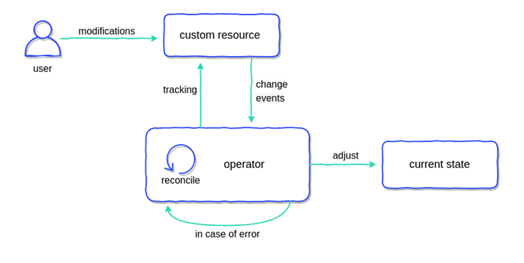
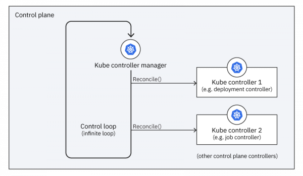

# WHAT IS OPERATOR SDK?
> Operator SDK 는 Operator 를 build, test 및 packaging 하기 위한 오픈 소스 도구 모음입니다.

Kubernetes Operator는 사용자 지정 Kubernetes 리소스를 모니터링하고 변경 시 일부 작업을 수행하는 응용 프로그램입니다.

Operator 는 단순히 응용 프로그램이기 때문에 기술적으로 원하는 프로그래밍 언어로 작성할 수 있으며 원하는 위치에 배포할 수 있습니다. 
그러나 실용적인 프로그래머가 되려면 좋은 Kubernetes 클라이언트가 있는 언어와 Kubernetes 클러스터에서 간단하게 도킹하고 실행할 수 있는 언어를 선택해야 합니다.

Operator SDK는 응용 프로그램별 많은 운영 지식이 필요할 수 있는 **Kubernetes 네이티브 응용 프로그램을 구축하는 과정을 단순화**합니다.
Operator SDK는 이러한 장벽을 낮출 뿐만 아니라 계량 또는 모니터링과 같은 많은 일반적인 **관리 기능에 필요한 상용 코드의 양을 줄이는 데도 도움**이 됩니다.

Operator SDK는 `controller-runtime` 라이브러리를 사용하여 다음을 제공하여 연산자를 더 쉽게 작성하는 프레임워크입니다.

- 운영 로직을 보다 직관적으로 작성하기 위한 High-level APIs 및 추상화
- 새로운 프로젝트를 신속하게 부트스트랩하기 위한 비계 및 코드 생성 도구
- OLM(Operator Lifecycle Manager)과의 통합을 통해 클러스터에서 Operator 패키징, 설치 및 실행을 간소화
- Prometeus Operator가 배포된 클러스터에서 사용할 수 있도록 생성된 Go-based Operator 에서 자동으로 설정되는 metrics

Kubernetes 기반 클러스터(예: OpenShift Container Platform)에 대한 클러스터 관리자 권한을 가진 Operator 작성자는 **Operator SDK CLI를 사용하여
Go, Ansible 또는 Helm 기반의 자체 Operator를 개발할 수 있습니다.**

---

 
 

## Workflow

- SDK 명령줄 인터페이스(CLI)를 사용하여 새 운영자 프로젝트 생성
- CRD(Custom Resource Definitions)를 추가하여 새 리소스 API 정의
- Operator SDK API를 사용하여 감시할 리소스를 지정
- SDK 및 컨트롤러 런타임 API를 사용하여 컨트롤러에 대한 조정 로직 작성
- Operator SDK CLI를 사용하여 Operator deployment manifests 를 generate 하고 build

 

- **Kubernetes**

 

- **Operator**

사용자가 Custom Resource 의 항목을 수정하면 Operator application 이 변경 사항을 인식하고 변경 사항에 따라 몇 가지 작업을 수행합니다. 
이러한 작업은 일반적으로 Kubernetes API에 대한 일종의 호출이지만 기술적으로는 무엇이든 될 수 있습니다.

---

 
 

## Operator components

Operator 는 Kubernetes 관리자를 대신하여 워크로드를 관리하기 위해 특수 기능을 사용하여 Kubernetes 제어부를 확장합니다.

### CR(Custom Resource)

- CRD에 의해 생성된 Kubernetes API 확장입니다. CR 인스턴스는 워크로드의 구성을 설명하기 위해 **CRD에 의해 정의된 설정에 대한 특정 값을 설정**합니다.

- 객체 정의는 완전히 새로운 객체가 아닌 **이미 존재하는 Deployments, Services와 같은 기본 객체를 목적에 맞게 조합하고 
추상화해서 새로운 이름으로 명시할 수 있다는 의미**입니다.

 

### CRD(Custom Resource Definition)

Custom Resource **`Definition`** 이라는 이름에서 알 수 있듯이 커스텀 리소스가 **어떤 데이터로 구성되어 있는지를 정의하는 객체일 뿐 CRD 만으로는 
실제 Custom Resource를 생성하지는 않으며**, 단지 커스텀 리소스의 데이터에 어떤 항목이 정의되어야 하는지 등을 저장하는 **선언적 메타데이터 객체**일 뿐입니다.

- 워크로드를 구성하는 데 사용할 수 있는 설정 스키마를 정의합니다.

- `kubectl` 을 통해서 사용 가능합니다.

- Operator로 사용할 상태 관리용 객체들의 Spec을 정의합니다. (Schema 관점)

 

### Controller

[컨트롤러](https://kubernetes.io/docs/concepts/architecture/controller/) 는 Kubernetes의 핵심 구성 요소이며 Operator의 두뇌입니다. 
워크로드에 맞게 사용자 맞춤이되며, CR의 값으로 표시되는 원하는 상태와 일치하도록 워크로드의 현재 상태를 구성합니다.

모든 컨트롤러에는 reconcile loop 를 구현하는 Reconciler 개체의 `Reconcile()` 메서드가 있습니다.
`Reconcile` 은 시스템의 실제 상태에 원하는 CR 상태를 적용하는 역할을 합니다. 감시된 CR 또는 리소스에서 이벤트가 발생할 때마다 실행되며 해당 상태가 일치하는지 여부에 따라 일부 값을 반환합니다.

**Controller는 객체의(`.spec (Wanted)`) 정보를 읽고 객체의 상태 (current state)와 비교해서 처리한 후에 `.status (to ETCD)`를 갱신하는 컨트롤 루프입니다.**

---

 
 

## What do operators do?

**Kubernetes 에서** `control plane` 의 컨트롤러는 **클러스터의 원하는 상태를 현재 상태와 반복적으로 비교하는 control loop 에서 실행**됩니다.
상태가 일치하지 않으면 컨트롤러가 원하는 상태와 더 가깝게 일치하도록 현재 상태를 조정하는 작업을 수행합니다.

마찬가지로, **위에서 설명했던 Operator 의 컨트롤러**는 특정 CR 유형을 감시하고 애플리케이션별 작업을 수행하여 워크로드의 현재 상태를 CR에 표시된 대로 원하는 상태와 일치시킵니다.

 

### The reconciliation loop in the control plane

일반적인 Kubernetes 클러스터에서 컨트롤러 관리자는 **control loop** 의 **reconciliation loop** 에서 컨트롤러를 실행합니다. 각 컨트롤러는 
클러스터 동작의 특정 부분을 관리합니다. 컨트롤러 관리자는 `Reconcile()` 메서드를 호출하여 각 컨트롤러를 실행할 수 있는 **control loop** 를 실행합니다.

 

### The reconciliation loop in the worker nodes

Kubernetes 컨트롤러가 `control plane`에서 실행되는 반면, **Operator의 컨트롤러는 Worker 노드에서 실행됩니다.** 이는 Operator가 Kubernetes 클러스터에 
워크로드로 배포되기 때문입니다. 다른 워크로드와 마찬가지로 클러스터는 Worker 노드에서 Operator의 워크로드를 호스팅합니다.

각 Operator는 **컨트롤러 관리자의 컨트롤러 목록에 custom 컨트롤러를 추가하여** reconciliation loop**를 확장합니다**

컨트롤러 관리자는 조정 루프를 실행할 때 다음 두 가지 작업을 수행합니다.

- control plane의 각 컨트롤러에 `reconcile`을 지시합니다.
- 각 Operator의 custom 컨트롤러에 `reconcile`을 지시합니다.

 

### Reconcile states

Kubernetes의 컨트롤러와 Operator의 custom 컨트롤러가 조화를 이루는 방식은 밑의 그림과 유사합니다.

Operator 컨트롤러는 Kubernetes 컨트롤러보다 한 수준 높은 추상화를 수행합니다. Kubernetes 컨트롤러는 `Deployment` 및 `Job`과 같은
built-in `Kind`를 `Pod` 등의 lower-level로 reconcile 합니다.

Custom 컨트롤러는 `Memcached`와 `Ecd` 같은 CRD를 `Deployment`와 `Service`같은 `Kind`워크로드로 reconcile 합니다.
따라서 custom 컨트롤러의 현재 상태는 Kubernetes 컨트롤러가 원하는 상태가 됩니다.

위의 두 `Kind`의 컨트롤러 모두 원하는 상태와 현재 상태를 reconcile 하지만 Operator의 custom resource에 대한 워크로드를 배포하려면 두 번의 변환이 필요합니다.

- Operator의 컨트롤러는 custom resource를 Opreator의 현재 상태이자 **control plane**의 원하는 상태인 관리형 리소스 집합(워크로드)으로 변환합니다.
- Kubernetes 컨트롤러는 관리되는 리소스를 **control plane**의 현재 상태에서 실행 중인 Pod(aka 피연사자)로 변환합니다.

---

 
 

## Operator Tools Overview

Operator는 단순한 응용 프로그램이기 때문에 기술적으로 원하는 프로그래밍 언어로 작성할 수 있으며 원하는 곳에 배포할 수 있습니다.

다음 옵션 중에서 선택할 수 있습니다.

- **Operator SDK** (Helm, Ansible, Go)
- **Operator Framework** (that is, KOPF, Java Operator SDK)
- **Bare Programming Language** (such as Java, Kotlin, C#)

 

### OPERATOR SDK: GO

Go는 범용 프로그래밍 언어이므로 원하는 operator logic을 작성할 수 있습니다. 그리고 쿠버네티스 자체가 Go로 작성돼 있어 이 언어는 쿠버네티스 API와 원활하게 상호작용합니다.

- 구현이 필수이며 복잡합니다.
- 구현하려는 기능에는 제한이 없습니다.
- Operator manifest bundle 파일(CRD, RBAC, Operator Deployment)이 Go 소스 코드에서 생성됩니다.

 

### OPERATOR SDK: HELM

Helm은 Kubernetes의 package manager 입니다. 이를 통해 템플릿 Kubernetes 구성 파일을 만들고 **Helm CLI**를 사용하여 자동으로 렌더링할 수 있습니다.

그리고 Helm 차트에서 Operator application을 자동으로 생성할 수 있습니다.

- 구현할때 선언적이고 단순합니다.
- Operator 기능은 Helm 기능으로 제한됩니다.
- Operator manifest bundle 파일(CRD, RBAC, Operator Deployment)이 자동으로 생성됩니다.

 

### OPERATOR SDK: ANSIBLE

Ansible은 IT 자동화를 위한 강력한 도구입니다. 그 본질이 Kubernetes API 와 상호 작용할 수 있는 plugin("community.kubernetes.k8s") 덕분입니다.

Operator SDK 는 Ansible 기반 Operator의 발판을 구성하는 방법을 제공하며, 장점은 다음과 같습니다.

- 구현할때 선언적이고 사람이 읽을 수 있습니다.
- Ansible은 거의 모든 operator 기능을 표현할 수 있습니다.
- Operator manifest bundle 파일(CRD, RBAC, Operator Deployment)이 자동으로 생성됩니다.

---

 

### OPERATOR FRAMEWORK

연산자 SDK 외에도 KOPF(Kubernetes Operator Pythonic Framework) 및 Java Operator SDK와 같은 연산자 구축을 돕는 다른 프레임워크가 있습니다. 프레임워크를 사용하면 다음과 같습니다.

- Framework는 Operator SDK보다 더 실험적이고 덜 개발되었습니다. 
- **Python, Java 또는 다른 언어의 Kubernetes 클라이언트는 Go보다 약간 별로입니다.**
- 원하는 기능에 제한은 없습니다.

---

 

### BARE PROGRAMMING LANGUAGE

마지막으로 베어 프로그래밍 언어는 처음부터 시작하여 모든 운영자 구현을 직접 작성하는 것입니다. 한 가지 인기 있는 접근법은 Quarkus와 함께 
Java를 사용하고 GraalVM을 사용하여 네이티브 도커 이미지를 구축하는 것입니다.

**이런 경우 코드를 많이 작성해야 하지만 조직 내 단일 프로그래밍 언어가 목표라면 좋은 접근법이 될 수 있습니다.**

- 구현이 복잡하고 많은 코드를 작성해야 합니다.
- 구현하려는 기능에는 제한이 없습니다.
- scaffolding 또는 manifest 파일 생성이 없습니다.

---

 

## Summary

프로그래밍은 공동 작업이므로 최상의 결과를 얻으려면 다른 사용자가 사용하는 솔루션을 고수하는 것이 좋습니다.

**OperatorHub.io**로 부터 데이터에 따른 사용되는 도구의 사용도입니다.

- **Go**: 71% 
- **Helm**: 13% 
- **Java**: 3%

Go 기반 Operator가 당연 인기가 높습니다. 그렇기 때문에 Golang이 고려해야 할 첫 번째 선택일 것입니다. 그 다음은 Helm 입니다.
특히 소프트웨어에 대한 Helm 차트가 이미 있거나 Operator를 신속하게 구축하고 복잡한 기능 수준이 필요하지 않은 경우에는 더 괜찮은 선택지입니다.
마지막으로 조직에서 **단일 프로그래밍 언어를 유지하는 것이 우선인 경우에만 `Operator Frameworks` 또는 `Bare Programming Language` 구현을 사용하세요.**

---

 
 

### 참고
- https://sdk.operatorframework.io/docs/overview/
- https://frozenpond.tistory.com/111
- https://ccambo.blogspot.com/2020/12/kubernetes-operator-kubernetes-operator.html