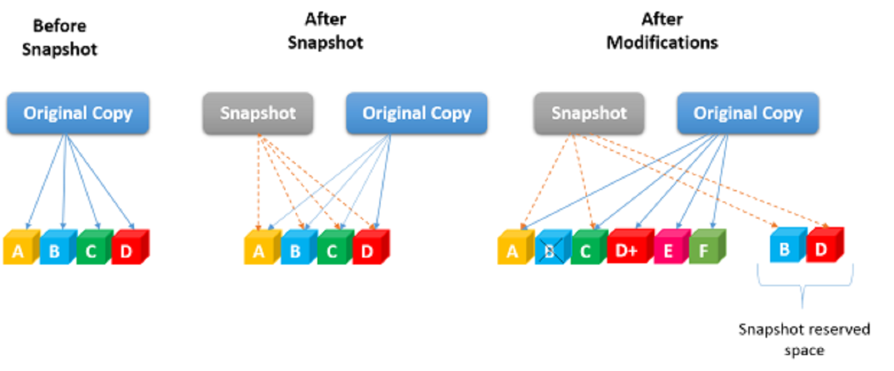
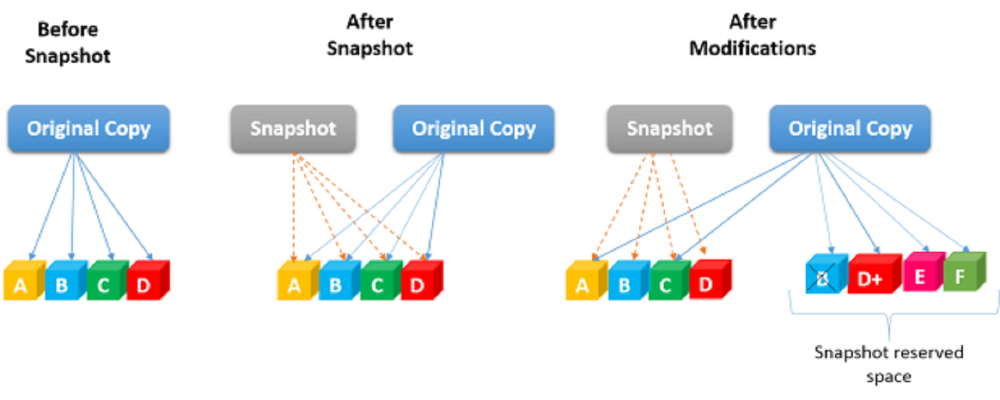
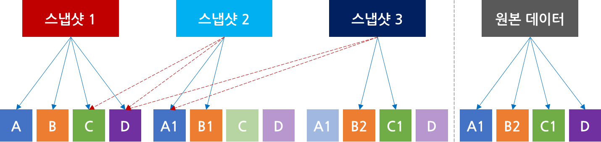

# 스냅샷이란?
스냅샷은 스토리지에 저장된 데이터를 과거 시점으로 되돌리는 것을 말합니다. 특정 시점에서 스냅샷을 생성하게 되면 백업처럼 원본 데이터를
별도로 준비된 스냅샷 공간(snapshot pool)에 복제해 놓고, 나중에 원본 데이터에 문제가 발생하게 되면 복원 잡을 합니다. 이처럼
특정 시점의 데이터를 복제해 놓는 방식을 **point-in-time copy**라고 합니다.

스냅샷 기술은 일반적으로 데이터 보호 시스템을 강화하고 RTO(복구 시간 목표) 및 RPO(복구 시점 목표)를 크게 단축하는 데 사용됩니다. 
다음은 다양한 유형의 스냅샷 기술과 각각의 장단점을 살펴보겠습니다.

---

#### 스냅샷 기술에는 6가지 일반적인 유형이 있습니다.
- **Clone or split-mirror**
- **Copy-on-write**
- **Copy-on-write (COW)** with background copy
- **Redirect-on-write**
- **Incremental**
- **Continuous data protection (CDP)**

 
 

## Split-mirror Snapshot
Split-mirror or Clone Snapshot은 스냅샷 설정 시 원본 데이터를 통째로 복제하는 방식으로, 가장 단순한 형태의 스냅샷입니다.
Split-mirror or Clone Snapshot는 스토리지 볼륨, 파일 시스템 또는 LUN(논리 단위 번호)일 수 있습니다.

---
#### 장점
데이터가 통째로 복제되기 때문에 **저장 방식과 구조가 단순하고 가용성이 높습니다. 무엇보다 원본에 문제가 생겼을 경우 
다시 복원할 수 있다는 장점이 있습니다.**

 

---
#### 단점
이 스냅샷 방법의 매우 중요한 단점은 **원본 데이터와 같은 양의 스토리지 공간이 요구**되기 때문에 **둘 이상의 스냅샷 클론을 라이브로 유지해야
하는 경우 비용이 많이 들 수 있습니다.** 다른 스냅샷 방식과 비교해 **공간 효율이 떨어지고, 데이터의 양이 커질수록 
스냅샷이 생성되는 속도가 느려지며 가용량과 성능에 부담을 줄 수 있습니다.**

 
 

## Copy-on-write Snapshot
Copy-on-write(이하 COW) Snapshot 방식은 가장 널리 쓰이는 스냅샷 방식 중 하나입니다. Copy-on-write를 사용하려면 스냅샷을 위해 
스토리지 용량을 프로비저닝해야 하며 예약된 용량을 사용하여 볼륨의 스냅샷을 시작해야 합니다. 
따라서 Copy-on-write 스냅샷을 구현하려면 스냅샷을 저장할 공간(일반적으로 볼륨/LUN 크기의 10-20%)을 미리 지정해야 합니다.

스냅샷이 처음 생성되면 원본 데이터가 있는 위치에 대한 메타데이터를 저장하지만 **초기 생성 시 실제 데이터는 물리적 복사를 하지 않습니다.**
쓰기 작업(write)이 있을 시 데이터를 복제(copy)하기 때문에 실질적인 데이터 처리는 데이터가 변경되는 시점에서 이루어집니다. 
따라서 **스냅샷을 생성하는 시스템에 거의 영향을 주지 않고 스냅샷 생성이 거의 즉각적으로 이루어집니다.**

위의 그림처럼 스냅샷을 생성하면 원본 데이터(`Original Copy`) `A`, `B`, `C`, `D`의 위치를 가리키고 있는데, 이를 포인터(pointer)라고 합니다. 
이 포인터를 통해 스토리지의 파일시스템이나 컨트롤러가 데이터를 추적할 수 있습니다. 여기서 데이터가 수정되는 경우, COW 스냅샷에서는 
원본 데이터를 미리 할당해 놓은 스냅샷 공간에 복제해 놓고 새로 수정된 데이터를 기존 위치에 덮어씁니다.

---
#### 장점
Copy-On-Write의 주요 장점은 예약된 스냅샷 저장소가 변경된 데이터를 캡처할 수 있을 만큼만 커야 하기 때문에 **공간 효율성이 매우 높다**는 것입니다.
그리고 변경 또는 업데이트가 발생하면 스냅샷 알고리즘이 SSD의 이전 데이터 블록을 SAS로 이동하고 쓰기 새로운 데이터를 SSD에 저장하므로
데이터가 업데이트 되어도 성능이 유지됩니다.

 

---
#### 단점
위의 그림을 예시로, 데이터 `B`를 삭제하고, 데이터 `D`를 수정하고, `E`, `F`라는 데이터를 새로 생성하는 경우를 가정해 보겠습니다. 
데이터의 변경에 대한 요청이 들어오면 변경되는 데이터 `B`와 `D`에 대한 위치를 포인터로 추적해 데이터 읽기(1 x 읽기 I/O 패널티)를 진행합니다. 
읽어 들인 원본 데이터 `B`와 `D`는 스냅샷 공간으로 쓰기를 진행(1 x 쓰기 I/O 패널티)하고 포인터를 재설정합니다. 
마지막으로 삭제된 데이터 `B`와 수정된 `D+`를 원래 데이터 블록 위치에 쓰고 새로운 데이터 `E`, `F`의 쓰기(1 x 쓰기 I/O 패널티)를 진행합니다. 
이후 스냅샷에 요청이 들어오면 변경되지 않은 데이터 `A`와 `C`, 그리고 스냅샷 공간의 데이터 `B`와 `D`를 가리키는 포인터를 통해 불러올 수 있습니다.

Copy-On-Write 스냅샷의 잘 알려진 단점은 **원본 볼륨의 성능이 저하**된다는 것입니다. 원래 볼륨에 대한 쓰기 요청은 원본 데이터가 스냅샷에 
"복사"될 때까지 완료될 때까지 기다려야 하기 때문입니다. Copy-On-Write의 한 가지 주요 측면은 각 스냅샷에 데이터의 유효한 원본 복사본이 
필요하다는 것입니다.

- 1 읽기(1 x 읽기 I/O)
- 2회 쓰기(2x 쓰기 I/O)

 
 

## Copy-on-write (COW) with background copy
Copy-on-write with background copy는 COW의 즉각적인 스냅샷 데이터를 가져오고 백그라운드 프로세스를 사용하여 해당 데이터를 원래 위치에서
스냅샷 저장 위치로 복사합니다. 이렇게 하면 원본 데이터의 Clone or Mirror가 생성됩니다.

백그라운드 복사를 사용한 기록 중 복사는 **Copy-on-write의 장점을 최대한 활용하면서 단점을 최소하하려고 시도합니다.**
종종 COW와 복제의 하이브리드로 설명됩니다.

 
 

## Redirect-on-write (ROW) Snapshot
Redirect-on-write는 COW와 비슷하지만 이중 쓰기 성능 저하를 제거합니다. ROW는 또한 COW와 같은 저장 공간 효율적인 스냅샷을 제공합니다.
원본 데이터의 복사본 한 개를 스냅샷 예약 공간(다양한 공급업체에서 설명하는 캐시, LUN 예약 또는 스냅샷 풀)과 CoW(Copy On Write)에 필요한 
변경된 데이터 복사본에 쓰는 대신 쓰기 시 리디렉션 (RoW)는 **변경된 데이터만 새 블록에 쓰거나 리디렉션합니다.**

---
#### 장점
위 그림과 같이 이전처럼 `B`와 `D`가 변경되고, 데이터 `E`, `F`가 생성되는 경우를 예시로 설명하겠습니다. 데이터 변경이 확인되면 삭제되는
데이터 `B`에 대한 정보와 변경되는 `D`, 그리고 추가되는 데이터 `E`, `F`를 여분의 공간에 바로 쓰기작업(1 x 쓰기 I/O 패널티)을 진행합니다.

요컨대, 볼륨에 대한 쓰기 작업은 COW와 다르게 새로 변경된 데이터의 쓰기 작업을 한번만 진행하면 되기 때문에 부하가 훨씬 덜 발생합니다.
- 1 쓰기(1x 쓰기 I/O)

 

---
#### 단점
스냅샷이 삭제되면 스냅샷 저장소의 데이터를 원래 볼륨으로 다시 조정해야 합니다. 여러 스냅샷이 생성됨에 따라 원본 데이터에 대한 액세스, 스냅샷 
및 원본 볼륨의 데이터 추적, 스냅샷 삭제 시 조정이 더욱 복잡해집니다. 스냅샷을 삭제하는 경우 수정된 데이터의 포인터를 재설정하는데 추가적인 
리소스 비용이 발생하게 됩니다. 

따라서 워크로드 유형과 그에 따라 스냅샷 구현 접근 방식을 계획하는 데 사용되는 스토리지 유형을 이해하는 것이 매우 중요합니다.

 
 

## Incremental
증분 스냅샷 (incremental snapshot)은 지속적인 데이터 보호는 데이터 손실이 없는 RPO(복구 시점 목표)와 즉각적인 RTO(복구 시간 목표)를 
제공하기 위해 개발되었습니다. **스냅샷 생성 이후에 변경되는 데이터만 새로운 스냅샷에 계속 기록하는 방식**을 말합니다. 롤링 재해(기본 데이터의 
문제는 미러링된 데이터의 문제는 사람의 개입으로 중단되기 훨씬 전에 자동으로 문제가 됨)를 제거하고 사람의 오류, 맬웨어, 우발적인 삭제 및 
데이터 손상으로부터 보호한다는 점을 제외하면 동기식 데이터 미러링과 유사합니다.

원본 데이터에 대한 변경 사항이 발생할 때마다 캡처 및 복사하고 타임 스탬프를 찍습니다.

위의 그림과 같이 스냅샷 1에 저장된 데이터 `A`, `B`, `C`, `D`에서 `A`와 `B`가 수정되었으면 수정된 `A1`과 `B1`이라는 데이터만 
스냅샷 2에 저장합니다. 수정되지 않은 C와 D는 스냅샷 1에서 참조합니다. 스냅샷 3에서 `B1`과 `C`가 수정되면 스냅샷 3에는 수정된 데이터 
`B2`와 `C1`만 저장되고, 나머지는 스냅샷 1과 2에서 참조합니다.

---

스냅샷을 생성할 때마다 **스토리지 공간을 매우 적게 소모**하기 때문에 다른 방식에 비해 스냅샷을 빠르고 자주 생성할 수 있습니다.

 
 

## Continuous data protection (CDP)
Continuous data protection은 데이터 블록이 수정될 때마다 **자동으로 스냅샷을 생성하는 방식*입니다. 일정 시간 단위로 스냅샷을 생성하는 
기존의 point-in-time 방식과는 다르게, 수정한 가장 최근 지점까지 롤백이 가능하기 때문에 **시스템 중단이 일어나기 직전의 데이터까지 
확보**할 수 있습니다. 데이터베이스를 기반으로 하는 이메일, 데이터베이스 및 애플리케이션을 위한 탁월한 데이터 보호 형태입니다.  특정 시점으로 
롤백할 수 있어 복구가 간편하고 빠릅니다. 다만, **변경이 가해질 때마다 스냅샷을 생성하기 때문에 필요 이상의 오버헤드**가 가해질 수 있습니다.

 
 

## 스냅샷 비교

---

### 참고
- https://en.wikipedia.org/wiki/Snapshot_(computer_storage)
- https://tech.gluesys.com/blog/2020/12/16/storage_7_intro.html
- https://www.techtarget.com/searchdatabackup/tip/Using-different-types-of-storage-snapshot-technologies-for-data-protection
- https://technoscooop.wordpress.com/tag/copy-on-write/