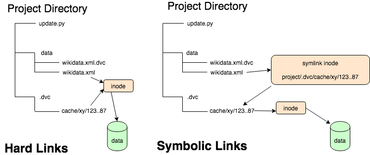
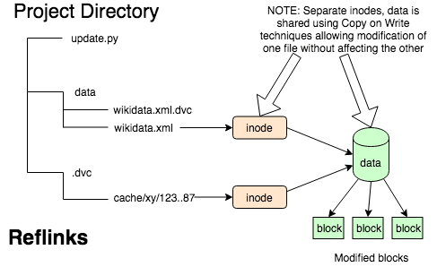
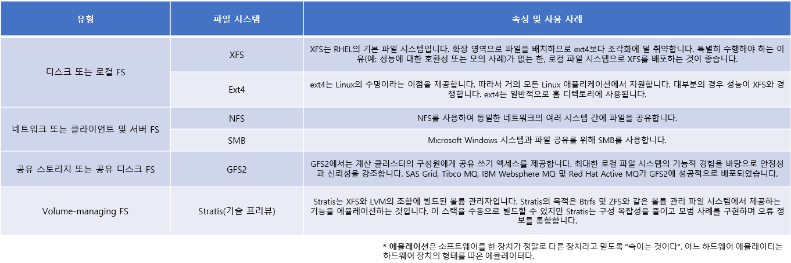

# Reflink란?

Reflink는 파일 간에 동일한 데이터 블록을 재사용하는 기능이 포함되어 중복 제거 및 빠른 기록 시 복사 스냅샷을 만드는 기능을 제공합니다. 시스템
에서 CRC 검사를 활성화해야 하며 사용된 데이터 블록 크기가 1KiB에서 4KiB 사이여야 한다는 점입니다. 기술적으로 상한은 메모리의 페이지 크기
(기본값)에 의해 설정되지만 최대 64KiB까지 더 많이 가질 수 있지만 커널을 다시 빌드해야 합니다. 그리고 많은 사람들은 그러한 구성이 불안정하다고 합니다. 

 

#### 사용가능 버전
커널 수준 지원이 필요하기 때문에 비교적 최근 릴리스에서만 XFS에서 사용할 수 있습니다.

- Ubuntu
    - Ubuntu 18.04 버전 부터 사용 가능하며 더 나은 버전은 Ubuntu 20.04 입니다.

- Centos
    - Centos7 버전 부터 사용 가능합니다.

- Red Hat Enterprise Linux
    - Red Hat Enterprise Linux 6 버전 부터 사용 가능합니다.

 
 

#### 뭔저 Reflink를 들어가기전에 Reflink가 나오기 전의 기술인 Hardlink와 Symlink를 알아보자!

---

### Hard Links and Symlinks
유닉스 계열 환경에서 태어날 때부터 존재해 온 옵션은 하드 링크와 심볼릭 링크입니다. Windows는 역사적으로 파일 링크를 지원하지 않았지만 
"mklink"는 두 가지 스타일의 링크도 지원합니다.

우리가 파일 이름으로 생각하는 것은 실제로 디렉토리 파일의 항목일 뿐입니다. 디렉토리 파일 항목에는 파일 이름과 inode 테이블에 대한
인덱스인 "inode 번호"가 포함됩니다. 하드 링크는 단순히 동일한 inode 번호를 가진 두 개의 디렉토리 항목입니다. 실제로 파일 시스템의 두 위치에 
나타나는 정확히 동일한 파일입니다.

심볼릭 링크는 속성이 링크의 대상을 지정하는 경로 이름을 포함하는 특수 파일입니다. 경로 이름이 포함되어 있기 때문에 기호 링크는 마운트된 
볼륨이나 네트워크 파일 시스템을 포함하여 파일 시스템의 모든 파일을 가리킬 수 있습니다.

 

#### inode 란?
inode (인덱스 노드)는 **파일 또는 디렉토리 와 같은 파일 시스템 개체 를 설명하는 Unix 스타일 파일 시스템 의 데이터 구조** 입니다. 각 inode는
객체 데이터의 속성과 디스크 블록 위치를 저장합니다. 파일 시스템 개체 속성에는 메타데이터 (마지막 변경 시간, 액세스, 수정)와 소유자 및 권한
데이터가 포함될 수 있습니다.

 

---

reflink는 캐시를 오염시킬 위험을 피하면서 파일을 작업 공간에 빠르게 연결하는 솔루션을 제공합니다. Hard link 및 symbolic link 접근 방식은
**속도 때문에 큰 이점이 있지만 그렇게 하면 캐시를 오염시킬 위험**이 있습니다. reflink의 방식인 copy-on-write 동작은 **누군가가 데이터 
파일을 수정하더라도 캐시의 복사본이 오염되지 않음을 의미**합니다. 즉, 데이터 안전이라는 추가 이점과 함께 기존 링크와 동일한 성능 이점이 있습니다.

두 개의 디렉토리 항목이 동일한 inode 항목을 참조하는 하드 링크와 달리 reflink에는 두 개의 inode 항목이 있으며 공유되는 것은 데이터 블록입니다.
하드 링크만큼 빠르게 발생하지만 중요한 차이점이 있습니다. 복제된 파일에 쓰기 작업을 수행하면 해당 데이터를 보유하기 위해 새 데이터 블록이 할당됩니다. 
**복제된 파일은 변경된 것으로 나타나고 원본 파일은 수정되지 않습니다.** 원본 데이터 세트를 오염시키지 않고 데이터 세트를 수정할 수 있습니다.

하드 링크와 마찬가지로 reflink는 지정된 마운트 볼륨 내에서만 작동합니다.

 
 

#### 파일 시스템도 알아보자!

---

### 파일 시스템 유형 및 사용 사례

 
 

## 로컬 파일 시스템
로컬 파일 시스템은 단일 로컬 서버에서 실행되고 스토리지에 직접 연결된 파일 시스템입니다.

예를 들어 로컬 파일 시스템은 내부 SATA 또는 SAS 디스크에 대한 유일한 선택 사항이며 서버에 로컬 드라이브가 있는 내부 하드웨어 
RAID 컨트롤러가 있는 경우에 사용됩니다. 로컬 파일 시스템은 SAN에서 내보낸 장치를 공유하지 않을 때 SAN에 연결된 스토리지에서 사용되는 
가장 일반적인 파일 시스템입니다.

 
 

## XFS 파일 시스템
XFS는 단일 호스트에서 대용량 파일과 파일 시스템을 지원하는 확장성이 뛰어난 고성능, 강력하고 성숙한 64비트 저널링 파일 시스템입니다.
그리고 병렬 I/O 스트림을 처리할 수 있기 때문에 매우 생산적입니다. 따라서 대역폭을 쉽게 확장할 수 있고 동시에 여러 장치에서 작업해도 성능이 
하되지 않는 파일 시스템 입니다.

XFS의 기능은 다음과 같습니다.

 

### 신뢰성
- 메타데이터 저널링: 시스템을 다시 시작할 때 재생할 수 있는 파일 시스템 작업 기록을 유지하고 파일 시스템을 다시 마운트하여 
                  시스템 충돌 후 파일 시스템 무결성을 보장합니다.
- 광범위한 런타임 메타데이터 일관성 검사
- 확장 가능하고 빠른 복구 유틸리티
- 쿼터 저널링. 따라서 충돌 후 긴 할당량 일관성 검사가 필요하지 않습니다.

 

### 확장 및 성능
- 지원되는 파일 시스템 크기는 1024TiB까지 (32bit 에선 제한됩니다.)
- 다수의 동시 운영 지원 기능
- 여유 공간 관리의 확장성을 위한 B-tree 인덱싱
- 정교한 메타 데이터 읽기-ahead 알고리즘
- 동영상 워크로드를 스트리밍하기 위한 최적화

 

### 할당 체계
- 익스텐트 기반 할당
- 스트라이프 인식 정책
- 지연된 할당
- 공백 사전 할당
- 동적으로 할당된 inode

 

### 기타 기능
- **reflink 기반 파일 복사본**
- 긴밀하게 통합된 백업 및 복원 유틸리티
- 온라인 조각 모음
- 온라인 파일 시스템 확장
- 포괄적인 진단 기능
- 확장 속성(xattr). 이렇게 하면 시스템이 파일당 여러 추가 이름/값 쌍을 연결할 수 있습니다.
- 프로젝트 또는 디렉터리 할당량. 이렇게 하면 디렉터리 트리에 대한 할당량 제한이 허용됩니다.
- 서브초 타임스탬프

 

###성능 특징
XFS는 엔터프라이즈 워크로드가 포함된 대규모 시스템에서 고성능을 제공합니다. 대규모 시스템은 비교적 많은 CPU 수, 여러 HBA 및 외부 디스크 
어레이 연결을 사용하는 시스템입니다. XFS는 멀티 스레드 병렬 I/O 워크로드가 있는 소규모 시스템에서도 우수한 성능을 제공합니다.

XFS는 단일 스레드의 메타데이터를 많이 사용하는 워크로드(예: 단일 스레드에서 다수의 작은 파일을 생성하거나 삭제하는 워크로드)의 성능이 상대적으로 낮습니다.

 
 

---

### 참고
- https://access.redhat.com/documentation/ko-kr/red_hat_enterprise_linux/8/html-single/managing_file_systems/index
- https://prog.world/xfs-reflink-and-fast-clone-made-for-each-other/
- https://jorgedelacruz.uk/2020/03/19/veeam-whats-new-in-veeam-backup-replication-v10-xfs-reflink-and-fast-clone-repositories-in-veeam/
- https://towardsdatascience.com/reflinks-vs-symlinks-vs-hard-links-and-how-they-can-help-machine-learning-projects-b77b89cdbab1