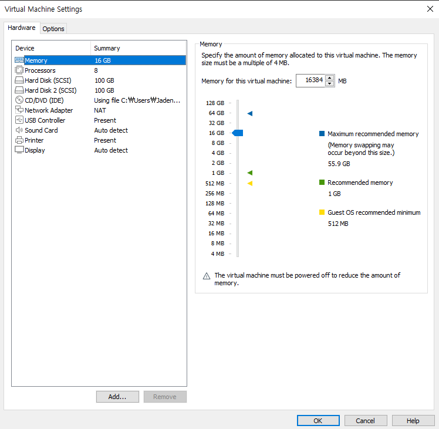

# Reflink 사용법
앞서 [Xfs_Reflink](1_Xfs_Reflinks.md)에서 말한것과 같이 시스템에서 CRC 검사를 활성화해야 하며 매우 흥미로운 점은 사용된 데이터 블록 
크기가 1KiB에서 4KiB 사이여야 한다는 점입니다. Linux의 XFS는 페이지 크기 또는 더 작은 블록의 파일 시스템만 마운트할 수 있습니다.

이러한 것들이 정상인지 사전에 확인합니다. 아래 사진은 현재 테스트하는 Linux의 사양입니다. 메모리와 Processors의 사양은 굳이 맞출필요가 없지만
Hard Disk는 두개이상 만들어주는게 좋습니다.



```
$ yum install -y lshw

$ lshw -class disk -class storage -short

H/W path              Device      Class          Description
============================================================
/0/100/7.1            scsi2       storage        82371AB/EB/MB PIIX4 IDE
/0/100/7.1/0.0.0      /dev/cdrom  disk           VMware IDE CDR10
/0/100/7.1/0.0.0/0    /dev/cdrom  disk
/0/100/10             scsi0       storage        53c1030 PCI-X Fusion-MPT Dual Ultra320 SCSI
/0/100/10/0.0.0       /dev/sda    disk           107GB VMware Virtual S
/0/100/10/0.1.0       /dev/sdb    disk           107GB VMware Virtual S
```

<br>

그런 다음 명령으로 원하는 섹션을 만듭니다. 이것을 하는 이유는 이미 생성된 파일 시스템에서는 `-rflink`플래그를 활성화할 수 없기 때문입니다.

```
$ mkfs.xfs -b size=4096 -m crc=1,reflink=1 /dev/sdb
```

명령어에서 `crc=1`, `reflink=1` 와 같은 것을 볼 수 있습니다. 이것이 우리가 필요로 하는 것입니다. 솔직히 `crc=1`이 기본적으로 설정되어 있지만 명확성을 
위해 이 작업을 수행했습니다.

<br>

다음은 백업용 폴더를 만들고 마운트합니다.
```
$ mkdir /backups
$ mount /dev/sdb /backups
```

마지막으로 모든 것이 정상인지 다음 명령어로 확인합니다.
```
$ df -hT

Filesystem              Type      Size  Used Avail Use% Mounted on
/dev/sdb                xfs       100G   33M  100G   1% /backups
```

<br>
<br>

## Test
이제 XFS와 reflink가 어떻게 작동하는지 확인해 보겠습니다. 이를 위해 `urandom`에서 리디렉션하는 가장 좋아하는 방법을 사용하여 임의 콘텐츠가 
포함된 파일을 생성합니다.

```
$ cd /backups
$ dd if=/dev/urandom of=test.txt bs=1M count=10240

10240+0 records in
10240+0 records out
10737418240 bytes (11 GB) copied, 50.1595 s, 214 MB/s
```

`count=`에서 용량은 자신이 원하는 용량을 넣어도 됩니다. 저는 약 2-3분가량 시간이 지나 완료가 되었습니다. reflink는 기본적으로 시스템에서 
사용되지 않기 때문에 여기서는 중복 제거가 표시되지 않습니다. 지금 우리가 정말로 관심을 갖고 있는 것은 데이터 자체가 차지하는 공간과 
메타데이터에 필요한 공간입니다.

<br>

지금 `df -h`를 수행하면 11GB가 중에 1GB의 메타데이터를 차지하고 새로 만든 10GB가 있음을 알 수 있습니다.
```
$ df -h

Filesystem               Size  Used Avail Use% Mounted on
/dev/sdb                 100G   11G   90G  11% /backups
```

<br>

reflink 매개변수를 사용하여 이 동일한 파일의 복사본을 시작할 것입니다. 결과는 다음과 같습니다.
```
$ cp -v --reflink=always test.txt test-one.txt

‘test.txt’ -> ‘test-one.txt’
cp: failed to clone ‘test-one’ from ‘test’: Operation not supported
```

하지만 제가 사용하는 CentOS Kernel에선 위와 같이 `--reflink=always`를 사용하면 `Operation net suppored`라는 에러가 떨어집니다. 저의 
Kernel 버전은 아래와 같으며 알아본 결과 Centos 일부 버전에서 오류가 발생하는걸 확인하였습니다.

```
$ uname -srm

Linux 3.10.0-1160.62.1.el7.x86_64 x86_64
```

v8.32 이후 의 주요 릴리스는 `cp`에서 `reflink=auto`를 어떤 옵션을 주지 않아도 default 값으로 작동합니다.

<br>

그래서 정상적으로 작동을 하는 `CentOS 8`에서 아래의 명령어를 실행했을때 각 파일에 대해 10GB의 디스크 공간이 20GB 사용되었음을 알려줍니다.
```
$ ls -hsl

total 20G
10G -rw-r--r--. 1 root root 10G May 12 20:50 test.txt
10G -rw-r--r--. 1 root root 10G May 12 20:56 test-one.txt
```

<br>

그러나 디스크 공간 사용량을 확인하는 명령을 실행하면 **디스크가 증가하지 않았습니다.** (파일 시스템이 다른 이유는 CentOS 8에서 기본 추천 Disk
Type이 NVMe이기 때문입니다.)
```
$ df -h

Filesystem               Size  Used Avail Use% Mounted on
/dev/nvme0n2             100G   11G   90G  11% /backups
```

<br>

아래와 같은 명령어를 사용하여 두개의 파일이 동일한 범위를 가지고 디스크 내부의 물리적 위치가 같음을 알 수 있습니다.
두 파일 모두 1개의 extents를 가지게 됩니다.
```
$ filefrag -v test.txt test-one.txt

Filesystem type is: 58465342
File size of test.txt is 1073741824 (262144 blocks of 4096 bytes)
 ext:     logical_offset:        physical_offset: length:   expected: flags:
   0:        0..  262143:         24..    262167: 262144:             last,shared,eof
test.txt: 1 extent found
File size of test-one.txt is 1073741824 (262144 blocks of 4096 bytes)
 ext:     logical_offset:        physical_offset: length:   expected: flags:
   0:        0..  262143:         24..    262167: 262144:             last,shared,eof
test-one.txt: 1 extent found
```
위와 같은 결과는 앞서 올렸던 [Reflink 설명](1_Xfs_Reflinks.md)에서 나왔던 것 처럼 reflink는 두 개의 inode 항목이 있으며 데이터 블록이 공유되는 것입니다.
복제된 파일에 쓰기 작업을 수행하면 해당 데이터를 보유하기 위해 새 데이터 블록이 할당됩니다. 그 말은 쓰기 작업이 수행되기 전까진 위와 같이 디스크 용량이
늘어 나지 않고 물리적 위치가 같다는 말입니다. 그리고 **복제된 파일은 변경된 것으로 나타나고 원본 파일은 수정되지 않습니다.** 원본 데이터 세트를 
오염시키지 않고 데이터 세트를 수정할 수 있습니다. 

<br>

### 파일 변경
그 다음 원본파일이나 reflink 복사본의 내용을 변경했을때 어떻게 바뀌는지 궁금하여 테스트를 해보았습니다.

먼저 원본파일에 "test"라는 내용을 추가하였을때의 변화를 보겠습니다.
```
$ echo -e "test" >> test.txt
$ filefrag -v test.txt test-one.txt

Filesystem type is: 58465342
File size of test.txt is 1073741829 (262145 blocks of 4096 bytes)
 ext:     logical_offset:        physical_offset: length:   expected: flags:
   0:        0..  262143:         24..    262167: 262144:             shared
   1:   262144..  786431:          0..    524287: 524288:     262168: last,unknown_loc,delalloc,eof
test.txt: 2 extents found
File size of test-one.txt is 1073741824 (262144 blocks of 4096 bytes)
 ext:     logical_offset:        physical_offset: length:   expected: flags:
   0:        0..  262143:         24..    262167: 262144:             last,shared,eof
test-one.txt: 1 extent found
```
위의 `flags:`에서 `unkown_loc`과 `delalloc`는 쓰기작업이 완료되기전의 상태를 나타내며 시간이지나면 아래의 상태처럼 `last`와 `eof`만 남게 됩니다.

```
$ echo -e "test123" >> test-one.txt
$ filefrag -v test.txt test-one.txt

Filesystem type is: 58465342
File size of test.txt is 1073741829 (262145 blocks of 4096 bytes)
 ext:     logical_offset:        physical_offset: length:   expected: flags:
   0:        0..  262143:         24..    262167: 262144:             shared
   1:   262144..  262144:     524312..    524312:      1:     262168: last,eof
test.txt: 2 extents found
File size of test-one.txt is 1073741832 (262145 blocks of 4096 bytes)
 ext:     logical_offset:        physical_offset: length:   expected: flags:
   0:        0..  262143:         24..    262167: 262144:             shared
   1:   262144..  262144:         10..        10:      1:     262168: last,eof
test-one.txt: 2 extents found
```

결과를 봤을때 `flags`에서 shared 상태인 메모리는 항상 고정상태에 있으며 새로 데이터를 썼을때 `offset`은 다른 위치에 저장이 됩니다.
하지만 디스크 용량을 확인했을 때 `/dev/nvme0n2         100G  11G   90G   11% /backups` 와 같이 용량은 그대로지만 새로 쓴 데이터의 length 가
1kb밖에 되지않아 유의미한 숫자변화가 없는것으로 보입니다. 하지만 **두개의 파일이 변화한다고 하여 `reflink`로 복사한 `flags`의 `shared`부분은 고정되므로
용량 제한에 큰 이점이 있습니다.**

그리고 복사한 파일을 변경한다고하여 처음 복사한 데이터와 `physical_offset`이 변경되지 않기 때문에 추가 용량이 들지않고 **원본파일을 삭제하여도
`shared`부분이 깨지거나 삭제되는게 아니라 `shared`만 사라지고 그대로 유지**합니다. 

<br>

---

### 참고
- https://prog.world/xfs-reflink-and-fast-clone-made-for-each-other/
- https://jorgedelacruz.uk/2020/03/19/veeam-whats-new-in-veeam-backup-replication-v10-xfs-reflink-and-fast-clone-repositories-in-veeam/