# Tibero Database 란?

> 멀티프로세스(Multi-process), 멀티스레드(Multi-thread) 아키텍처를 기반으로 해 많은 사용자가 한꺼번에 DBMS에 접근하는 경우에도 효율적인 자원 사용과 빠른 접속 처리로 다중 사용자를 수용
>
> [참고 사항](https://technet.tmaxsoft.com/upload/download/online/tibero/pver-20140808-000002/tibero_admin/ch_03.html)

 
 

# 1. Tibero 전체 구조

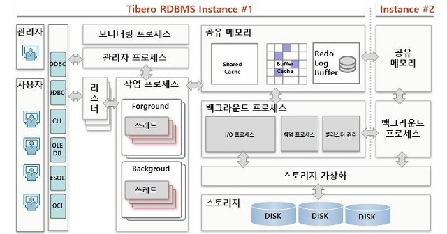

 
 

## 1-1. Tibero Process

대규모 사용자 접속을 수용하는 다중 프로세스 및 다중 스레드 기반의 아키텍처 구조를 갖추고 있습니다.

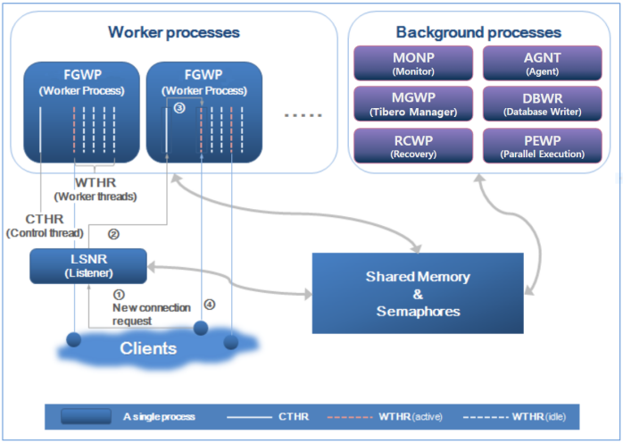

Tibero의 프로세스는 크게 3가지로 구성된다.

- 리스너(Listener)
- 워커 프로세스(Worker Process 또는 Foreground Process)
- 백그라운드 프로세스(Background Process)

 
 

### 1-1-1. 리스너

1. 현재 유휴한 워커 스레드가 있는 워커 프로세스를 찾아서 클라이언트의 접속 요청(①)을 한다.
2. 이때 File descriptor와 함께 할당되므로 클라이언트는 서버의 내부 동작과 상관없이 마치 처음부터 워
   커 스레드에 접속한 것처럼 동작하게 된다.
3. 리스너의 요청을 받은 컨트롤 스레드(CTHR: control thread)는 자기 자신에 속한 워커 스레드의 상태를
   검사(②)하여 현재 유휴한 워커 스레드에 클라이언트의 접속을 할당(③)한다.
4. 할당된 워커 스레드는 클라이언트와 인증 절차를 거친 후 세션을 시작(④)한다.

 

### 1-1-2. 워커 프로세스

워커 프로세스(Worker Process)는 클라이언트와 실제로 통신을 하며 사용자의 요구 사항을 처리하는 프로세스입니다.

Tibero는 효율적인 리소스의 활용을 위해 **스레드(Thread) 기반**으로 작업을 수행합니다.

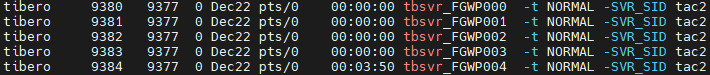

 

#### 1-1-2-1. 컨트롤 스레드

기본적으로 하나의 워커 프로세스 안에는 1개의 컨트롤 스레드와 10개의 워커 스레드가 존재합니다.

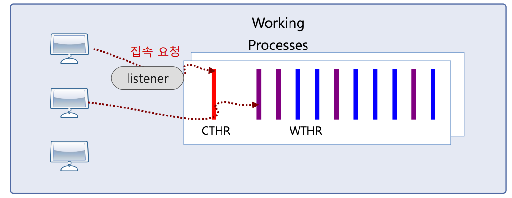

워커 프로세스마다 하나씩 존재하며 다음과 같은 역할을 담당한다.

- Tibero가 기동될 때 초기화 파라미터에 설정된 수만큼 워커 스레드를 생성한다.
- 클라이언트의 새로운 접속 요청이 오면 현재 유휴한 워커 스레드에 클라이언트의 접속을 할당한다.
- 시그널 처리를 담당한다.
- Tibero 6부터 I/O multiplexing을 지원하며 필요한 경우 워커 스레드 대신 메시지를 보내거나 받는 역
  할을 수행한다

 

#### 1-1-2-2. 워커 스레드

워커 스레드는 클라이언트와 1:1로 통신하며, 클라이언트가 보내는 메시지를 받아 처리하고, 그 결과를 돌려준다. 주로 SQL 파싱, 최적화 수행 등 
DBMS가 하는 작업 대부분이 워커 프로세스에서 일어난다.

 

### 1-1-3. 백그라운드 프로세스

- **Monitor Process(MONP: 감시 프로세스)**

  리스너를 포함한 다른 프로세스를 생성하거나 주기적으로 각 프로세스의 상태를 점검하는 역할을 담당한다. 또한 교착 상태(deadlock)도 검사한다.

 
 
- **Tibero 매니저 프로세스(MGWP)**

  시스템을 관리하기 위한 용도의 프로세스이다. SYS 계정만 접속이 허용된다.

 

- **Agent Process(AGNT: 에이전트 프로세스)**

  시스템 유지를 위해 주기적으로 처리해야 하는 Tibero 내부의 작업을 담당

  Tibero 6부터 다중 스레드(Multi-threaded) 기반 구조로 동작하며, 서로 다른 용도의 업무를 스레드별로
  나누어 수행한다.

 

- **DataBase Wirte Process(DBWR: 데이터베이스 쓰기 프로세스)**

  데이터베이스에서 변경된 내용을 디스크에 기록하는 일과 연관된 스레드들이 모여 있는 프로세스

 

- **Recovery Worker Process(RCWP: 리커버리 워커 프로세스)**

  리커버리와 백업을 담당하는 프로세스

 

- **Parallel Execution Worker Process(PEWP: Parallel Execution 워커 프로세스)**

  PE 수행을 위해 도입된 PE 전용 프로세스이다. PE SQL을 처리할 때에 locality를 극대화하기 위해서 WTHR들을 하나의 PEP에서 할당
 
 
 

# 2. DBMS

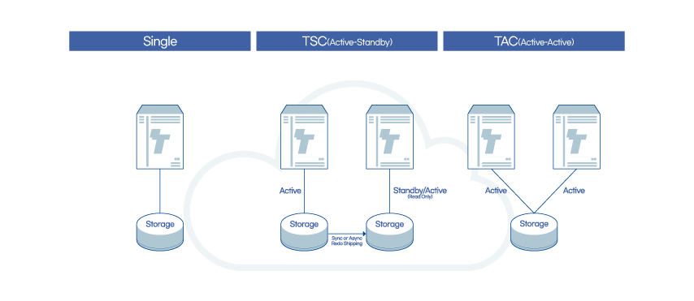

Tibero 설치 구성에서는 몇가지 방법이 있습니다.

- **Single**: 간편한 구성으로 시스템 관리 및 운영 용이
- **TSC(Active-Standby)**: 독립디스크 기반으로 자료 보호 및 재해 복구에 적합
- **TAC(Active-Active)**: 공유디스크 기반으로 시스템 중단없는 안정적인 서비스 제공
- **TAC-TAS**: 공유디스크 기반으로 TAS 기능을 이용하여 성능면에서 오버헤드 최소화

 
 
 

# 3. Tibero Active Cluster(TAC)

티베로의 TAC(Tibero Active Cluster)는 여러 대의 DB서버를 클러스터로 묶어 한 대의 서버에 장애가 발생하더라도 서비스가 지속될 수 있도록 하는 기술로,
오라클의 RAC로도 유명한 공유디스크 방식의 액티브 클러스터링(Active Clustering) 기술이다.

 

**운영 중에 한 노드가 멈추더라도 동작 중인 다른 노드들이 서비스를 지속하게 된다.**

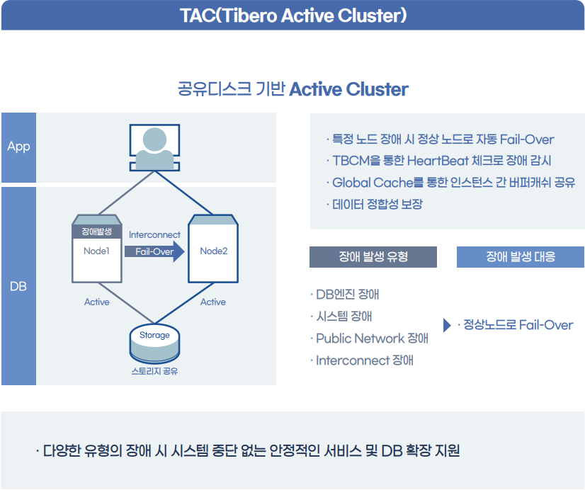

각각의 instance 는 CM이 관리하게 되며 Inter-Connect 를 통해 정보를 공유하게 된다.

 
 

### 3-1. 클라우드 환경에서 티베로 클러스터링 방안

티베로는 다음과 같은 3가지 모델을 제공하여 클라우드 환경을 지원합니다.

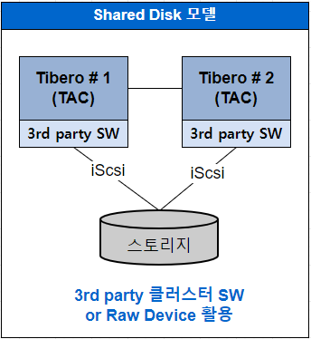

2개 이상의 서로 다른 DBMS 노드에서 공유 스토리지를 읽고 쓰기 위해서는 써드파티 클러스터 소프트웨어가 제공하는 클러스터 파일 시스템을 사용하거나
로우 디바이스(Raw Device)를 DBMS가 직접 제어하는 방식을 사용해야 합니다.

써드파티 솔루션을 사용한다면 여러 사례에서 입증된것처럼 안정적 운영이 가능하지만 DBMS 비용 외에 별도 솔루션 도입 비용이 발생합니다.

 
 

### 3-2. TAC를 위한 데이터베이스

**TAC는 공유 디스크 기반의 클러스터 데이터베이스이다.** 여러 데이터베이스 서버의 인스턴스가 **물리적으로 같은 데이터베이스 파일을 보고 사용**하기 때문에
데이터베이스 생성은 한 서버에서 한 번만 수행하면 된다.

**모든 서버의 인스턴스가 동일한 컨트롤 파일 및 데이터 파일을 읽고 쓰게 된다.** 반면 **TAC에서는 공유 디스크에서 데이터 접근의 경합을 최소화하기 위해
Redo 로그 및 Undo에 대해서는 인스턴스마다 별도의 파일을 가지고 있어야 한다.** Redo 로그 및 Undo 정보는 각 서버의 인스턴스들이 별도의 파일에 저장하지
만 복구 상황 등에 따라 다른 인스턴스의 정보를 읽어야 하므로 **반드시 공유 디스크상에 존재해야 한다.**

 
 
 

# 4. Tibero Active Storage(TAS) - 스토리지 가상화 기술 지원 

스토리지 가상화란 스토리지와 서버 사이에 소프트웨어 또는 하드웨어 계층을 추가함으로써, 애플리케이션(여기서는 DBMS) 구동 시 데이터를 찾기 위해
**특정 디스크 드라이브, 파티션 또는 스토리지 하위 시스템을 인식하지 않아도 DBMS와 스토리지가 서로 독립적으로 관리될 수 있도록 하는 기술**이다.

 

TAS 서비스는 TAC와는 별도의 계층에 위치해 스토리지 클러스터를 구성하고 **별도의 외부 솔루션 없이 직접 디스크 장치를 관리**하여 티베로 운영에
필요한 데이터 파일, 로그 파일 등을 저장하기 위한 **논리적 볼륨 관리자(Logical Volume Manager)이다**. 또한, **공유 디스크를 사용할 경우
TAC(티베로 액티브 클러스터) 기능을 사용할 수 있도록 클러스터링 기능을 제공**한다.

 

**TAS는 여러 개의 디스크들을 디스크 스페이스로 관리**하는데, 디스크 스페이스는 논리 볼륨 위에 파일 시스템을 생성한 것과 유사하며, 티베로는 이러한
디스크 스페이스에 파일을 저장해 관리한다. 디스크 스페이스를 사용해 티베로 운영 중 **데이터베이스를 종료하지 않고도 디스크를 추가하거나 제거**할 수 있는데,
이렇게 디스크를 추가/제거할 경우 TAS는 자동으로 디스크 스페이스에 있는 **모든 디스크에 데이터를 균등하게 분배해 각 디스크가 최대한 공평하게 일할 수 있도록 저장된 데이터를 재배치(Rebalancing)한다.**

 

또한, TAS는 미러링과 스트라이핑을 통해 디스크 공간을 관리할 수 있는데, **스트라이핑을 지원하여 디스크 간 병렬 처리로 최대한의 성능을 낼 수 있도록
분산 저장**하고, 미러링을 통해 티베로의 데이터를 복제 저장(2-way 또는 3-way)하기 때문에 대부분의 스토리지 장애에 대해 고가용성을 유지할 수 있다.

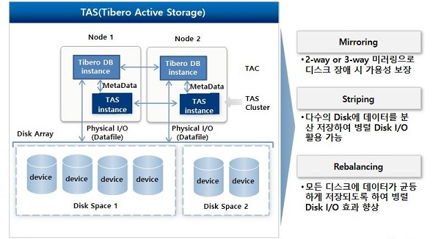

 
 

### 4-1. TAS 인스턴스

TAS는 데이터베이스보다 적은 양의 일을 수행하므로 시스템 자원을 거의 사용 하지 않습니다.

**TAS는 공유 디스크를 사용하기 위한 클러스터링 기능을 제공한다.** 하나의 디스크 스페이스는 하나의 Tibero 인스턴스만 사용할 수 있습니다.
**여러 Tibero 인스턴스가 하나의 디스크 스페이스를 사용하려면 해당 인스턴스들을 TAC로 구성**해야 합니다.

 
 

### 4-2. TAS 디스크 스페이스

디스크 스페이스는 여러 개의 디스크들로 이루어져있습니다. 각각의 디스크 스페이스는 해당 디스크 스페이스를 관리하는데 필요한 메타 데이터와 데이터베이스에서 사용하는 파일들을 저장하고있습니다.

 
 

### 4-3. TAS 디스크

TAS는 다음 디스크 장치들을 TAS 디스크로 사용할 수 있습니다.

- 디스크 전체
- 디스크 파티션
- 논리 볼륨

디스크나 Physical Volume에 대한 권한 문제는 **udev를 통하여 디바이스 노드를 생성하여 해결할 수 있습니다.**

 

SAN 스토리지 상에서 처음부터 LUN으로 나눠진 디스크에 대해서는 클러스터링 S/W 및 GFS2 없이 TAS 클러스터 구성이 가능합니다.

 

TAS 클러스터 구성할 때 **동일한 디스크가 각 노드에서 서로 다른 이름으로 설정되어도 TAS 디스크로 사용할 수 있습니다.** 예를 들어 같은 디스크라도
CLVM이 없다면 1번 node에서 `/dev/hdisk1`로 보이고 2번 node에서 `/dev/hdisk2`로 보일 수 있는데 TAS로 구성할 때 이러한 환경에서도 정상적으로
DB를 구성할 수 있습니다. **disk string을 통하여 이러한 TAS 디스크를 검색하게 되므로 클러스터에 참여하는 노드들이 필요한 disk/raw device를
볼 수 있도록만 설정해 주면 됩니다.**

 

TAS는 파일의 내용을 디스크 스페이스에 속한 모든 디스크들에 분산 저장합니다. 이러한 저장 방식은 디스크 스페이스에 속한 모든 디스크들의
공간을 균일하게 사용하도록 하며, 모든 디스크들에 동일한 입출력 부하가 가해지도록 합니다. 그러므로 디스크 스페이스를 구성하는 **TAS 디스크들은
물리적으로 서로 다른 디스크 장치여야 합니다.** RAID로 Logical Volume 구성할 때 striping size가 TAS의 AU size의 배수가 되도록 하는 것을 권장합니다.
이렇게 해야 디스크의 strping 단위와 TAS의 striping 단위의 align이 맞게 되어 성능이 향상된다.

 
 

### 4-4. 할당 단위

할당 단위는 디스크 스페이스에서 공간 할당에 사용하는 기본 단위

디스크 스페이스에서 사용할 할당 단위의 크기는 디스크 스페이스를 생성할 때 AU_SIZE속성으로 설정 할 수 있으며, 설정 가능한 값은 1, 2, 4, 8, 16, 32 또는 64MB입니다.

 
 

### 4-5. 익스텐트(Extent)

TAS 파일들은 익스텐트들의 집합으로 디스크 스페이스에 저장합니다.

익스텐트 크기를 변경하는 것은 파일 익스텐트 정보를 유지하기 위한 메모리 사용을 줄이는 효과도 있습니다. 익스텐트의 크기는 파일의 크기가 커짐에 따라 자동으로 커지게 됩니다.
파일 크기가 작을 때는 디스크 스페이스의 할당 단위(Allocation Unit, 이하 AU)와 동일하며, 파일 크기가 커지면 4AU나 16AU의 크기가 됩니다.

 

다음은 익스텐트와 할당 단위의 관계를 나타내는 그림입니다.

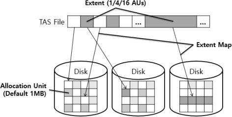

 
 
 

# 5. Tibero Active Storage - Tibero Active Cluster (TAS-TAC)

다음은 TAS-TAC 와 Zeta 모델의 간략한 구조를 나타내는 그림입니다.

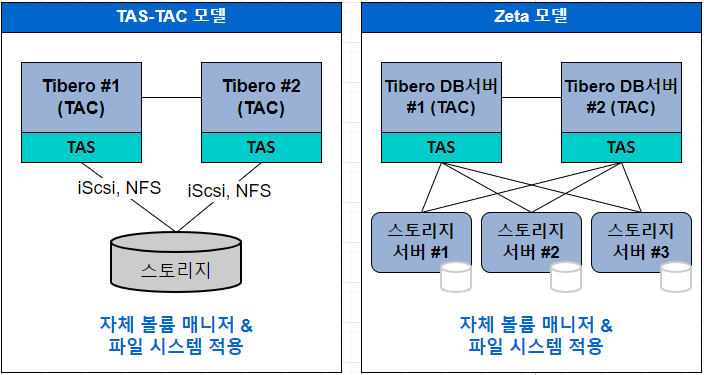

TAS를 사용하면 클라우드 환경에서 일반적으로 적용중인 NAS의 지원과 iSCSI(인터넷 스몰 컴퓨터 시스템 인터페이스, Internet Small Computer System Interface)와
NFS(네트워크 파일시스템, Network File System) 프로토콜을 원활히 지원합니다.

 

Zeta 모델은 DB 서버와 스토리지 서버를 분리한 아키텍처를 통해 성능을 높인 클라우드 DBMS입니다. DB 서버 외에 스토리지 서버를 두어 처리할
업무를 분담하여 성능을 높이는 구조입니다. 이미 티베로의 제타데이터(ZetaData)와 같은 데이터베이스 어플라이언스에서 성능의 우수성이 입증되었습니다.

대표적인 성능 향상 기술로 기능 오프로딩(Function Offloading, DB 서버로 요청되는 데이터베이스언어(SQL)의 조건 처리를 스토리지 서버가 이해하고 수행)이 있습니다. VM이나 컨테이너 기반의 클라우드 환경에서 DBMS의 자유로운 확장을 지원합니다.

 

다음은 TAS-TAC 모델에서 내부 PORT 나 Network 설정입니다.

TAS, TAC 각각 서로 통신을 할때는 내부 HostIP를 사용하며 Port로 프로세스끼리 통신합니다.

**위와 같은 구성으로 설치를 하는 방법은 [TAC-TAS 설치방법](2_Tibero-TAC-TAS_Install.md)에서 참고하시면 됩니다.**

 
 
 

# 6. Tibero Standby Cluster(TSC)

Tibero TAC 뿐만 아니라 독립 디스크 방식(Shared Nothing)의 TSC(Tibero Standby Cluster) 이중화 구성을 지원하여 운영상 고가용성과 재해복구(DR)에 적합한 아키텍처를 제공

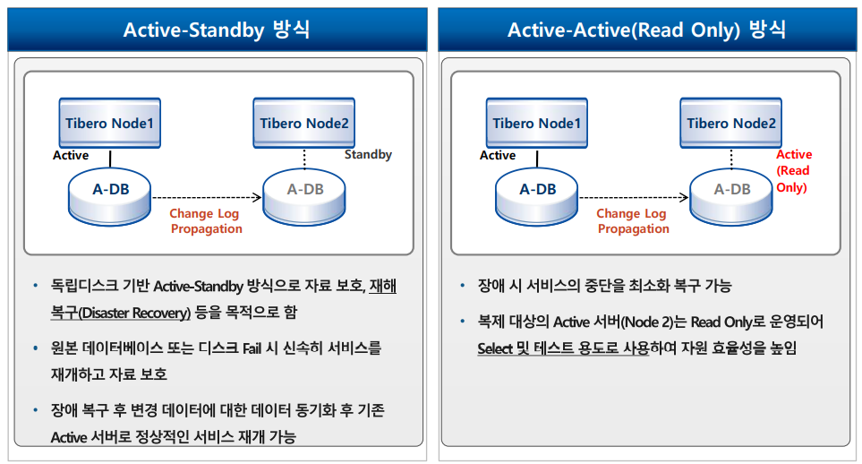

- **Active-Standly 방식**
    - 독립디스크 기반 Active-Standly 방식으로 자료 보호, 재해 복구(Disaster Recovery)등을 목적으로 한다.

    - 원본 데이터베이스 또는 디스크 Fail 시 신속히 서비스를 재개하고 자료 보호

    - 장애 복구 후 변경 데이터에 대한 데이터 동기화 후 기존 Active 서버로 정상적인 서비스 재개 가능

- **Active-Actvie(Ready Only) 방식**
    - 장애 시 서비스의 중단을 최소화 복구 가능
    - 복제 대상의 Active 서버(Node 2)는 Read Only로 운영되어 Select 및 테스트 용도로 사용하여 자원 효율성을 높임

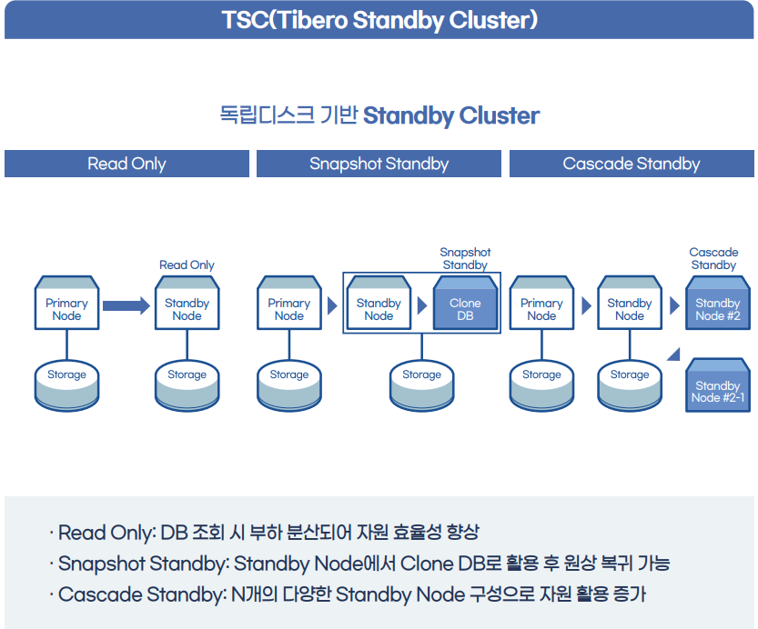