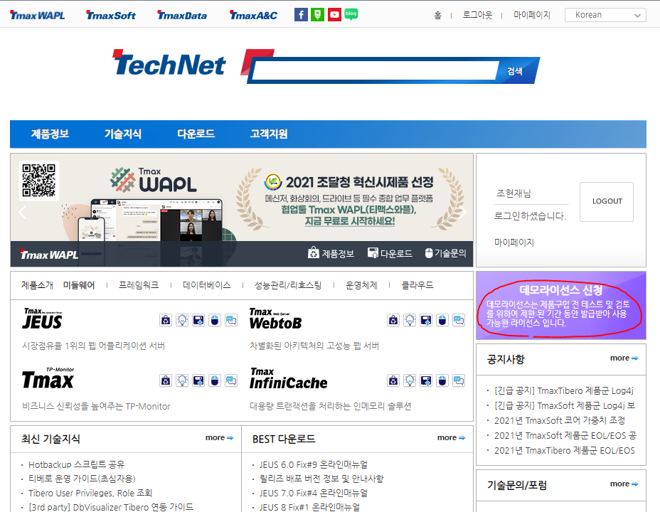
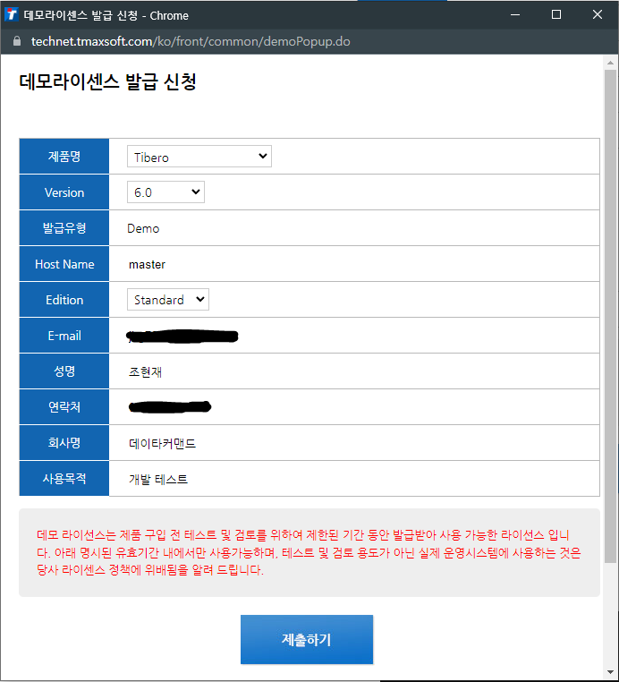

# 티베로 라이센스 발급

라이센스 발급을 위해서 [사이트](https://technet.tmaxsoft.com/kr/front/main/main.do)에 들어가서  **회원가입**후에 데모라이센스 신청을 클릭




### 발급 신청

데모라이센스 발급 신청이라는 팝업창이 떠서 정보를 입력하면 되는데 여기서 Host Name 을 정확히 입력해야 라이센스가 제대로 동작한다.

- Host Name

```
# uname -n	// Linux Host Nmae
master

$ hostname	// Windows Host Nmae
DESKTOP-3HOH52D
```




**발급이 완료되면 자기 계정의 이메일로 온 license.xml을 설치디렉토리/license 폴더 밑에 위치시킨다.**

