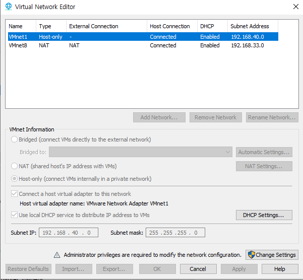
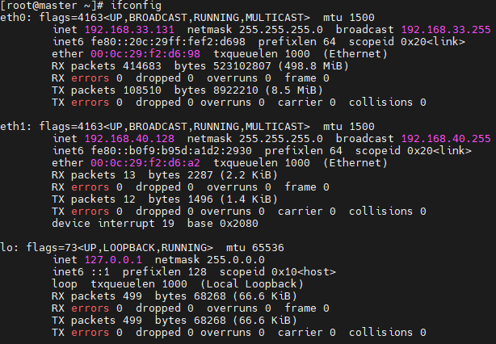
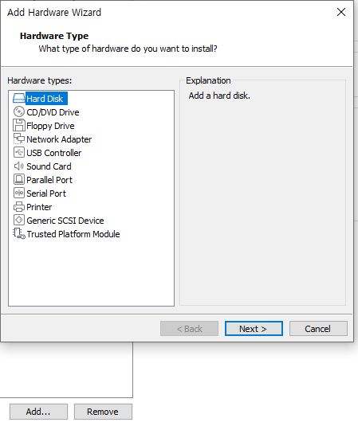
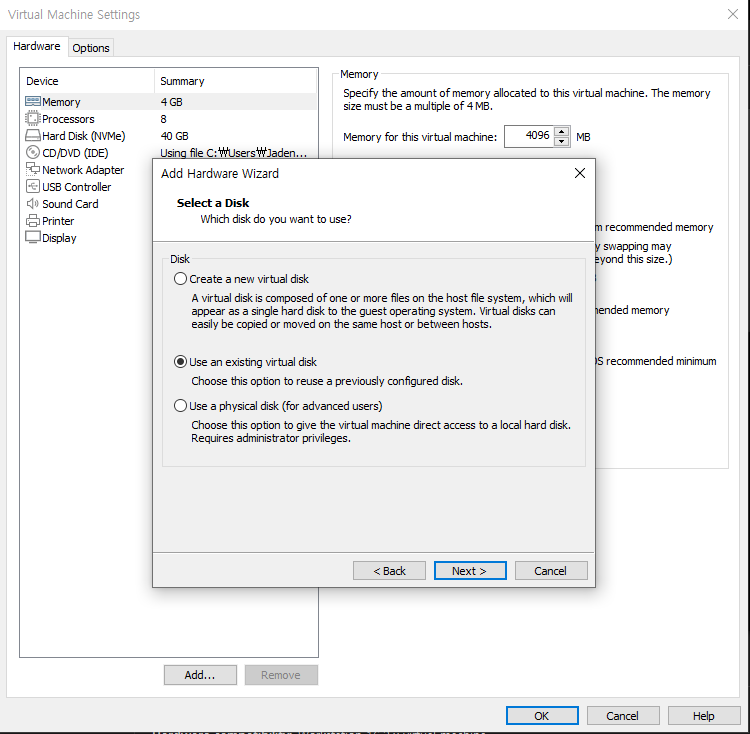
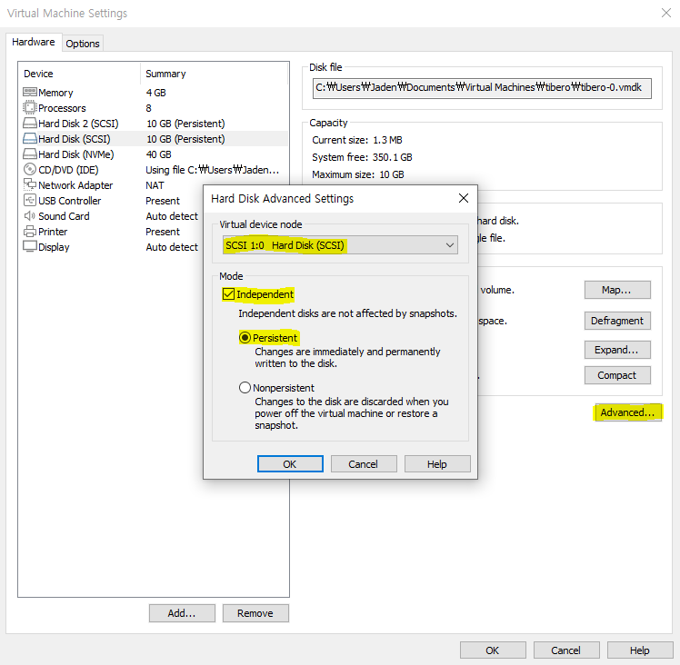
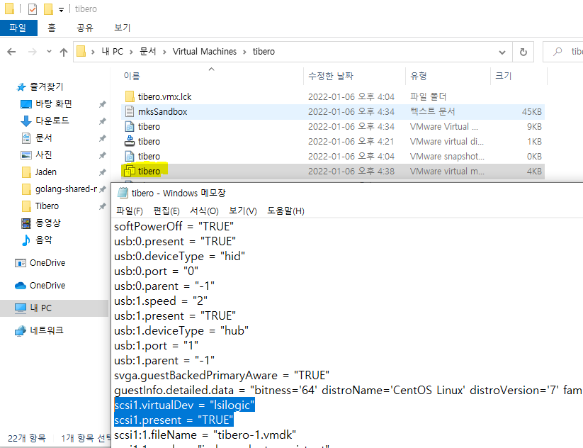
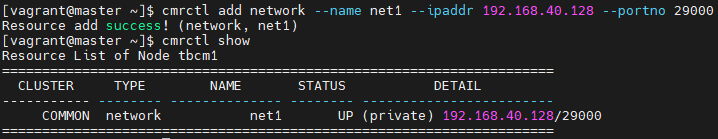

# Tibero Active Cluster

Tibero Active Cluster(TAC)는 **확장성, 고가용성을 목적으로 제공**하는 Tibero RDBMS의 주요 기능이다. TAC 환경에서 실행 중인 모든 인스턴스는 공유된 데이터베이스를 통해 트랜잭션을 수행하며, 공유된 데이터에 대한 접근은 데이터의 일관성과 정합성 유지를 위해 상호 통제하에 이뤄진다.

큰 업무를 작은 업무의 단위로 나누어 여러 노드 사이에 분산하여 수행할 수 있기 때문에 업무 처리 시간을 단축할 수 있다.

여러 시스템이 공유 디스크를 기반으로 데이터 파일을 공유한다. TAC 구성에 필요한 데이터 블록은 노드 간을 연결하는 고속 사설망을 통해 주고 받음으로써 노드가 하나의 공유 캐시(shared cache)를 사용하는 것처럼 동작한다.

운영 중에 한 노드가 멈추더라도 동작 중인 다른 노드들이 서비스를 지속하게 된다. 이러한 과정은 투명하고 신속하게 처리된다.


다음은 TAC의 간략한 구조를 나타내는 그림이다	[출처 : http://www.gurubee.net/lecture/2107]


[출처 : https://novice-data.tistory.com/60]


# Installation

우선 사용하고자하는 노드의 숫자만큼 생성을 생성을 합니다. 저는 master와 node 2개를 생성했습니다. 


### 1. 라이센스 신청

- 라이센스 신청하는 방법은 [게시물](https://github.com/jaden7856/TIL/blob/master/Tibero/1_Tibero-License.md)을 참조합니다. 여기서 하나의 Tibero를 만드는 것과 차이는 **TAC Cluster를 구성하기 위해서 Standard가 아닌 Enterprise 라이센스를 신청해야합니다.**
- 각각 node들의 hostname에 맞게 발급받으세요.


### 2. VMware 설정

#### add - Network Adapter

VM을 끄고, TAC 노드간 Interconnect 용으로 사용할 IP를 HostOnly로 추가해줍니다.


- VM Network 확인




- 네트워크 확인




### 3. Share Disk 설정

Tibero TAC 는 공유 디스크를 기반으로 하기 때문에 데이터파일이 저장될 경로는 모든 DB 노드가 접근가능해야한다. 공유 파일시스템으로도 구성할 수 있지만 raw device 를 기반으로 설치하겠습니다.

1. 아래 사진과 같이 Hard Disk 2를 Virtual Machine에 추가합니다. 




#### 주의 !! 

여기서 **`Allocate all disk space now.`**를 체크하지 않으면 나중에 `diskspace`를 만들때 오류가 발생


총 2개에서 3개 disk를 추가한다. 용량은 자율선택


#### 3)에서 Shared Disk를 node2번에 추가해준다.

- 다른 노드에 용량을 추가할땐 다른 방식입니다. 기존에 있는 virtual disk를 선택해서 처음에 만들었던 `.vmdk`파일을 선택하여 추가합니다.




- 두개를 생성하면 `Advanced...`를 클릭하여 `SCSI 1:0` 과 `SCSI 1:1`을 각각 선택하고 Mode도 체크




- Virtualmachin이 설치된 곳에 vmx파일을 연결프로그램으로 메모장을 통해 열어 아래 드래그 된 것을 바꾸겠습니다. **이 과정은 device를 공유하게 만들어주는 과정입니다.**




드래그 한 부분을 밑에 문장을 추가 하겠습니다. 그리고 다른 Node들도 똑같이 바꿉니다. 추가 디바이스 개수에 따라 추가적으로 적어주시면 됩니다.

```
scsi1:0.filename = "centos-7-1-1.x86_64-1.vmdk" # 이 문장 밑에 적기
disk.locking="FALSE"
diskLib.dataCacheMaxSize="0"
scsi1:0.sharedBus="virtual"
scsi1:0.deviceType="disk"

scsi1:1.filename = "centos-7-1-1.x86_64-2.vmdk"	# 이 문장 밑에 적기
scsi1:1.sharedbus="virtual"
scsi1:1.deviceType="disk"
```

만약 `disk.locking` 오류가 뜨면서 VM이 실행이 안될경우 기존에 이미 `disk.locking`이 있을 수 있습니다.


- 생성 확인

루트 계정으로 접속 후 `/dev/sdb`가 생성되었다면 정상 (개인 Disk 추가 갯수에따라 다르다.)

```
# ls -l /dev/sd*
brw-rw----. 1 root disk 8,  0 Jan  6 01:11 /dev/sda
brw-rw----. 1 root disk 8,  1 Jan  6 01:11 /dev/sda1
brw-rw----. 1 root disk 8, 16 Jan  6 01:11 /dev/sdb
brw-rw----. 1 root disk 8, 32 Jan  7 07:50 /dev/sdc
```


####  .rules 파일 생성 (노드 모두 적용)

```
$ vi /etc/udev/rules.d/99-tibero.rules

ACTION=="add|change", KERNEL=="sdb", RUN+="/bin/raw /dev/raw/raw1 %N"
ACTION=="add|change", KERNEL=="sdc", RUN+="/bin/raw /dev/raw/raw2 %N"

ACTION=="add|change", KERNEL=="raw*", OWNER=="tibero", GROUP=="dba", MODE=="0660"

ACTION=="add|change", KERNEL=="raw1", SYMLINK+="tas/disk01"
ACTION=="add|change", KERNEL=="raw2", SYMLINK+="tas/disk02"

ACTION=="add|change", KERNEL=="sdb", OWNER=="tibero", GROUP=="dba", MODE=="0660"
ACTION=="add|change", KERNEL=="sdc", OWNER=="tibero", GROUP=="dba", MODE=="0660"
```


#### . udev rules 적용

```
$ udevadm control --reload-rules
$ udevadm trigger
```


#### . 생성 확인

```
$ ll /dev/tas/
total 0
lrwxrwxrwx. 1 root root 11 Jan 10 23:40 disk01 -> ../raw/raw1
lrwxrwxrwx. 1 root root 11 Jan 10 23:40 disk02 -> ../raw/raw2

$ raw -qa
/dev/raw/raw1:  bound to major 8, minor 16
/dev/raw/raw2:  bound to major 8, minor 32
```


### 3. 설치 전 환경 구성

> **master, node 2개 모두 설치**

##### 2-0. hosts 설정

```
# vi /etc/hosts
```

```
192.168.33.x master
192.168.33.x node1
192.168.33.x node2
```


##### 2-1. JDK 설치

Tibero를 설치하기 위해서는 `JDK 1.5.17` 이상 버전이 필요합니다. 저는 Openjdk 8 버전을 설치했습니다.

```
# yum -y install java-1.8.0-openjdk-devel.x86_64
```


##### 2-2 패키지 설치

Tibero 설치 시 필요한 패키지들을 설치

```
# yum -y install gcc gcc-c++ libgcc libstdc++ libstdc++-devele compat-libstdc++ libaio libaio-devel
```


##### 2-3 커널 파라미터 설정

**master와 node들의 메모리 설정이 다르다면 메모리 설정에 따른 값을 넣어주세요**

`sysctl.conf`파일에 들어간 후 맨밑 하단에 밑의 값들을 추가합니다.

```
# vi /etc/sysctl.conf
```

```
#tibero
kernel.sem = 10000 32000 10000 10000
kernel.shmmax = 8589934592		# 시스템의 물리적인 메모리 절반 (byte 단위)
kernel.shmall = ceil(SHMMAX/PAGE_SIZE)값보다 크게	# Linux 기본 PAGE_SIZE는 4096
kernel.shmmni = 4096
fs.file-max = 6815744
net.ipv4.ip_local_port_range = 1024 65000
```

시스템 메모리가 16GB이고 Tibero RDBMS가 사용할 최대 메모리가 8GB인 경우를 기준으로 설정

 `sysctl.conf`에 추가한 후에 **`sysctl -p`명령어로 동적 적용**


##### 2-4 .bash_profile 수정

> **master, node들에서 `TB_SID`와 `CM_SID`는 각각 다르게 이름을 지어준다. 
>
> ex) master - tibero1, node1 - tibero2...


**만약 Linux에 자기 계정(root 이외)이 없다면 하나 생성 후 시작하겠습니다.**

##### 2-4-1 유저생성

```
$ groupadd dba -g 1024
$ useradd tibero -g 1024 -u 1024
```


#### root 계정 bash 수정

```
# vi .bash_profile
```

```shell
### Tibero6 ENV ###
export TB_HOME=[티베로 설치 위치]
export PATH=.:$TB_HOME/bin:$TB_HOME/client/bin:$PATH
export LD_LIBRARY_PATH=$TB_HOME/lib:$TB_HOME/client/lib:$LD_LIBRARY_PATH

### Tibero6 CM ENV ###
export CM_SID=cm1				# 2번 노드에선 cm2
export CM_HOME=$TB_HOME
```

```
# source .bash_profile
```


##### tibero 계정 bash 수정

```
$ vi .bash_profile
```

```shell
# Tibero 6 Env
export TB_HOME=[티베로 설치 위치]
export TB_SID=tac1 ## DB Instance 별 ID. 두번째 노드는 tac2
export PATH=.:$TB_HOME/bin:$TB_HOME/client/bin:$PATH
export LD_LIBRARY_PATH=$TB_HOME/lib:$TB_HOME/client/lib:$LD_LIBRARY_PATH

export TB_PROF_DIR=$TB_HOME/bin/prof

# Tibero TBCM Env
export CM_SID=tbcm1	## Cluster Manager ID. 두번째 노드는 tbcm2
export CM_HOME=$TB_HOME

# Tibero aliases
alias tbhome='cd $TB_HOME'
alias tbbin='cd $TB_HOME/bin'
alias tblog='cd /logs/tibero'
alias tbcfg='cd $TB_HOME/config'
alias tbcfgv='vi $TB_HOME/config/$TB_SID.tip'
alias tbcli='cd ${TB_HOME}/client/config'
alias tbcliv='vi ${TB_HOME}/client/config/tbdsn.tbr'
alias tas='export TB_SID=tas1'							# 노드2에서는 tas2
alias tac='export TB_SID=tac1'							# 노드2에서는 tac2
```

```
$ source .bash_profile
```


- tibero tac_profile (node1)

```
$ vi ~/.tac_profile
$ cat ~/.tac_profile

### TAC ENV ###
export TB_SID=tac1
export TB_HOME=[티베로 설치 위치]
export PATH=.:$TB_HOME/bin:$TB_HOME/client/bin:$PATH
export LD_LIBRARY_PATH=$TB_HOME/lib:$TB_HOME/client/lib:$LD_LIBRARY_PATH
```

 

- tibero tas_profile (node1)

```
$ vi ~/.tas_profile
$ cat ~/.tas_profile

### TAS ENV ###
export TB_SID=tas1
export TB_HOME=[티베로 설치 위치]
export PATH=.:$TB_HOME/bin:$TB_HOME/client/bin:$PATH
export LD_LIBRARY_PATH=$TB_HOME/lib:$TB_HOME/client/lib:$LD_LIBRARY_PATH
```

 

- ibero tac_profile (node2)

```
$ vi ~/.tac_profile
$ cat ~/.tac_profile

### TAC ENV ###
export TB_SID=tac2
export TB_HOME=[티베로 설치 위치]
export PATH=.:$TB_HOME/bin:$TB_HOME/client/bin:$PATH
export LD_LIBRARY_PATH=$TB_HOME/lib:$TB_HOME/client/lib:$LD_LIBRARY_PATH
```

 

- tibero tas_profile (node2)

```
$ vi ~/.tas_profile
$ cat ~/.tas_profile

### TAS ENV ###
export TB_SID=tas2
export TB_HOME=[티베로 설치 위치]
export PATH=.:$TB_HOME/bin:$TB_HOME/client/bin:$PATH
export LD_LIBRARY_PATH=$TB_HOME/lib:$TB_HOME/client/lib:$LD_LIBRARY_PATH
```


### 3. 설치하기

> master, node 모두 설치

1) [다운로드](https://technet.tmaxsoft.com/ko/front/download/viewDownload.do?cmProductCode=0301&version_seq=PVER-20150504-000001&doc_type_cd=DN#binary) 클릭후 자신의 운영체제에 맞게 저는 **Linux (x86) 64-bit** 를 다운받았습니다.

2. Linux server에 `license.xml`파일과 `tibero6....tar.gz`파일을 넣어주고 압축을 해제

   - ```
     # tar -zxvf [파일이름]
     ```

3. `tibero6`폴더안에 license폴더에 `license.xml`파일을 넣어주겠습니다.


### 4. 티베로 환경파일 생성

> master, node 모두 생성

환경변수로 설정한 `$TB_HOME`밑에 config폴더에서 `gen_tip.sh`를 실행하면 위와 같이 티베로 환경파일이 생성됩니다.

```shell
$ tac
$ $TB_HOME/config/gen_tip.sh		# alias를 했다면 tbcfg 하고 ./gen_tip.sh
Using TB_SID "tac1"
/home/vagrant/tibero6/config/tac1.tip generated
/home/vagrant/tibero6/config/psm_commands generated
/home/vagrant/tibero6/client/config/tbdsn.tbr generated.
Running client/config/gen_esql_cfg.sh
Done.

$ tas
$ $TB_HOME/config/gen_tip.sh
Using TB_SID "tas1"
/home/vagrant/tibero6/config/tas1.tip generated
Already exists /home/vagrant/tibero6/config/psm_commands!! Nothing has changed
There's already /home/vagrant/tibero6/client/config/tbdsn.tbr!!
Added tas1 to /home/vagrant/tibero6/client/config/tbdsn.tbr.
Running client/config/gen_esql_cfg.sh
Done.
```


### 5. Tibero Tip File 수정

> master, node 모두 수정

1번 노드를 위한 `CM TIP` 파일을 1번 노드의 `$TB_HOME/config` 아래에`tbcm1.tip`으로, 2 번 노드를 위한 `CM TIP` 파일을 2번 노드의 `$TB_HOME/config` 아래에 `tbcm2.tip`으로 저장하였으며, 다음 과 같이 TIP 파일을 작성하였습니다. (config 폴더에 저장해야 한다).

- <tbcm1.tip>

```
$ vi $TB_HOME/config/tbcm1.tip

CM_NAME=tbcm1						## 각각 이름 다르게
CM_UI_PORT=8635
CM_RESOURCE_FILE=/home/vagrant/tibero6/config/tbcm1_res
```

- <tbcm2.tip>

```
$ $ vi $TB_HOME/config/tbcm2.tip

CM_NAME=tbcm2						## 각각 이름 다르게
CM_UI_PORT=8655
CM_RESOURCE_FILE=/home/vagrant/tibero6/config/tbcm2_res
```


**TAC 설치 파라미터입니다.** 기존에 있던 모든 값들은 삭제하거나 주석처리 합니다.

```
$ tac
$ vi $TB_HOME/config/$TB_SID.tip	## alias를 했다면 tbcfgv
```

- <tac.tip>

```v
### TAC ENV ###
DB_NAME=tac
LISTENER_PORT=21000
CONTROL_FILES="+DS0/tac/c1.ctl","+DS0/tac/c2.ctl"	
DB_CREATE_FILE_DEST="+DS0/tbdata"

# +[diskspace이름] => +DS) /  +를 쓰면 TAS의 DISKSPACE를 찾아감

MAX_SESSION_COUNT=20
TOTAL_SHM_SIZE=2G
MEMORY_TARGET=4G

AS_PORT=30011						# TAS의 서비스 포트
USE_ACTIVE_STORAGE=Y				# TAS 를 사용하려면 파라미터 Y

CLUSTER_DATABASE=Y
THREAD=0							# node0 => THREAD=0 /node1 => THREAD=0
UNDO_TABLESPACE=UNDO0
LOCAL_CLUSTER_ADDR=192.168.40.128	# 이노드의 Interconnect IP
LOCAL_CLUSTER_PORT=21100			#tac 노드간 통신포트
CM_PORT=8635						#cm1의 내부포트
```

- <tac2.tip>

```
$ tac
$ vi $TB_HOME/config/$TB_SID.tip	## alias를 했다면 tbcfgv
```

```v
### TAC ENV ###
DB_NAME=tac
LISTENER_PORT=21010
CONTROL_FILES="+DS0/tac/c1.ctl","+DS0/tac/c2.ctl"
DB_CREATE_FILE_DEST="+DS0/tbdata"

MAX_SESSION_COUNT=20
TOTAL_SHM_SIZE=2G
MEMORY_TARGET=4G
 
#AS_PORT=40011   					# TAS의 서비스 포트
#USE_ACTIVE_STORAGE=Y    			# TAS 를 사용하려면 파라미터 Y

CLUSTER_DATABASE=Y
THREAD=1        					# node0 => THREAD=0 /node1 => THREAD=0
UNDO_TABLESPACE=UNDO1
LOCAL_CLUSTER_ADDR=192.168.40.129  	# 이노드의 Interconnect IP
LOCAL_CLUSTER_PORT=21110			#tac 노드간 통신포트
CM_PORT=8655  						#cm2의 내부포트
```


- <tas.tip>

```
$ tas
$ vi $TB_HOME/config/$TB_SID.tip	## alias를 했다면 tbcfgv
```

```v
DB_NAME=tas
LISTENER_PORT=30011 			# tas 서비스 포트
MAX_SESSION_COUNT=20
MEMORY_TARGET=4G
TOTAL_SHM_SIZE=2G

CLUSTER_DATABASE=Y 				#TAS 다중화 구성하려면 Y 필수
THREAD=0 						# node 1 -> THREAD=0
LOCAL_CLUSTER_ADDR=192.168.40.128
LOCAL_CLUSTER_PORT=30111 		#TAS 인스턴스 간 연결 포트
CM_PORT=8635 					# 내부 CM과 소통할 Port / CM tip의 CM_UI_PORT와 같은 값

INSTANCE_TYPE=AS 				# TAS의 TIP이라는 것을 알려줌
AS_DISKSTRING="/dev/tas/*"
AS_ALLOW_ONLY_RAW_DISKS=N
AS_WTHR_CNT=2
```

- <tas2.tip>

```
$ tas
$ vi $TB_HOME/config/$TB_SID.tip	## alias를 했다면 tbcfgv
```

```v
DB_NAME=tas
LISTENER_PORT=40011
MAX_SESSION_COUNT=20
MEMORY_TARGET=4G
TOTAL_SHM_SIZE=2G

CLUSTER_DATABASE=Y
THREAD=1
LOCAL_CLUSTER_ADDR=192.168.40.129
LOCAL_CLUSTER_PORT=40111
CM_PORT=8655

INSTANCE_TYPE=AS
AS_DISKSTRING="/dev/tas/*"
AS_ALLOW_ONLY_RAW_DISKS=N
AS_WTHR_CNT=2
```


- Tibero Listener 설정 (tbdsn.tbr)

```
$ tbcliv
```

```v
[node1]
$ tbcliv

tac1=(
    (INSTANCE=(HOST=localhost)
              (PORT=21000)
              (DB_NAME=tac)
    )
)

#-------------------------------------------------
# Appended by gen_tip.sh at Mon Jan 10 00:44:13 UTC 2022
tas1=(
    (INSTANCE=(HOST=localhost)
              (PORT=30011)
              (DB_NAME=tas)
    )
)

tac=(
    (INSTANCE=(HOST=192.168.33.131)
    (PORT=8629)
    (DB_NAME=tibero)
    )
    (INSTANCE=(HOST=192.168.33.132)
    (PORT=8629)
    (DB_NAME=tibero)
    )
    (LOAD_BALANCE=Y)
    (USE_FAILOVER=Y)
)
```

```
[node2]
$ tbcliv

tac2=(
    (INSTANCE=(HOST=localhost)
              (PORT=21010)
              (DB_NAME=tac)
    )
)

#-------------------------------------------------
# Appended by gen_tip.sh at Mon Jan 10 00:44:13 UTC 2022
tas2=(
    (INSTANCE=(HOST=localhost)
              (PORT=40011)
              (DB_NAME=tas)
    )
)
```


### 6. cm, tas, tac

모든 설정을 마쳤으니, TAC 서비스들을 등록하고 기동한다.

아래와 같은 순서로 스크립트를 올리니 그대로 따라하기를 바란다.


**cm기동 -> 네트워크와 클러스터 등록 -> tas diskspace 생성 -> 클러스터 start -> tas 등록 -> tas 기동 -> tas thread 1(node2) 추가**

 

#### 6-A. node1

1번 노드부터 구성을 하면 먼저 CM을 실행시켜야 하는데, 이를 위해서는 CM_SID가 앞서 작성한 TIP 파일의 파일 이름과 같아야 한다(따라서 본 예제에서는 CM_SID가 `tbcm1`여야 한다).

- root로 cm을 기동

```
[root@master ~]# tbcm -b
import resources from '/home/vagrant/tibero6/config/tbcm1_res'...

TBCM 6.1.1 (Build 186930)

TmaxData Corporation Copyright (c) 2008-. All rights reserved.

Tibero cluster manager started up.
Local node name is (tbcm1:18629).
```


##### tbcm 오류

아래와 같은 오류는 `tac.tip`파일에서 `PORT`번호가 겹치거나 오타 등 문제일 확율이 높다.

```
# tbcm -b
CM Guard daemon started up.
Tibero cluster manager (tbcm1) startup failed!
```


#### 6-A-1. Network 등록

- Private

```
# cmrctl add network --name net1 --nettype private --ipaddr 192.168.40.128 --portno 29000
```

다시 한 번 cmrctl show를 이용하여 리소스 상태를 확인하면 다음과 같이 출력된다




- Public

ip를 확인 후 public ip `eth0`를 등록하겠습니다.

```v
# ifconfig
eth0: flags=4163<UP,BROADCAST,RUNNING,MULTICAST>  mtu 1500
        inet 192.168.33.131  netmask 255.255.255.0  broadcast 192.168.33.255
        inet6 fe80::20c:29ff:fef2:d698  prefixlen 64  scopeid 0x20<link>
        ether 00:0c:29:f2:d6:98  txqueuelen 1000  (Ethernet)
        RX packets 424439  bytes 523923370 (499.6 MiB)
        RX errors 0  dropped 0  overruns 0  frame 0
        TX packets 113237  bytes 10521301 (10.0 MiB)
        TX errors 0  dropped 0 overruns 0  carrier 0  collisions 0

eth1: flags=4163<UP,BROADCAST,RUNNING,MULTICAST>  mtu 1500
        inet 192.168.40.128  netmask 255.255.255.0  broadcast 192.168.40.255
        inet6 fe80::b0f9:b95d:a1d2:2930  prefixlen 64  scopeid 0x20<link>
        ether 00:0c:29:f2:d6:a2  txqueuelen 1000  (Ethernet)
        RX packets 505  bytes 51526 (50.3 KiB)
        RX errors 0  dropped 0  overruns 0  frame 0
        TX packets 66  bytes 11864 (11.5 KiB)
        TX errors 0  dropped 0 overruns 0  carrier 0  collisions 0
        device interrupt 19  base 0x2080

lo: flags=73<UP,LOOPBACK,RUNNING>  mtu 65536
        inet 127.0.0.1  netmask 255.0.0.0
        inet6 ::1  prefixlen 128  scopeid 0x10<host>
        loop  txqueuelen 1000  (Local Loopback)
        RX packets 561  bytes 76564 (74.7 KiB)
        RX errors 0  dropped 0  overruns 0  frame 0
        TX packets 561  bytes 76564 (74.7 KiB)
        TX errors 0  dropped 0 overruns 0  carrier 0  collisions 0
```

```
# cmrctl add network --name pub1 --nettype public --ifname eth0
```


다음으로 아래의 명령어와 같은 방법으로 클러스터를 등록한다.  **cluster file 등록 '+'를 경로 앞에 붙여주면 tas diskspace를 사용한다는 뜻**

```
# cmrctl add cluster --name cls1 --incnet net1 --pubnet pub1 --cfile "+/dev/tas/*"
```

 성공적으로 클러스터 리소스가 등록되면 다음과 같이 출력된다.

```
Resource add success! (cluster, cls1)
```

#### tas diskspace없이 cluster 기동하면 실패하게된다.


#### 6-A-2. diskspace 생성

```
# su - tibero			# 자기 계정 접속
$ tas
$ tbboot nomount
$ tbsql sys/tibero
```

```
CREATE DISKSPACE ds0 NORMAL REDUNDANCY
FAILGROUP fg1 DISK
'/dev/tas/disk01' NAME disk1
FAILGROUP fg2 DISK
'/dev/tas/disk02' NAME disk2
ATTRIBUTE 'AU_SIZE'='4M';
```


##### TBR-2131: Generic I/O error.

`tbsql sys/tibero`를 할때 이 에러가 발생했다면 파일을 열 수 없을때 발생 합니다.

파일의 경로 및 권한을 확인하고 `tbcliv`에서 포트가 알맞게 적혀있는지 확인하세요.

정확한 오류로그를 확인하기위해 **`$ tberr [오류번호]`**  입력해서 원일을 확인.

- ex) `$ tberr 2131`


##### BOOT FAILED.

이 오류는 `tbdown`으로 tb서버가 열러있는데 또 실행을 했을때 발생합니다. 그러므로 기존에 열려있던 서버를 닫아주면 해결이 됩니다.

```
***********************************************************
*                     BOOT FAILED.
* tbsvr process (16839) is alive.
* Check if there are any tbsvr instances running.
***********************************************************
```


#### 6-A-3. tas diskspace 생성 후 기동 (아직 node1에서 진행)

```
$ su -
# cmrctl start cluster --name cls1
```

```
# cmrctl show
Resource List of Node cm1
=====================================================================
  CLUSTER     TYPE        NAME       STATUS           DETAIL
----------- -------- -------------- -------- ------------------------
     COMMON  network           net1       UP (private) 192.168.40.128/29000
     COMMON  network           pub1       UP (public) eth0
     COMMON  cluster           cls1       UP inc: net1, pub: pub1
       cls1     file         cls1:0       UP +0
       cls1     file         cls1:1       UP +1
       cls1     file         cls1:2       UP +2
=====================================================================

```


#### 6-A-4. tas 서비스 등록 및 확인

최초에 cm을 root로 기동하게 되면 `cm1.tip`과 `cm1_res`, `cm`의 `log` 등의 오너쉽을 `tibero:dba`로 변경하기 위해서 아래처럼 파일들이 위치한 `/tibero` 경로의 ownership을 통째로 변경해준다.

**권한 설정을 하지않으면 `service`실행이 권한 제한으로 되지 않으니 꼭 해주자!**

```
# chown -R tibero:dba /home/tibero
```

```
# su - tibero

$ cmrctl add service --name tas --cname cls1 --type as
Resource add success! (service, tas)

$ cmrctl add as --name tas1 --svcname tas --dbhome $TB_HOME --envfile /home/vagrant/.tas_profile			## -- envfile [.tas_profile 위치]
Resource add success! (as, tas1)

$ cmrctl start as --name tas1
Listener port = 30011

Tibero 6

TmaxData Corporation Copyright (c) 2008-. All rights reserved.
Tibero instance started up (NORMAL mode).
BOOT SUCCESS! (MODE : NORMAL)
```

```
$ cmrctl show
Resource List of Node cm1
=====================================================================
  CLUSTER     TYPE        NAME       STATUS           DETAIL
----------- -------- -------------- -------- ------------------------
     COMMON  network           net1       UP (private) 192.168.40.128/29000
     COMMON  network           pub1       UP (public) eth0
     COMMON  cluster           cls1       UP inc: net1, pub: pub1
       cls1     file         cls1:0       UP +0
       cls1     file         cls1:1       UP +1
       cls1     file         cls1:2       UP +2
       cls1  service            tas       UP Active Storage, Active Cluster (auto-restart: OFF)
       cls1       as           tas1 UP(NRML) tas, /home/vagrant/tibero6, failed retry cnt: 0
=====================================================================
```


###### thread 1 (node2)를 등록해야 node2 tas에서 diskspace(ds0)를 공유하고 접속 가능함

```
$ tbsql sys/tibero

SQL> alter diskspace ds0 add thread 1;

Diskspace altered.

SQL> q
Disconnected.
```


#### 6-B. node2

- tbcm 가동 및 private, public 등록 및 확인

```
[root@worker-1 ~]# tbcm -b
# cmrctl add network --name net2 --nettype private --ipaddr 192.168.40.129 --portno 29000

# cmrctl add network --name pub2 --nettype public --ifname eth0

# cmrctl show
Resource List of Node cm2
=====================================================================
  CLUSTER     TYPE        NAME       STATUS           DETAIL
----------- -------- -------------- -------- ------------------------
     COMMON  network           net2       UP (private) 192.168.40.129/29000
     COMMON  network           pub2       UP (public) eth0
=====================================================================
```


#### 6-B-1. Cluster 등록

- cluster는 node1과 같은 이름으로 등록해주어야 한다. 
  - node1에서 등록한 tas 서비스가 보이는 것을 확인할 수 있다.

```
# cmrctl add cluster --name cls1 --incnet net2 --pubnet pub2 --cfile "+/dev/tas/*"

# cmrctl start cluster --name cls1

# cmrctl show
Resource List of Node cm2
=====================================================================
  CLUSTER     TYPE        NAME       STATUS           DETAIL
----------- -------- -------------- -------- ------------------------
     COMMON  network           net2       UP (private) 192.168.40.129/29000
     COMMON  network           pub2       UP (public) eth0
     COMMON  cluster           cls1       UP inc: net2, pub: pub2
       cls1     file         cls1:0       UP +0
       cls1     file         cls1:1       UP +1
       cls1     file         cls1:2       UP +2
       cls1  service            tas       UP Active Storage, Active Cluster (auto-restart: OFF)
=====================================================================
```


#### 6-B-2. Service 등록

```
# chown -R tibero:dba /home/tibero

# su - tibero

$ tas

$ cmrctl add as --name tas2 --svcname tas --dbhome $TB_HOME --envfile /home/tibero/.tas_profile

$ cmrctl start as --name tas2
```


##### 오류.  Failed to start the resource

권한 설정을 하지않으면 아래와 같은 오류가 발생합니다. `6-A-4.`으로 가서 권한 설정 방법을 보고 해결

```
$ cmrctl start as --name tas2
Failure to create directory: /home/tibero/tibero6/instance/tas2 (13:Permission denied)
Failure to create directory: /home/tibero/tibero6/instance/tas2 (13:Permission denied)
Create directory fail cascade: /home/tibero/tibero6/instance/tas2/log
Create directory fail cascade: /home/tibero/tibero6/instance/tas2/log/dlog
tb_open_logfd(/home/tibero/tibero6/instance/tas2/log/dlog/dbms.log, 1090, 420) failed.
Failed to start the resource 'tas2'
```


##### 오류. same key already exists

저는 `tas2` 서비스가 실행이 되지않고 오류가 발생하였습니다. 오류 설명대로 같은 공유메모리 키를 사용중인것 같아 삭제를 하고 다시 실행하겠습니다.

```
$ cmrctl start as --name tas2
Failure to create directory: /home/vagrant/tibero6/instance/tas2 (13:Permission denied)
***************************************************************************
* A shared memory segment with the same key already exists.
* SHM_KEY = 0xd541e17e
* Trying to reuse the shared memory segment....
***************************************************************************
Failure to create directory: /home/vagrant/tibero6/instance/tas2 (13:Permission denied)
Create directory fail cascade: /home/vagrant/tibero6/instance/tas2/log
Create directory fail cascade: /home/vagrant/tibero6/instance/tas2/log/dlog
tb_open_logfd(/home/vagrant/tibero6/instance/tas2/log/dlog/dbms.log, 1090, 420) failed.
Failed to start the resource 'tas2'
```

```
# ipcs
------ Message Queues --------
key        msqid      owner      perms      used-bytes   messages

------ Shared Memory Segments --------
key        shmid      owner      perms      bytes      nattch     status
0xd541e17e 0          tibero     640        2147483648 0

------ Semaphore Arrays --------
key        semid      owner      perms      nsems
```

```
# ipcrm -m 0
# ipcs
------ Message Queues --------
key        msqid      owner      perms      used-bytes   messages

------ Shared Memory Segments --------
key        shmid      owner      perms      bytes      nattch     status

------ Semaphore Arrays --------
key        semid      owner      perms      nsems
```


###  7. tac, vip

#### VIP failover 

- TAC 클러스터의 노드에 장애가 발생하면 공용 IP에 액세스 할 수 없지만 가상 IP는 연결 및 연결 장애 조치에 사용됩니다.


#### A. node1

- tac 서비스 생성, tac 서비스에 tac1 등록

```
$ tac

$ cmrctl add service --name tac --cname cls1 --type db

$ cmrctl add db --name tac1 --svcname tac --dbhome $TB_HOME --envfile /home/tibero/.tac_profile

$ cmrctl show
Resource List of Node cm1
=====================================================================
  CLUSTER     TYPE        NAME       STATUS           DETAIL
----------- -------- -------------- -------- ------------------------
     COMMON  network           net1       UP (private) 192.168.40.130/29000
     COMMON  network           pub1       UP (public) ens33
     COMMON  cluster           cls1       UP inc: net1, pub: pub1
       cls1     file         cls1:0       UP +0
       cls1     file         cls1:1       UP +1
       cls1     file         cls1:2       UP +2
       cls1  service            tas       UP Active Storage, Active Cluster (auto-restart: OFF)
       cls1  service            tac     DOWN Database, Active Cluster (auto-restart: OFF)
       cls1       as           tas1 UP(NRML) tas, /home/tibero/tibero6, failed retry cnt: 0
       cls1       db           tac1     DOWN tac, /home/tibero/tibero6, failed retry cnt: 0
=====================================================================
```


#### 7-A-1. database 생성

```
$ tbboot nomount

$ tbsql sys/tibero

Connected to Tibero.

SQL> create database
user sys identified by tibero
character set UTF8 -- UTF8, EUCKR, ASCII, MSWIN949
national character set utf16
logfile group 0 ('+DS0/tac/log01.redo') size 100M,
        group 1 ('+DS0/tac/log11.redo') size 100M,
        group 2 ('+DS0/tac/log21.redo') size 100M
maxdatafiles 2048
maxlogfiles 100
maxlogmembers 8
noarchivelog
  datafile '+DS0/tbdata/system001.dtf' size 256M autoextend on next 100M maxsize 2G
default tablespace USR 
  datafile '+DS0/tbdata/usr001.dtf' size 256M autoextend on next 100M maxsize 2G
default temporary tablespace TEMP
  tempfile '+DS0/tbdata/temp001.dtf' size 128M autoextend on next 10M maxsize 1G
  extent management local AUTOALLOCATE
undo tablespace UNDO0
  datafile '+DS0/tbdata/undo001.dtf' size 128M autoextend on next 10M maxsize 1G
  extent management local AUTOALLOCATE
;

Database created.

SQL> q
Disconnected.
```


#### 7-A-2. undo, redo 추가

- tac 프로세서 떠있는 것 확인

```
$ tbboot

$ ps -ef |grep tbsvr
tibero     4716      1  0 Jan10 pts/0    00:00:03 tbsvr          -t NORMAL -SVR_SID tas1
tibero     4718   4716  0 Jan10 pts/0    00:00:00 tbsvr_MGWP     -t NORMAL -SVR_SID tas1
									:
									:
									
tibero    35772      1  0 00:49 pts/0    00:00:00 tbsvr          -t NORMAL -SVR_SID tac1
tibero    35779  35772  0 00:49 pts/0    00:00:00 tbsvr_MGWP     -t NORMAL -SVR_SID tac1
tibero    35780  35772  0 00:49 pts/0    00:00:00 tbsvr_FGWP000  -t NORMAL -SVR_SID tac1
tibero    35781  35772  0 00:49 pts/0    00:00:00 tbsvr_FGWP001  -t NORMAL -SVR_SID tac1
									:
									:
									
tibero    36325  20508  0 00:51 pts/0    00:00:00 grep --color=auto tbsvr
```


```
$ tbsql sys/tibero

Connected to Tibero.

SQL> create undo tablespace undo1 datafile '+DS0/tbdata/undo1.dtf' size 128M
autoextend on next 10M maxsize 1G
extent management local autoallocate; 

Tablespace 'UNDO1' created.
```

```
SQL> alter database add logfile thread 1 group 3 '+DS0/tac/log02.log' size 100M;
Database altered.

SQL> alter database add logfile thread 1 group 4 '+DS0/tac/log12.log' size 100M;
Database altered.

SQL> alter database add logfile thread 1 group 5 '+DS0/tac/log22.log' size 100M;
Database altered.

SQL> alter database enable public thread 1;
Database altered.

SQL> q
Disconnected.
```


#### 7-A-3. system shell

- `system shell`을 수행하면 system에서 사용하는 기본 스키마와 오브젝트 등이 생성됨

```
$ sh $TB_HOME/scripts/system.sh -p1 tibero -p2 syscat -a1 y -a2 y -a3 y -a4 y
```


#### 7-A-4. vip 등록

- vip 등록을 위해선 tbcm이 root권한으로 실행되어 있어야 하며, svcname으로 지정한 서비스에 pubnet attribute가 등록되어 있어야 한다. 환경변수 PATH에 /sbin 경로가 잡혀있지 않으면 VIP alias에 실패하므로 확인해야 한다.

```
$ cmrctl add vip --name vip1 --node $CM_SID --svcname tac --ipaddr <vip_ipaddr/netmask_addr> --bcast <bcast_addr>

$ cmrctl show
Resource List of Node cm1
=====================================================================
  CLUSTER     TYPE        NAME       STATUS           DETAIL
----------- -------- -------------- -------- ------------------------
     COMMON  network           net1       UP (private) 192.168.40.130/29000
     COMMON  network           pub1       UP (public) ens33
     COMMON  cluster           cls1       UP inc: net1, pub: pub1
       cls1     file         cls1:0       UP +0
       cls1     file         cls1:1       UP +1
       cls1     file         cls1:2       UP +2
       cls1  service            tas       UP Active Storage, Active Cluster (auto-restart: OFF)
       cls1  service            tac       UP Database, Active Cluster (auto-restart: OFF)
       cls1       as           tas1 UP(NRML) tas, /home/tibero/tibero6, failed retry cnt: 0
       cls1       db           tac1 UP(NRML) tac, /home/tibero/tibero6, failed retry cnt: 0
       cls1      vip           vip1  BOOTING tac, 192.168.33.134/255.255.255.0/192.168.33.255 (1)
                                             failed retry cnt: 3
=====================================================================
```


- vip 등록에 성공하면, cm이 자동으로 추가

```
$ ifconfig
ens33: flags=4163<UP,BROADCAST,RUNNING,MULTICAST>  mtu 1500
        inet 192.168.33.129  netmask 255.255.255.0  broadcast 192.168.33.255
        inet6 fe80::9868:f843:b91d:f586  prefixlen 64  scopeid 0x20<link>
        ether 00:0c:29:ee:da:a8  txqueuelen 1000  (Ethernet)
        RX packets 4422  bytes 346969 (338.8 KiB)
        RX errors 0  dropped 0  overruns 0  frame 0
        TX packets 2151  bytes 455266 (444.5 KiB)
        TX errors 0  dropped 0 overruns 0  carrier 0  collisions 0

ens33:1: flags=4163<UP,BROADCAST,RUNNING,MULTICAST>  mtu 1500
        inet 192.168.33.154  netmask 255.255.255.0  broadcast 192.168.33.255
        ether 00:0c:29:ee:da:a8  txqueuelen 1000  (Ethernet)

								:
								:
```


#### B. node2

- node2에서도 vip1이 잘 보인다.

```
$ cmrctl show
Resource List of Node cm2
=====================================================================
  CLUSTER     TYPE        NAME       STATUS           DETAIL
----------- -------- -------------- -------- ------------------------
     COMMON  network           pub2       UP (public) ens33
     COMMON  network           net2       UP (private) 192.168.40.130/29100
     COMMON  cluster           cls1       UP inc: net2, pub: pub2
       cls1     file         cls1:0       UP +0
       cls1     file         cls1:1       UP +1
       cls1     file         cls1:2       UP +2
       cls1  service            tas       UP Active Storage, Active Cluster (auto-restart: OFF)
       cls1  service            tac       UP Database, Active Cluster (auto-restart: OFF)
       cls1       as           tas2 UP(NRML) tas, /home/tibero/tibero6, failed retry cnt: 0
       cls1      vip           vip1    UP(R) tac, 192.168.33.154/255.255.255.0/192.168.33.255 (1)
                                             failed retry cnt: 0
=====================================================================
```


#### 7-B-1. tac2를 tac 서비스에 등록

```
$ tac

$ cmrctl add db --name tac2 --svcname tac --dbhome $TB_HOME --envfile /home/tibero/.tac_profile

$ $ cmrctl start db --name tac2
```


#### 7-B-2. VIP 등록

```
$ cmrctl add vip --name vip2 --node $CM_SID --svcname tac --ipaddr <vip_ipaddr/netmask_addr> --bcast <bcast_addr>
```


##### 오류. Control file open failed

이 경우 `tbcfgv`에서 `CONTROL_FILE`의 주소가 node1과 node2가 틀릴때 발생하거나 권한 문제입니다.

```
********************************************************
* Critical Warning : Raise svmode failed. The reason is
*   TBR-24003 :  Unable to read control file.
*   Current server mode is NOMOUNT.
********************************************************
```


### 8. 최종확인

```
$ cmrctl show service --name tac
Service Resource Info
=================================================
Service name    : tac
Service type    : Database
Service mode    : Active Cluster
Cluster         : cls1
Inst. Auto Start: OFF
Interrupt Status: COMMITTED
Incarnation No. : 8 / 8 (CUR / COMMIT)
=================================================
| INSTANCE LIST                                 |
|-----------------------------------------------|
| NID   NAME    Status  Intr Stat ACK No. Sched |
| --- -------- -------- --------- ------- ----- |
|   1      cm1 UP(NRML) COMMITTED       8     Y |
|   2      cm2 UP(NRML) COMMITTED       8     Y |
=================================================
```

```
$ cmrctl show service --name tas
Service Resource Info
=================================================
Service name    : tas
Service type    : Active Storage
Service mode    : Active Cluster
Cluster         : cls1
Inst. Auto Start: OFF
Interrupt Status: COMMITTED
Incarnation No. : 2 / 2 (CUR / COMMIT)
=================================================
| INSTANCE LIST                                 |
|-----------------------------------------------|
| NID   NAME    Status  Intr Stat ACK No. Sched |
| --- -------- -------- --------- ------- ----- |
|   1      cm1 UP(NRML) COMMITTED       2     Y |
|   2      cm2 UP(NRML) COMMITTED       2     Y |
=================================================
```


### 9. TAC 정지

- DB -> TAS -> CM 순으로 종료

```
$ tac

$ tbdown

$ tas

$ tbdown

$ su -

# tbcm -d
```


### 10. 참고

- 빠르게 네트워크를 써치하고 찾을 수 있도록 network resource의 name들을 등록해준다.

  운영기에서는 속도가 중요하여 해당 작업이 중요할 수 있다.

```
vi /etc/hosts
#### Tibero CLUSTER Manager ## 
192.168.33.131 pub1
192.168.33.154 vip1
192.168.40.129 net1

192.168.33.130 pub2
192.168.33.155 vip2
192.168.40.130 net2
```

