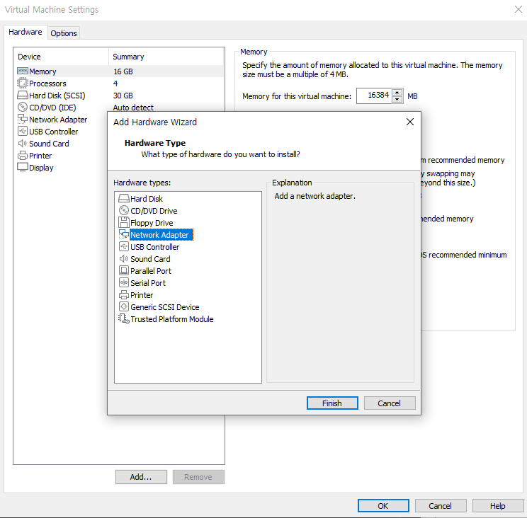
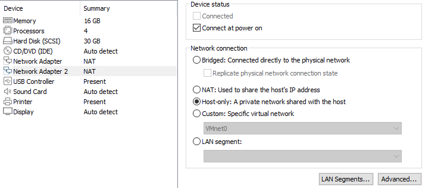
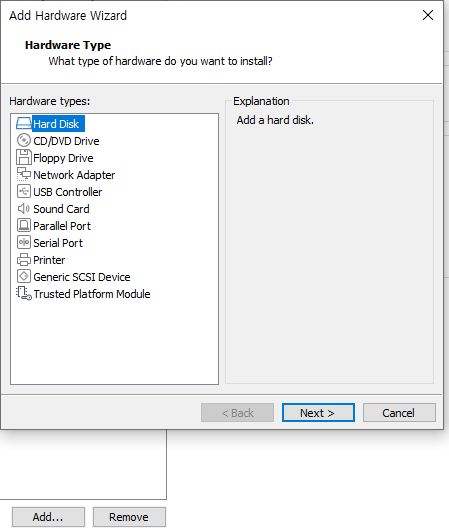
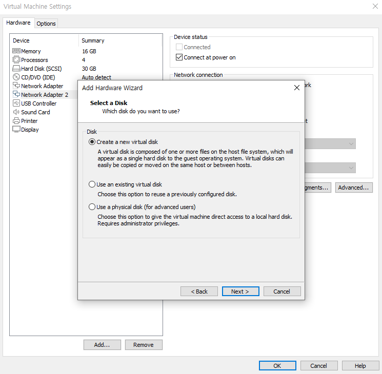
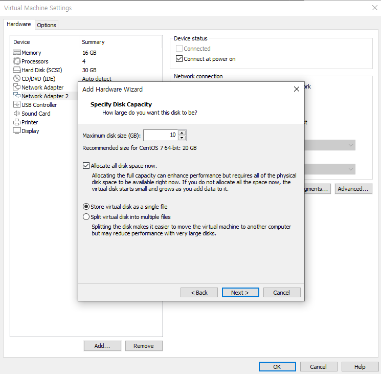
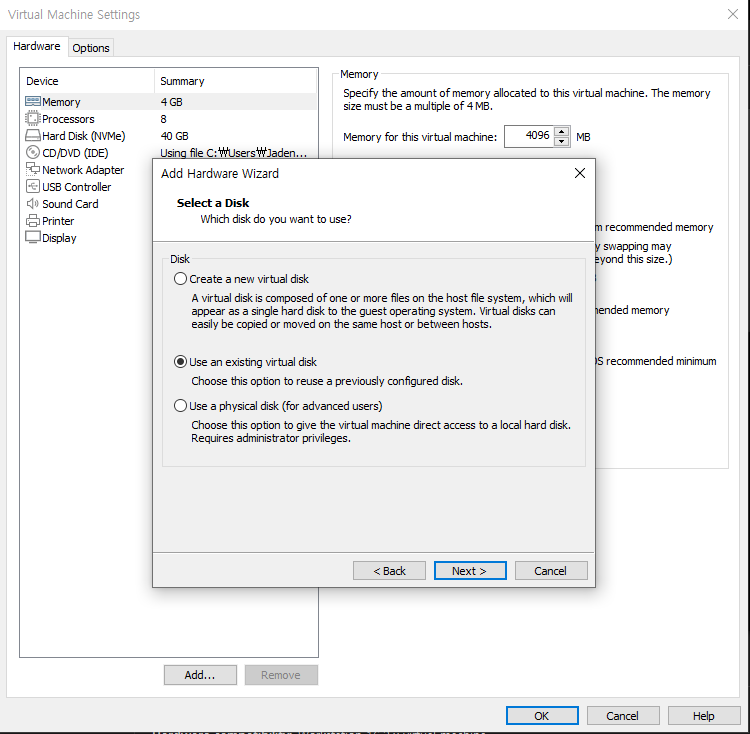
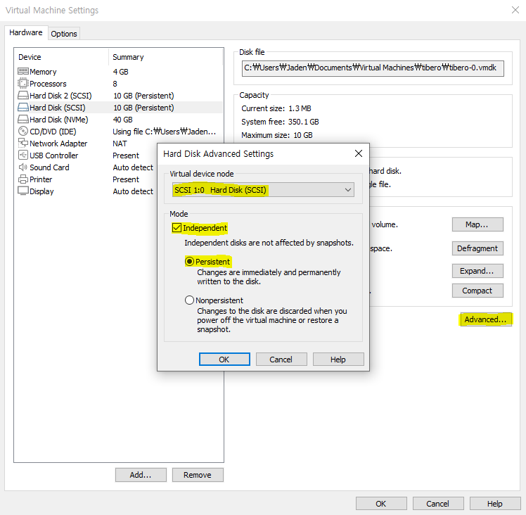
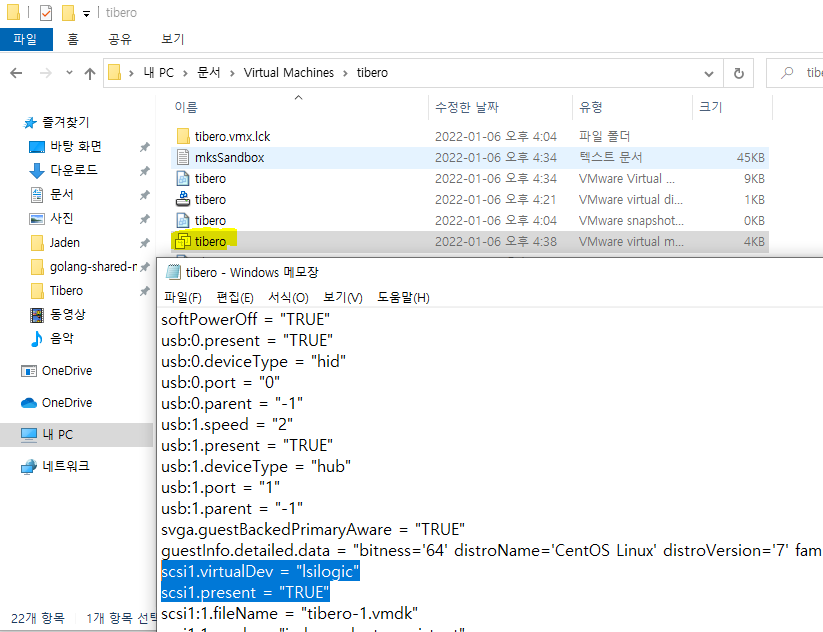

# Tibero Active Cluster

Tibero Active Cluster(TAC)는 **확장성, 고가용성을 목적으로 제공**하는 Tibero RDBMS의 주요 기능이다. TAC 환경에서 실행 중인 모든 인스턴스는 공유된 데이터베이스를 통해 트랜잭션을 수행하며, 공유된 데이터에 대한 접근은 데이터의 일관성과 정합성 유지를 위해 상호 통제하에 이뤄진다.

큰 업무를 작은 업무의 단위로 나누어 여러 노드 사이에 분산하여 수행할 수 있기 때문에 업무 처리 시간을 단축할 수 있다.

여러 시스템이 공유 디스크를 기반으로 데이터 파일을 공유한다. TAC 구성에 필요한 데이터 블록은 노드 간을 연결하는 고속 사설망을 통해 주고 받음으로써 노드가 하나의 공유 캐시(shared cache)를 사용하는 것처럼 동작한다.

운영 중에 한 노드가 멈추더라도 동작 중인 다른 노드들이 서비스를 지속하게 된다. 이러한 과정은 투명하고 신속하게 처리된다.


다음은 TAC의 간략한 구조를 나타내는 그림이다	[출처 : http://www.gurubee.net/lecture/2107]


PORT 번호는 임의의 숫자입니다.

[출처 : https://novice-data.tistory.com/60]


# Installation

## 1. 시스템 요구 사항
> **참고**
>
> 1. 현재 Windows 플랫폼의 경우 TAC를 지원하지 않는다

현재 우리 회사측에서 사용하는 Linux 기반 지원 플랫폼과 운영체제와 하드웨어, 소프트웨어 요구사항

<br>

### 1.1 지원 플랫폼 및 운영체제

| H/W, S/W | CPU              | OS                                                                                                 | Binary Bits |
|----------|------------------|----------------------------------------------------------------------------------------------------|-------------|
| GNU      | X86(Pentium4 이상) | Red Hat Enterprise Linux 7<br/>Red Hat Enterprise Linux 8.1 ~ 8.5 <br/> ProLinux 7.5<br/> CentOS 7 | 64bits      |

<br>

### 1.2 하드웨어 요구사항

| Platform  | RAM | Swap Space | /tmp Directory Space | HDD Spase <br/> (Full / Client Only) |
|-----------|-----|------------|----------------------|--------------------------------------|
| Linux/x86 | 1GB | 2GB        | 500MB                | 2.5GB / 400MB                        |

- 권장 설정 : 물리 메모리의 두 배
- 사용자 설정 : `(백그라운드 프로세스 개수 + 워커 프로세스 개수) * 프로세스 당 Swap 사용량(300MB)`

<br>

### 1.3 소프트웨어 요구사항

| Platform  | OS                                                | Compiler                                | JDK Version   |
|-----------|---------------------------------------------------|-----------------------------------------|---------------|
| Linux/x86 | Red Hat Enterprise Linux 7 <br/> Kernel 3.10.0 이상 | C99 지원 컴파일러, <br/> gcc version 4.8.5 이상 | JDK 1.5.17 이상 |

<br>
<br>

## 2. JDK 및 Tibero 다운로드
> **참고**
>
> 1. 현재 JDK 1.9 이상은 지원하지 않는다.
> 2. 벤더별 JDK 설치 방법은 각 벤더에서 제공하는 설치 안내서를 참고한다.
> 3. Tibero를 설치하기 전에 JDK 1.5.17 이상이 반드시 설치되어 있어야 합니다.

Tibero는 로그인 후 Tibero 버전과 운영체제에 맞는 것을 설치하면 됩니다.

#### [JDK Download](https://www.oracle.com/java/technologies/downloads/#java17)
#### [Tibero Download](https://technet.tmaxsoft.com/ko/front/download/findDownloadList.do?cmProductCode=0301)

<br>
<br>

## 3. 라이센스 신청

- 라이센스 신청하는 방법은 [게시물](https://github.com/jaden7856/TIL/blob/master/Tibero/1_Tibero-License.md)을 참조합니다. 여기서 하나의 Tibero를 만드는 것과 차이는 **TAC Cluster를 구성하기 위해서 Standard가 아닌 Enterprise 라이센스를 신청해야합니다.**
- 각각 node들의 hostname에 맞게 발급받으세요.

<br>
<br>

## 4. VMware 설정
CPU - 최소 4core
Memory - [ TAS - 3G / TAC - 4G / CM - 1G / OS -2G ] -> 총합 10G는 필요

### 4-1. Network Adapter

VM을 끄고, TAC 노드간 Interconnect 용으로 사용할 IP를 HostOnly로 추가해줍니다.






<br>
<br>

### 4-2. Share Disk 설정

Tibero TAC 는 공유 디스크를 기반으로 하기 때문에 데이터파일이 저장될 경로는 모든 DB 노드가 접근가능해야합니다.

각 디스크의 권한 또는 소유권을 변경해 직접 사용해도 되지만 재부팅시 디스크 이름이 변경되는 문제가 발생할 수 있으므로 이러한 문제를 예방하기 위해 
udev를 사용하여 디바이스 노드를 구성하는 방법을 권고합니다.

1. 아래 사진과 같이 Hard Disk 2를 Virtual Machine에 추가합니다. (disk 개수와 용량은 자율선택)





<br>

#### 주의 !! 

여기서 **`Allocate all disk space now.`**를 체크하지 않으면 나중에 `diskspace`를 만들때 오류가 발생



<br>

### 4-3. Shared Disk를 node2번에 추가해준다.

- 다른 노드에 용량을 추가할땐 다른 방식입니다. 기존에 있는 virtual disk를 선택해서 처음에 만들었던 `.vmdk`파일을 선택하여 추가합니다.




- 두개를 생성하면 `Advanced...`를 클릭하여 `SCSI 1:0` 과 `SCSI 1:1`을 각각 선택하고 Mode도 체크



<br>

- Virtualmachin이 설치된 곳에 vmx파일을 연결프로그램으로 메모장을 통해 열어 아래 드래그 된 것을 바꾸겠습니다. **이 과정은 device를 공유하게 만들어주는 과정입니다.**



`SharedDisk Name.vmdk`파일 밑에 문장을 추가 하겠습니다. 그리고 다른 Node들도 똑같이 바꿉니다. 추가 디바이스 개수에 따라 추가적으로 적어주시면 됩니다.

```
# scsi0:1.filename = "[SharedDisk Name].vmdk" 이 문장 밑에 적기

disk.locking="FALSE"
diskLib.dataCacheMaxSize="0"
scsi0:1.sharedbus="virtual"
scsi0:1.deviceType="disk"
```

만약 `disk.locking` 오류가 뜨면서 VM이 실행이 안될경우 기존에 이미 `disk.locking`이 있을 수 있습니다.

<br>

### 4-4. VM 실행

Minimal Install Software 로 selection을 하고 **Installation Destination을 정할때 디스크 sda만 선택하고 shared disk로 만들었던 
디스크들은 선택하지 않습니다.** 그 다음 네트워크도 설정후 reboot 클릭을 합니다.


- 생성 확인

루트 계정으로 접속 후 `/dev/sdb`, `/dev/sdc`가 생성되었다면 정상 (개인 Disk 추가 갯수에따라 다르다.)

```
$ fdisk -l | grep /dev/sd
Disk /dev/sda: 32.2 GB, 32212254720 bytes, 62914560 sectors
/dev/sda1   *        2048     2099199     1048576   83  Linux
/dev/sda2         2099200    62914559    30407680   8e  Linux LVM
Disk /dev/sdb: 10.7 GB, 10737418240 bytes, 20971520 sectors
Disk /dev/sdc: 10.7 GB, 10737418240 bytes, 20971520 sectors
```

<br>
<br>

## 5. 디스크 준비
> Node 모두 적용

### 5-1. `.rules` 파일 생성

```shell
$ vi /etc/udev/rules.d/99-tibero.rules

ACTION=="add|change", KERNEL=="sdb", RUN+="/bin/raw /dev/raw/raw1 %N"
ACTION=="add|change", KERNEL=="sdc", RUN+="/bin/raw /dev/raw/raw2 %N"

ACTION=="add|change", KERNEL=="raw*", OWNER=="tibero", GROUP=="dba", MODE=="0660"

ACTION=="add|change", KERNEL=="raw1", SYMLINK+="tas/disk01"
ACTION=="add|change", KERNEL=="raw2", SYMLINK+="tas/disk02"

ACTION=="add|change", KERNEL=="sdb", OWNER=="tibero", GROUP=="dba", MODE=="0660"
ACTION=="add|change", KERNEL=="sdc", OWNER=="tibero", GROUP=="dba", MODE=="0660"
```

<br>

### 5-2. udev rules 적용

```
$ udevadm control --reload-rules
$ udevadm trigger
```

<br>

### 5-3. 생성 확인
```
$ ll /dev/tas/

lrwxrwxrwx. 1 root root 11 Dec 14 11:08 disk01 -> ../raw/raw1
lrwxrwxrwx. 1 root root 11 Dec 14 11:08 disk02 -> ../raw/raw2
```

<br>
<br>

## 6. 설치 전 환경 구성
> 모든 노드 설정 필요

### 6-1. hosts 설정

```
$ vi /etc/hosts

192.168.x.x tibero1
192.168.x.x tibero2
```

<br>

### 6-2. JDK 적용

앞의 (2)에서 JDK 다운 받았던 bin 파일을 vm 서버로 옮겨주고 설치하겠습니다. 

```
$ tar -zxvf jdk-17_linux-x64_bin.tar.gz

$ mv jdk-17.0.5 /usr/lib/

$ vi /etc/profile

export JAVA_HOME=/usr/lib/jdk-17.0.5   # 맨 밑에 적습니다.
export PATH=$PATH:$JAVA_HOME/bin

=====================================
$ source /etc/profile
```

<br>

### 6-3 패키지 설치

Tibero 설치 시 필요한 패키지들을 설치

```
$ yum install -y gcc gcc-c++ libgcc libstdc++ libstdc++-devele compat-libstdc++ libaio libaio-devel pstack libpthread librt libm libaio libdl
```

<br>

### 6-4 커널 파라미터 설정
> **참고**
>
> SELinux를 enforce mode로 사용할 경우 프로세스가 비정상적인 동작을 할 수 있어 Tibero를 사용하는 경우 enforce mode로 설정하는 것을 권장하지 않는다.

- 방화벽 해제
```
$ systemctl stop firewalld && systemctl disable firewalld
```

**master와 node들의 메모리 설정이 다르다면 메모리 설정에 따른 값을 넣어주세요**

```
$ vi /etc/sysctl.conf

#tibero
kernel.sem = 10000 32000 10000 10000
kernel.shmall = 2097152       # ceil(shmmax/PAGE_SIZE) Linux 기본 PAGE_SIZE는 4096
kernel.shmmax = 8589934592    # 16GB이면 8589934592. 8GB이면 4294967296.
kernel.shmmni = 4096
fs.file-max = 67108864
fs.aio-max-nr = 1048576
net.ipv4.ip_local_port_range = 1024 65000
net.ipv4.tcp_rmem = 4194304
net.ipv4.tcp_wmem = 1048576
net.core.rmem_default = 262144
net.core.wmem_default = 262144
net.core.rmem_max = 4194304
net.core.wmem_max = 67108864
```

시스템 메모리가 16GB이고 Tibero RDBMS가 사용할 최대 메모리가 8GB인 경우를 기준으로 설정

`sysctl.conf`에 추가한 후에 **`sysctl -p`명령어로 동적 적용**

<br>

### 6-5. Shell Limits 파라미터

```
# nofile = MAX_SESSION_COUNT / WTHR_PROC_CNT 이상으로 설정한다.
#        - Soft Limit : 65536
#        - Hard Limit : 65536

# nproc = MAX_SESSION_COUNT+10000 이상으로 설정한다.
#        - Soft Limit : 65536
#        - Hard Limit : 65536
```

```
$ vi /etc/security/limits.conf

tibero soft nproc 65536
tibero hard nproc 65536
tibero soft nofile 65536
tibero hard nofile 65536
```

<br>

### 6-6. 유저생성

만약 Linux에 자기 계정(root 이외)이 없다면 하나 생성 후 시작하겠습니다.

```
$ groupadd dba -g 1024
$ useradd tibero -g 1024 -u 1024
```

<br>

### 6-7 .bash_profile 수정

> node 들에서 `TB_SID`와 `CM_SID`는 각각 다르게 이름을 지어준다.


- root 계정

```shell
[노드 1번]
# Tibero 7 Env
export TB_HOME=/tibero/tibero7
export PATH=.:$TB_HOME/bin:$TB_HOME/client/bin:$PATH
export LD_LIBRARY_PATH=$TB_HOME/lib:$TB_HOME/client/lib:$LD_LIBRARY_PATH

# Tibero7 CM ENV
export CM_HOME=$TB_HOME
export CM_SID=tbcm1

[노드 2번]
# Tibero 7 Env
export TB_HOME=/tibero/tibero7
export PATH=.:$TB_HOME/bin:$TB_HOME/client/bin:$PATH
export LD_LIBRARY_PATH=$TB_HOME/lib:$TB_HOME/client/lib:$LD_LIBRARY_PATH

# Tibero7 CM ENV
export CM_HOME=$TB_HOME
export CM_SID=tbcm2
```

<br>

- tibero 계정

앞서 계정을 만든 `tibero`에 접속(`su - tibero`)하여 환경변수 설정하겠습니다.

```shell
$ vi .bash_profile

[노드 1번]
# Tibero 7 Env
export TB_HOME=/tibero/tibero7
export TB_SID=tac1
export TB_PROF_DIR=$TB_HOME/bin/prof
export PATH=.:$TB_HOME/bin:$TB_HOME/client/bin:$PATH
export LD_LIBRARY_PATH=$TB_HOME/lib:$TB_HOME/client/lib:$LD_LIBRARY_PATH

export CM_SID=tbcm1
export CM_HOME=$TB_HOME

# Tibero aliases
alias tbhome='cd $TB_HOME'
alias tbbin='cd $TB_HOME/bin'
alias tblog='cd /logs/tibero'
alias tbcfg='cd $TB_HOME/config'
alias tbcfgv='vi $TB_HOME/config/$TB_SID.tip'
alias tbcli='cd ${TB_HOME}/client/config'
alias tbcliv='vi ${TB_HOME}/client/config/tbdsn.tbr'
alias tas='export TB_SID=tas1'
alias tac='export TB_SID=tac1'		

=========

[노드 2번]
# Tibero 7 Env
export TB_HOME=/tibero/tibero7
export TB_SID=tac2
export TB_PROF_DIR=$TB_HOME/bin/prof
export PATH=.:$TB_HOME/bin:$TB_HOME/client/bin:$PATH
export LD_LIBRARY_PATH=$TB_HOME/lib:$TB_HOME/client/lib:$LD_LIBRARY_PATH

export CM_SID=tbcm2
export CM_HOME=$TB_HOME

# Tibero aliases
alias tbhome='cd $TB_HOME'
alias tbbin='cd $TB_HOME/bin'
alias tblog='cd /logs/tibero'
alias tbcfg='cd $TB_HOME/config'
alias tbcfgv='vi $TB_HOME/config/$TB_SID.tip'
alias tbcli='cd ${TB_HOME}/client/config'
alias tbcliv='vi ${TB_HOME}/client/config/tbdsn.tbr'
alias tas='export TB_SID=tas2'
alias tac='export TB_SID=tac2'
```

```
$ source .bash_profile
```

```shell
# 노드 각각 profile 생성

$ vi ~/.tac_profile
$ cat ~/.tac_profile
### TAC ENV ###
export TB_SID=tac1
export TB_HOME=/tibero/tibero7
export PATH=.:$TB_HOME/bin:$TB_HOME/client/bin:$PATH
export LD_LIBRARY_PATH=$TB_HOME/lib:$TB_HOME/client/lib:$LD_LIBRARY_PATH

$ vi ~/.tas_profile
$ cat ~/.tas_profile
### TAS ENV ###
export TB_SID=tas1
export TB_HOME=/tibero/tibero7
export PATH=.:$TB_HOME/bin:$TB_HOME/client/bin:$PATH
export LD_LIBRARY_PATH=$TB_HOME/lib:$TB_HOME/client/lib:$LD_LIBRARY_PATH
```

<br>
<br>

## 7. 티베로 설치하기
> 모든 노드

앞서 (2. JDK 및 Tibero 다운로드)에서 자신의 운영체제에 맞게 저는 **Linux (x86) 64-bit** 를 다운받았습니다.

라이센스발급받았던 `license.xml`파일과 `tibero7....tar.gz`파일을 넣어주고 압축을 해제 후 `tibero7/license`폴더에 `license.xml`파일을 넣어주겠습니다.
```
$ su -
$ mkdir /tibero					                  # 경로생성

$ mv ttibero7....tar.gz /tibero/		          # tibero binary 옮기기

$ cd /tibero 					                  # 경로에 가서 tibero binary 풀어줌
$ tar -zxvf tibero7....tar.gz


$ mv /root/license.xml /tibero/tibero7/license/   # license 인스턴스의 license 경로 아래 옮겨줌

$ chown -R tibero:dba /tibero			          # tibero 하위 경로 오너쉽 변경
```

<br>
<br>

## 8. 티베로 환경파일 생성

> 모든 노드

환경변수로 설정한 `$TB_HOME`밑에 config폴더에서 `gen_tip.sh`를 실행하면 위와 같이 티베로 환경파일이 생성됩니다.

```shell
$ su - tibero
$ tac
$ $TB_HOME/config/gen_tip.sh		# alias를 했다면 tbcfg 하고 ./gen_tip.sh

Using TB_SID "tac1"   # Node 2 에서는 "tac2"
/home/vagrant/tibero6/config/tac1.tip generated
/home/vagrant/tibero6/config/psm_commands generated
/home/vagrant/tibero6/client/config/tbdsn.tbr generated.
Running client/config/gen_esql_cfg.sh
Done.
```
```shell
$ tas
$ $TB_HOME/config/gen_tip.sh		# alias를 했다면 tbcfg 하고 ./gen_tip.sh

Using TB_SID "tac1"   # Node 2 에서는 "tac2"
/home/vagrant/tibero6/config/tac1.tip generated
/home/vagrant/tibero6/config/psm_commands generated
/home/vagrant/tibero6/client/config/tbdsn.tbr generated.
Running client/config/gen_esql_cfg.sh
Done.
```

<br>
<br>

## 9. Tibero Tip File 수정

> 모든 노드

1번 노드를 위한 `CM TIP` 파일을 1번 노드의 `$TB_HOME/config` 아래에`tbcm1.tip`으로, 2 번 노드를 위한 `CM TIP` 파일을 2번 노드의 `$TB_HOME/config` 아래에 `tbcm2.tip`으로 저장하였으며, 다음 과 같이 TIP 파일을 작성하였습니다. (config 폴더에 저장해야 한다).

### 9-1. `cm.tip` 설정

- Node 1
```
$ vi $TB_HOME/config/$CM_SID.tip

CM_NAME=tbcm1
CM_UI_PORT=18629
CM_RESOURCE_FILE="/tibero/tibero7/config/tbcm1_res"
```

- Node 2
```
$ vi $TB_HOME/config/$CM_SID.tip

CM_NAME=tbcm2
CM_UI_PORT=18629
CM_RESOURCE_FILE="/tibero/tibero7/config/tbcm2_res"
```

<br>

### 9-2. `tac.tip` 설정 

**TAC 설치 파라미터입니다.** 기존에 있던 모든 값들은 삭제하거나 주석처리 합니다.

- Node 1
```
$ tac
$ vi $TB_HOME/config/$TB_SID.tip	## alias를 했다면 tbcfgv

### TAC ENV ###
DB_NAME=tac
LISTENER_PORT=8629
CONTROL_FILES="+DS0/c1.ctl","+DS0/c2.ctl"
DB_CREATE_FILE_DEST="+DS0/tbdata"

MAX_SESSION_COUNT=50
MEMORY_TARGET=2G
TOTAL_SHM_SIZE=1G

AS_PORT=28629						# TAS의 서비스 포트
USE_ACTIVE_STORAGE=Y				# TAS 를 사용하려면 파라미터 Y

CLUSTER_DATABASE=Y
THREAD=0							# node0 => THREAD=0 /node1 => THREAD=0
UNDO_TABLESPACE=UNDO0

LOCAL_CLUSTER_ADDR=192.168.40.128	# 이노드의 Interconnect IP
LOCAL_CLUSTER_PORT=9629			    #tac 노드간 통신포트
CM_PORT=18629						#tbcm1의 내부포트
```
```shell
$ vi ~/.tac_profile

### TAC ENV ###
export TB_SID=tac1
export TB_HOME=[티베로 설치 위치]
export PATH=.:$TB_HOME/bin:$TB_HOME/client/bin:$PATH
export LD_LIBRARY_PATH=$TB_HOME/lib:$TB_HOME/client/lib:$LD_LIBRARY_PATH
```

- Node 2
```
$ tac
$ vi $TB_HOME/config/$TB_SID.tip	## alias를 했다면 tbcfgv

### TAC ENV ###
DB_NAME=tac
LISTENER_PORT=8629
CONTROL_FILES="+DS0/c1.ctl","+DS0/c2.ctl"
DB_CREATE_FILE_DEST="+DS0/tbdata"

MAX_SESSION_COUNT=50
MEMORY_TARGET=2G
TOTAL_SHM_SIZE=1G

AS_PORT=28629
USE_ACTIVE_STORAGE=Y

CLUSTER_DATABASE=Y
THREAD=1
UNDO_TABLESPACE=UNDO1

LOCAL_CLUSTER_ADDR=192.168.40.129
LOCAL_CLUSTER_PORT=9629
CM_PORT=18629
```
```shell
$ vi ~/.tac_profile

### TAC ENV ###
export TB_SID=tac2
export TB_HOME=[티베로 설치 위치]
export PATH=.:$TB_HOME/bin:$TB_HOME/client/bin:$PATH
export LD_LIBRARY_PATH=$TB_HOME/lib:$TB_HOME/client/lib:$LD_LIBRARY_PATH
```

<br>

### 9-3. `tas.tip` 설정 

- Node 1

```
$ tas
$ vi $TB_HOME/config/$TB_SID.tip	## alias를 했다면 tbcfgv

DB_NAME=tas
LISTENER_PORT=28629 			# tas 서비스 포트
MAX_SESSION_COUNT=50
MEMORY_TARGET=2G
TOTAL_SHM_SIZE=1G

CLUSTER_DATABASE=Y 				    #TAS 다중화 구성하려면 Y 필수
THREAD=0 						

CM_PORT=18629 					    # 내부 CM과 소통할 Port / CM tip의 CM_UI_PORT와 같은 값
LOCAL_CLUSTER_ADDR=192.168.40.128
LOCAL_CLUSTER_PORT=29629 		    #TAS 인스턴스 간 연결 포트

INSTANCE_TYPE=AS 				    # TAS의 TIP이라는 것을 알려줌. 필수
AS_ALLOW_ONLY_RAW_DISKS=N           # RAW 디바이스를 사용하지 않으므로, 이 설정이 필요하다.
AS_WTHR_CNT=10
AS_DISKSTRING="/dev/tas/*"          # /dev/disk0과 /dev/disk1를 사용하므로 /dev/disk*값을 준다.
```
```shell
$ vi ~/.tas_profile

### TAS ENV ###
export TB_SID=tas1
export TB_HOME=[티베로 설치 위치]
export PATH=.:$TB_HOME/bin:$TB_HOME/client/bin:$PATH
export LD_LIBRARY_PATH=$TB_HOME/lib:$TB_HOME/client/lib:$LD_LIBRARY_PATH
```

- Node 2
```v
$ tas
$ vi $TB_HOME/config/$TB_SID.tip	## alias를 했다면 tbcfgv

DB_NAME=tas
LISTENER_PORT=28629
MAX_SESSION_COUNT=50
MEMORY_TARGET=2G
TOTAL_SHM_SIZE=1G

CLUSTER_DATABASE=Y
THREAD=1

CM_PORT=18629
LOCAL_CLUSTER_ADDR=192.168.40.129
LOCAL_CLUSTER_PORT=29629

INSTANCE_TYPE=AS
AS_ALLOW_ONLY_RAW_DISKS=N
AS_WTHR_CNT=10
AS_DISKSTRING="/dev/tas/*"
```
```shell
$ vi ~/.tas_profile

### TAS ENV ###
export TB_SID=tas2
export TB_HOME=[티베로 설치 위치]
export PATH=.:$TB_HOME/bin:$TB_HOME/client/bin:$PATH
export LD_LIBRARY_PATH=$TB_HOME/lib:$TB_HOME/client/lib:$LD_LIBRARY_PATH
```

<br>

### 9-4. Tibero Listener 설정 (tbdsn.tbr)

- Node 1
```v
$ tbcliv

tac1=(
    (INSTANCE=(HOST=localhost)
              (PORT=8629)
              (DB_NAME=tac)
    )
)

#-------------------------------------------------
# Appended by gen_tip.sh at Mon Jan 10 00:44:13 UTC 2022
tas1=(
    (INSTANCE=(HOST=localhost)
              (PORT=28629)
              (DB_NAME=tas)
    )
)

tac=(
    (INSTANCE=(HOST=192.168.x.146)      # vip ip
    (PORT=8629)
    (DB_NAME=tibero)
    )
    (INSTANCE=(HOST=192.168.x.147)      # vip ip
    (PORT=8629)
    (DB_NAME=tibero)
    )
    (LOAD_BALANCE=Y)
    (USE_FAILOVER=Y)
)
```

- Node 2
```
$ tbcliv

tac2=(
    (INSTANCE=(HOST=localhost)
              (PORT=8629)
              (DB_NAME=tac)
    )
)

#-------------------------------------------------
# Appended by gen_tip.sh at Mon Jan 10 00:44:13 UTC 2022
tas2=(
    (INSTANCE=(HOST=localhost)
              (PORT=28629)
              (DB_NAME=tas)
    )
)
```

<br>
<br>

## 10. cm, tas, tac

모든 설정을 마쳤으니, TAC 서비스들을 등록하고 기동하겠습니다.

<br>

### 10-1. cm, tas

아래와 같은 순서로 스크립트를 올리겠습니다.

**cm기동 -> 네트워크와 클러스터 등록 -> tas diskspace 생성 -> 클러스터 start -> tas 등록 -> tas 기동 -> tas thread 1(node2) 추가**

- **Node 1**

1번 노드부터 구성을 하면서 먼저 CM을 실행시켜야 하는데, 이를 위해서는 CM_SID가 앞서 작성한 TIP 파일의 파일 이름과 같아야 합니다(따라서 본 예제에서는 CM_SID가 `tbcm1`여야 한다).

```
# root로 cm을 기동

[root@master ~]# tbcm -b

CM Guard daemon started up.
import resources from '/tibero/tibero7/config/tbcm1_res'...

TBCM 7.1.1 (Build 254994)

TmaxTibero Corporation Copyright (c) 2020-. All rights reserved.

Tibero cluster manager started up.
Local node name is (tbcm1:18629).
```

<br>

##### tbcm 오류

아래와 같은 오류는 `tac.tip`파일에서 `PORT`번호가 겹치거나 오타 등 문제일 확율이 높다.

```
# tbcm -b
CM Guard daemon started up.
Tibero cluster manager (tbcm1) startup failed!
```

<br>

### 10-2. Network 등록

- Private

```
$ cmrctl add network --name inc1 --nettype private --ipaddr 192.168.40.128 --portno 19629

Resource add success! (network, inc1)
```

`cmrctl show`를 이용하여 리소스 상태를 확인하면 다음과 같이 출력됩니다.

```
$ cmrctl show

Resource List of Node tbcm1
=====================================================================
  CLUSTER     TYPE        NAME       STATUS           DETAIL
----------- -------- -------------- -------- ------------------------
     COMMON  network           inc1       UP (private) 192.168.40.128/19629
=====================================================================
```

<br>

- Public

ip를 확인 후 public ip `eth0`를 등록하겠습니다.

```shell
$ ifconfig

eth0: flags=4163<UP,BROADCAST,RUNNING,MULTICAST>  mtu 1500
        inet 192.168.33.136  netmask 255.255.255.0  broadcast 192.168.33.255
        inet6 fe80::20c:29ff:fef2:d698  prefixlen 64  scopeid 0x20<link>
        ether 00:0c:29:f2:d6:98  txqueuelen 1000  (Ethernet)
        RX packets 424439  bytes 523923370 (499.6 MiB)
        RX errors 0  dropped 0  overruns 0  frame 0
        TX packets 113237  bytes 10521301 (10.0 MiB)
        TX errors 0  dropped 0 overruns 0  carrier 0  collisions 0

eth1: flags=4163<UP,BROADCAST,RUNNING,MULTICAST>  mtu 1500
        inet 192.168.40.128  netmask 255.255.255.0  broadcast 192.168.40.255
        inet6 fe80::b0f9:b95d:a1d2:2930  prefixlen 64  scopeid 0x20<link>
        ether 00:0c:29:f2:d6:a2  txqueuelen 1000  (Ethernet)
        RX packets 505  bytes 51526 (50.3 KiB)
        RX errors 0  dropped 0  overruns 0  frame 0
        TX packets 66  bytes 11864 (11.5 KiB)
        TX errors 0  dropped 0 overruns 0  carrier 0  collisions 0
        device interrupt 19  base 0x2080

lo: flags=73<UP,LOOPBACK,RUNNING>  mtu 65536
        inet 127.0.0.1  netmask 255.0.0.0
        inet6 ::1  prefixlen 128  scopeid 0x10<host>
        loop  txqueuelen 1000  (Local Loopback)
        RX packets 561  bytes 76564 (74.7 KiB)
        RX errors 0  dropped 0  overruns 0  frame 0
        TX packets 561  bytes 76564 (74.7 KiB)
        TX errors 0  dropped 0 overruns 0  carrier 0  collisions 0
```

```
$ cmrctl add network --name pub1 --nettype public --ifname eth0

Resource add success! (network, pub1)
```


다음으로 아래의 명령어와 같은 방법으로 클러스터를 등록합니다.  **cluster file 등록 `+`를 경로 앞에 붙여주면 tas diskspace를 사용한다는 뜻**

```
$ cmrctl add cluster --name cls1 --incnet inc1 --pubnet pub1 --cfile "+/dev/tas/*"

Resource add success! (cluster, cls1)
```

**tas diskspace없이 cluster 기동하면 실패하게 됩니다.**

<br>

### 10-3. diskspace 생성

- 중복 레벨
  - TAS의 미러링 기능을 사용하기 위해 디스크 중복 레벨을 설정한다. 
- 실패 그룹 정의 
  - 실패 그룹을 설정할 수 있습니다. 실패 그룹을 나누게 되면 하나의 실패 그룹에 문제가 발생해도 서비스를 유지할 수 있고, 실패 그룹을 설정하게 되면 미러링을 사용할 때 복제본을 서로 다른 실패 그룹에 만들게 됩니다. 실패 그룹을 설정하지 않으면 각 디스크가 실패 그룹이 된다. 
- 디스크 스페이스 속성 
  - 할당 단위 크기 등의 속성을 설정할 수 있다. 

TAS는 각 디스크 장치의 크기를 자동으로 인식한다. 만약 디스크 장치의 크기를 자동으로 인식하지 못했 거나 디스크 장치의 사용 공간을 제한하려면, 디스크 스페이스를 생성할 때 디스크에 SIZE 절을 사용할 수 있다. 또한 NAME 절을 사용하여 디스크에 이름을 부여할 수 있습니다.

```
# su - tibero			# 자기 계정 접속
$ tas
$ tbboot nomount

Change core dump dir to /tibero/tibero7/bin/prof.
Listener port = 28629

Tibero 7

TmaxTibero Corporation Copyright (c) 2020-. All rights reserved.
Tibero instance started up (NOMOUNT mode).

$ tbsql sys/tibero

tbSQL 7

TmaxTibero Corporation Copyright (c) 2020-. All rights reserved.

Connected to Tibero.
```

<br>

중복 레벨이 NORMAL이고 실패 그룹 `fg1`, `fg2`가 있는 디스크 스페이스 `ds0`을 만든다. 이때 `AS_DISKSTRING` 초기화 파라미터를 `"/dev/tas/disk0*"`로 설정하여 발견한 디스크 장치들을 TAS 디스크로 사용한다.

```
CREATE DISKSPACE ds0 NORMAL REDUNDANCY
FAILGROUP fg1 DISK '/dev/tas/disk01' NAME disk1
FAILGROUP fg2 DISK '/dev/tas/disk02' NAME disk2
ATTRIBUTE 'AU_SIZE'='4M';

Diskspace 'DS0' created.
```

<br>

##### TBR-2131: Generic I/O error.

`tbsql sys/tibero`를 할때 이 에러가 발생했다면 파일을 열 수 없을때 발생 합니다.

파일의 경로 및 권한을 확인하고 `tbcliv`에서 포트가 알맞게 적혀있는지 확인하세요.

정확한 오류로그를 확인하기위해 **`$ tberr [오류번호]`**  입력해서 원일을 확인.

- ex) `$ tberr 2131`

##### BOOT FAILED.

이 오류는 `tbdown`으로 tb서버가 열러있는데 또 실행을 했을때 발생합니다. 그러므로 기존에 열려있던 서버를 닫아주면 해결이 됩니다.

```
***********************************************************
*                     BOOT FAILED.
* tbsvr process (16839) is alive.
* Check if there are any tbsvr instances running.
***********************************************************
```


<br>


### 10-4. tas diskspace 생성 후 기동 (아직 node1에서 진행)

nomount 모드에서 diskspace 생성하면 tas는 종료됨

```
$ ps -ef | grep tbsvr

tibero    92699  90712  0 11:15 pts/0    00:00:00 grep --color=auto tbsvr
```

```
$ su -
# cmrctl start cluster --name cls1

MSG SENDING SUCCESS!
```

```
# cmrctl show
Resource List of Node tbcm1
=====================================================================
  CLUSTER     TYPE        NAME       STATUS           DETAIL
----------- -------- -------------- -------- ------------------------
     COMMON  network           pub1       UP (public) ens33
     COMMON  network           inc1       UP (private) 192.168.40.128/19629
     COMMON  cluster           cls1       UP inc: inc1, pub: pub1
       cls1     file         cls1:0       UP +0
       cls1     file         cls1:1       UP +1
       cls1     file         cls1:2       UP +2
=====================================================================

```

<br>

### 10-5. tas 서비스 등록 및 확인

최초에 cm을 root로 기동하게 되면 `tbcm1.tip`과 `cm1_res`, `cm`의 `log` 등의 오너쉽을 `tibero:dba`로 변경하기 위해서 아래처럼 파일들이 위치한 `/tibero` 경로의 ownership을 통째로 변경해줍니다.

**권한 설정을 하지않으면 `service`실행이 권한 제한으로 되지 않으니 꼭 해주자!**

```
$ chown -R tibero:dba /tibero
```

```
# su - tibero

$ cmrctl add service --name tas --cname cls1 --type as
Resource add success! (service, tas)

$ cmrctl add as --name tas1 --svcname tas --dbhome $TB_HOME --envfile /home/tibero/.tas_profile			## -- envfile [.tas_profile 위치]
Resource add success! (as, tas1)

$ cmrctl start as --name tas1
Listener port = 28629

Tibero 7

TmaxTibero Corporation Copyright (c) 2020-. All rights reserved.
Tibero instance started up (NORMAL mode).
BOOT SUCCESS! (MODE : NORMAL)
```

```
$ cmrctl show
Resource List of Node tbcm1
=====================================================================
  CLUSTER     TYPE        NAME       STATUS           DETAIL
----------- -------- -------------- -------- ------------------------
     COMMON  network           pub1       UP (public) ens33
     COMMON  network           inc1       UP (private) 192.168.40.128/19629
     COMMON  cluster           cls1       UP inc: inc1, pub: pub1
       cls1     file         cls1:0       UP +0
       cls1     file         cls1:1       UP +1
       cls1     file         cls1:2       UP +2
       cls1  service            tas       UP Active Storage, Active Cluster (auto-restart: OFF)
       cls1       as           tas1 UP(NRML) tas, /tibero/tibero7, failed retry cnt: 0
=====================================================================
```

<br>

#### thread 1 (node2)를 등록해야 node2 tas에서 diskspace(ds0)를 공유하고 접속 가능함

```
$ tbsql sys/tibero

SQL> alter diskspace ds0 add thread 1;

Diskspace altered.

SQL> q
Disconnected.
```

<br>

### 10-6. node2

tbcm 가동 및 private, public 등록 및 확인

```
$ su -
$ tbcm -b

$ cmrctl add network --name inc2 --nettype private --ipaddr 192.168.40.129 --portno 19629

$ cmrctl add network --name pub2 --nettype public --ifname eth0

# cmrctl show

Resource List of Node tbcm2
=====================================================================
  CLUSTER     TYPE        NAME       STATUS           DETAIL
----------- -------- -------------- -------- ------------------------
     COMMON  network           inc2       UP (private) 192.168.40.129/19630
     COMMON  network           pub2       UP (public) eth0
=====================================================================
```

<br>

### 10-7. Cluster 등록

cluster는 node1과 같은 이름으로 등록해주어야 합니다.
  - node1에서 등록한 tas 서비스가 보이는 것을 확인할 수 있다.

```
$ cmrctl add cluster --name cls1 --incnet inc2 --pubnet pub2 --cfile "+/dev/tas/*"

$ cmrctl start cluster --name cls1

$ cmrctl show

Resource List of Node tbcm2
=====================================================================
  CLUSTER     TYPE        NAME       STATUS           DETAIL
----------- -------- -------------- -------- ------------------------
     COMMON  network           inc2       UP (private) 192.168.40.129/19629
     COMMON  network           pub2       UP (public) ens33
     COMMON  cluster           cls1       UP inc: inc2, pub: pub2
       cls1     file         cls1:0       UP +0
       cls1     file         cls1:1       UP +1
       cls1     file         cls1:2       UP +2
       cls1  service            tas       UP Active Storage, Active Cluster (auto-restart: OFF)
=====================================================================
```

<br>

### 10-8. Service 등록

```
# chown -R tibero:dba /tibero

# su - tibero

$ tas

$ cmrctl add as --name tas2 --svcname tas --dbhome $TB_HOME --envfile /home/tibero/.tas_profile

$ cmrctl start as --name tas2

Listener port = 28629

Tibero 7

TmaxTibero Corporation Copyright (c) 2020-. All rights reserved.
Tibero instance started up (NORMAL mode).
BOOT SUCCESS! (MODE : NORMAL)
```

<br>

##### 오류.  Failed to start the resource

권한 설정을 하지않으면 아래와 같은 오류가 발생합니다. `10-8.`으로 가서 권한 설정 방법을 보고 해결

```
$ cmrctl start as --name tas2
Failure to create directory: /home/tibero/tibero6/instance/tas2 (13:Permission denied)
Failure to create directory: /home/tibero/tibero6/instance/tas2 (13:Permission denied)
Create directory fail cascade: /home/tibero/tibero6/instance/tas2/log
Create directory fail cascade: /home/tibero/tibero6/instance/tas2/log/dlog
tb_open_logfd(/home/tibero/tibero6/instance/tas2/log/dlog/dbms.log, 1090, 420) failed.
Failed to start the resource 'tas2'
```

##### 오류. same key already exists

저는 `tas2` 서비스가 실행이 되지않고 오류가 발생하였습니다. 오류 설명대로 같은 공유메모리 키를 사용중인것 같아 삭제를 하고 다시 실행하겠습니다.

```
$ cmrctl start as --name tas2
Failure to create directory: /home/vagrant/tibero6/instance/tas2 (13:Permission denied)
***************************************************************************
* A shared memory segment with the same key already exists.
* SHM_KEY = 0xd541e17e
* Trying to reuse the shared memory segment....
***************************************************************************
Failure to create directory: /home/vagrant/tibero6/instance/tas2 (13:Permission denied)
Create directory fail cascade: /home/vagrant/tibero6/instance/tas2/log
Create directory fail cascade: /home/vagrant/tibero6/instance/tas2/log/dlog
tb_open_logfd(/home/vagrant/tibero6/instance/tas2/log/dlog/dbms.log, 1090, 420) failed.
Failed to start the resource 'tas2'
```

```
# ipcs
------ Message Queues --------
key        msqid      owner      perms      used-bytes   messages

------ Shared Memory Segments --------
key        shmid      owner      perms      bytes      nattch     status
0xd541e17e 0          tibero     640        2147483648 0

------ Semaphore Arrays --------
key        semid      owner      perms      nsems
```

```
# ipcrm -m 0
# ipcs
------ Message Queues --------
key        msqid      owner      perms      used-bytes   messages

------ Shared Memory Segments --------
key        shmid      owner      perms      bytes      nattch     status

------ Semaphore Arrays --------
key        semid      owner      perms      nsems
```

<br>
<br>

##  11. tac, vip

- VIP failover 

TAC 클러스터의 노드에 장애가 발생하면 공용 IP에 액세스 할 수 없지만 가상 IP는 연결 및 연결 장애 조치에 사용됩니다.

<br>

### 11-1. node1

tac 서비스 생성, tac 서비스에 tac1 등록

```
$ su - tibero
$ tac

$ cmrctl add service --name tac --cname cls1 --type db

$ cmrctl add db --name tac1 --svcname tac --dbhome $TB_HOME --envfile /home/tibero/.tac_profile

$ cmrctl show

Resource List of Node tbcm1
=====================================================================
  CLUSTER     TYPE        NAME       STATUS           DETAIL
----------- -------- -------------- -------- ------------------------
     COMMON  network           inc1       UP (private) 192.168.40.128/19629
     COMMON  network           pub1       UP (public) ens33
     COMMON  cluster           cls1       UP inc: inc1, pub: pub1
       cls1     file         cls1:0       UP +0
       cls1     file         cls1:1       UP +1
       cls1     file         cls1:2       UP +2
       cls1  service            tas       UP Active Storage, Active Cluster (auto-restart: OFF)
       cls1  service            tac     DOWN Database, Active Cluster (auto-restart: OFF)
       cls1       as           tas1 UP(NRML) tas, /tibero/tibero7, failed retry cnt: 0
       cls1       db           tac1     DOWN tac, /tibero/tibero7, failed retry cnt: 0
=====================================================================
```

<br>

### 11-2. database 생성

```
$ tbboot nomount

$ tbsql sys/tibero

Connected to Tibero.

SQL> create database
user sys identified by tibero
character set UTF8 -- UTF8, EUCKR, ASCII, MSWIN949
national character set utf16
logfile group 0 ('+DS0/tac/log01.redo') size 100M,
        group 1 ('+DS0/tac/log11.redo') size 100M,
        group 2 ('+DS0/tac/log21.redo') size 100M
maxdatafiles 2048
maxlogfiles 100
maxlogmembers 8
noarchivelog
  datafile '+DS0/tbdata/system001.dtf' size 256M autoextend on next 100M maxsize 2G
default tablespace USR 
  datafile '+DS0/tbdata/usr001.dtf' size 256M autoextend on next 100M maxsize 2G
default temporary tablespace TEMP
  tempfile '+DS0/tbdata/temp001.dtf' size 128M autoextend on next 10M maxsize 1G
  extent management local AUTOALLOCATE
undo tablespace UNDO0
  datafile '+DS0/tbdata/undo001.dtf' size 128M autoextend on next 10M maxsize 1G
  extent management local AUTOALLOCATE
;

Database created.

SQL> q
Disconnected.
```

<br>

### 11-3. undo, redo 추가

tac 프로세서 떠있는 것 확인

```
# database를 생성하면 db 인스턴스가 종료됨
$ ps -ef |grep tbsvr
tibero    13512      1  0 08:01 pts/0    00:00:06 tbsvr          -t NORMAL -SVR_SID tas1
tibero    13514  13512  0 08:01 pts/0    00:00:00 tbsvr_MGWP     -t NORMAL -SVR_SID tas1
tibero    13515  13512  0 08:01 pts/0    00:00:02 tbsvr_FGWP000  -t NORMAL -SVR_SID tas1
tibero    13516  13512  0 08:01 pts/0    00:00:00 tbsvr_FGWP001  -t NORMAL -SVR_SID tas1
tibero    13517  13512  0 08:01 pts/0    00:00:00 tbsvr_FGWP002  -t NORMAL -SVR_SID tas1
tibero    13518  13512  0 08:01 pts/0    00:00:00 tbsvr_FGWP003  -t NORMAL -SVR_SID tas1
tibero    13519  13512  0 08:01 pts/0    00:00:00 tbsvr_FGWP004  -t NORMAL -SVR_SID tas1
tibero    13520  13512  0 08:01 pts/0    00:00:11 tbsvr_AGNT     -t NORMAL -SVR_SID tas1
tibero    13521  13512  0 08:01 pts/0    00:00:15 tbsvr_DBWR     -t NORMAL -SVR_SID tas1
tibero    13522  13512  0 08:01 pts/0    00:00:01 tbsvr_RCWP     -t NORMAL -SVR_SID tas1
tibero    13523  13512  0 08:01 pts/0    00:00:08 tbsvr_ASSD     -t NORMAL -SVR_SID tas1
tibero    13524  13512  0 08:01 pts/0    00:00:10 tbsvr_ACSD     -t NORMAL -SVR_SID tas1
tibero    68730  65720  0 11:04 pts/0    00:00:00 grep --color=auto tbsvr

$ tbboot
Change core dump dir to /tibero/tibero7/bin/prof.
Listener port = 8629

Tibero 7

TmaxTibero Corporation Copyright (c) 2020-. All rights reserved.
Tibero instance started up (NORMAL mode).

# tac 프로세스 확인
$ ps -ef |grep tbsvr
tibero    13512      1  0 08:01 pts/0    00:00:06 tbsvr          -t NORMAL -SVR_SID tas1
tibero    13514  13512  0 08:01 pts/0    00:00:00 tbsvr_MGWP     -t NORMAL -SVR_SID tas1
tibero    13515  13512  0 08:01 pts/0    00:00:02 tbsvr_FGWP000  -t NORMAL -SVR_SID tas1

                              :
                              :

tibero    69139      1  1 11:05 pts/0    00:00:00 tbsvr          -t NORMAL -SVR_SID tac1
tibero    69146  69139  0 11:05 pts/0    00:00:00 tbsvr_MGWP     -t NORMAL -SVR_SID tac1
tibero    69147  69139  0 11:05 pts/0    00:00:00 tbsvr_FGWP000  -t NORMAL -SVR_SID tac1
tibero    69148  69139  0 11:05 pts/0    00:00:00 tbsvr_FGWP001  -t NORMAL -SVR_SID tac1
                              
                              :
                              :
                              
tibero    69161  69139  0 11:05 pts/0    00:00:00 tbsvr_ASSD     -t NORMAL -SVR_SID tac1
tibero    69162  69139  0 11:05 pts/0    00:00:00 tbsvr_ACSD     -t NORMAL -SVR_SID tac1
tibero    69632  65720  0 11:06 pts/0    00:00:00 grep --color=auto tbsvr
```

```
$ tbsql sys/tibero

Connected to Tibero.

SQL> create undo tablespace undo1 datafile '+DS0/tbdata/undo1.dtf' size 128M
autoextend on next 10M maxsize 1G
extent management local autoallocate; 

Tablespace 'UNDO1' created.
```

```
SQL> alter database add logfile thread 1 group 3 '+DS0/tac/log02.log' size 100M;
Database altered.

SQL> alter database add logfile thread 1 group 4 '+DS0/tac/log12.log' size 100M;
Database altered.

SQL> alter database add logfile thread 1 group 5 '+DS0/tac/log22.log' size 100M;
Database altered.

SQL> alter database enable public thread 1;
Database altered.

SQL> q
Disconnected.
```

<br>

### 11-4. system shell

`system shell`을 수행하면 system에서 사용하는 기본 스키마와 오브젝트 등이 생성됨

```
$ sh $TB_HOME/scripts/system.sh -p1 tibero -p2 syscat -a1 y -a2 y -a3 y -a4 y

Creating additional system index...
Dropping agent table...
Creating client policy table ...
Creating text packages table ...
Creating the role DBA...
Creating system users & roles...
Creating example users...

     :
     :
     
Creating internal system jobs...
Creating Japanese Lexer epa source ...
Creating internal system notice queue ...
Creating sql translator profiles ...
Creating agent table...
Done.
For details, check /tibero/tibero7/instance/tac1/log/system_init.log.
```

<br>

### 11-5. vip 등록

vip 등록을 위해선 tbcm이 root권한으로 실행되어 있어야 하며, svcname으로 지정한 서비스에 pubnet attribute가 등록되어 있어야 합니다. 

환경변수 PATH에 /sbin 경로가 잡혀있지 않으면 VIP alias에 실패하므로 확인해야 합니다.

```
$ cmrctl add vip --name vip1 --node $CM_SID --svcname tac --ipaddr 192.168.33.156/255.255.255.0 --bcast 192.168.33.255

$ cmrctl show

Resource List of Node tbcm1
=====================================================================
  CLUSTER     TYPE        NAME       STATUS           DETAIL
----------- -------- -------------- -------- ------------------------
     COMMON  network           inc1       UP (private) 192.168.40.128/19629
     COMMON  network           pub1       UP (public) ens33
     COMMON  cluster           cls1       UP inc: inc1, pub: pub1
       cls1     file         cls1:0       UP +0
       cls1     file         cls1:1       UP +1
       cls1     file         cls1:2       UP +2
       cls1  service            tas       UP Active Storage, Active Cluster (auto-restart: OFF)
       cls1  service            tac       UP Database, Active Cluster (auto-restart: OFF)
       cls1       as           tas1 UP(NRML) tas, /tibero/tibero7, failed retry cnt: 0
       cls1       db           tac1 UP(NRML) tac, /tibero/tibero7, failed retry cnt: 0
       cls1      vip           vip1       UP tac, 192.168.33.156/255.255.255.0/192.168.33.255 (1)
                                             failed retry cnt: 0
=====================================================================
```


- vip 등록에 성공하면, cm이 자동으로 추가

```shell
$ ifconfig

ens33: flags=4163<UP,BROADCAST,RUNNING,MULTICAST>  mtu 1500
        inet 192.168.33.136  netmask 255.255.255.0  broadcast 192.168.33.255
        inet6 fe80::f6de:316:507e:ae36  prefixlen 64  scopeid 0x20<link>
        ether 00:0c:29:76:43:99  txqueuelen 1000  (Ethernet)
        RX packets 4699  bytes 389449 (380.3 KiB)
        RX errors 0  dropped 0  overruns 0  frame 0
        TX packets 2856  bytes 320586 (313.0 KiB)
        TX errors 0  dropped 0 overruns 0  carrier 0  collisions 0

ens33:1: flags=4163<UP,BROADCAST,RUNNING,MULTICAST>  mtu 1500
        inet 192.168.33.156  netmask 255.255.255.0  broadcast 192.168.33.255
        ether 00:0c:29:76:43:99  txqueuelen 1000  (Ethernet)

ens34: flags=4163<UP,BROADCAST,RUNNING,MULTICAST>  mtu 1500
        inet 192.168.40.128  netmask 255.255.255.0  broadcast 192.168.40.255
        inet6 fe80::99c8:3bc1:4949:da28  prefixlen 64  scopeid 0x20<link>
        ether 00:0c:29:76:43:a3  txqueuelen 1000  (Ethernet)
        RX packets 67175  bytes 7158218 (6.8 MiB)
        RX errors 0  dropped 0  overruns 0  frame 0
        TX packets 59743  bytes 23002875 (21.9 MiB)
        TX errors 0  dropped 0 overruns 0  carrier 0  collisions 0

lo: flags=73<UP,LOOPBACK,RUNNING>  mtu 65536
        inet 127.0.0.1  netmask 255.0.0.0
        inet6 ::1  prefixlen 128  scopeid 0x10<host>
        loop  txqueuelen 1000  (Local Loopback)
        RX packets 49046  bytes 15957074 (15.2 MiB)
        RX errors 0  dropped 0  overruns 0  frame 0
        TX packets 49046  bytes 15957074 (15.2 MiB)
        TX errors 0  dropped 0 overruns 0  carrier 0  collisions 0
```

<br>

### 11-6. node2

- node2에서도 vip1이 보여야 합니다.

```
$ cmrctl show

Resource List of Node tbcm2
=====================================================================
  CLUSTER     TYPE        NAME       STATUS           DETAIL
----------- -------- -------------- -------- ------------------------
     COMMON  network           inc2       UP (private) 192.168.40.129/19629
     COMMON  network           pub2       UP (public) ens33
     COMMON  cluster           cls1       UP inc: inc2, pub: pub2
       cls1     file         cls1:0       UP +0
       cls1     file         cls1:1       UP +1
       cls1     file         cls1:2       UP +2
       cls1  service            tas       UP Active Storage, Active Cluster (auto-restart: OFF)
       cls1  service            tac       UP Database, Active Cluster (auto-restart: OFF)
       cls1       as           tas2 UP(NRML) tas, /tibero/tibero7, failed retry cnt: 0
       cls1      vip           vip1    UP(R) tac, 192.168.33.156/255.255.255.0/192.168.33.255 (1)
                                             failed retry cnt: 0
=====================================================================
```

<br>

### 11-7. tac2를 tac 서비스에 등록

```
$ tac

$ cmrctl add db --name tac2 --svcname tac --dbhome $TB_HOME --envfile /home/tibero/.tac_profile

$ cmrctl start db --name tac2

Listener port = 8629

Tibero 7

TmaxTibero Corporation Copyright (c) 2020-. All rights reserved.
Tibero instance started up (NORMAL mode).
BOOT SUCCESS! (MODE : NORMAL)

$ cmrctl show

Resource List of Node tbcm2
=====================================================================
  CLUSTER     TYPE        NAME       STATUS           DETAIL
----------- -------- -------------- -------- ------------------------
     COMMON  network           inc2       UP (private) 192.168.40.129/19629
     COMMON  network           pub2       UP (public) ens33
     COMMON  cluster           cls1       UP inc: inc2, pub: pub2
       cls1     file         cls1:0       UP +0
       cls1     file         cls1:1       UP +1
       cls1     file         cls1:2       UP +2
       cls1  service            tas       UP Active Storage, Active Cluster (auto-restart: OFF)
       cls1  service            tac       UP Database, Active Cluster (auto-restart: OFF)
       cls1       as           tas2 UP(NRML) tas, /tibero/tibero7, failed retry cnt: 0
       cls1       db           tac2 UP(NRML) tac, /tibero/tibero7, failed retry cnt: 0
       cls1      vip           vip1    UP(R) tac, 192.168.33.156/255.255.255.0/192.168.33.255 (1)
                                             failed retry cnt: 0
=====================================================================
```

<br>

### 11-8. VIP 등록

```
$ cmrctl add vip --name vip3 --node $CM_SID --svcname tac --ipaddr 192.168.33.157/255.255.255.0 --bcast 192.168.33.255
```

##### 오류. Control file open failed

이 경우 `tbcfgv`에서 `CONTROL_FILE`의 주소가 node1과 node2가 틀릴때 발생하거나 권한 문제입니다.

```
********************************************************
* Critical Warning : Raise svmode failed. The reason is
*   TBR-24003 :  Unable to read control file.
*   Current server mode is NOMOUNT.
********************************************************
```

<br>
<br>

## 12. 최종확인

```
$ cmrctl show service --name tac
Service Resource Info
=================================================
Service name    : tac
Service type    : Database
Service mode    : Active Cluster
Cluster         : cls1
Inst. Auto Start: OFF
Interrupt Status: COMMITTED
Incarnation No. : 4 / 4 (CUR / COMMIT)
=================================================
| INSTANCE LIST                                 |
|-----------------------------------------------|
| NID   NAME    Status  Intr Stat ACK No. Sched |
| --- -------- -------- --------- ------- ----- |
|   1    tbcm1 UP(NRML) COMMITTED       4     Y |
|   2    tbcm2 UP(NRML) COMMITTED       4     Y |
=================================================
```

```
$ cmrctl show service --name tas
Service Resource Info
=================================================
Service name    : tas
Service type    : Active Storage
Service mode    : Active Cluster
Cluster         : cls1
Inst. Auto Start: OFF
Interrupt Status: COMMITTED
Incarnation No. : 2 / 2 (CUR / COMMIT)
=================================================
| INSTANCE LIST                                 |
|-----------------------------------------------|
| NID   NAME    Status  Intr Stat ACK No. Sched |
| --- -------- -------- --------- ------- ----- |
|   1    tbcm1 UP(NRML) COMMITTED       2     Y |
|   2    tbcm2 UP(NRML) COMMITTED       2     Y |
=================================================
```

<br>
<br>

## 13. TAC 정지

- DB -> TAS -> CM 순으로 종료

```
$ tac

$ tbdown

$ tas

$ tbdown

$ su -

# tbcm -d
```

<br>
<br>

## 14. 참고

- 빠르게 네트워크를 써치하고 찾을 수 있도록 network resource의 name들을 등록해 줍니다.

  운영기에서는 속도가 중요하여 해당 작업이 중요할 수 있습니다.

```
vi /etc/hosts
#### Tibero CLUSTER Manager ## 
192.168.33.131 pub1
192.168.33.154 vip1
192.168.40.129 net1

192.168.33.130 pub2
192.168.33.155 vip2
192.168.40.130 net2
```

