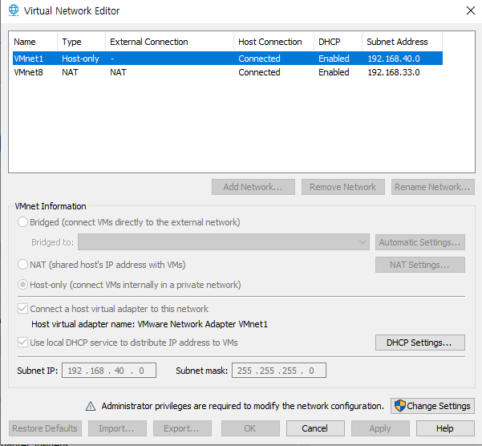
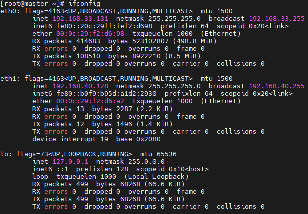
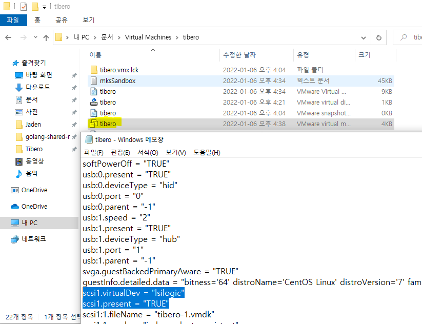

# Tibero Active Cluster

Tibero Active Cluster(TAC)는 **확장성, 고가용성을 목적으로 제공**하는 Tibero RDBMS의 주요 기능이다. TAC 환경에서 실행 중인 모든 인스턴스는 공유된 데이터베이스를 통해 트랜잭션을 수행하며, 공유된 데이터에 대한 접근은 데이터의 일관성과 정합성 유지를 위해 상호 통제하에 이뤄진다.

큰 업무를 작은 업무의 단위로 나누어 여러 노드 사이에 분산하여 수행할 수 있기 때문에 업무 처리 시간을 단축할 수 있다.

여러 시스템이 공유 디스크를 기반으로 데이터 파일을 공유한다. TAC 구성에 필요한 데이터 블록은 노드 간을 연결하는 고속 사설망을 통해 주고 받음으로써 노드가 하나의 공유 캐시(shared cache)를 사용하는 것처럼 동작한다.

운영 중에 한 노드가 멈추더라도 동작 중인 다른 노드들이 서비스를 지속하게 된다. 이러한 과정은 투명하고 신속하게 처리된다.


다음은 TAC의 간략한 구조를 나타내는 그림이다	[출처 : http://www.gurubee.net/lecture/2107]


[출처 : https://novice-data.tistory.com/60]


# Installation

우선 사용하고자하는 노드의 숫자만큼 생성을 생성을 합니다. 저는 master와 node 2개를 생성했습니다. 


### 1. 라이센스 신청

- 라이센스 신청하는 방법은 [게시물](https://github.com/jaden7856/TIL/blob/master/Tibero/1_Tibero-License.md)을 참조합니다. 여기서 하나의 Tibero를 만드는 것과 차이는 **TAC Cluster를 구성하기 위해서 Standard가 아닌 Enterprise 라이센스를 신청해야합니다.**
- 각각 node들의 hostname에 맞게 발급받으세요.


### 2. VMware 설정

#### add - Network Adapter

TAC 노드간 Interconnect 용으로 사용할 IP를 HostOnly로 추가해줍니다.


- VM Network 확인




- 네트워크 확인




### 3. Share Disk 설정

Tibero TAC 는 공유 디스크를 기반으로 하기 때문에 데이터파일이 저장될 경로는 모든 DB 노드가 접근가능해야한다. 공유 파일시스템으로도 구성할 수 있지만 raw device 를 기반으로 설치하겠습니다.

1. 아래 사진과 같이 Hard Disk 2를 Virtual Machine에 추가합니다. 


**총 2개에서 3개 disk를 추가한다.**


#### 3)에서 Shared Disk를 node2번에 추가해준다.

- 다른 노드에 용량을 추가할땐 다른 방식입니다. 기존에 있는 virtual disk를 선택해서 처음에 만들었던 `.vmdk`파일을 선택하여 추가합니다.


- 두개를 생성하면 `Advanced...`를 클릭하여 `SCSI 1:0` 과 `SCSI 1:1`을 각각 선택하고 Mode도 체크


- Virtualmachin이 설치된 곳에 vmx파일을 연결프로그램으로 메모장을 통해 열어 아래 드래그 된 것을 바꾸겠습니다. **이 과정은 device를 공유하게 만들어주는 과정입니다.**




드래그 한 부분을 밑에 문장으로 바꾸도록 하겠습니다. 그리고 다른 Node들도 똑같이 바꿉니다.

```
# Bgin Shared Controller( LSI Logic )
disk.locking = "FALSE"
scsi1.present = "TRUE"
scsi1.virtualDev = "lsilogic"
scsi1.sharedBus = "VIRTUAL"
```


- 생성 확인

루트 계정으로 접속 후 `/dev/sdb`가 생성되었다면 정상 (개인 Disk 추가 갯수에따라 다르다.)

```
# ls -l /dev/sd*
brw-rw----. 1 root disk 8,  0 Jan  6 01:11 /dev/sda
brw-rw----. 1 root disk 8,  1 Jan  6 01:11 /dev/sda1
brw-rw----. 1 root disk 8, 16 Jan  6 01:11 /dev/sdb
brw-rw----. 1 root disk 8, 32 Jan  7 07:50 /dev/sdc
```


####  .rules 파일 생성 (노드 모두 적용)

```
$ vi /etc/udev/rules.d/99-tibero.rules

ACTION=="add|change", KERNEL=="sdb", RUN+="/bin/raw /dev/raw/raw1 %N"
ACTION=="add|change", KERNEL=="sdc", RUN+="/bin/raw /dev/raw/raw2 %N"

ACTION=="add|change", KERNEL=="raw*", OWNER=="tibero", GROUP=="dba", MODE=="0660"

ACTION=="add|change", KERNEL=="raw1", SYMLINK+="tas/disk01"
ACTION=="add|change", KERNEL=="raw2", SYMLINK+="tas/disk02"

ACTION=="add|change", KERNEL=="sdb", OWNER=="tibero", GROUP=="dba", MODE=="0660"
ACTION=="add|change", KERNEL=="sdc", OWNER=="tibero", GROUP=="dba", MODE=="0660"
```


#### . udev rules 적용

```
$ udevadm control --reload-rules
$ udevadm trigger
```


#### . 생성 확인

```
$ ll /dev/tas/
total 0
lrwxrwxrwx. 1 root root 11 Dec 20 09:15 disk01 -> ../raw/raw1
lrwxrwxrwx. 1 root root 11 Dec 20 09:15 disk02 -> ../raw/raw2

$ raw -qa
/dev/raw/raw1:  bound to major 8, minor 16
/dev/raw/raw2:  bound to major 8, minor 32
```


### 3. 설치 전 환경 구성

> **master, node 2개 모두 설치**

##### 2-0. hosts 설정

```
# vi /etc/hosts
```

```
192.168.1.x master
192.168.1.x node1
192.168.1.x node2
```


##### 2-1. JDK 설치

Tibero를 설치하기 위해서는 `JDK 1.5.17` 이상 버전이 필요합니다. 저는 Openjdk 8 버전을 설치했습니다.

```
# yum install java-1.8.0-openjdk-devel.x86_64
```


##### 2-2 패키지 설치

Tibero 설치 시 필요한 패키지들을 설치

```
# yum install gcc gcc-c++ libgcc libstdc++ libstdc++-devele compat-libstdc++ libaio libaio-devel
```


##### 2-3 커널 파라미터 설정

**master와 node들의 메모리 설정이 다르다면 메모리 설정에 따른 값을 넣어주세요**

`sysctl.conf`파일에 들어간 후 맨밑 하단에 밑의 값들을 추가합니다.

```
# vi /etc/sysctl.conf
```

```
#tibero
kernel.sem = 10000 32000 10000 10000
kernel.shmmax = 8589934592		# 시스템의 물리적인 메모리 절반 (byte 단위)
kernel.shmall = ceil(SHMMAX/PAGE_SIZE)값보다 크게	# Linux 기본 PAGE_SIZE는 4096
kernel.shmmni = 4096
fs.file-max = 6815744
net.ipv4.ip_local_port_range = 1024 65000
```

시스템 메모리가 16GB이고 Tibero RDBMS가 사용할 최대 메모리가 8GB인 경우를 기준으로 설정

 `sysctl.conf`에 추가한 후에 **`sysctl -p`명령어로 동적 적용**


##### 2-4 .bash_profile 수정

> **master, node들에서 `TB_SID`와 `CM_SID`는 각각 다르게 이름을 지어준다. 
>
>  ex) master - tibero1, node1 - tibero2...

```
$ vi .bash_profile
```

```shell
# Tibero 6 Env
export TB_HOME=[티베로 설치 위치]
export TB_SID=tac1 ## DB Instance 별 ID. 두번째 노드는 tac2
export PATH=.:$TB_HOME/bin:$TB_HOME/client/bin:$PATH
export LD_LIBRARY_PATH=$TB_HOME/lib:$TB_HOME/client/lib:$LD_LIBRARY_PATH

export TB_PROF_DIR=$TB_HOME/bin/prof

# Tibero TBCM Env
export CM_SID=tbcm1	## Cluster Manager ID. 두번째 노드는 tbcm2
export CM_HOME=$TB_HOME

# Tibero aliases
alias tbhome='cd $TB_HOME'
alias tbbin='cd $TB_HOME/bin'
alias tblog='cd /logs/tibero'
alias tbcfg='cd $TB_HOME/config'
alias tbcfgv='vi $TB_HOME/config/$TB_SID.tip'
alias tbcli='cd ${TB_HOME}/client/config'
alias tbcliv='vi ${TB_HOME}/client/config/tbdsn.tbr'
alias tas='export TB_SID=tas1'							# 노드2에서는 tas2
alias tac='export TB_SID=tac1'							# 노드2에서는 tac2
```

```
$ source .bash_profile
```


- tibero tac_profile (node1)

```
$ vi ~/.tac_profile
$ cat ~/.tac_profile

### TAC ENV ###
export TB_SID=tac1
export TB_HOME=[티베로 설치 위치]
export PATH=.:$TB_HOME/bin:$TB_HOME/client/bin:$PATH
export LD_LIBRARY_PATH=$TB_HOME/lib:$TB_HOME/client/lib:$LD_LIBRARY_PATH
```

 

- tibero tas_profile (node1)

```
$ vi ~/.tas_profile
$ cat ~/.tas_profile

### TAS ENV ###
export TB_SID=tas1
export TB_HOME=[티베로 설치 위치]
export PATH=.:$TB_HOME/bin:$TB_HOME/client/bin:$PATH
export LD_LIBRARY_PATH=$TB_HOME/lib:$TB_HOME/client/lib:$LD_LIBRARY_PATH
```

 

- ibero tac_profile (node2)

```
$ vi ~/.tac_profile
$ cat ~/.tac_profile

### TAC ENV ###
export TB_SID=tac2
export TB_HOME=[티베로 설치 위치]
export PATH=.:$TB_HOME/bin:$TB_HOME/client/bin:$PATH
export LD_LIBRARY_PATH=$TB_HOME/lib:$TB_HOME/client/lib:$LD_LIBRARY_PATH
```

 

- tibero tas_profile (node2)

```
$ vi ~/.tas_profile
$ cat ~/.tas_profile

### TAS ENV ###
export TB_SID=tas2
export TB_HOME=[티베로 설치 위치]
export PATH=.:$TB_HOME/bin:$TB_HOME/client/bin:$PATH
export LD_LIBRARY_PATH=$TB_HOME/lib:$TB_HOME/client/lib:$LD_LIBRARY_PATH
```


### 3. 설치하기

> master, node 모두 설치

1) [다운로드](https://technet.tmaxsoft.com/ko/front/download/viewDownload.do?cmProductCode=0301&version_seq=PVER-20150504-000001&doc_type_cd=DN#binary) 클릭후 자신의 운영체제에 맞게 저는 **Linux (x86) 64-bit** 를 다운받았습니다.

2. Linux server에 `license.xml`파일과 `tibero6....tar.gz`파일을 넣어주고 압축을 해제

   - ```
     # tar -zxvf [파일이름]
     ```

3. `tibero6`폴더안에 license폴더에 `license.xml`파일을 넣어주겠습니다.


### 4. 티베로 환경파일 생성

> master, node 모두 생성

환경변수로 설정한 `$TB_HOME`밑에 config폴더에서 `gen_tip.sh`를 실행하면 위와 같이 티베로 환경파일이 생성됩니다.

```shell
$ tac
$ $TB_HOME/config/gen_tip.sh		# alias를 했다면 tbcfg 하고 ./gen_tip.sh
Using TB_SID "tac1"
/home/vagrant/tibero6/config/tac1.tip generated
/home/vagrant/tibero6/config/psm_commands generated
/home/vagrant/tibero6/client/config/tbdsn.tbr generated.
Running client/config/gen_esql_cfg.sh
Done.

$ tas
$ $TB_HOME/config/gen_tip.sh
Using TB_SID "tas1"
/home/vagrant/tibero6/config/tas1.tip generated
Already exists /home/vagrant/tibero6/config/psm_commands!! Nothing has changed
There's already /home/vagrant/tibero6/client/config/tbdsn.tbr!!
Added tas1 to /home/vagrant/tibero6/client/config/tbdsn.tbr.
Running client/config/gen_esql_cfg.sh
Done.
```


### 5. Tibero Tip File 수정

> master, node 모두 수정

1번 노드를 위한 `CM TIP` 파일을 1번 노드의 `$TB_HOME/config` 아래에`tbcm1.tip`으로, 2 번 노드를 위한 `CM TIP` 파일을 2번 노드의 `$TB_HOME/config` 아래에 `tbcm2.tip`으로 저장하였으며, 다음 과 같이 TIP 파일을 작성하였습니다. (config 폴더에 저장해야 한다).

- <tbcm1.tip>

```
$ vi $TB_HOME/config/tbcm1.tip

CM_NAME=tbcm1						## 각각 이름 다르게
CM_UI_PORT=18629
CM_RESOURCE_FILE=/home/vagrant/tibero6/config/tbcm1_res
```

- <tbcm2.tip>

```
$ $ vi $TB_HOME/config/tbcm2.tip

CM_NAME=tbcm2						## 각각 이름 다르게
CM_UI_PORT=18629
CM_RESOURCE_FILE=/home/vagrant/tibero6/config/tbcm2_res
```


**TAC 설치 파라미터입니다.** 기존에 있던 모든 값들은 삭제하거나 주석처리 합니다.

```
$ tac
$ vi $TB_HOME/config/$TB_SID.tip	## alias를 했다면 tbcfgv
```

- <tac.tip>

```v
### TAC ENV ###
DB_NAME=tac
LISTENER_PORT=8629
CONTROL_FILES="+DS0/tac/c1.ctl","+DS0/tac/c2.ctl"	
DB_CREATE_FILE_DEST="+DS0/tbdata"

# +[diskspace이름] => +DS) /  +를 쓰면 TAS의 DISKSPACE를 찾아감

MAX_SESSION_COUNT=20
TOTAL_SHM_SIZE=2G
MEMORY_TARGET=4G

AS_PORT=28629						# TAS의 서비스 포트
USE_ACTIVE_STORAGE=Y				# TAS 를 사용하려면 파라미터 Y

CLUSTER_DATABASE=Y
THREAD=0							# node0 => THREAD=0 /node1 => THREAD=0
UNDO_TABLESPACE=UNDO0
LOCAL_CLUSTER_ADDR=192.168.40.128	# 이노드의 Interconnect IP
LOCAL_CLUSTER_PORT=9629				#tac 노드간 통신포트
CM_PORT=18629						#cm1의 내부포트
```

- <tac2.tip>

```
$ tac
$ vi $TB_HOME/config/$TB_SID.tip	## alias를 했다면 tbcfgv
```

```v
### TAC ENV ###
DB_NAME=tac
LISTENER_PORT=8629
CONTROL_FILES="+DS0/tac1/c1.ctl","+DS0/tac1/c2.ctl"
DB_CREATE_FILE_DEST="+DS0/tbdata"

MAX_SESSION_COUNT=20
TOTAL_SHM_SIZE=2G
MEMORY_TARGET=4G
 
AS_PORT=28629   					# TAS의 서비스 포트
USE_ACTIVE_STORAGE=Y    			# TAS 를 사용하려면 파라미터 Y

CLUSTER_DATABASE=Y
THREAD=1        					# node0 => THREAD=0 /node1 => THREAD=0
UNDO_TABLESPACE=UNDO1
LOCAL_CLUSTER_ADDR=192.168.40.129  	# 이노드의 Interconnect IP
LOCAL_CLUSTER_PORT=9629				#tac 노드간 통신포트
CM_PORT=18629  						#cm2의 내부포트
```


- <tas.tip>

```
$ tas
$ vi $TB_HOME/config/$TB_SID.tip	## alias를 했다면 tbcfgv
```

```v
DB_NAME=tas
LISTENER_PORT=28629 			# tas 서비스 포트
MAX_SESSION_COUNT=20
MEMORY_TARGET=2G
TOTAL_SHM_SIZE=1G

CLUSTER_DATABASE=Y 				#TAS 다중화 구성하려면 Y 필수
THREAD=0 						# node 1 -> THREAD=0
LOCAL_CLUSTER_ADDR=192.168.40.128
LOCAL_CLUSTER_PORT=29629 		#TAS 인스턴스 간 연결 포트
CM_PORT=18629 					# 내부 CM과 소통할 Port / CM tip의 CM_UI_PORT와 같은 값

INSTANCE_TYPE=AS 				# TAS의 TIP이라는 것을 알려줌
AS_DISKSTRING="/dev/tas/*"
AS_ALLOW_ONLY_RAW_DISKS=N
AS_WTHR_CNT=2
```

- <tas2.tip>

```
$ tas
$ vi $TB_HOME/config/$TB_SID.tip	## alias를 했다면 tbcfgv
```

```v
DB_NAME=tas
LISTENER_PORT=28629
MAX_SESSION_COUNT=20
MEMORY_TARGET=2G
TOTAL_SHM_SIZE=1G

CLUSTER_DATABASE=Y
THREAD=1
LOCAL_CLUSTER_ADDR=192.168.40.129
LOCAL_CLUSTER_PORT=29629
CM_PORT=18629

INSTANCE_TYPE=AS
AS_DISKSTRING="/dev/tas/*"
AS_ALLOW_ONLY_RAW_DISKS=N
AS_WTHR_CNT=2
```


- Tibero Listener 설정 (tbdsn.tbr)

```
$ tbcliv
```

```v
[node1]
$ tbcliv

tac1=(
    (INSTANCE=(HOST=localhost)
              (PORT=8629)
              (DB_NAME=tac)
    )
)

#-------------------------------------------------
# Appended by gen_tip.sh at Mon Jan 10 00:44:13 UTC 2022
tas1=(
    (INSTANCE=(HOST=localhost)
              (PORT=28629)
              (DB_NAME=tas)
    )
)

tac=(
    (INSTANCE=(HOST=192.168.33.131)
    (PORT=8629)
    (DB_NAME=tibero)
    )
    (INSTANCE=(HOST=192.168.33.132)
    (PORT=8629)
    (DB_NAME=tibero)
    )
    (LOAD_BALANCE=Y)
    (USE_FAILOVER=Y)
)
```

```
[node2]
$ tbcliv

tac2=(
    (INSTANCE=(HOST=localhost)
              (PORT=8629)
              (DB_NAME=tac)
    )
)

#-------------------------------------------------
# Appended by gen_tip.sh at Mon Jan 10 00:44:13 UTC 2022
tas2=(
    (INSTANCE=(HOST=localhost)
              (PORT=28629)
              (DB_NAME=tas)
    )
)
```


### 6. cm, tas, tac

모든 설정을 마쳤으니, TAC 서비스들을 등록하고 기동한다.

아래와 같은 순서로 스크립트를 올리니 그대로 따라하기를 바란다.


**cm기동 -> 네트워크와 클러스터 등록 -> tas diskspace 생성 -> 클러스터 start -> tas 등록 -> tas 기동 -> tas thread 1(node2) 추가**

 

#### A. node1

1번 노드부터 구성을 하면 먼저 CM을 실행시켜야 하는데, 이를 위해서는 CM_SID가 앞서 작성한 TIP 파일의 파일 이름과 같아야 한다(따라서 본 예제에서는 CM_SID가 `tbcm1`여야 한다).

```
[vagrant@master ~]$ tbcm -b
import resources from '/home/vagrant/tibero6/config/tbcm1_res'...

TBCM 6.1.1 (Build 186930)

TmaxData Corporation Copyright (c) 2008-. All rights reserved.

Tibero cluster manager started up.
Local node name is (tbcm1:18629).
```

```
# cmrctl add network --name net1 --ipaddr 192.168.40.128 --portno 29000
```


#### tbcm 오류

아래와 같은 오류는 

```
$ tbcm -b
CM Guard daemon started up.
Tibero cluster manager (tbcm1) startup failed!
```


다시 한 번 cmrctl show를 이용하여 리소스 상태를 확인하면 다음과 같이 출력된다


다음으로 아래의 명령어와 같은 방법으로 클러스터를 등록한다. 이때, cfile이 저장될 폴더는 미리 만들 어 놓아야 한다. 또한, cfile 경로는 공유 디스크에 있도록 지정해야 한다. 

```
# cmrctl add cluster --name cls1 --incnet net1 --cfile /'shared disk 경로'/cls1_cfile
```

 성공적으로 클러스터 리소스가 등록되면 다음과 같이 출력된다.

```
Resource add success! (cluster, cls1)
```


```
# tbsql sys/tibero
```

```
CREATE DISKSPACE ds0 NORMAL REDUNDANCY
FAILGROUP fg1 DISK
'data/disk01' NAME disk101
FAILGROUP fg2 DISK
'data/disk02' NAME disk201
ATTRIBUTE 'AU_SIZE'='4M';
```

`TBR-31006: Cannot create the diskspace.`


```
# cmrctl add network --nettype private --ipaddr [IP] --portno 10013 --name prvnet
# cmrctl add network --nettype public --ifname eth0 --name pubnet
# cmrctl add cluster --incnet prvnet --pubnet pubnet --cfile "/dev/raws/rlv1g01" --name cls
# cmrctl start cluster --name cls
```


`Failed to start the resource 'cls'` 에러

```
# systemctl stop firewalld
```

