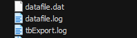

# tbExport, tbImport

**tbExport**는 Tibero에서 제공하는 Export 유틸리티이다. 이 유틸리티를 통해 Tibero데이터베이스에 저장된 스키마 객체의 전체 또는 일부를 추출해 고유 형식의 파일로 저장하므로 데이터베이스의 백업과 다른 머신 간의 데이터베이스를 전송할 때 유용하다.

tbExport 유틸리티에서 하나의 스키마 객체를 추출하면 그와 연관된 스키마 객체가 자동으로 함께 추출된다. 예를 들어, 하나의 테이블을 추출하면 그 테이블에 대해 생성된 인덱스와 제약조건 등이 함께 추출된다. 필요에 따라서 연관된 일부 스키마 객체가 함께 추출되지 않도록 지정할 수 있다.

Export 모드에는 전체 데이터베이스 모드, 사용자 모드, 테이블 모드가 있다. 이 중 전체 데이터베이스 모드는 DBA만이 사용할 수 있다.

tbExport 유틸리티를 실행한 결과로 생성된 파일은 운영체제 파일이다. 따라서 Tibero데이터베이스 파일과는 달리 일반 파일과 같은 작업을 실행할 수 있다. 예를 들어, 파일을 FTP를 이용하여 전송하거나 CD-ROM 등에 저장하여 원격지의 Tibero데이터베이스로 옮길 수도 있다.

Export가 실행되는 과정에서 발생하는 로그는 LOG 파라미터를 사용하여 지정한다.


### 특징

- 논리적인 백업
- Tibero의 내부 스키마 및 데이터를 SQL 문장으로 추출한다.
- 서로 다른 시점의 데이터
- 여러 개의 테이블을 Export할 때 추출한 각 테이블의 데이터는 동일 시점의 데이터가 아니라 Export 작업이 실행되는 시점의 순차적인 데이터이다.
- 테이블 정의를 저장
- 데이터의 존재 여부에 상관 없이 테이블 정의(테이블의 DDL 스크립트)를 저장한다.
- 테이블의 재구성
- 테이블 생성 후 수많은 DML 작업으로 인해 발생한 마이그레이션이 된 로우(migrated row)나 단편화(fragmentation)를 제거한다.


### 파라미터 목록

다음은 명령 프롬프트에서 지정할 수 있는 tbExport 유틸리티의 파라미터이다.

| 항목        | 기본값      | 설명                                                         |
| ----------- | ----------- | ------------------------------------------------------------ |
| CFGFILE     |             | 환경설정 파일의 이름이다.                                    |
| USERNAME    |             | Export를 수행하는 사용자의 계정을 입력한다.                  |
| PASSWORD    |             | Export를 수행하는 사용자의 패스워드를 입력한다.              |
| IP          | localhost   | Export 대상 Tibero 서버의 IP를 입력한다.                     |
| PORT        | 8629        | Export 대상 Tibero 서버의 포트를 입력한다.                   |
| SID         |             | Export 대상 Tibero 서버의 SID를 입력한다.                    |
| FILE        | default.dat | Export를 수행할 때 생성되는 파일의 이름이다.바이너리 파일의 형태로 운영체제에서 생성되며, 이름을 지정하지 않으면 기본값으로 생성된다. |
| NO_PACK_DIR |             | 압축을 해제한 덤프 파일이 저장되는 디렉터리이다. 이 옵션이 지정되면, FILE 파라미터에 설정된 값은 무시된다. |
| OVERWRITE   | N           | Export를 수행할 때 생성되는 파일의 이름과 동일파일을 덮어쓸지 지정한다.Y: 파일을 덮어쓴다.N: 파일을 덮어쓰지 않는다. |
| LOG         |             | Export의 로그가 기록될 파일의 이름을 입력한다.               |
| FULL        | N           | 전체 데이터베이스 모드로 Export를 수행할지 지정한다.Y: 전체 데이터베이스 모드로 Export를 수행한다.N: 사용자 또는 테이블 모드로 Export를 수행한다. (둘 중 하나의 모드는 있어야 함) |
| USER        |             | 사용자 모드로 Export를 수행할 때 Export될 객체의 소유자를 지정한다.USER=userlist의 형태로 사용한다. |
| TABLE       |             | 테이블 모드로 Export를 수행할 때 Export할 대상 테이블의 이름을 지정한다.TABLE=tablelist의 형태로 사용한다. |
| QUERY       |             | Export될 데이터에 필터 조건을 지정한다.모드에 상관없이 동작하지만, 원하지 않는 테이블에도 적용될 수 있으므로 주의한다.Where 조건 앞과 뒤를 \"로 감싸주어야 한다.지정된 조건에 의해 SQL 문장에서 문법(Syntax) 에러가 발생할 경우, 조건을 적용하지 않고 다시 시도한다. |
| INDEX       | Y           | Export를 수행할 때 인덱스 정보의 Export 여부를 지정한다.Y: 인덱스를 Export한다.N: 인덱스를 Export하지 않는다. |
| GRANT       | Y           | Export를 수행할 때 권한의 Export 여부를 지정한다.Y: 권한을 Export한다.N: 권한을 Export하지 않는다. |
| CONSTRAINT  | Y           | Export를 수행할 때 제약조건의 Export 여부를 지정한다.Y: 제약조건을 Export한다 .N: 제약조건을 Export하지 않는다. |
| ROWS        | Y           | Export를 수행할 때 테이블의 데이터를 Export 할지 여부를 지정한다.Y: 테이블의 데이터를 Export한다.N: 테이블의 데이터를 Export하지 않는다. |
| SCRIPT      | N           | Export를 수행할 때 스키마 객체를 생성하는 DDL 스크립트의 표시 여부를 지정한다.Y: 스키마 객체를 생성하는 DDL 스크립트를 표시한다.N: 스키마 객체를 생성하는 DDL 스크립트를 표시하지 않는다. |
| THREAD_CNT  | 4           | 테이블의 데이터를 Export하기 위해 사용하는 스레드의 개수를 입력한다. |
| SERVER_VER  | 5           | Export의 대상이 되는 Tibero의 버전을 지정한다.               |


### 수행 예제

- tbExport

```v
$ tbexport USERNAME=sys PASSWORD=tibero IP=<추출서버 IP> PORT=<LISTENER_PORT> SID=<SID_NAME> FILE=datafile.dat LOG=datafile.log FULL=y ROWS=y THREAD_CNT=7 GRANT=y

tbexport 6.0

Copyright 2015 TmaxData Co., Ltd. All Rights Reserved.

the entire database: Thu Jan 13 19:49:23 EST 2022
Export national character set: UTF-16
  exporting tablespaces
  exporting roles
  exporting public synonyms
  exporting schema:"ADMIN"
    exporting tables
      [0] ADMIN.PRODUCT                                         4 rows exported.
    exporting indexes
    exporting constraints
  exporting schema:"OUTLN"
    exporting tables
      [1] OUTLN.OL$HINTS                                       no rows exported.
      [0] OUTLN.OL$                                            no rows exported.
    exporting indexes
  exporting schema:"TIBERO"
  exporting schema:"TIBERO1"
Packing the file...
Export completed successfully
```


위와같이 성공하게 되면 아래와 같은 파일이 생성이 됩니다.




- tbImport

```
$ tbimport USERNAME=sys PASSWORD=tibero IP=<입력서버 IP> PORT=<LISTENER_PORT> SID=<SID_NAME> FILE=datafile.dat LOG=datafile.log FULL=y SCRIPT=y THREAD_CNT=7
```

