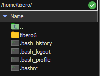
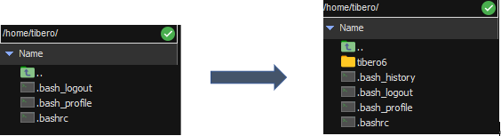

## Tibero를 rsync를 이용하여 독립된 노드에 복제 후 기동이 될까?

위의 제목대로 회사 업무로 Tibero가 정상적으로 기동이 되는 노드에서 독립된 노드로, 기본적인 `yum update`만 되어있는 곳에 `rsync`를 이용하여 복제 후 정상적으로 기동이 되는지 알아보도록 하겠습니다.


<br><br>

## rsync

**`rsync`**는 Remote Sync의 약자로 samba의 핵심 개발자인 Andrew Tridgell 이 만든 file & directory 동기화를 위한 프로토콜이자 Unix용 커맨드라인 유틸리티이다. 

전송시에 네트웍 대역폭을 최소화하는 delta encoding algorithm 을 구현하여 rcp 나 scp 보다 훨씬 빠르고 효율적으로 site 간의 데이타를 동기화한다.

`rsync`는 client와 server 프로그램이 모두 포함되어 있으며 server 로 구동시 TCP의 873 포트를 사용한다.

server 구동시 SSH 나 RSH 같은 Remote Shell protocol 기반에서 동작할 수도 있으므로 **ssh 기반으로 rsync 를 사용하면 방화벽 오픈을 할 필요가 없이 편리하게 사용할 수 있다.** (SSH 추천)

**주요 용도로는 전통적인 [rcp](http://en.wikipedia.org/wiki/Rcp_(Unix)), [scp](http://en.wikipedia.org/wiki/Secure_copy)를 대치하는 용도로 사용할 수 있으며 원격 사이트 미러링(Remote Site mirroring), 데이타 백업(data backup) 등의 용도로도 사용할 수 있다.**


<br><br>

### 설치

- Centos & RHEL

```v
# yum -y install rsync 
```

- Ubuntu & Linux Mint

```
# apt -y install rsync
```


<br><br>

### 명령어

- 로컬 동기화

```
# rsync {option} {Source} {Destination}
```

- 원격 동기화 Pull

```
# rsync {option} <User_Nmae>@<Remote-Host>:<Source-File-Dir> <Destination>
```

- 원격 동기화 Push

```
# rsync {option} <Source-File-Dir> <User_Nmae>@<Remote-Host>:<Destination>
```


- 주요 옵션
  - `-v`, `-verbose` : 상세 출력
  - `-q`, `-quiet` : 메시지 출력 억제
  - `-a`, `-archive` : 아카이브 파일 및 동기화 중 디렉토리
  - `-r`, `-recursive` : 재귀적으로 하위 디렉터리 까지 복사
  - `-b`, `-backup` : 동기화 중에 백업을 수행
  - `-u`, `-update` : 대상 파일이 더 최신인 경우 소스에서 대상으로 파일을 복사하지 않습니다.
  - `-l`, `-links` : 동기화 중에 심볼릭 링크를 심볼릭 링크로 복사
  - `-z`, `-compress` : 파일 데이터 압축
  - `-h`, `-human-readable` : 읽을 수 있는 형식으로 출력


<br><br>

### Test

`tibero6` 폴더와 `.bash_profile`에 저장된 파라미터, 기타 설정값들을 Target 서버로 복사를 하여 Tibero가 기동이 되는지 확인해보자!

- Source 서버



```
# rsync -avzh /home/tibero/ root@192.168.33.138:/home/tibero/
root@192.168.33.138's password: [root계정 비밀번호 입력]
```

<br>

#### Authentication failed 오류!

Target 서버에 권환을 수정

```
# vi /etc/rsyncd.conf.   서버쪽에 mig 처럼 셋팅을 해준다.

id = nobody
gid = nobody
use chroot = no
read only = no
max connections = 4
syslog facility = local5
pid file = /var/run/rsyncd.pid
host allow = 192.168.242.196
timeout = 600

[mig]
path = /home/nateon/test1
comment = tkjavadev -> tkstage
uid = root
gid = root
auth users = nateon, root
secrets file = /etc/rsyncd.secrets
```

 ```
 # /etc/rsyncd.secrets
 
 user:password1!
 root:123456
 user2:password2#
 ```

 ```
 # chmod 666 rsyncd.secrets
 # chown root:root rsyncd.secrets
 ```

<br>

- Target 서버



위의 사진과 같이 Target 서버에 제대로 복사가 완료가 되었습니다.


<br>

<br>

#### 추가

이제 설정값 복사를 하지않은 `sysctl.conf`파일에 들어간 후 맨밑 하단에 밑의 값들을 추가합니다.

```
# vi /etc/sysctl.conf
```

```
#tibero
kernel.sem = 10000 32000 10000 10000
kernel.shmmax = 8589934592		# 시스템의 물리적인 메모리 절반 (byte 단위)
kernel.shmall = ceil(SHMMAX/PAGE_SIZE)값보다 크게	# Linux 기본 PAGE_SIZE는 4096
kernel.shmmni = 4096
fs.file-max = 6815744
net.ipv4.ip_local_port_range = 1024 65000
```

시스템 메모리가 16GB이고 Tibero RDBMS가 사용할 최대 메모리가 8GB인 경우를 기준으로 설정

 `sysctl.conf`에 추가한 후에 **`sysctl -p`명령어로 동적 적용**

<br>

밑의 파일로 들어가서 `CONTROL_FILES`의 절대 경로를 자신의 계정 경로에맞게 설정합니다.

```
$ vi $TB_HOME/config/tibero.tip

DB_NAME=tibero
LISTENER_PORT=8629
CONTROL_FILES="/home/tibero/tibero6/database/tibero/c1.ctl"
					:
					:
```

<br>

**주의! 만약 기업에서 라이센스를 신청하지 않고 개인이라면 그 노드의 `hostname`에 맞게 라이센스발급 받은걸로 바꿔주세요!**


<br>

<br>

#### 확인

tibero 계정 접속 후 tb를 기동해보도록 합시다!

```
# su - tibero
```

```
$ tbboot
Change core dump dir to /home/tibero/tibero6/bin/prof.
Listener port = 8629

Tibero 6

TmaxData Corporation Copyright (c) 2008-. All rights reserved.
Tibero instance started up (NORMAL mode).
```

```
$ tbsql sys/tibero

tbSQL 6

TmaxData Corporation Copyright (c) 2008-. All rights reserved.

Connected to Tibero.
```


`tbsql`까지 기동이 되는걸 확인 하였습니다!  Source서버에서 만들었떤 table이 그대로 있는지 확인하도록 하겠습니다.

```
SQL> select * from dept;

    DEPTNO DEPTNAME                PDEPTNO
---------- -------------------- ----------
         1 Jo                           10
         2 Lee                          11
         3 Kim                          12

3 rows selected.
```


데이터도 있는걸 확인하였습니다. 아주 기분이 좋군요!
