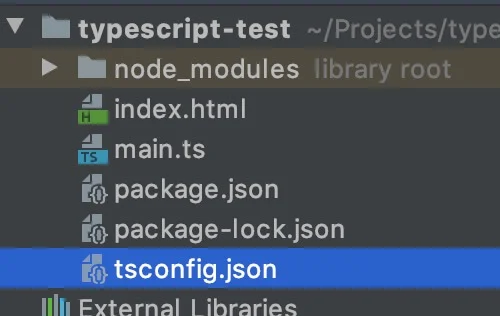
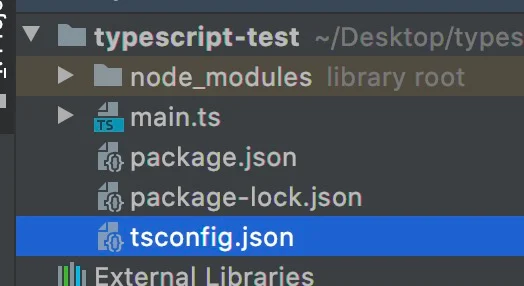

# 00. 왜 타입스크립트인가?

[타입스크립트(TypeScript)](https://www.typescriptlang.org/)는 Microsoft에서 개발하고 유지/관리하는 Apache 라이센스가 부여된 오픈 소스입니다.

일반 자바스크립트로 컴파일되는 자바스크립트 Superset(상위 호환)으로 2012년 10월에 처음 릴리스 되었습니다.


그러면 왜 타입스크립트를 써야 할까요?


C#과 Java 같은 체게젹이고 정제된 언어들에서 사용하는 강한 타입 시스템은 높은 가독성과 코드품질 등을 제공할 수 있고 런타임이 아닌 컴파일 환경에서 에러가 발생해 치명적인 오류들을 더욱더 쉽게 잡아낼 수 있습니다.

반면 자바스크립트는 타입 시스템이 없는 동적 프로그래밍 언어로, 자바스크립트 변수는 String, Number, Boolean 등 여러 타입의 값을 가질 수 있습니다.  이를 약한 타입 언어라고 표현할 수 있으며 비교젹 유연하게 개발할 수 있는 환경을 제공하는 한편 런타임 환경에서 쉽게 에러가 발생할 수 있는 단점을 가집니다.

그리고 타입스크립트는 이러한 자바스크립트에 강한 타입 시스템을 적용해 대부분의 에러를 컴파일 환경에서 코드를 입력하는 동안 체크할 수 있습니다.


# 01. 타입스크립트 사용법

자바스크립트가 `.js` 확장자를 가진 파일로 작성되는 것과 같이 타입스크립트는 `.ts` 확장자를 가진 파일로 작성할 수 있고, 작성 후 타입스크립트 컴파일러를 통해 자바스크립트 파일로 컴파일하여 사용하게 됩니다.

```js
$ tsc sample.ts
# compiled to `sample.js`
```


# 02. 타입스크립트의 기능

타입스크립트의 기능은 다음과 같습니다.

- **크로스 플랫폼 지원** : 자사크립트가 실행되는 모든 플랫폼에서 사용할 수 있습니다.
- **객체 지향 언어** : 클래스, 인터페이스, 모듈 등의 강력한 기능을 제공하며, 순수한 객체 지향 코드를 작성할 수 있습니다.
- **정적 타입** : 정적 타입을 사용하기 때문에 코드를 입력하는 동안에 오류를 체크할 수 있습니다.(단 에디터 혹은 플러그인의 도움을 필요)
- **DOM 제어** : 자바스크립트와 같이 DOM을 제어해 요소를 추가하거나 삭제할 수 있습니다.
- **최신 ECMAScript 기능 지원** : ES6 이상의 최신 자바스크립트 문법을 손쉽게 지원할 수 있습니다.


# 03. 개발환경


### VSCode와 WebStorm

VSCode와 WebStorm은 타입스크립트 지원 기능이 내장외어 있기 때문에 별도의 설정 없이도 타입스크립트 파일(`.ts`, `tsconfig.json`등) 인식할 수 있고 코드 검사, 빠른 수정, 실행 및 디버깅 등의 다양한 기능을 바로 사용할 수 있습니다.

단, 컴파일러는 포함되어 있지 않기 때문에 별도로 설치해야 합니다.)

```shell
$ npm install typescript
```


### 컴파일러 설치

`tsc`명령을 사용하기 위해 다음과 같이 타입스크립트를 전역 설치할 수 있습니다.

타입스크립트 파일을 경로로 지정하면 해당 파일을 컴파일합니다.

```shell
$ npm install -g typescript
$ tsc --version
$ tsc ./src/index.ts
```

혹은, 단일 프로젝트에서만 사용하길 희망하는 경우 일반 지역 설치 후 `npx tsc` 명령으로 실행할 수도 있습니다.

```shell
$ npm install -D typescript
$ npx tsc --version
$ npx tsc ./src/index.ts
```


#### 컴파일러 옵션

타입스크립트 컴파일을 위한 다양한 옵션을 지정할 수 있습니다.

- 공식 문서 : https://www.typescriptlang.org/docs/handbook/compiler-options.html

```shell
$ tsc ./src/index.ts --watch --strict true --target ES6 --lib ES2015,DOM --module CommonJS
```

혹은 아래와 같이 `tsconfig.json`파일로 옵션을 관리할 수 있습니다. `"include"`와 `"exclude"`옵션을 같이 추가해, 컴파일에 **포함할 경로**와 **제외할 경로**를 설정할 수 있습니다.

> VScode와 WebStorm을 사용하는 경우, `tsconfig.json` 파일을 프로젝트 루트 경로에 생성하면 에디터에 의해 구성 옵션이 분석됩니다.

```json
{
  "compilerOptions": {
    "strict": true,
    "target": "ES6",
    "lib": ["ES2015", "DOM"],
    "module": "CommonJS"
  },
  "include": [
    "src/**/*.ts"
  ],
  "exclude": [
    "node_modules"
  ]
}
```

```shell
$ tsc --watch
```


## Repl.it

https://replit.com/languages/typescript

파일과 디렉터리로 관리되는 타입스크립트 프로젝트를 손쉽게 구성할 수 있습니다. 간단한 프로젝트로 타입스크립트를 테스트하기 좋습니다.


## Parcel

타입스크립트를 로컬 환경에서 빠르게 테스트하고 싶다면 [Parcel 번들러](https://ko.parceljs.org/getting_started.html)가 좋은 선택입니다.

```shell
$ mkdir typescript-test
$ cd typescript-test
$ npm init -y
$ npm install -D typescript parcel-bundler
```




`tsconfig.json` 파일을 생성하고 원하는 옵션을 추가합니다.

```json
{
  "compilerOptions": {
    "strict": true
  },
  "exclude": [
    "node_modules"
  ]
}
```


`main.ts`파일을 생성하고 원하는 타입스크립트 코드를 입력합니다.

```js
function add(a: number, b: number) {
  return a + b;
}
const sum: number = add(1, 2);
console.log(sum);
```


`index.html` 파일을 생성하고 다음과 같이 `.js`가 아닌 `.ts`파일을 연결합니다.

Parcel 번들러가 빌드시 자동으로 타입스크립트를 컴파일합니다.

```html
<!doctype html>
<html>
<head>
  <meta charset="UTF-8">
  <title>TypeScript Test</title>
</head>
<body>
  <script src="main.ts"></script>
</body>
</html>
```


마지막으로 다음과 같이 진입 파일로 `index.html`를 지정하고 Parcel버들러로 빌드합니다.

```shell
$ npx parcel index.html
# Server running at http://localhost:1234
```


## TS Node

NodeJS환경에서 테스트하고 싶다면 [TS Node](https://github.com/TypeStrong/ts-node)를 사용하세요.

```shell
$ mkdir typescript-test
$ cd typescript-test
$ npm init -y
$ npm install -D typescript @types/node ts-node
```

> @types/node는 Node.js API를 위한 타입 선언 모듈입니다.
>
> @types에 대한 자세한 내용은 '모듈'파트를 참고하세요.




`tsconfig.json`파일을 생성하고 원하는 옵션을 추가합니다.

```json
{
  "compilerOptions": {
    "strict": true,
    "module": "CommonJS"
  },
  "exclude": [
    "node_modules"
  ]
}
```


`main.ts`파일을 생성하고 원하는 타입스크립트 코드를 입력합니다.

```js
console.log('TypeScript on NodeJS!');
```


TS Node를 사용해 `main.ts`를 실행합니다.

```shell
$ npx ts-node main.js
# TypeScript on NodeJS!
```

