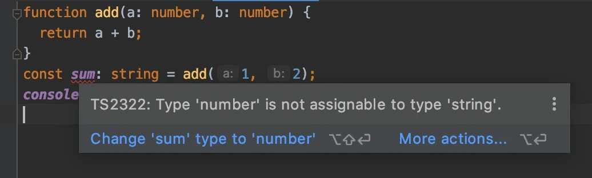

## 타입 지정

타입스크립트는 일반 변수, 매개 변수(Parameter), 객체 속성(Property) 등에 `: TYPE`과 같은 형태로 타입을 지정할 수 있습니다.

```JS
function someFunc(a: TYPE_A, b: TYPE_B): TYPE_RETURN {
  return a + b;
}
let some: TYPE_SOME = someFunc(1, 2);
```


다음 예시를 보면,

`add`함수의 매개 변수 `a`와 `b`는 `number`타입이어야 한다고 지정했고, 그렇게 실행된 함수의 반환 값은 숫자로 추론(Inference)되기 때문에 변수 `sum`도 `number`타입이어야 한다고 지정했습니다.

```js
function add(a: number, b: number) {
  return a + b;
}
const sum: number = add(1, 2);
console.log(sum); // 3
```


자바스크립트로 컴파일한 결과는 다음과 같습니다.

```js
"use strict";
function add(a, b) {
  return a + b;
}
const sum = add(1, 2);
console.log(sum);
```


## 타입 에러

만약 다음과 같이 변수를 `sum`을 `number`가 아닌 `string`타입이어야 한다고 지정했다면, 컴파일조차 하지 않고 코드를 작성하는 시점에서 에러가 발생합니다.

```js
function add(a: number, b: number) {
  return a + b;
}
const sum: string = add(1, 2);
console.log(sum);
```




위 이미지에서 TS2322라는 에러 코드를 볼 수 있으며, 이를 검색하면 쉽게 에러 코드에 대한 정보를 얻을 수 있습니다.